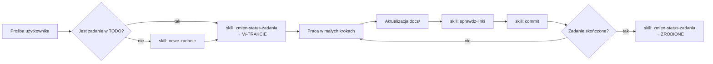

# AGENTS.md — instrukcje dla agentów AI

> Plik kanoniczny dla wszystkich agentów (Claude Code, Codex, Gemini itp.).
> [CLAUDE.md](CLAUDE.md) importuje ten plik — **zmiany reguł wprowadzaj tutaj**, nie w [CLAUDE.md](CLAUDE.md).

## 1. Czym jest ten projekt

**WS Tracker** — natywna aplikacja desktopowa na Linuksa, dystrybuowana jako
**Flatpak**, która siedzi w **tacce systemowej** (KDE Plasma i GNOME) i pozwala zarządzać
czasem pracy w firmowym **Kimai** bez otwierania przeglądarki.

Funkcjonalnie odwzorowuje wtyczkę przeglądarkową
[kimai-ws-tracker](https://github.com/websystemspl/kimai-ws-tracker) (Web Systems):
start/stop timera, lista ostatnich wpisów, wznawianie, edycja trwającego wpisu, flaga
„billable”, sumy dzienne/tygodniowe, walidacja jakości opisu.
Szczegóły: [docs/integracje/kimai-ws-tracker.md](docs/integracje/kimai-ws-tracker.md).

Status: **wydana 0.9.1 (beta)**: rdzeń, integracje desktopowe, interfejs i paczka Flatpak (Plany 1–4) gotowe;
dalej: identyfikator i nazwa ([0056](TODO/W-TRAKCIE/0056-identyfikator-i-wydawca/todo.md),
[0062](TODO/DO-ZROBIENIA/0062-aplikacja-ws-tracker/todo.md)), testy GNOME przed 1.0.
Stos: **Python + PySide6 (Qt 6), Flatpak na `org.kde.Platform` 6.11** —
[ADR-0002](docs/decyzje/0002-stos-python-pyside6.md).

## 2. Mapa repozytorium

```text
AGENTS.md              ← ten plik (reguły dla agentów)
CLAUDE.md              ← import AGENTS.md + specyfika Claude Code
README.md              ← opis dla ludzi
.claude/skills/        ← skille projektu (powtarzalne zadania)
docs/                  ← pełna dokumentacja projektu (Obsidian vault-friendly)
  README.md            ← indeks (MOC) dokumentacji
  architektura/        ← jak działa aplikacja, komponenty, przepływy
  decyzje/             ← ADR — rejestr decyzji architektonicznych
  integracje/          ← jeden plik .md na każdą integrację zewnętrzną + linki
  procesy/             ← workflow: commity, TODO, dokumentowanie, wydania
  assets/              ← zrzuty ekranu, diagramy wyeksportowane, obrazy
TODO/                  ← zadania; każde zadanie = folder z todo.md i materiałami
  README.md            ← tablica: linki do wszystkich zadań, pogrupowane jak foldery
  _szablon/            ← szablon nowego zadania
  DO-ZROBIENIA/        ← pomysl, do-zrobienia
  W-TRAKCIE/           ← w-trakcie, zablokowane
  ZROBIONE/            ← zrobione, porzucone
```

Pełny opis struktury: [docs/architektura/struktura-repozytorium.md](docs/architektura/struktura-repozytorium.md).

## 3. Złote zasady (obowiązkowe)

1. **Język**: dokumentacja, TODO, commity i komunikacja — **po polsku**. Identyfikatory
   w kodzie, nazwy plików kodu i komentarze w kodzie — po angielsku.
2. **Małe commity, często.** Każda logiczna, mała zmiana = osobny commit (jeden plik docs,
   jedno zadanie TODO, jedna funkcja). Nie zbieraj wielu zmian w jeden commit.
   Format: [docs/procesy/commity.md](docs/procesy/commity.md) (Conventional Commits po polsku).
   **Pracujemy bezpośrednio na `main`** — projekt ma jednego autora, osobne gałęzie nie są
   potrzebne. Nie pushujemy bez prośby użytkownika.
3. **Dokumentacja na bieżąco.** Zmiana w kodzie, która zmienia zachowanie, strukturę
   albo integrację, **musi** w tym samym lub następnym commicie zaktualizować `docs/`.
   Kod bez dokumentacji = zadanie nieskończone.
4. **Każde zadanie ma folder w `TODO/`.** Zanim zaczniesz pracę — utwórz/zaktualizuj
   zadanie (skill `nowe-zadanie`, powstaje w `TODO/DO-ZROBIENIA/`). Każda zmiana statusu
   przenosi folder do właściwego podfolderu: [DO-ZROBIENIA](TODO/DO-ZROBIENIA/),
   [W-TRAKCIE](TODO/W-TRAKCIE/), [ZROBIONE](TODO/ZROBIONE/) (skill `zmien-status-zadania`).
   [TODO/README.md](TODO/README.md) zawsze linkuje do każdego zadania.
5. **Każda integracja ma plik w `docs/integracje/`** z linkami do oficjalnej dokumentacji
   (skill `nowa-integracja`). Nie wolno dodać zależności zewnętrznej bez tego pliku.
6. **Decyzje architektoniczne zapisuj jako ADR** w `docs/decyzje/` (skill `nowa-decyzja`).
7. **Weryfikuj fakty o bibliotekach** przez Context7 / oficjalną dokumentację — nie
   z pamięci. Linki w docs muszą prowadzić do źródeł.
8. **Obrazy i diagramy**: diagramy jako bloki ` ```mermaid ` bezpośrednio w `.md`
   (Obsidian i GitHub je renderują).
9. **Materiały zadania w folderze zadania.** Wszystko, co powstaje przy zadaniu, trafia
   do jego folderu, w podfolder według rodzaju: `zrzuty/`, `diagramy/`, `testy/`
   (raporty, logi, testy ręczne), `prototyp/`, `notatki/`, `dane/`. Każdy plik jest
   podlinkowany w `todo.md`. Do `docs/assets/` trafiają tylko obrazy wspólne dla
   dokumentacji. Szczegóły: [docs/procesy/zadania.md](docs/procesy/zadania.md).
10. **Sekrety**: token API Kimai nigdy nie trafia do repo, logów ani plików konfiguracyjnych
   w czystym tekście — tylko do magazynu sekretów systemu (Secret Service / portal).
11. **Bez telemetrii.** Aplikacja łączy się wyłącznie z adresem Kimai podanym przez użytkownika.

## 4. Konwencje dokumentów (Obsidian)

- Każdy plik `.md` w `docs/` i `TODO/` zaczyna się od **frontmatter YAML**
  (`noteId`, `tytul`, `tags`, `utworzono`, `zaktualizowano`, dla zadań także `status`,
  `priorytet`). `noteId` i `tags` są obowiązkowe we **wszystkich** plikach `.md` poza
  `.claude/` i `.github/`, bo inaczej dopisuje je rozszerzenie VS Code *notebook*. W `.github/` (np.
  [.github/README.md](.github/README.md) — strona repozytorium na GitHubie) frontmattera **nie ma**: GitHub pokazuje go
  jako tabelę. Skill
  [frontmatter](.claude/skills/frontmatter/SKILL.md): `frontmatter.py sprawdz` przed commitem.
- Linki wewnętrzne: **względne linki markdown** `[etykieta](../ścieżka/plik.md)`, działają
  w VS Code, Obsidianie i na GitHubie. **Wikilinki `[[...]]` są zakazane.** Każde odwołanie
  do zadania, ADR, dokumentu czy pliku jest linkiem, nie zwykłym tekstem.
- Pliki `.md` przenosimy tylko przez `linki.py przenies`. Przed commitem uruchamiamy
  `linki.py sprawdz` (skill [sprawdz-linki](.claude/skills/sprawdz-linki/SKILL.md)).
- **markdownlint**: każdy plik `.md` bez uwag rozszerzenia VS Code markdownlint (reguły w
  [.markdownlint.jsonc](.markdownlint.jsonc): domyślne, linia do 120 znaków). Przed commitem skill
  [markdownlint](.claude/skills/markdownlint/SKILL.md): `mdfix.py napraw` i `mdfix.py sprawdz`.
- Linki zewnętrzne: zwykły markdown, sprawdzone (HTTP 200).
- Uwagi: callouty Obsidiana — `> [!note]`, `> [!warning]`, `> [!tip]`, `> [!todo]`.
- Listy zadań: `- [ ]` / `- [x]`.
- **Daty zawsze z godziną i minutą**: `2026-09-25 19:42` (frontmatter, tabele, dzienniki
  zadań). Samą datę bez godziny wolno podać tylko w nazwie pliku.

Szczegóły: [docs/procesy/dokumentowanie.md](docs/procesy/dokumentowanie.md).

## 5. Skille projektu (`.claude/skills/`)

| Skill | Kiedy użyć |
| --- | --- |
| [nowe-zadanie](.claude/skills/nowe-zadanie/SKILL.md) | tworzenie zadania w `TODO/` z szablonu |
| [zmien-status-zadania](.claude/skills/zmien-status-zadania/SKILL.md) | zmiana statusu: start, blokada, zamknięcie; przeniesienie folderu między DO-ZROBIENIA / W-TRAKCIE / ZROBIONE, tablica, commit |
| [nowa-integracja](.claude/skills/nowa-integracja/SKILL.md) | dodanie pliku integracji w `docs/integracje/` |
| [nowa-decyzja](.claude/skills/nowa-decyzja/SKILL.md) | zapis decyzji architektonicznej (ADR) |
| [frontmatter](.claude/skills/frontmatter/SKILL.md) | `noteId` + `tags` w każdym dokumencie; naprawa i nowy `noteId` |
| [sprawdz-linki](.claude/skills/sprawdz-linki/SKILL.md) | sprawdzenie i naprawa linków, przenoszenie plików `.md` z poprawą linków |
| [markdownlint](.claude/skills/markdownlint/SKILL.md) | sprawdzenie i poprawa plików `.md` regułami rozszerzenia VS Code markdownlint |
| [commit](.claude/skills/commit/SKILL.md) | przygotowanie małego commita zgodnego z konwencją |

## 6. Workflow pracy agenta



## 7. Komendy

### Kimai testowy (Docker)

```bash
tests/kimai/kimai-testowe.sh up               # lokalny Kimai 2.67.0 + konta + tokeny + dane
eval "$(tests/kimai/kimai-testowe.sh env)"    # zmienne KIMAI_TEST_*
tests/kimai/kimai-testowe.sh down             # usuń wszystko
```

Szczegóły: [tests/kimai/README.md](tests/kimai/README.md). Nigdy nie testujemy zapisu na Kimai firmy.

### Dokumentacja

```bash
python3 .claude/skills/sprawdz-linki/linki.py sprawdz
python3 .claude/skills/frontmatter/frontmatter.py sprawdz
python3 .claude/skills/markdownlint/mdfix.py sprawdz
```

### Python (rdzeń i interfejs)

```bash
python3 -m venv .venv && .venv/bin/pip install -e ".[dev,ui]" # raz (PySide6 z pip — do testów)
.venv/bin/pytest                                              # testy (bez Dockera i pulpitu)
.venv/bin/pytest --cov=ws_tracker_tray.core --cov-fail-under=90    # pokrycie rdzenia
.venv/bin/pytest -m kimai                                     # testy kontraktowe (Docker)
.venv/bin/pytest -m desktop                                   # D-Bus na prawdziwej sesji (portfel, powiadomienie, portal)
.venv/bin/ruff format . && .venv/bin/ruff check .             # format + lint (tylko kod produktu)
scripts/instaluj-dev.sh                                       # raz: .desktop + ikona w ~/.local/share (nazwa i ikona w powiadomieniach)
PYTHONPATH=src /usr/bin/python3 -m ws_tracker_tray                 # uruchomienie na KDE (systemowy PySide6 — layer-shell działa)
.venv/bin/python -m ws_tracker_tray                                # uruchomienie z .venv (okno bez ramki, bez layer-shell)
```

### Flatpak

```bash
flatpak/buduj.sh                                              # paczka w dist/ (Docker, obraz flathub-infra kde-6.11)
flatpak/buduj.sh --zainstaluj                                 # to samo i instalacja u siebie
```
