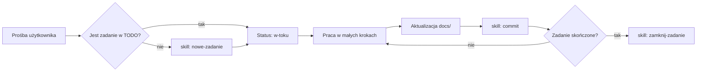

# AGENTS.md — instrukcje dla agentów AI

> Plik kanoniczny dla wszystkich agentów (Claude Code, Codex, Gemini itp.).
> `CLAUDE.md` importuje ten plik — **zmiany reguł wprowadzaj tutaj**, nie w `CLAUDE.md`.

## 1. Czym jest ten projekt

**Kimai Tray** (nazwa robocza) — natywna aplikacja desktopowa na Linuksa, dystrybuowana jako
**Flatpak**, która siedzi w **tacce systemowej** (KDE Plasma i GNOME) i pozwala zarządzać
czasem pracy w firmowym **Kimai** bez otwierania przeglądarki.

Funkcjonalnie odwzorowuje wtyczkę przeglądarkową
[kimai-ws-tracker](https://github.com/websystemspl/kimai-ws-tracker) (Web Systems):
start/stop timera, lista ostatnich wpisów, wznawianie, edycja trwającego wpisu, flaga
„billable”, sumy dzienne/tygodniowe, walidacja jakości opisu.
Szczegóły: [[docs/integracje/kimai-ws-tracker|docs/integracje/kimai-ws-tracker.md]].

Status: **faza 1 — specyfikacja i planowanie**.
Stos: **Python + PySide6 (Qt 6), Flatpak na `org.kde.Platform` 6.11** —
[[docs/decyzje/0002-stos-python-pyside6|ADR-0002]].

## 2. Mapa repozytorium

```
AGENTS.md              ← ten plik (reguły dla agentów)
CLAUDE.md              ← import AGENTS.md + specyfika Claude Code
README.md              ← opis dla ludzi
.claude/skills/        ← skille projektu (powtarzalne zadania)
docs/                  ← pełna dokumentacja projektu (Obsidian vault-friendly)
  README.md            ← indeks (MOC) dokumentacji
  architektura/        ← jak działa aplikacja, komponenty, przepływy
  decyzje/             ← ADR — rejestr decyzji architektonicznych
  integracje/          ← jeden plik .md na każdą integrację zewnętrzną + linki
  procesy/             ← workflow: commity, TODO, dokumentowanie, wydania
  assets/              ← zrzuty ekranu, diagramy wyeksportowane, obrazy
TODO/                  ← zadania aktywne; każde zadanie = podfolder z plikiem todo.md
  README.md            ← tablica: linki do zadań aktywnych i zakończonych
  _szablon/            ← szablon nowego zadania
  DONE/                ← zadania zakończone (przenoszone przez skill zamknij-zadanie)
```

Pełny opis struktury: [[docs/architektura/struktura-repozytorium|docs/architektura/struktura-repozytorium.md]].

## 3. Złote zasady (obowiązkowe)

1. **Język**: dokumentacja, TODO, commity i komunikacja — **po polsku**. Identyfikatory
   w kodzie, nazwy plików kodu i komentarze w kodzie — po angielsku.
2. **Małe commity, często.** Każda logiczna, mała zmiana = osobny commit (jeden plik docs,
   jedno zadanie TODO, jedna funkcja). Nie zbieraj wielu zmian w jeden commit.
   Format: [[docs/procesy/commity|docs/procesy/commity.md]] (Conventional Commits po polsku).
3. **Dokumentacja na bieżąco.** Zmiana w kodzie, która zmienia zachowanie, strukturę
   albo integrację, **musi** w tym samym lub następnym commicie zaktualizować `docs/`.
   Kod bez dokumentacji = zadanie nieskończone.
4. **Każde zadanie ma folder w `TODO/`.** Zanim zaczniesz pracę — utwórz/zaktualizuj
   zadanie (skill `nowe-zadanie`). Po skończeniu — zmień status, opisz wynik i przenieś
   folder do `TODO/DONE/` (skill `zamknij-zadanie`). `TODO/README.md` zawsze linkuje
   do każdego aktywnego zadania.
5. **Każda integracja ma plik w `docs/integracje/`** z linkami do oficjalnej dokumentacji
   (skill `nowa-integracja`). Nie wolno dodać zależności zewnętrznej bez tego pliku.
6. **Decyzje architektoniczne zapisuj jako ADR** w `docs/decyzje/` (skill `nowa-decyzja`).
7. **Weryfikuj fakty o bibliotekach** przez Context7 / oficjalną dokumentację — nie
   z pamięci. Linki w docs muszą prowadzić do źródeł.
8. **Obrazy i diagramy**: diagramy jako bloki ` ```mermaid ` bezpośrednio w `.md`
   (Obsidian i GitHub je renderują). Zrzuty ekranu do `docs/assets/` lub do folderu
   zadania w `TODO/<zadanie>/assets/`, osadzane przez `![[plik.png]]`.
9. **Sekrety**: token API Kimai nigdy nie trafia do repo, logów ani plików konfiguracyjnych
   w czystym tekście — tylko do magazynu sekretów systemu (Secret Service / portal).
10. **Bez telemetrii.** Aplikacja łączy się wyłącznie z adresem Kimai podanym przez użytkownika.

## 4. Konwencje dokumentów (Obsidian)

- Każdy plik `.md` w `docs/` i `TODO/` zaczyna się od **frontmatter YAML**
  (`tytul`, `tagi`, `utworzono`, `zaktualizowano`, dla zadań także `status`, `priorytet`).
- Linki wewnętrzne: `[[ścieżka/plik|etykieta]]` (wikilinki Obsidiana). Linki zewnętrzne:
  zwykły markdown.
- Uwagi: callouty Obsidiana — `> [!note]`, `> [!warning]`, `> [!tip]`, `> [!todo]`.
- Listy zadań: `- [ ]` / `- [x]`.
- Daty w formacie ISO: `2026-09-25`.

Szczegóły: [[docs/procesy/dokumentowanie|docs/procesy/dokumentowanie.md]].

## 5. Skille projektu (`.claude/skills/`)

| Skill | Kiedy użyć |
|---|---|
| `nowe-zadanie` | tworzenie zadania w `TODO/` z szablonu |
| `zamknij-zadanie` | zamknięcie zadania: status, wynik, przeniesienie do `TODO/DONE/`, tablica, commit |
| `nowa-integracja` | dodanie pliku integracji w `docs/integracje/` |
| `nowa-decyzja` | zapis decyzji architektonicznej (ADR) |
| `commit` | przygotowanie małego commita zgodnego z konwencją |

## 6. Workflow pracy agenta



## 7. Komendy

> [!todo] Uzupełnić przy szkielecie projektu (zadanie `TODO/0002-specyfikacja-projektu`).
> Tu trafią: uruchomienie w trybie dev, testy (pytest, pytest-qt), lint, budowa Flatpaka.
