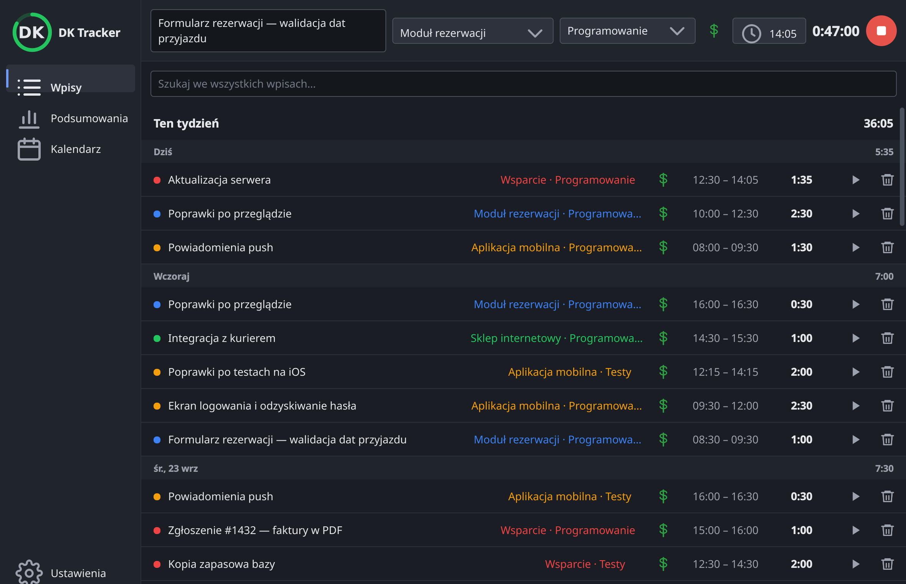
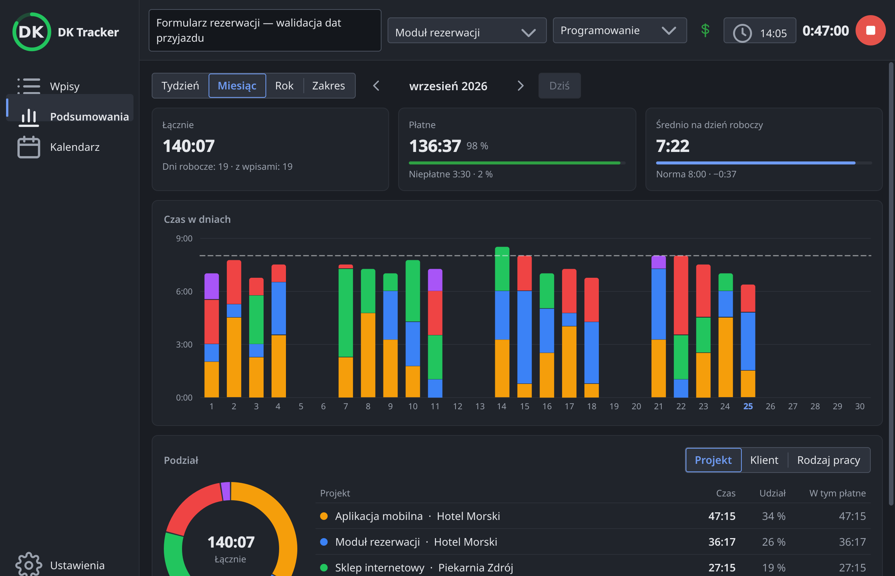
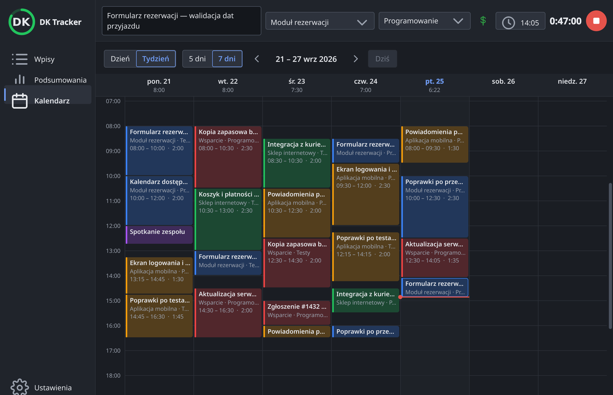

# DK Tracker

Klient [Kimai](https://www.kimai.org/) na pulpit Linuksa: cały czas pracy w jednym oknie — lista wpisów, podsumowania
i kalendarz — bez karty w przeglądarce. Timer uruchomisz i zatrzymasz z okna albo z ikony w tacce systemowej, która
pokazuje, ile trwa bieżący wpis. Zaczęło się jako linuksowa wersja firmowej wtyczki
[WS Tracker](https://github.com/websystemspl/kimai-ws-tracker); dziś robi znacznie więcej.



> **Status:** wersja **0.10.5 (beta)** — sprawdzona na KDE Plasma 6 (Wayland). GNOME: testy w toku.

## Co potrafi

**Okno główne** — wszystko, co zwykle robisz w Kimai, w natywnej aplikacji:

- **Wpisy** tygodniami i dniami, z sumami; nowy wpis z timera albo wpisany ręcznie; okno edycji z każdą opcją, jaką
  ma serwer (tagi, pola własne); usuwanie z „Cofnij”; wyszukiwanie we wszystkich swoich wpisach.
- **Podsumowania** tygodnia, miesiąca, roku albo dowolnego zakresu: czas płatny i niepłatny, średnia na dzień
  roboczy wobec normy dziennej, wykres dni w kolorach projektów, podział wg projektu, klienta i rodzaju pracy; po
  najechaniu widać wpisy, z których składa się słupek czy pozycja.
- **Kalendarz** dnia lub tygodnia: wpisy jako bloki, nowy wpis przeciągnięciem myszy, przesuwanie (także na inny
  dzień) i zmiana godzin za krawędź, z przyciąganiem co kwadrans.

**Zawsze pod ręką** — gdy pulpit ma tackę systemową (można ją wyłączyć):

- ikona z czasem trwającego wpisu (`47m`, `1:22`) i menu: zatrzymaj, wznów ostatni, otwórz okno;
- małe okienko przy ikonie do szybkiego startu, zmiany opisu i projektu oraz ostatnich wpisów.

**Poza tym:** zasady jak we wtyczce (jakość opisu, płatne / niepłatne jak w Kimai), zmiana projektu i rodzaju pracy
trwającego wpisu, przypomnienie o zbyt długim timerze i utracie połączenia, token API w portfelu systemu
(KWallet / GNOME Keyring), autostart, motyw jasny i ciemny, polski i angielski. Łączy się wyłącznie z Twoim Kimai.

| Podsumowania | Kalendarz |
| --- | --- |
|  |  |

## Instalacja

Aplikacja jest dystrybuowana jako [Flatpak](https://flatpak.org/). Instalacja z repozytorium — aktualizacje przyjdą
same (Discover, GNOME Software, `flatpak update`):

```bash
flatpak install --user https://dragonking026.github.io/DK-Tracker-Linux/io.github.dragonking026.DK-Tracker-Linux.flatpakref
```

Plik `.flatpak` jest też w [najnowszym wydaniu](https://github.com/DragonKing026/DK-Tracker-Linux/releases/latest),
ale tak zainstalowana aplikacja nie dostaje aktualizacji. Szczegóły i przejście z pliku na repozytorium:
[wydania i instalacja](docs/procesy/wydania.md).

DK Tracker działa na każdym pulpicie jako zwykłe okno. Ikona w tacce na GNOME wymaga rozszerzenia
[AppIndicator and KStatusNotifierItem Support](https://extensions.gnome.org/extension/615/appindicator-support/).

## Konfiguracja

1. Uruchom DK Tracker z menu programów — przy pierwszym starcie okno otworzy się na ustawieniach.
2. Podaj adres Kimai i **token API** (w Kimai: Profil → API; to nie jest hasło do logowania).
3. **Sprawdź połączenie**, potem **Zapisz** — okno przejdzie do wpisów.

## Dokumentacja i rozwój

- [Indeks dokumentacji](docs/README.md) · [przegląd projektu](docs/architektura/przeglad.md)
- Specyfikacje: [0.10 — okno główne](docs/specyfikacja/2026-09-26-okno-glowne-0.10.md) ·
  [1.0 — parytet z wtyczką](docs/specyfikacja/2026-09-25-kimai-tray-1.0.md)
- [Plany](docs/plany/README.md) · [zadania](TODO/README.md)
- Zasady pracy (także dla agentów AI): [AGENTS.md](AGENTS.md)
- Stos: Python 3.13, PySide6 (Qt 6), Flatpak na `org.kde.Platform` 6.11

## Licencja

[GPL-3.0-or-later](LICENSE) (wersje 0.9.0 i 0.9.1: AGPL-3.0-or-later). DK Tracker to niezależny projekt, nie jest
oficjalną aplikacją
[Kimai](https://www.kimai.org/) ani nie jest z nim powiązany; Kimai jest znakiem towarowym jego autora
([zasady](https://www.kimai.org/en/trademark-policy.html)).
