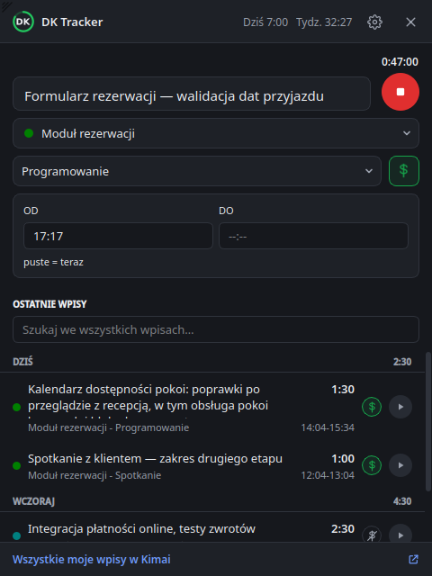

# DK Tracker

Mierzenie czasu w [Kimai](https://www.kimai.org/) prosto z tacki systemowej Linuksa — bez otwierania przeglądarki.
Natywna, linuksowa wersja firmowej wtyczki przeglądarkowej
[WS Tracker](https://github.com/websystemspl/kimai-ws-tracker).



> **Status:** wersja **0.10.4 (beta)** — sprawdzona na KDE Plasma 6 (Wayland). GNOME: testy w toku.

## Co potrafi

- okno główne na wzór Toggl Track: wpisy tygodniami i dniami, ręczne dodawanie, okno edycji z tagami, usuwanie z
  „Cofnij”;
- podsumowania tygodnia, miesiąca, roku lub zakresu: czas płatny i niepłatny, średnia na dzień roboczy, norma
  dzienna, wykres dni w kolorach projektów, podział wg projektu, klienta i rodzaju pracy;
- ikona w tacce z czasem trwającego wpisu (`47m`, `1:22`), menu: zatrzymaj, wznów ostatni, ustawienia;
- okno przy ikonie: opis, projekt (z wyszukiwaniem), rodzaj pracy, płatne / niepłatne, godziny „od / do”;
- ostatnie wpisy pogrupowane po dniach, wznawianie jednym kliknięciem, sumy dnia i tygodnia;
- wyszukiwanie we wszystkich swoich wpisach w Kimai (po opisie), długie opisy rozwijane kliknięciem;
- zmiana projektu i rodzaju pracy trwającego wpisu (wtyczka tego nie pozwala);
- przypomnienie o długim timerze, powiadomienia o utracie połączenia;
- token API w portfelu systemu (KWallet / GNOME Keyring), autostart, wersja polska i angielska.

## Instalacja

Aplikacja jest dystrybuowana jako [Flatpak](https://flatpak.org/). Instalacja z repozytorium — aktualizacje przyjdą
same (Discover, GNOME Software, `flatpak update`):

```bash
flatpak install --user https://dragonking026.github.io/DK-Tracker-Linux/io.github.dragonking026.DK-Tracker-Linux.flatpakref
```

Plik `.flatpak` jest też w [najnowszym wydaniu](https://github.com/DragonKing026/DK-Tracker-Linux/releases/latest),
ale tak zainstalowana aplikacja nie dostaje aktualizacji. Szczegóły i przejście z pliku na repozytorium:
[wydania i instalacja](docs/procesy/wydania.md).

Na GNOME ikona w tacce wymaga rozszerzenia
[AppIndicator and KStatusNotifierItem Support](https://extensions.gnome.org/extension/615/appindicator-support/);
bez niego DK Tracker działa jako zwykłe okno.

## Konfiguracja

1. Kliknij ikonę w tacce → **Otwórz ustawienia**.
2. Podaj adres Kimai i **token API** (Kimai: Profil → API — to nie jest hasło do logowania).
3. **Sprawdź połączenie**, potem **Zapisz**.

## Dokumentacja i rozwój

- [Indeks dokumentacji](docs/README.md) · [specyfikacja 1.0](docs/specyfikacja/2026-09-25-kimai-tray-1.0.md) ·
  [plany](docs/plany/README.md) · [zadania](TODO/README.md)
- Zasady pracy (także dla agentów AI): [AGENTS.md](AGENTS.md)
- Stos: Python 3.13, PySide6 (Qt 6), Flatpak na `org.kde.Platform` 6.11

## Licencja

[GPL-3.0-or-later](LICENSE) (wersje 0.9.0 i 0.9.1: AGPL-3.0-or-later). DK Tracker to niezależny projekt, nie jest
oficjalną aplikacją
[Kimai](https://www.kimai.org/) ani nie jest z nim powiązany; Kimai jest znakiem towarowym jego autora
([zasady](https://www.kimai.org/en/trademark-policy.html)).
