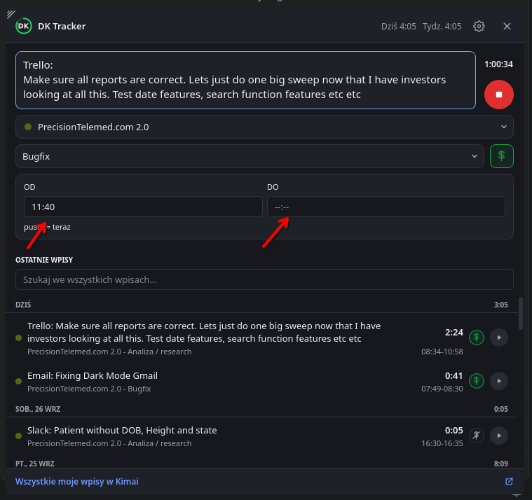

# 0077 — Okienko przy tacce: godziny OD/DO z listy, w jednym wierszu; kursor rączki

> [!info] Status
> **do-zrobienia** · priorytet **p2** · [← tablica zadań](../../README.md)

## Cel

Pola godziny rozpoczęcia i zakończenia trwającego wpisu w okienku przy tacce zajmują mniej miejsca i działają jak w
oknie głównym: godzinę się wybiera, nie wpisuje. Wszystko, co da się kliknąć, pokazuje kursor rączki.

## Kontekst

- Uwaga użytkownika (zrzut niżej): ramka OD/DO ma trzy wiersze (etykiety, pola, „puste = teraz”), a pola to zwykłe
  pola tekstowe z maską `--:--`. Najechanie na przyciski, listy i wiersze nie zmienia kursora.
- Wzór: `TimeField.qml` okna głównego — przycisk z ikoną zegara, po kliknięciu lista godzin i minut (co 5 min, plus
  minuta z Kimai spoza kroku) —
  [wygląd okna głównego](../../../docs/architektura/wyglad-okna-glownego.md).
- Okienko przy tacce jest w Qt Widgets ([form.py](../../../src/dk_tracker/ui/form.py)), więc potrzebny jest jego
  odpowiednik w widżetach.

## Kryteria akceptacji

- [ ] OD i DO w jednym wierszu razem z podpowiedzią „puste = teraz”
- [ ] Godzinę wybiera się z listy godzin i minut (jak w oknie głównym); DO da się wyczyścić (= teraz)
- [ ] Zmiana OD zapisuje godzinę rozpoczęcia, DO jest brane przy stopie — jak dotąd
- [ ] Kursor rączki nad przyciskami, listami, polami wyboru godziny i wierszami wpisów
- [ ] Testy i dokumentacja zaktualizowane
- [ ] Zmiany zacommitowane małymi krokami

## Kroki

- [ ] Widżet wyboru godziny (`TimePicker`) z testami
- [ ] Wiersz OD/DO w formularzu
- [ ] Kursor rączki
- [ ] Dokumentacja

## Materiały

## Dziennik

### 2026-09-28 12:43

- Utworzono zadanie.

## Wynik

<!-- Wypełniane przy zamknięciu: co powstało, gdzie, co zostało na później. -->
