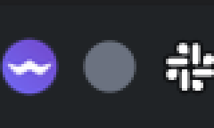
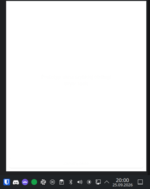

# Ustalenia prototypu 0004

Prototyp: [prototyp/tray_demo.py](../prototyp/tray_demo.py) (do wyrzucenia). Środowisko:
Fedora 44, **KDE Plasma 6.7.5, Wayland**, monitor 2560×1440, PySide6 / Qt 6.11.2 (lokalnie,
jeszcze nie we Flatpaku). Kliknięcia symulowane metodą `Activate` obiektu SNI przez D-Bus,
czyli tą samą, którą wywołuje panel Plasmy.

## KDE Plasma (Wayland) — sprawdzone automatycznie

| Pytanie | Wynik | Dowód |
|---|---|---|
| Czy `QSystemTrayIcon` pokazuje ikonę? | **tak** — `tray_available: true`, SNI zarejestrowany (`Category=ApplicationStatus`, `Status=Active`, `ItemIsMenu=false`, menu przez `/MenuBar` = dbusmenu) | [log](../testy/log-kde-tool.jsonl),  |
| Lewy klik → okno? | **tak** — `Activate` daje `ActivationReason.Trigger`, okno się pokazuje i dostaje fokus (`active: true`) | [log](../testy/log-kde-tool.jsonl) |
| Czy aplikacja zna pozycję ikony / okna? | **nie** — `tray.geometry()` = 0,0,0,0, pozycja okna z Qt = 0,0 (Wayland) | [log](../testy/log-kde-tool.jsonl) |
| Gdzie KWin stawia okno bezramkowe (wariant A)? | **na środku ekranu** (460×560, środek x=1279 na 2560) |  |
| Tooltip z czasem timera | **odświeża się co sekundę** (`Kimai Tray — 0:00:22 — …` → `0:00:24`); tekst trafia do tytułu tooltipa SNI | [log](../testy/log-kde-layer.jsonl) |
| Zmiana ikony (szara → zielona) | **działa** |  |
| Wariant B: `layer-shell-qt` z Pythona | **działa** — PySide nie ma wiązań, ale `LayerShellQt::Window::get(QWindow*)` przez `ctypes` + `setProperty` (anchors, layer, keyboardInteractivity, margins, scope) ustawia wszystko (`set_ok: true`); odczyt enumów z PySide niemożliwy (brak konwertera) — bez znaczenia | [log](../testy/log-kde-layer.jsonl) |
| Gdzie stoi okno w wariancie B? | **prawy dolny róg, tuż nad panelem**: 12 px od prawej (margines), 60 px od dołu (12 px + panel — kompozytor respektuje strefę panelu) |  |

## Wariant B — test ręczny użytkownika (2026-09-25 20:06)

Log: [testy/log-kde-layer-reczny.jsonl](../testy/log-kde-layer-reczny.jsonl).

| Krok | Wynik |
|---|---|
| 1. Klik w ikonę → okno w prawym dolnym rogu | **tak** |
| 2. Pisanie w polu tekstowym (`keyboardInteractivity=OnDemand`) | **tak** |
| 3. Klik poza okno → okno się chowa | **tak** (`WindowDeactivate`) |
| 4. Klik w ikonę przy **otwartym** oknie | **okno zostaje** — Plasma nie wysyła `Activate`, okno nie traci fokusu; ikona **nie działa jak przełącznik** |
| 5. Prawy klik → menu przy ikonie | **tak** — menu rysuje Plasma z dbusmenu (`/MenuBar`), aplikacja nie dostaje zdarzenia `Context` |
| Uwaga użytkownika | wpisany tekst pozostaje po schowaniu i ponownym otwarciu (zaleta: szkic opisu nie przepada) |

> [!warning] Krok 4
> Zamknięcie okna tylko przez klik obok albo `Esc`/przycisk. Do rozważenia w UI: przycisk
> zamknięcia w nagłówku okna i obsługa `Esc`.

## Wariant A — test ręczny użytkownika (2026-09-25 20:16)

Log: [testy/log-kde-tool-reczny.jsonl](../testy/log-kde-tool-reczny.jsonl).

| Krok | Wynik |
|---|---|
| 1. Klik w ikonę → okno | **na środku ekranu** (użytkownik: w wariancie B było przy tacce) |
| 2. Pisanie | **tak** |
| 3. Klik poza okno → chowa się | **tak** |
| 4. Klik w ikonę przy otwartym oknie | **okno zostaje** — jak w B: Plasma nie wysyła `Activate`, okno nie traci fokusu |
| 5. Prawy klik → menu przy ikonie | **tak** |

> [!important] Wniosek z kroku 4 (oba warianty)
> To zachowanie hosta tacki (Plasma), nie okna. Ikona **nie zamknie** otwartego okna —
> w UI potrzebny przycisk zamknięcia w nagłówku i klawisz `Esc` (plus chowanie po utracie fokusu).

## Flatpak (2026-09-25 20:16)

| Pytanie | Wynik |
|---|---|
| Budowa z `io.qt.PySide.BaseApp` | **zablokowana na Fedorze 44**: Flatpak 1.18.2 ma regresję — `build-init --base` kończy się `lsetxattr(security.selinux): Operation not supported` ([flatpak#6818](https://github.com/flatpak/flatpak/issues/6818), poprawka w 1.18.3 przez [PR #6834](https://github.com/flatpak/flatpak/pull/6834)); w repozytoriach Fedory 44 (także updates-testing) jest tylko 1.18.2 |
| Obejście | PySide6 z paczek PyPI (`pyside6-essentials` + `shiboken6` 6.11.2, 80 MB) zamiast bazy — [manifest](../prototyp/flatpak/pl.websystems.KimaiTray.Prototyp.wheels.yml); budowa **20 s**, aplikacja 236 MB |
| Tacka we Flatpaku z samym `--talk-name=org.kde.StatusNotifierWatcher` | **działa** — ikona zarejestrowana, bez `--own-name` |
| Klik (`Activate` → `Trigger`) i tooltip co sekundę w piaskownicy | **działa** ([log](../testy/log-flatpak-tool.jsonl)) |
| Wariant B we Flatpaku | **niewykonalny w obejściu** — `layer-shell-qt` nie ma w `org.kde.Platform`, a wtyczkę trzeba zbudować pod Qt aplikacji; Qt z paczki pip nie ma nagłówków prywatnych. Możliwe dopiero z bazą PySide (Qt runtime'u) po naprawie Flatpaka |
| Budowa w piaskownicy narzędzia agenta | `flatpak-builder` wymaga pracy poza piaskownicą Claude Code (dostęp do `~/.local/share/flatpak`) — informacja dla kolejnych sesji |

## Do sprawdzenia ręcznie

Wszystkie punkty sprawdzone w testach ręcznych wariantów A i B (wyżej).

## Nie sprawdzone (zablokowane)

- **GNOME** — na tej maszynie nie ma GNOME Shell; testy wykonają później inne osoby (decyzja użytkownika).

## Wnioski (wstępne)

- Wariant B jest technicznie osiągalny z PySide bez kompilacji — ważne dla ADR-0003.
- Konsekwencja wariantu B: `QT_WAYLAND_SHELL_INTEGRATION=layer-shell` działa dla **całego procesu**
  (każde okno staje się powierzchnią warstwy) — okno ustawień musiałoby być osobnym procesem
  albo zmienna ustawiana tylko dla okna szybkiej obsługi (do zbadania).
- `layer-shell-qt` nie jest w `org.kde.Platform` — we Flatpaku trzeba go dołożyć modułem albo
  wziąć z hosta (nie da się). Do sprawdzenia przy budowie Flatpaka.
