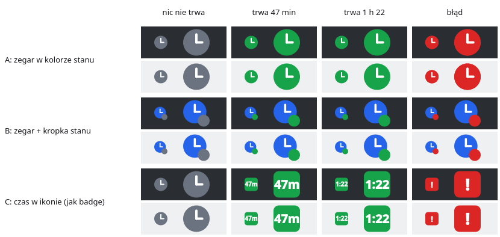

# 0028 — Plan 3 — projekt interfejsu (decyzje przed planem)

> [!info] Status
> **w-trakcie** · priorytet **p1** · [← tablica zadań](../../README.md)

## Cel

Rozstrzygnąć z użytkownikiem decyzje o wyglądzie i zachowaniu UI, których nie zamyka
[specyfikacja](../../../docs/specyfikacja/2026-09-25-kimai-tray-1.0.md), a potem napisać Plan 3 (`ui/`).

## Kontekst

- Architektura UI: [specyfikacja, sekcje 4–5](../../../docs/specyfikacja/2026-09-25-kimai-tray-1.0.md), [ADR-0005](../../../docs/decyzje/0005-okno-przy-tacce-na-kde.md).
- Wzorzec: [kimai-ws-tracker](../../../docs/integracje/kimai-ws-tracker.md) (wygląd i palety motywów), [katalog funkcji](../../../docs/architektura/funkcje.md).
- Prototyp: [0004](../../ZROBIONE/0004-prototyp-tacki-i-okna/todo.md).

## Kryteria akceptacji

- [ ] Każda otwarta decyzja UI rozstrzygnięta i zapisana (tu i w docs)
- [ ] Plan 3 napisany, zweryfikowany i zaakceptowany przez użytkownika

## Decyzje

- [x] **Motyw:** według systemu (jasny/ciemny), palety 1:1 z wtyczki — [paleta](../../../docs/integracje/kimai-ws-tracker.md). Wtyczka też przełącza motyw według systemu (`prefers-color-scheme`).
- [x] **Ikona w tacce (F-02):** wariant **C** — czas w ikonie jak plakietka wtyczki (`47m` / `1:22` na zielonym, `!` na czerwonym, szary zegar gdy nic nie trwa); pełna informacja w tooltipie. Zapis: [F-02](../../../docs/architektura/funkcje.md).

## Materiały

-  — makieta F-02: 22 px (100 %) i 44 px (200 %), panel ciemny i jasny; skrypt: [prototyp/ikony_makieta.py](prototyp/ikony_makieta.py)

## Dziennik

### 2026-09-25
- **21:55** Utworzono. Motyw: według systemu (decyzja użytkownika).
- **21:59** Ikona: wariant C (decyzja użytkownika).
