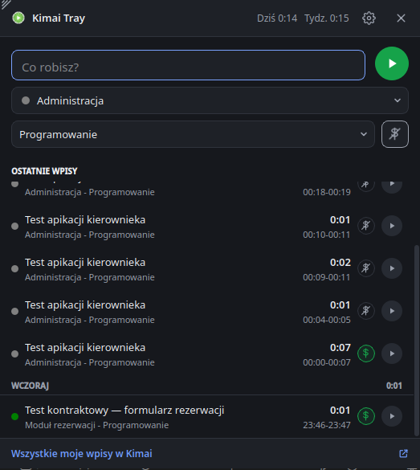

# Lista kontrolna testu na żywo (Plan 3)

Zadanie: [0041](../todo.md). Środowisko: Fedora 44, KDE Plasma 6.7.5 (Wayland), systemowy PySide6 6.11.2,
Kimai 2.67.0 w Dockerze (`tests/kimai/kimai-testowe.sh`), izolowana konfiguracja (`XDG_CONFIG_HOME`).
Testuje użytkownik; poprawki z pierwszego przebiegu: [0042](../../../ZROBIONE/0042-poprawki-po-tescie-na-zywo/todo.md).

| Nr | Punkt | Wynik |
| --- | --- | --- |
| 1 | Pierwsze uruchomienie: szary zegar, „nieskonfigurowana”, ustawienia jako zwykłe okno | tak |
| 2 | Ustawienia: test połączenia „Połączono jako jan.”, ostrzeżenie o `http://`, zapis | tak (tekst ucięty — poprawione w 0042) |
| 3 | Okno przy tacce: projekty po klientach, czynności, `$` według projektu | tak (+ wyszukiwanie, 0042) |
| 4 | Start Enterem, ikona `0m`, tooltip, zegar | tak |
| 5 | Edycja opisu, godziny „od”, `$` (jan: blokada; kierownik: zapis) | tak |
| 6 | Chowanie: klik obok, Esc, ✕; klik ikony przełącza okno | tak (przełączanie dodane w 0042) |
| 7 | Menu: „Zatrzymaj timer” / „Wznów ostatni wpis” z powiadomieniem | tak (po poprawce identyfikatorów, 0042) |
| 8 | Lista: ▶ wznawia, `$` w wierszu, link do Kimai | tak; link otworzył Firefoxa zamiast Brave — skutek izolacji testu (`XDG_CONFIG_HOME` dziedziczy `xdg-open`), normalnie Brave (sprawdzone `xdg-mime`) |
| 9 | Język English bez restartu | tak |
| 10 | Motyw jasny/ciemny na żywo | do potwierdzenia |
| 11 | Długi timer (próg 0,1 h): powiadomienie z przyciskami, „Zatrzymaj” zatrzymuje i zamyka | tak |
| 12 | Druga instancja pokazuje okno pierwszej | tak (sprawdzone: wyjście po 0,24 s, okno pokazane) |

