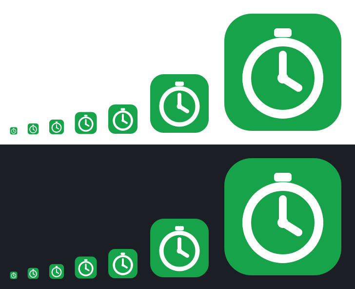
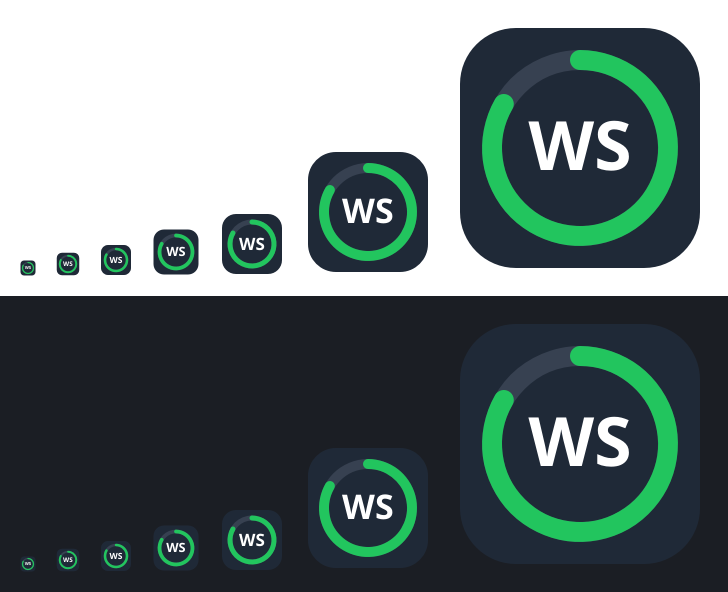
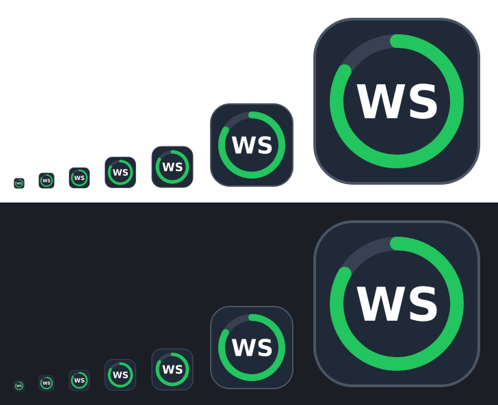

# 0063 — Własna ikona i nazwa „WS Tracker” w 0.9.1

> [!info] Status
> **w-trakcie** · priorytet **p1** · [← tablica zadań](../../README.md)

## Cel

Zastąpić logo Kimai własną ikoną i zmienić nazwę wyświetlaną na **WS Tracker** już w wydaniu 0.9.1.

## Kontekst

- [Zasady znaku towarowego Kimai](https://www.kimai.org/en/trademark-policy.html): logo wolno pokazać jako „działa z
  Kimai”, ale nie wolno sprawiać wrażenia oficjalnej aplikacji ani powiązania; użycie komercyjne wymaga zgody. Dotąd
  logo Kimai było ikoną aplikacji (menu, pasek tytułu, Discover, nagłówek okna).
- Decyzje użytkownika (2026-09-26 13:45): wariant **C** (ciemny kafel, zielony pierścień postępu, „WS”); nazwa „WS
  Tracker” już
  teraz. Identyfikator, pakiet i komenda zostają do decyzji właściciela
  ([0056](../0056-identyfikator-i-wydawca/todo.md), [0062](../../DO-ZROBIENIA/0062-aplikacja-ws-tracker/todo.md)).
- Poprawki wariantu C: litery zamienione na krzywe (bez zależności od czcionek), jaśniejsza obwódka kafla (widoczność
  na ciemnym pulpicie).

| Wariant | Podgląd (16–256 px, jasne i ciemne tło) |
| --- | --- |
| A — Stoper |  |
| B — Kafel |  |
| C — WS |  |
| **C — wersja końcowa** |  |

## Kryteria akceptacji

- [ ] Ikona: źródło [data/icons/ws-tracker.svg](../../../data/icons/ws-tracker.svg), PNG 512 px w pakiecie, Flatpak i
  wersja deweloperska; logo Kimai usunięte
- [ ] Nazwa „WS Tracker” w oknie, menu, powiadomieniach, portfelu, `.desktop`, MetaInfo, stronie repozytorium, README
- [ ] Test ikony (TDD), pełny zestaw kontroli z CI

## Kroki

- [ ] Projekt wariantów i wybór
- [ ] Ikona i nazwa w kodzie
- [ ] Dokumentacja

## Materiały

- [prototyp/a-stoper.svg](prototyp/a-stoper.svg), [prototyp/b-kafel.svg](prototyp/b-kafel.svg),
  [prototyp/c-ws.svg](prototyp/c-ws.svg), [prototyp/c-ws-final.svg](prototyp/c-ws-final.svg) — źródła wariantów
- [zrzuty/](zrzuty/podglad-c-ws-final.png) — podglądy (wyżej)

## Dziennik

### 2026-09-26

- **13:45** Warianty A, B, C; użytkownik wybrał C i nazwę „WS Tracker” w 0.9.1.

## Wynik

<!-- Wypełniane przy zamknięciu. -->
