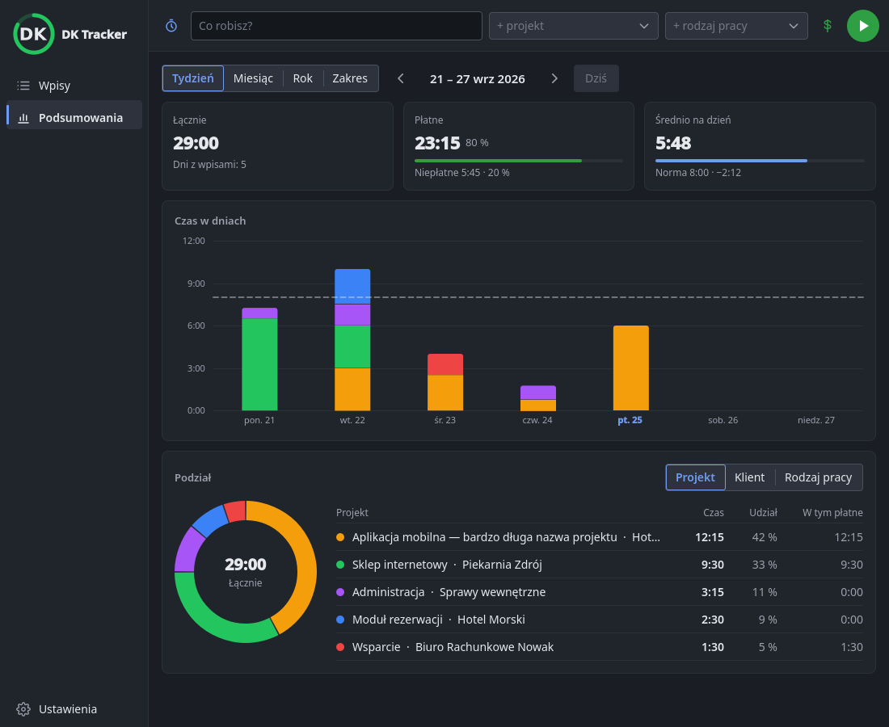
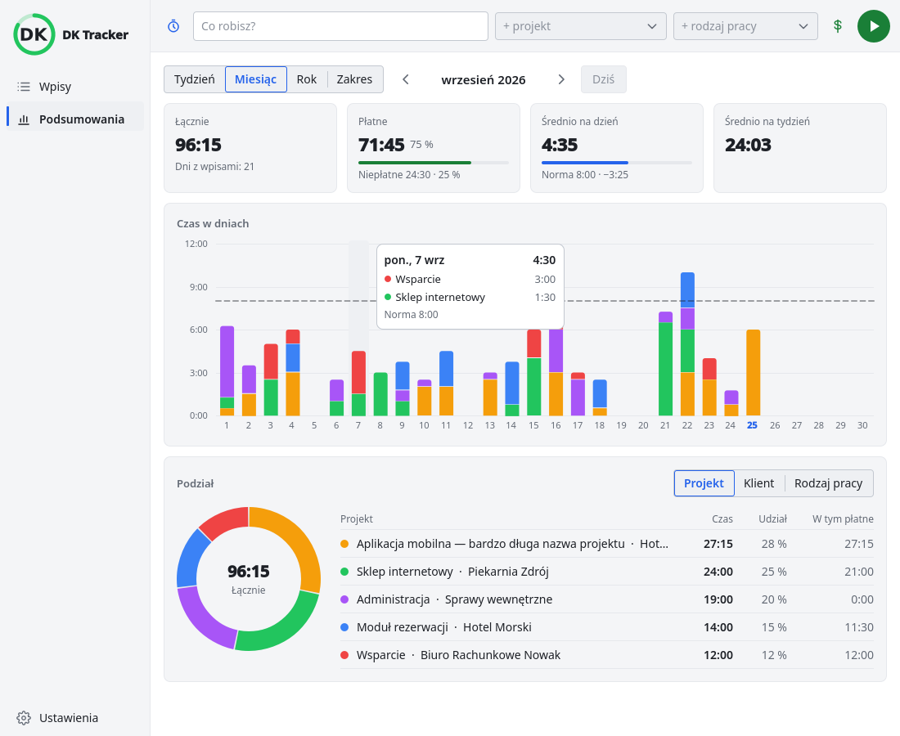
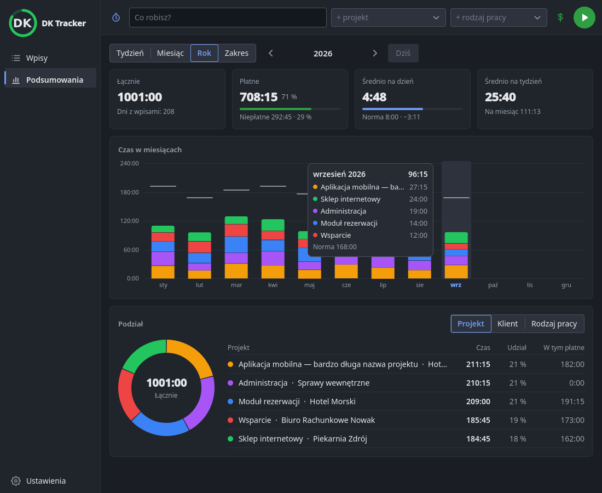
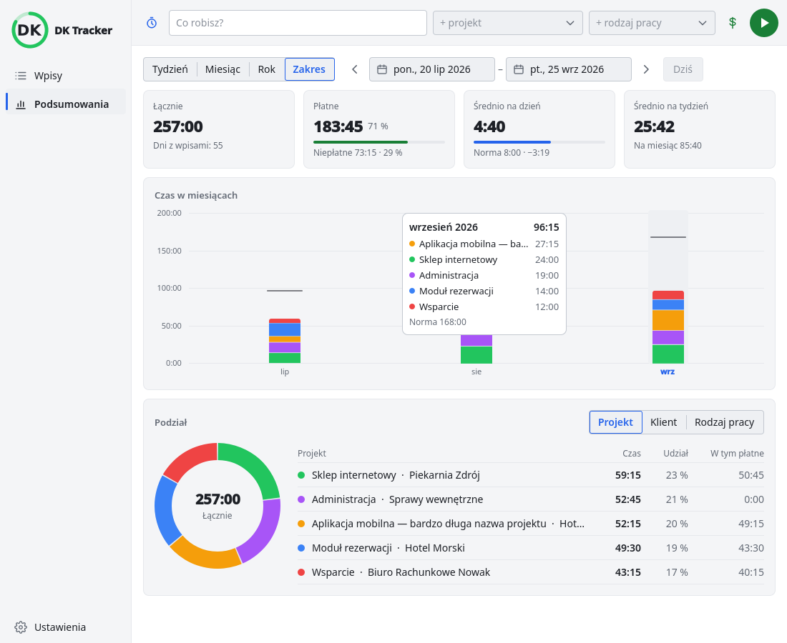
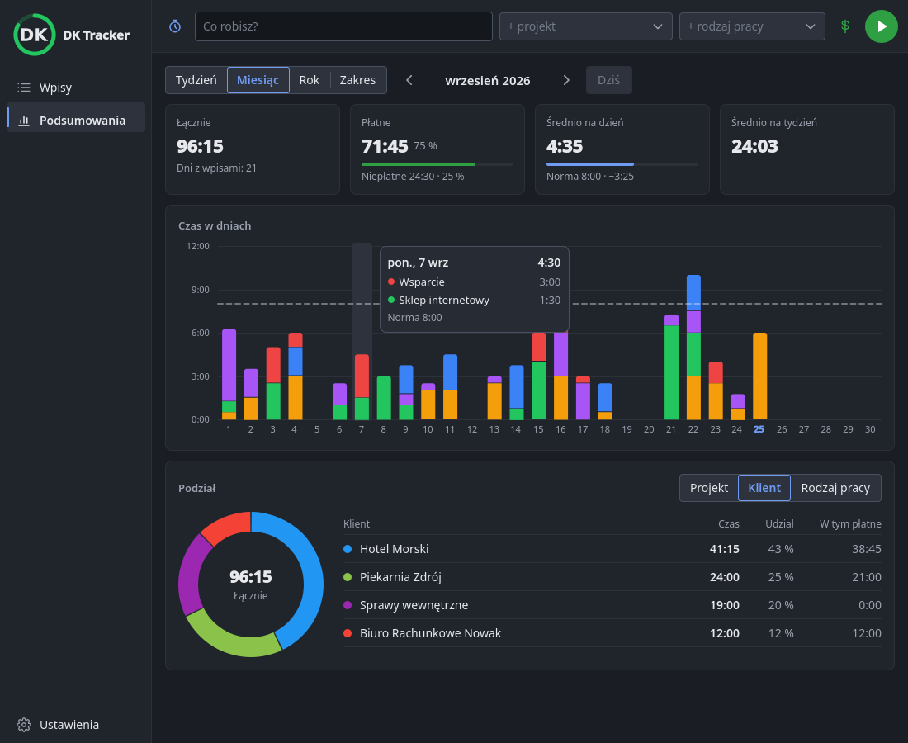
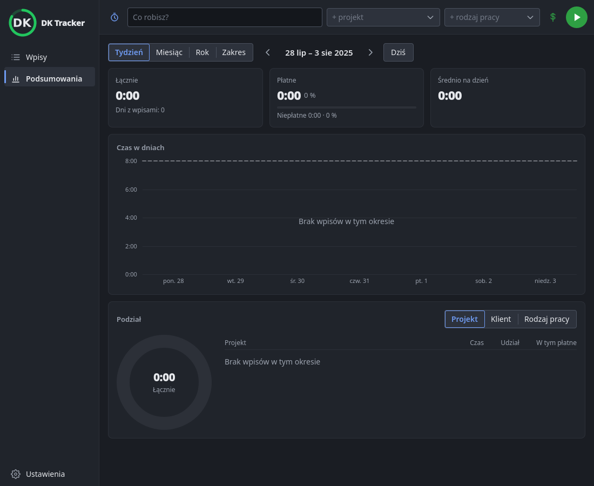
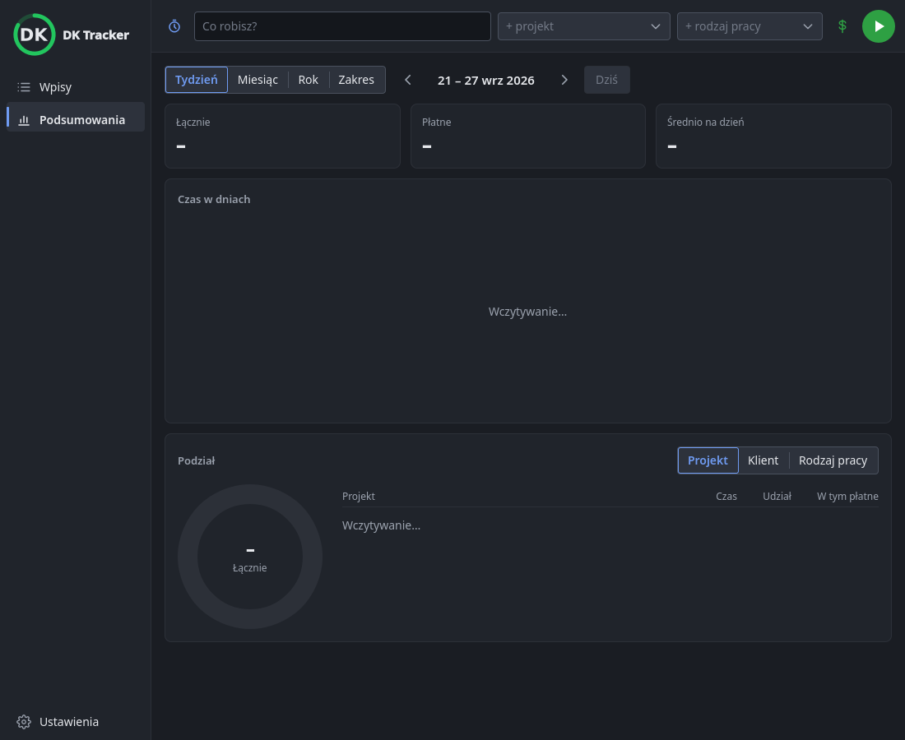
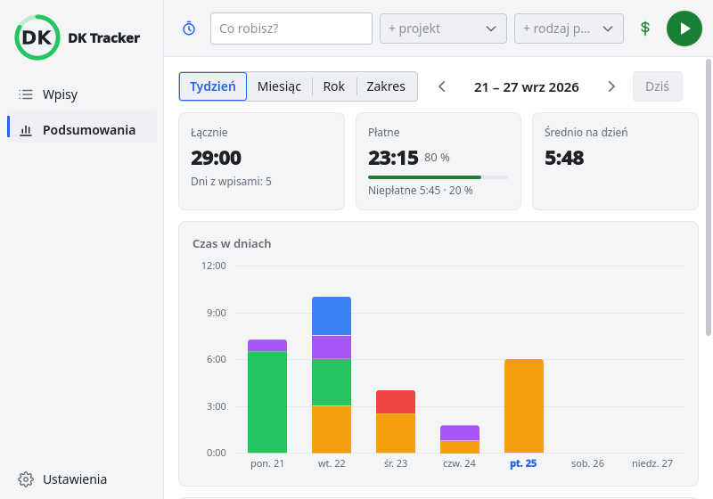

# 0070 — Plan 6: podsumowania 0.10.3 — wykonanie

> [!info] Status
> **w-trakcie** · priorytet **p1** · [← tablica zadań](../../README.md)

## Cel

Widok **Podsumowania** w oknie głównym według
[specyfikacji 0.10, sekcja 6](../../../docs/specyfikacja/2026-09-26-okno-glowne-0.10.md#6-podsumowania-0103)
i wydanie 0.10.3.

## Kontekst

- Użytkownik (2026-09-27): „Kontynuuj dalszy ciąg implementacji wersji 0.10” — po wydaniu
  [0.10.2](../../ZROBIONE/0069-plan5-okno-glowne/todo.md) kolejny krok to podsumowania.
- Plan: [Plan 6](../../../docs/plany/2026-09-27-plan-6-podsumowania.md).
- Wygląd z tych samych kolorów i kontrolek:
  [wygląd okna głównego](../../../docs/architektura/wyglad-okna-glownego.md).

## Kryteria akceptacji

- [x] Okresy tydzień / miesiąc / rok / zakres, strzałki ◀ ▶, domyślnie bieżący tydzień
- [x] Czas łączny, płatne/niepłatne (h i %), średnia na dzień roboczy, dni z wpisami, norma
- [x] Wykres słupkowy w kolorach projektów z normą i dymkiem; podział: wykres kołowy + tabela
  (projekt / klient / rodzaj pracy)
- [x] Norma dzienna w ustawieniach (0 = bez normy)
- [x] Wyniki zgodne z sumami Kimai dla tego samego okresu (test kontraktowy)
- [x] Galeria zrzutów w obu motywach sprawdzona przed pokazaniem; PL/EN
- [x] Testy i ruff czyste, dokumentacja zaktualizowana
- [ ] Test na żywo z użytkownikiem, wydanie 0.10.3 za zgodą użytkownika

## Kroki

- [x] Plan 6
- [x] `core/summary.py` — liczenie (TDD)
- [x] Norma w ustawieniach
- [x] Most i modele widoku
- [x] Widok QML i pasek boczny
- [x] Kontroler: wczytywanie okresu w tle
- [x] Test kontraktowy
- [x] Galeria zrzutów
- [x] Dokumentacja
- [ ] Wersja i wydanie

## Materiały

Galeria bez ekranu (`grabWindow`), dane wymyślone — skrypt: [testy/galeria.py](testy/galeria.py).

| Stan | Zrzut |
| --- | --- |
| Tydzień, ciemny |  |
| Miesiąc z dymkiem, jasny |  |
| Rok z dymkiem, ciemny |  |
| Zakres, jasny |  |
| Podział wg klienta |  |
| Pusty okres |  |
| Nowy okres się wczytuje |  |
| Okno 800 × 560 |  |

## Dziennik

### 2026-09-27

- **11:41** Utworzono zadanie.
- **11:45** Start. Plan 6 napisany (ebef920).

- **12:45** Zrobione zadania 1–9 planu (TDD): `Entry` z klientem i kolorami (bfeb803), `core/summary.py`
  (b0f7666, 78ae076), norma w ustawieniach (d6f3e75), `SummaryPage` (9d9b03f), kontroler (d84abda), widok QML
  (642f7e1), test kontraktowy sum (ef1179b). Galeria przejrzana przed pokazaniem: poprawione nierówne kafelki,
  kolejność w dymku, podświetlenie pustej kolumny, dni starego okresu pod nazwą nowego przy wczytywaniu. Testy:
  679 + 18 kontraktowych. Czeka: test na żywo z użytkownikiem i wydanie 0.10.3.
- **13:05** Test na żywo (użytkownik): średnie opisane niejasno, wystarczy jedna — czas ÷ dni z wpisami (wybór
  użytkownika spośród: dni robocze do dziś, dni z wpisami, wszystkie dni robocze). Kafelek „Średnio na tydzień / na
  miesiąc” usunięty, średnia nazywa się „Średnio na dzień pracy”; specyfikacja, plan (R6) i F-36 poprawione.

- **13:40** Dalej test na żywo: (1) średnia jednak ÷ **dni robocze** (pon.–pt., do dziś) — ÷ dni z wpisami
  obniżało ją po pracy w sobotę; norma przy miesiącach też z dni roboczych; (2) najechanie na wycinek pierścienia
  albo wiersz tabeli pokazuje dymek z opisami wpisów i ich czasem, jak w Togglu. Testy: 690.

- **13:55** Test na żywo: dymek słupka ma wyliczać wpisy — pod każdym projektem opisy z czasem (dzień do 10,
  miesiąc do 3 na projekt, żeby zmieścić się w oknie 560 px). Testy: 692.

## Wynik

<!-- Wypełniane przy zamknięciu: co powstało, gdzie, co zostało na później. -->
