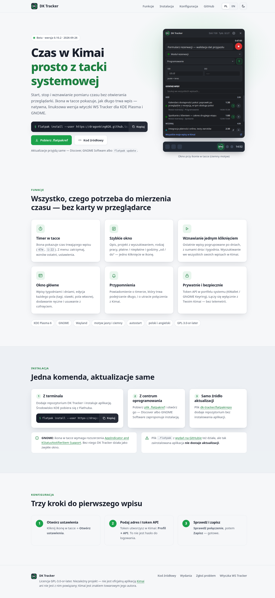
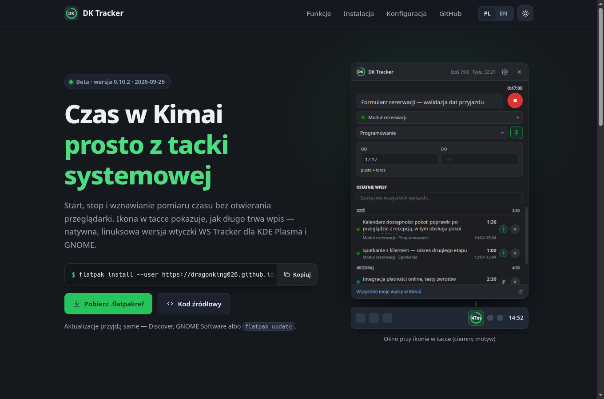
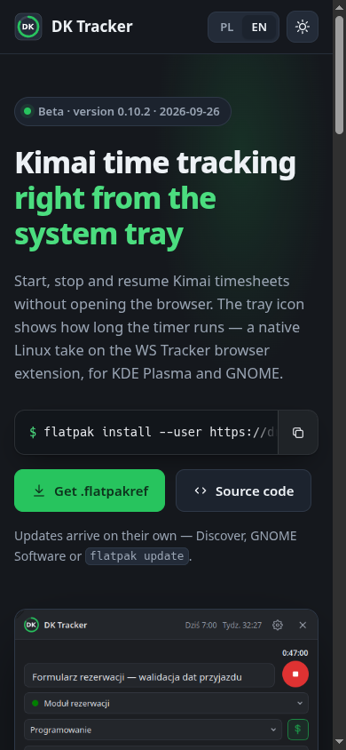

# 0071 — Strona projektu na GitHub Pages — nowy wygląd i workflow „Strona”

> [!info] Status
> **w-trakcie** · priorytet **p2** · [← tablica zadań](../../README.md)

## Cel

Zamiast surowej strony z jedną komendą — prawdziwa strona projektu
([dragonking026.github.io/DK-Tracker-Linux](https://dragonking026.github.io/DK-Tracker-Linux/)): czym jest DK Tracker,
zrzut okna, funkcje, instalacja w jednym kroku, konfiguracja; po polsku i angielsku. Strona ma się dać
opublikować bez wydawania nowej wersji aplikacji.

## Kontekst

- Dziś stronę generuje [flatpak/pages.py](../../../flatpak/pages.py) (`index_html`), a publikuje ją tylko
  [wydanie.yml](../../../.github/workflows/wydanie.yml) przy tagu `v*`.
- Pages to jedno wdrożenie: strona **i** repozytorium Flatpaka
  ([ADR-0007](../../../docs/decyzje/0007-dystrybucja-repozytorium-flatpak-na-github-pages.md),
  [GitHub Pages](../../../docs/integracje/github-pages.md)). Każda publikacja podmienia całość — publikacja samej
  strony musi więc zabrać ze sobą działające, podpisane repozytorium.
- Decyzje użytkownika (2026-09-27 11:53): osobny workflow „Strona” (kopiuje opublikowane repozytorium
  `ostree pull --mirror`, podpisuje summary tym samym kluczem, wdraża z nową stroną); strona PL + EN
  z przełącznikiem.
- Proces wydań: [docs/procesy/wydania.md](../../../docs/procesy/wydania.md).

## Kryteria akceptacji

- [x] Strona statyczna (bez zewnętrznych skryptów i czcionek — zgodnie z brakiem telemetrii), jasny i ciemny motyw,
  działa na telefonie
- [x] PL i EN z przełącznikiem; domyślnie według języka przeglądarki
- [x] Komenda instalacji z przyciskiem „kopiuj”, link do `.flatpakref` i `.flatpakrepo`
- [x] `pages.py` i wydanie publikują nową stronę tak jak dotąd (te same pliki `.flatpakref` / `.flatpakrepo`)
- [ ] Workflow „Strona” publikuje stronę bez wydania; repozytorium Flatpaka po nim działa (`flatpak remote-ls`,
  `flatpak update`)
- [x] Dokumentacja zaktualizowana ([wydania](../../../docs/procesy/wydania.md),
  [GitHub Pages](../../../docs/integracje/github-pages.md))
- [ ] Zmiany zacommitowane małymi krokami

## Kroki

- [x] Projekt strony: tokeny, sekcje, oba motywy, szerokość telefonu
- [x] Szablon strony w repozytorium + `pages.py` go używa, testy
- [x] Workflow `strona.yml` (mirror repozytorium, podpis summary, wdrożenie)
- [x] Dokumentacja
- [ ] Publikacja i sprawdzenie na żywo

## Materiały

Podgląd lokalny (przed publikacją):

- 
- 
- 

## Dziennik

### 2026-09-27 11:53

- Utworzono zadanie. Praca w worktree `.claude/worktrees/strona` (gałąź `strona` od `origin/main`), bo główny katalog
  zajmuje inna sesja.
- **11:53** Start pracy: projekt strony i workflow „Strona”.

### 2026-09-27 12:45

- Strona z szablonu [flatpak/strona/](../../../flatpak/strona/index.html), składana przez
  [pages.py](../../../flatpak/pages.py) (wersja i data z MetaInfo); przegląd w obu motywach i na 390 px — bez
  przewijania w poziomie, kopiowanie, przełączniki języka i motywu działają.
- Workflow [strona.yml](../../../.github/workflows/strona.yml). Sprawdzone lokalnie: `ostree pull --mirror`
  z kluczem projektu przechodzi, bez klucza — odmowa; `publikuj.sh` na prawdziwej kopii (333 MB) z kluczem testowym
  daje repozytorium z tym samym commitem aplikacji (`7c29725d`), `flatpak remote-ls` / `remote-info` je czytają.
- Dokumentacja: [GitHub Pages](../../../docs/integracje/github-pages.md),
  [GitHub Actions](../../../docs/integracje/github-actions.md), [wydania](../../../docs/procesy/wydania.md).
- Czeka: push na `main` (za zgodą) i sprawdzenie na żywo.

## Wynik

<!-- Wypełniane przy zamknięciu: co powstało, gdzie, co zostało na później. -->
