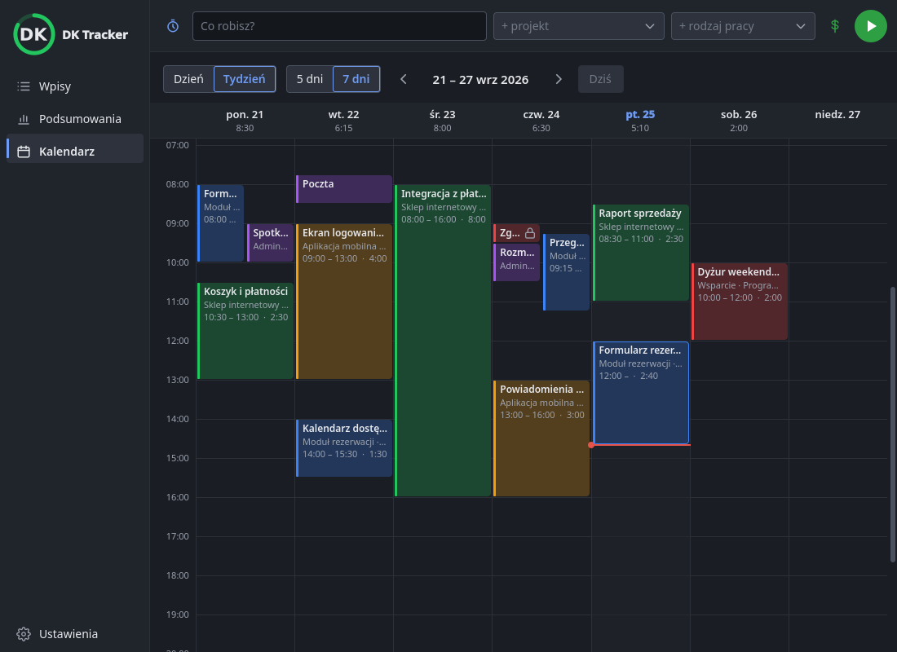
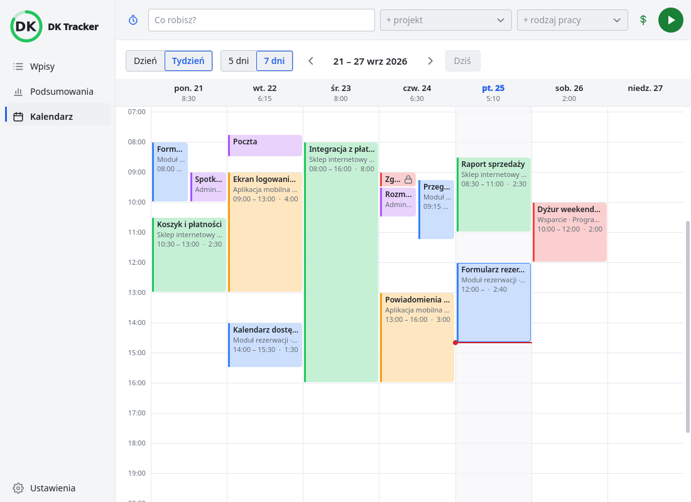
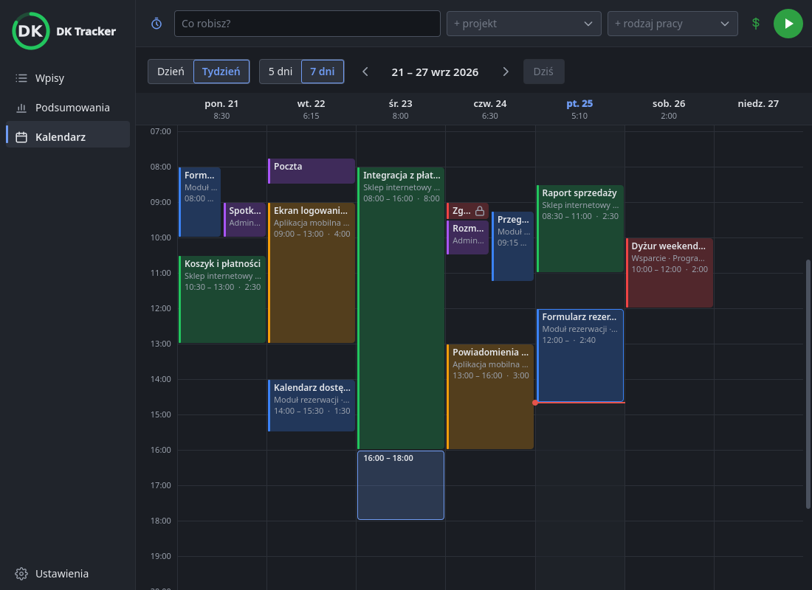
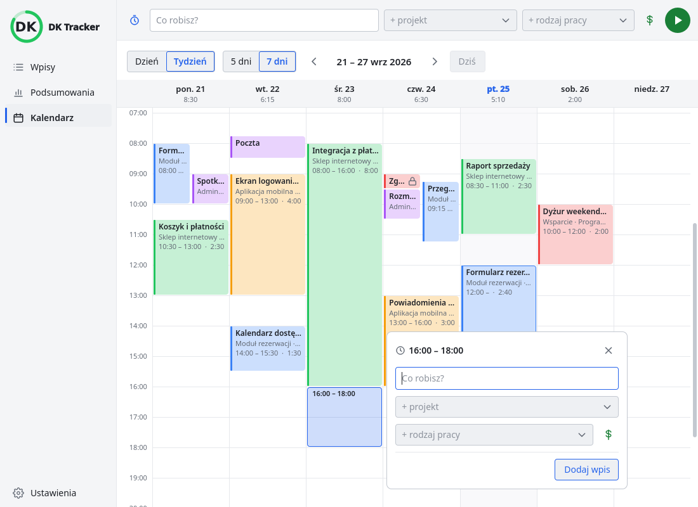
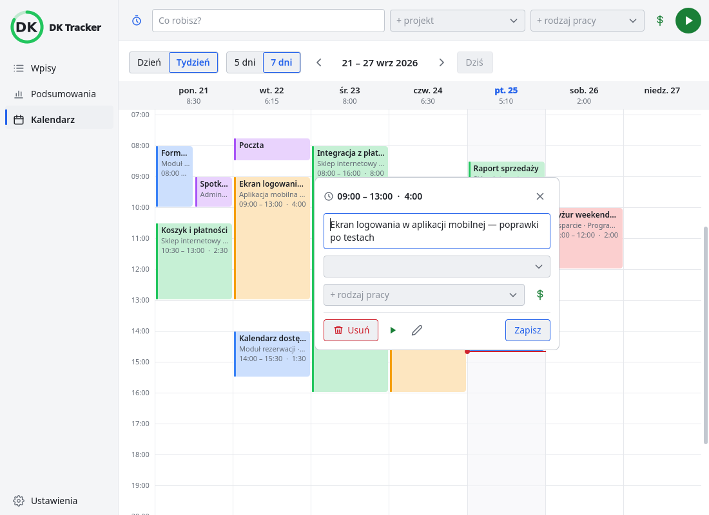
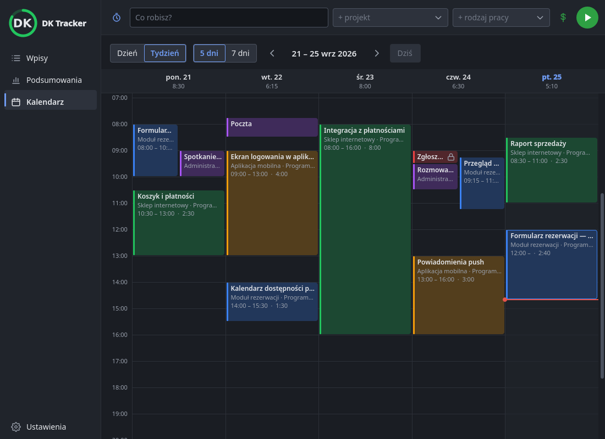
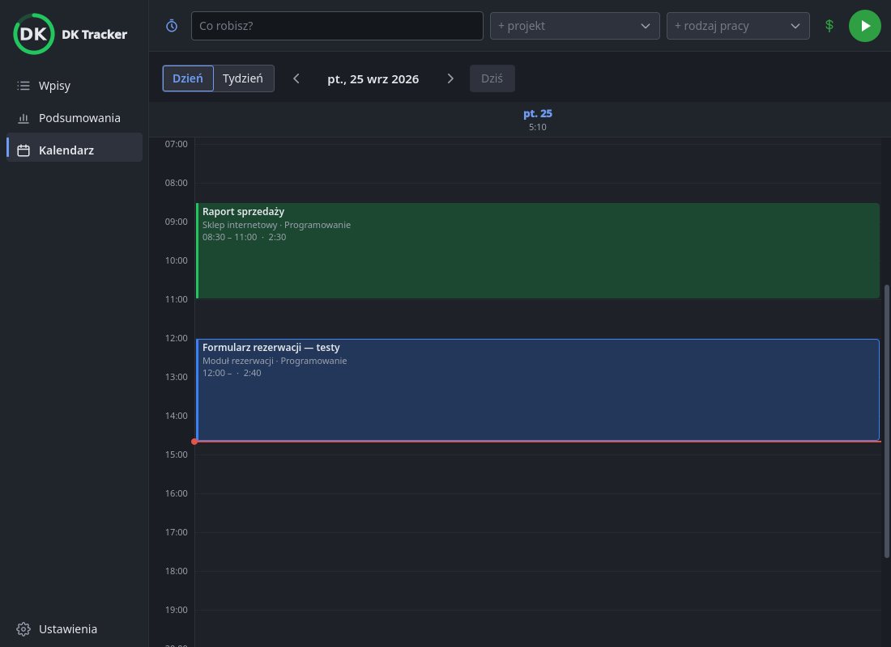
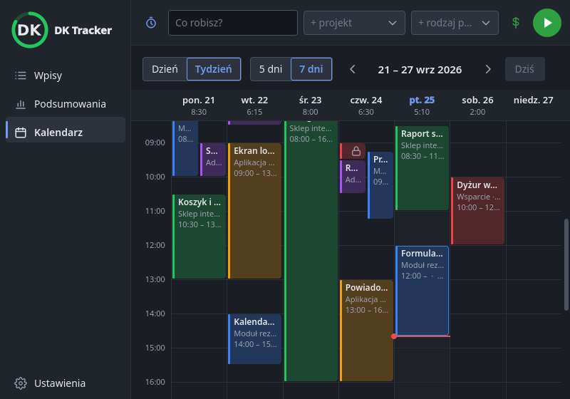

# 0073 — Plan 7: kalendarz 0.10.5 — wykonanie

> [!info] Status
> **w-trakcie** · priorytet **p1** · [← tablica zadań](../../README.md)

## Cel

Widok **Kalendarz** w oknie głównym według
[specyfikacji 0.10, sekcja 8](../../../docs/specyfikacja/2026-09-26-okno-glowne-0.10.md#8-kalendarz-0105) i wydanie
0.10.5.

## Kontekst

- Użytkownik (2026-09-27, po wydaniu 0.10.4): „Możesz iść dalej”.
- Plan: [Plan 7](../../../docs/plany/2026-09-27-plan-7-kalendarz.md). Wygląd:
  [wygląd okna głównego](../../../docs/architektura/wyglad-okna-glownego.md).

## Kryteria akceptacji

- [x] Dzień / tydzień (5 lub 7 dni), ◀ ▶, „Dziś”; siatka 0–24 przewinięta na godziny pracy; linia „teraz”
- [x] Bloki w kolorach projektów, trwający rośnie na żywo, nakładające się obok siebie, wyeksportowane z kłódką
- [x] Przeciągnięcie w pustym miejscu → nowy wpis z dymka; krawędź → godziny; blok → przesunięcie (też na inny dzień)
- [x] Klik w blok → dymek z „Usuń” i „Wznów”; odmowa Kimai → blok wraca, komunikat
- [x] Przyciąganie co 15 min, Alt wyłącza
- [x] Test kontraktowy przesunięcia na inny dzień; galeria w obu motywach; PL/EN; dokumentacja
- [ ] Test na żywo z użytkownikiem, wydanie 0.10.5

## Kroki

- [x] Plan 7
- [x] Rdzeń: `core/calendar.py` (dni, układ bloków, przyciąganie) i `Tracker.reschedule`
- [x] `CalendarPage` (`app.calendarPage`)
- [x] Widok QML: siatka, bloki, przeciąganie, dymek
- [x] Kontroler
- [x] Test kontraktowy, galeria, dokumentacja
- [ ] Wersja i wydanie

## Materiały

Galeria bez ekranu (`grabWindow`), dane wymyślone — skrypt: [testy/galeria.py](testy/galeria.py).

| Stan | Zrzut |
| --- | --- |
| Tydzień, ciemny |  |
| Tydzień, jasny |  |
| Przeciąganie nowego wpisu |  |
| Dymek nowego wpisu |  |
| Dymek wpisu |  |
| 5 dni |  |
| Dzień z trwającym wpisem |  |
| Okno 800 × 560 |  |

## Dziennik

### 2026-09-27

- **13:13** Utworzono i start.

- **14:10** Zadania 1–8 planu (TDD): `core/calendar.py` i `Tracker.reschedule` (ce2baf0), `CalendarPage` i
  kontroler (ba51b8f), widok QML (5633ab8), test kontraktowy (d566e80). Galeria: poprawione przewijanie (liczone przed
  znaną wysokością siatki), szary nowy blok (kolor palety to tekst), delegat przysłaniający `grid`. Test klikania i
  przeciągania bloku na prawdziwym QML. Testy: 744 + 19 kontraktowych. Czeka: test na żywo i wydanie 0.10.5.

## Wynik

<!-- Wypełniane przy zamknięciu. -->
