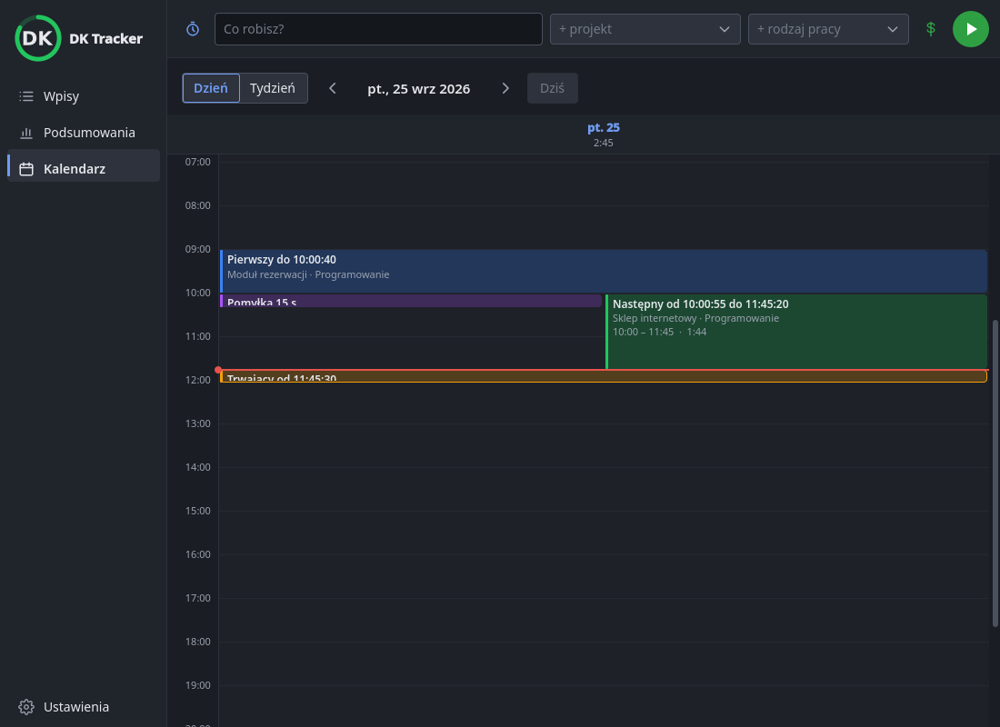

# 0078 — Kalendarz liczy sekundy; lewy klik ikony na GNOME

> [!info] Status
> **w-trakcie** · priorytet **p2** · [← tablica zadań](../../README.md)

## Cel

Kalendarz rysuje wpisy co do sekundy, więc wpis zamknięty i nowy otwarty w tej samej minucie są widoczne jeden pod
drugim. Wyjaśnić, czemu na GNOME lewy klik ikony pokazuje menu zamiast okienka.

## Kontekst

- Uwaga użytkownika: „w tej samej minucie zamknę i otworzę nowy wpis” — kalendarz liczył bloki w pełnych minutach
  ([core/calendar.py](../../../src/dk_tracker/core/calendar.py)), więc wpis krótszy niż minuta w obrębie jednej
  minuty miał długość 0 i znikał, a nowy trwający wpis był niewidoczny do następnej minuty.
- Uwaga użytkownika z testu na GNOME: lewy klik działa jak prawy (menu). Zadanie testów GNOME:
  [0020](../../DO-ZROBIENIA/0020-testy-gnome/todo.md); integracja:
  [GNOME AppIndicator](../../../docs/integracje/gnome-appindicator.md).

## Kryteria akceptacji

- [x] Bloki kalendarza mają sekundy (położenie, długość, czas); wpis krótszy niż minuta jest widoczny
- [x] Przeciągnięta krawędź jest na pełnej minucie, druga zachowuje sekundy
- [x] Przyczyna zachowania na GNOME ustalona w kodzie rozszerzenia i opisana w dokumentacji
- [x] Testy i dokumentacja zaktualizowane
- [ ] Sprawdzone przez użytkownika (kalendarz; podwójny klik na GNOME)
- [ ] Zmiany zacommitowane małymi krokami

## Kroki

- [x] Sekundy w `layout` i w `CalendarPage`, QML z ułamkiem minuty
- [x] GNOME: źródło rozszerzenia AppIndicator, dokumentacja
- [ ] Wydanie

## Materiały

Po zmianie (render offscreen, dzień): pierwszy wpis do 10:00:40, pomyłka 15 s, następny od 10:00:55, trwający od
11:45:30 — każdy widoczny; krótki stoi obok następnego.

[Skrypt zrzutu](testy/zrzut-sekund.py) (na bazie galerii z
[0073](../../ZROBIONE/0073-plan7-kalendarz/todo.md)).

## Dziennik

### 2026-10-01 15:48

- Utworzono zadanie i od razu rozpoczęto.
- Kalendarz: `Block.start`/`end` w sekundach od północy; do QML minuty z ułamkiem; „teraz” też z sekundami; wpis
  o zerowej długości też ma blok (min. 14 px).
- Render pokazał, że blok 15 s (rysowany na 14 px ≈ 18 min) zasłaniał następny: w układzie kolumn blok zajmuje
  co najmniej 18 min (`MIN_BLOCK_SECONDS`), więc krótki staje obok następnego. Testy: 761 zielonych.
- GNOME: rozszerzenie AppIndicator (od 2022,
  [`indicatorStatusIcon.js`](https://github.com/ubuntu/gnome-shell-extension-appindicator/blob/master/indicatorStatusIcon.js))
  przy ikonie z menu na **pojedynczy** lewy klik pokazuje menu, a `Activate` wysyła dopiero przy **podwójnym**. Bez
  menu pojedynczy klik nie robi nic — aplikacja nie ma na to wpływu.

## Wynik

<!-- Wypełniane przy zamknięciu: co powstało, gdzie, co zostało na później. -->
