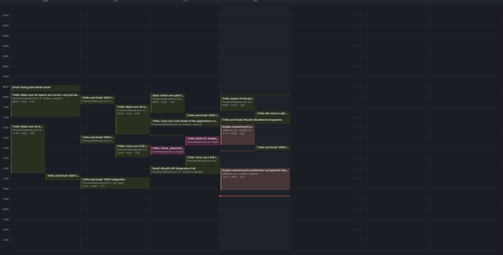
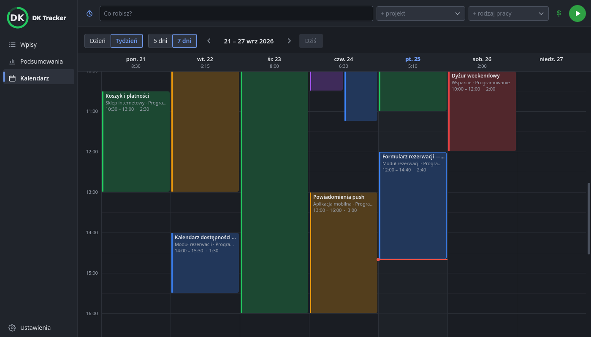
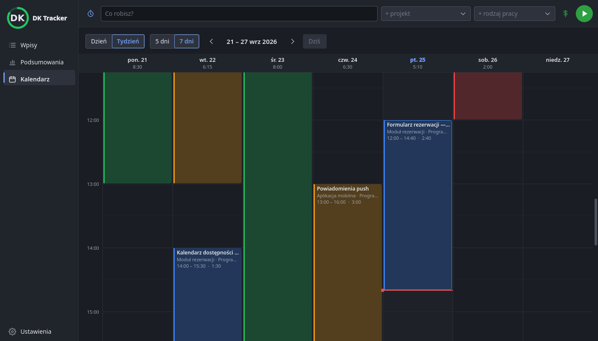

# 0079 — Kalendarz: większa skala od 8:00, przybliżanie kółkiem, przesuwanie prawym

> [!info] Status
> **w-trakcie** · priorytet **p2** · [← tablica zadań](../../README.md)

## Cel

Kalendarz pokazuje mniej godzin, ale wyraźniej: domyślnie od 8:00 w większej skali, a skalę zmienia się kółkiem
myszy z Ctrl.

## Kontekst

- Uwaga użytkownika (zrzut niżej): na dużym ekranie mieści się cała doba (48 px na godzinę), krótkie wpisy są
  nieczytelne. „Większy rozkład, więcej minut, skupić się na przedziale po 8, powiększenie scrollem”.
- Kalendarz: [F-37](../../../docs/architektura/funkcje.md#f-37-kalendarz-0105),
  [wygląd okna głównego](../../../docs/architektura/wyglad-okna-glownego.md); poprzednie zmiany:
  [0078](../0078-sekundy-w-kalendarzu-i-klik-na-gnome/todo.md).

## Kryteria akceptacji

- [x] Domyślnie 96 px na godzinę, widok od 8:00 (później, gdy „teraz” by nie było widać)
- [x] Kółko przybliża i oddala (32–384 px), godzina pod kursorem zostaje (0.10.14: z Ctrl — u użytkownika nie
  działało; 0.10.15: samo kółko)
- [x] Prawy przycisk przeciągany przesuwa godziny; lewy dalej rysuje nowe wpisy
- [x] Skala zapamiętana między uruchomieniami
- [x] Linie co pół godziny przy większej skali
- [x] Testy i dokumentacja zaktualizowane
- [ ] Sprawdzone przez użytkownika

## Kroki

- [x] `zoomed` w [core/calendar.py](../../../src/dk_tracker/core/calendar.py), `hourHeight` i `zoom` w
  [calendar_page.py](../../../src/dk_tracker/ui/main_window/calendar_page.py), `calendar_hour_height` w pamięci
- [x] `CalendarView.qml`: skala, kółko, prawy przycisk, start od 8:00, linie półgodzinne
- [x] Wydanie

## Materiały

Po zmianie (render offscreen, 1400 × 800; „teraz” 14:40, więc widok zaczyna się trochę później niż o 8:00):

[Skrypt zrzutów](testy/zrzut-skali.py).

## Dziennik

### 2026-10-01 18:48

- Utworzono zadanie i od razu rozpoczęto. Skala w pamięci (`Memory.calendar_hour_height`), zmiana o ćwierć na
  ząbek. Testy: 763 zielone.

### 2026-10-01 19:20

- Użytkownik (zrzut, 0.10.14): „Ctrl + kółko nie działa, prawy przycisk myszy powinien móc poruszać (na pustym),
  i bez Ctrl, po prostu kółko”. Offscreen Ctrl + kółko działało; przyczyny na prawdziwym KDE nie ustaliłem (log pusty,
  brak narzędzi do symulacji wejścia). Teraz samo kółko przybliża, prawy przycisk przeciąga godziny (`calendarPan`,
  pod kolumnami dni — lewy dalej rysuje). Test okna: kółko 96 → 120 z godziną pod kursorem w miejscu, prawy
  przycisk o 100 px w górę → widok 100 px dalej, bez nowego wpisu. Wydanie 0.10.15.

### 2026-10-01 19:40

- Użytkownik (0.10.15): „scroll dalej nie działa”, „prawy przycisk działa”. Prawy przycisk to `MouseArea`, kółko —
  `WheelHandler`, który według [dokumentacji Qt](https://doc.qt.io/qt-6/qml-qtquick-wheelhandler.html)
  (`acceptedDevices`) domyślnie bierze tylko kółko myszy — przewijanie touchpadem pomija; test offscreen wysyłał
  zdarzenie „myszy”, więc przechodził. Kółko obsługuje teraz `onWheel` tego samego `MouseArea` (wszystkie
  urządzenia, `angleDelta` albo `pixelDelta`). Okno zapisuje w logu 5 pierwszych zdarzeń kółka (urządzenie, faza,
  przesunięcie) — gdyby nadal nie działało. Wydanie 0.10.16.

## Wynik

<!-- Wypełniane przy zamknięciu: co powstało, gdzie, co zostało na później. -->
