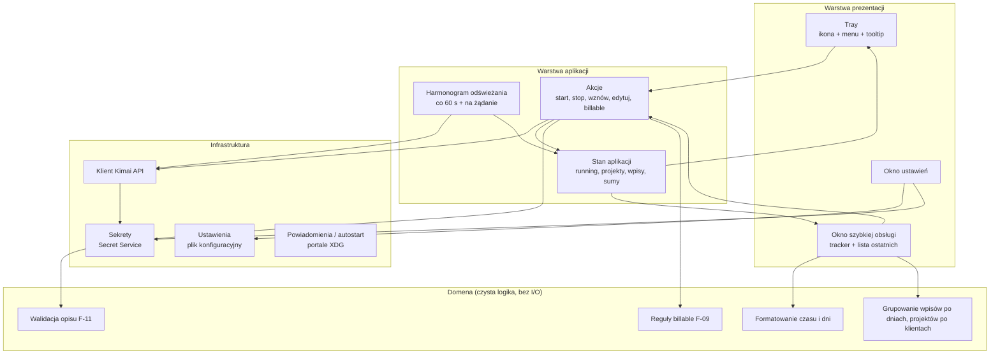
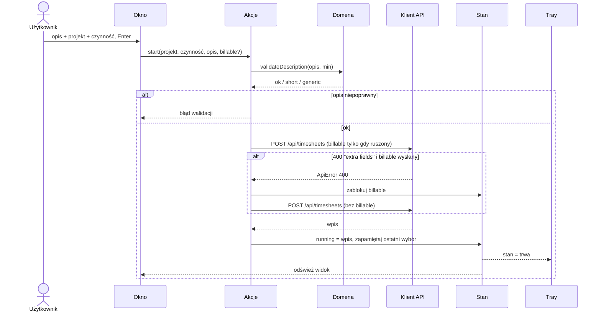
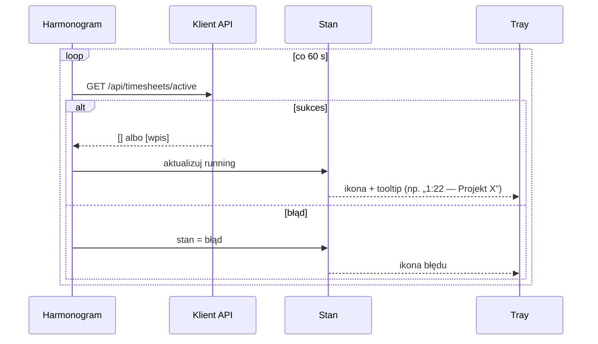

# Architektura aplikacji

> [!warning] Szkic logiczny
> Ten dokument opisuje podział na komponenty **niezależnie od języka i biblioteki UI**.
> Zostanie doprecyzowany (nazwy modułów, ścieżki plików) po zatwierdzeniu stosu
> w ADR i specyfikacji projektu — patrz [[TODO/README|zadania fazy 1]].

## Warstwy

## Komponenty

| Komponent | Odpowiedzialność | Zależy od | Funkcje |
|---|---|---|---|
| **Klient Kimai API** | HTTP + Bearer, mapowanie błędów (`ApiError`, `isBillableRejected`, zbieranie błędów formularza), format dat lokalnych, stronicowanie | sekrety, ustawienia | F-01, F-04…F-12, F-14 |
| **Domena** | walidacja opisu, domyślne billable, formatowanie `h:mm`/`47m`, nazwy dni, grupowanie | nic | F-02, F-08, F-09, F-11, F-12 |
| **Stan aplikacji** | jedno źródło prawdy o trwającym wpisie, listach i sumach; powiadamia UI o zmianach | API, domena | wszystkie |
| **Harmonogram** | odświeżanie co 60 s (jak `chrome.alarms` we wtyczce), natychmiast po akcjach, tyk zegara co 1 s gdy okno otwarte | stan | F-02, F-12 |
| **Tray** | ikona zależna od stanu, tooltip z czasem, menu kontekstowe, otwieranie okna | stan, akcje | F-02, F-20 |
| **Okno szybkiej obsługi** | odpowiednik popupu wtyczki | stan, akcje, domena | F-03…F-10, F-12 |
| **Okno ustawień** | URL, token, język, min. długość opisu, test połączenia | ustawienia, sekrety, API | F-01, F-13 |
| **Ustawienia** | trwały zapis nie-sekretnych ustawień i „ostatni wybór” | system plików (XDG config) | F-01, F-06 |
| **Sekrety** | zapis/odczyt tokenu w magazynie systemu | Secret Service / portal | F-01 |

**Zasada**: domena nie wie nic o UI ani HTTP — dzięki temu testujemy ją jednostkowo
i przenosimy 1:1 z testowalnej logiki wtyczki (`validate.js`, formatowanie).

## Przepływ: start timera

## Przepływ: cykl odświeżania

## Otwarte kwestie architektoniczne

- [ ] Stos technologiczny (język, UI toolkit, tray) — ADR
- [ ] Forma „popupu” na Waylandzie (okno, okno bez ramki, panel, samo menu) — ADR
- [ ] Runtime Flatpaka (KDE vs GNOME vs Freedesktop) — wynika ze stosu
- [ ] Sposób przechowywania tokenu (Secret Service bezpośrednio vs portal Secret)

## Powiązane

- [[docs/architektura/funkcje|Katalog funkcji]]
- [[docs/integracje/README|Integracje]]
- [[docs/decyzje/README|Decyzje]]
