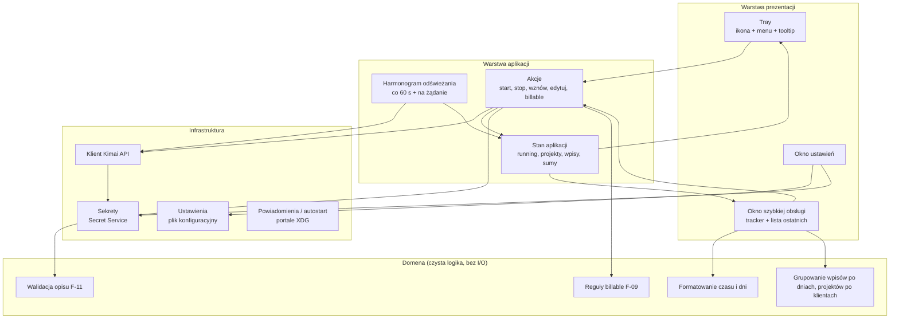
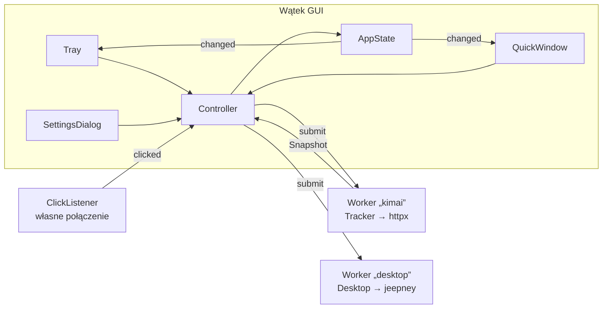
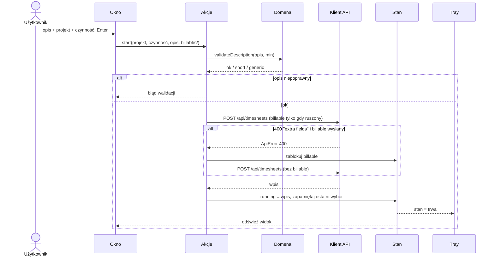
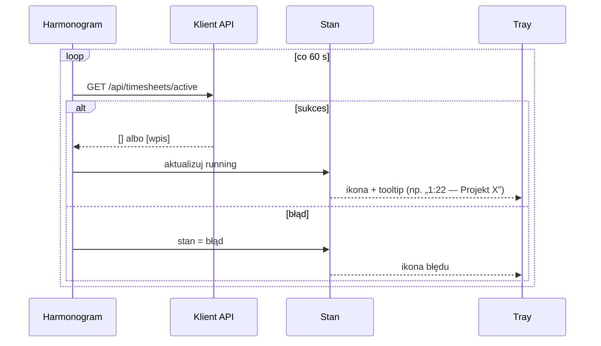

# Architektura aplikacji

> [!note] Stan
> Rdzeń (warstwy „Domena” i logika „Stanu aplikacji”, klient API, ustawienia, decyzje
> o powiadomieniach) jest zaimplementowany — [Plan 1](../plany/2026-09-25-plan-1-rdzen.md),
> mapa modułów niżej. Warstwa prezentacji, sekrety i portale — plany 2–4.

## Warstwy

## Komponenty

| Komponent | Odpowiedzialność | Zależy od | Funkcje |
| --- | --- | --- | --- |
| **Klient Kimai API** | HTTP + Bearer, mapowanie błędów (`ApiError`, `isBillableRejected`, zbieranie błędów formularza), format dat lokalnych, stronicowanie | sekrety, ustawienia | F-01, F-04…F-12, F-14 |
| **Domena** | walidacja opisu, domyślne billable, formatowanie `h:mm`/`47m`, nazwy dni, grupowanie | nic | F-02, F-08, F-09, F-11, F-12 |
| **Stan aplikacji** | jedno źródło prawdy o trwającym wpisie, listach i sumach; powiadamia UI o zmianach | API, domena | wszystkie |
| **Harmonogram** | odświeżanie co 60 s (jak `chrome.alarms` we wtyczce), natychmiast po akcjach, tyk zegara co 1 s gdy okno otwarte | stan | F-02, F-12 |
| **Tray** | ikona zależna od stanu, tooltip z czasem, menu kontekstowe, otwieranie okna | stan, akcje | F-02, F-20 |
| **Okno szybkiej obsługi** | odpowiednik popupu wtyczki | stan, akcje, domena | F-03…F-10, F-12 |
| **Okno ustawień** | URL, token, język, min. długość opisu, test połączenia | ustawienia, sekrety, API | F-01, F-13 |
| **Ustawienia** | trwały zapis nie-sekretnych ustawień i „ostatni wybór” | system plików (XDG config) | F-01, F-06 |
| **Sekrety** | zapis/odczyt tokenu w magazynie systemu | Secret Service / portal | F-01 |

### Moduły rdzenia (Plan 1)

| Komponent | Moduł |
| --- | --- |
| Klient Kimai API | [core/kimai_client.py](../../src/ws_tracker_tray/core/kimai_client.py), [core/errors.py](../../src/ws_tracker_tray/core/errors.py) |
| Domena | [validation](../../src/ws_tracker_tray/core/validation.py), [billable](../../src/ws_tracker_tray/core/billable.py), [timefmt](../../src/ws_tracker_tray/core/timefmt.py), [grouping](../../src/ws_tracker_tray/core/grouping.py), [models](../../src/ws_tracker_tray/core/models.py) |
| Stan aplikacji (logika) | [core/tracker.py](../../src/ws_tracker_tray/core/tracker.py) |
| Ustawienia | [core/settings.py](../../src/ws_tracker_tray/core/settings.py) |
| Powiadomienia (decyzja) | [core/notification_policy.py](../../src/ws_tracker_tray/core/notification_policy.py) |
| Teksty | [core/i18n.py](../../src/ws_tracker_tray/core/i18n.py), [locales/](../../src/ws_tracker_tray/core/locales/) |

### Moduły UI (Plan 3)

| Komponent | Moduł | Funkcje |
| --- | --- | --- |
| Stan aplikacji (UI) | [ui/state.py](../../src/ws_tracker_tray/ui/state.py) — `AppState` | wszystkie |
| Harmonogram, akcje, powiadomienia | [ui/app.py](../../src/ws_tracker_tray/ui/app.py) — `Controller`, [ui/worker.py](../../src/ws_tracker_tray/ui/worker.py) | F-02, F-12, F-20, F-21, F-22 |
| Tray | [ui/tray.py](../../src/ws_tracker_tray/ui/tray.py), [ui/icons.py](../../src/ws_tracker_tray/ui/icons.py), tekst: [core/presentation.py](../../src/ws_tracker_tray/core/presentation.py) | F-02, F-20 |
| Okno szybkiej obsługi | [ui/popup.py](../../src/ws_tracker_tray/ui/popup.py), [ui/form.py](../../src/ws_tracker_tray/ui/form.py), [ui/recent.py](../../src/ws_tracker_tray/ui/recent.py), [ui/placement.py](../../src/ws_tracker_tray/ui/placement.py) | F-03…F-10, F-12 |
| Okno ustawień | [ui/settings_dialog.py](../../src/ws_tracker_tray/ui/settings_dialog.py) | F-01, F-13, F-21, F-22 |
| Sekrety, powiadomienia, autostart | [ui/desktop_bridge.py](../../src/ws_tracker_tray/ui/desktop_bridge.py) → [desktop/](../../src/ws_tracker_tray/desktop/) | F-01, F-21, F-22 |
| Start | [ui/main.py](../../src/ws_tracker_tray/ui/main.py), [`__main__.py`](../../src/ws_tracker_tray/__main__.py) | — |

Wątki (GUI tylko rysuje; tracker i D-Bus mają po jednym wątku — nie są bezpieczne wątkowo):

**Zasada**: domena nie wie nic o UI ani HTTP — dzięki temu testujemy ją jednostkowo
i przenosimy 1:1 z testowalnej logiki wtyczki (`validate.js`, formatowanie).

## Przepływ: start timera

## Przepływ: cykl odświeżania

## Otwarte kwestie architektoniczne

- [x] Stos technologiczny — [ADR-0002: Python + PySide6](../decyzje/0002-stos-python-pyside6.md)
- [x] Forma okna na Waylandzie — [ADR-0005](../decyzje/0005-okno-przy-tacce-na-kde.md) (zastąpił ADR-0003)
- [x] Runtime Flatpaka — `org.kde.Platform` 6.11 + `io.qt.PySide.BaseApp`
- [x] Sposób przechowywania tokenu — Secret Service bezpośrednio (jeepney),
      [ADR-0004](../decyzje/0004-architektura-rdzen-python-ui-qt.md); portal Secret poza 1.0

## Powiązane

- [Katalog funkcji](funkcje.md)
- [Integracje](../integracje/README.md)
- [Decyzje](../decyzje/README.md)
