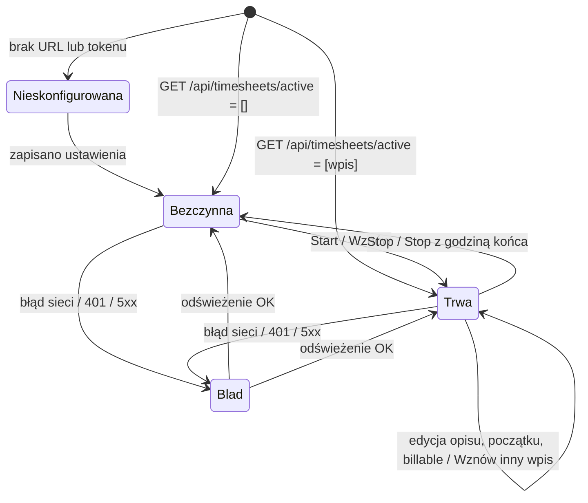

# Katalog funkcji

Każda funkcja ma identyfikator `F-NN`, na który powołują się zadania w `TODO/` i testy.
Opis zachowania pochodzi z analizy kodu wtyczki
[WS Tracker 1.5.1](../integracje/kimai-ws-tracker.md) — kolumna „Źródło” wskazuje plik.
Endpointy opisane są w [Kimai REST API](../integracje/kimai-api.md).

## Mapa stanów aplikacji

---

## F-01 Konfiguracja połączenia

| | |
| --- | --- |
| **Co** | Adres Kimai, token API, język (auto/pl/en), minimalna długość opisu (domyślnie 15, 0 = wyłączone). |
| **Test połączenia** | `GET /api/users/me` → komunikat „Połączono jako *alias/username*” albo powód błędu. |
| **Zapis** | URL obcięty z końcowych `/`. Zapis ustawień **resetuje blokadę billable** (F-09), bo inny serwer/token może mieć uprawnienie. |
| **Źródło** | `options/options.js`, `lib/api.js#getSettings` |
| **Od 0.10.0** | Ustawienia to strona okna głównego (F-35), nie osobne okno. **Motyw**: jak w systemie (domyślnie), jasny albo ciemny — dla okna głównego i okienka przy tacce, zmienia się od razu po zapisie. **Token** zapisany w portfelu widać jako stałą maskę „••••” z dopiskiem — nigdy sam token ani jego długość. Od 0.10.4 na dole strony **„O programie”**: znak, nazwa, wersja, opis, licencja, link do strony projektu ([0072](../../TODO/ZROBIONE/0072-o-programie/todo.md)). |
| **Różnica w aplikacji** | Token → magazyn sekretów ([Secret Service](../integracje/secret-service.md)), nie plik ustawień. Brak odpowiednika „host permissions” Chrome — Flatpak ma dostęp do sieci przez `--share=network`. |

## F-02 Ikona w tacce ze stanem

| | |
| --- | --- |
| **Co** | Odpowiednik „badge” wtyczki. Pokazuje, czy timer działa i jak długo. |
| **Format czasu** | `<60 min` → `47m`; `≥60 min` → `1:22` (wtyczka zmieniła z `1h22`, bo Chrome ucinał do 5 znaków). |
| **Kolory wtyczki** | szary `#6b7280` — nic nie trwa / brak konfiguracji; zielony `#16a34a` — trwa; czerwony `#dc2626` + `!` — błąd. |
| **Odświeżanie** | Co 1 minutę (`chrome.alarms`) + natychmiast po start/stop. |
| **Źródło** | `background.js` |
| **Różnica w aplikacji** | Tacka SNI nie ma „badge z tekstem”, więc **czas rysujemy w samej ikonie** (wariant C, decyzja użytkownika 2026-09-25): nic nie trwa → szary zegar; trwa → `47m` / `1:22` białym pogrubionym tekstem na zielonym zaokrąglonym kwadracie; błąd → `!` na czerwonym. Pełna informacja (czas, projekt, opis) w **tooltipie**. Makieta: [0028](../../TODO/ZROBIONE/0028-plan3-projekt-ui/zrzuty/ikony-warianty.png). Etykieta obok ikony na GNOME (`XAyatanaLabel`) — do sprawdzenia w [0020](../../TODO/DO-ZROBIENIA/0020-testy-gnome/todo.md). Patrz [StatusNotifierItem](../integracje/statusnotifieritem.md). |
| **Kliknięcia ikony** | lewy → okno (F-03), prawy → menu (F-20), **środkowy → nic** (decyzja użytkownika 2026-09-25: żadnej akcji bez okna/menu, żeby nie zatrzymać timera przypadkiem). |
| **Od 0.10.0** | Tacka jest opcjonalna: tylko gdy system ją ma i gdy włączona opcja „Pokazuj ikonę w tacce” (F-35). W menu „Otwórz DK Tracker” (okno główne) i „Szybkie okienko” (F-03). |

## F-03 Okno szybkiej obsługi (popup)

| | |
| --- | --- |
| **Co** | Po kliknięciu ikony: nagłówek (nazwa, suma dnia, suma tygodnia, ustawienia), pasek trackera, komunikaty, lista ostatnich wpisów. |
| **Szerokość** | 460 px we wtyczce 1.5.0. |
| **Stan „nieskonfigurowana”** | Tylko tekst + przycisk „Otwórz ustawienia”. |
| **Źródło** | `popup/popup.html`, `popup/popup.css` |
| **Różnica w aplikacji** | **KDE:** okno zakotwiczone przy tacce (`layer-shell`, prawy dolny róg nad panelem). **Gdzie indziej:** okno bezramkowe, zwykle na środku. Lewy klik ikony otwiera okno; **klik ikony przy otwartym oknie go nie zamyka** (Plasma nie wysyła `Activate`) — zamyka przycisk w nagłówku, `Esc` albo klik obok (utrata fokusu). Wpisany opis zostaje po schowaniu. Bez hosta tacki: zwykłe okno z ramką. Decyzja: [ADR-0005](../decyzje/0005-okno-przy-tacce-na-kde.md) (sprawdzone w prototypie 0004). |

## F-04 Start timera

1. Wymagane: projekt (`errNoProject`), czynność (`errNoActivity`), opis zgodny z F-11.
2. `POST /api/timesheets` z `begin` = czas **minus 1 s** w formacie
   `YYYY-MM-DDTHH:mm:ss` bez strefy, `project`, `activity`, `description`, opcjonalnie
   `billable` (F-09).
   **Różnica w aplikacji:** wtyczka bierze czas przeglądarki. Aplikacja liczy go
   w **strefie konta Kimai** (`/api/users/me → timezone`), bo Kimai dokleja tę strefę
   bez przeliczania. Przy różnych strefach wtyczka zapisuje wpis przesunięty w czasie
   (sprawdzone: [raport](../../TODO/ZROBIONE/0002-specyfikacja-projektu/testy/raport-kimai-docker-2026-09-25.md)).
3. Zapamiętanie `lastProject`, `lastActivity` (F-06).
4. Odświeżenie ikony (F-02) i okna.
5. **Enter** w polu opisu = start; **Shift+Enter** = nowa linia. Pole rośnie z tekstem (także z zawiniętymi liniami),
   aby
   wszystkie linie były widoczne, do 96 px — dopiero dłuższy opis przewija się
   ([0068](../../TODO/ZROBIONE/0068-pole-opisu-rosnie/todo.md)).

Źródło: `popup.js#startTracking`, `api.js#start`, `api.js#localStamp`.

## F-05 Stop timera

- Bez godziny końca → `PATCH /api/timesheets/{id}/stop`.
- Z wybraną godziną „do” → `PATCH /api/timesheets/{id}` z `end` (ten sam dzień co
  początek). Walidacja: koniec > początek (`errEndBeforeBegin`).

Źródło: `popup.js#stopTracking`.

## F-06 Wybór projektu i czynności

- Projekty: `GET /api/projects?visible=1&ignoreDates=1` (bez `ignoreDates` API ukrywa
  projekty z minionym oknem dat).
- Klienci: `GET /api/customers?visible=1` — tylko po to, by wiedzieć, którzy są
  niebillable (błąd tego zapytania jest ignorowany).
- **Grupowanie po kliencie** (`parentTitle`), sortowanie alfabetyczne klientów i projektów
  — lista 75 projektów bez grup była nieużywalna.
- Kropka z kolorem projektu (`project.color`), szara gdy nic nie wybrano.
- Czynności: `GET /api/activities?visible=1&globals=true&project={id}`, sortowane.
- Zmiana projektu przebudowuje czynności i resetuje billable do domyślnego.
- Wtyczka: ostatni wybór pamiętany lokalnie i przywracany, jeśli nadal istnieje na liście. U nas najpierw projekt i
  rodzaj pracy **najnowszego wpisu w Kimai** (także zaczętego w przeglądarce), a gdy wpisów nie ma — zapamiętany wybór
  (prośba użytkownika, [0061](../../TODO/ZROBIONE/0061-domyslnie-ostatni-wpis/todo.md)).
- W trakcie trwania wpisu projekt i czynność są **zablokowane** (zmiana = inny wpis,
  nie korekta).

- **W aplikacji (prośba użytkownika, poza wtyczką):** lista projektów otwiera się z polem wyszukiwania na górze
  (jak Select2): filtr po nazwie projektu i klienta, bez wielkości liter i polskich znaków, Enter wybiera pierwszy
  wynik, strzałki chodzą tylko po projektach — [ui/project_picker.py](../../src/dk_tracker/ui/project_picker.py).

Źródło: `popup.js#fillPickers`, `#onProjectChange`, `#restoreLastActivity`.

## F-07 Edycja trwającego wpisu

| Pole | Zachowanie |
| --- | --- |
| Opis | Zapis po 1,2 s od końca pisania (cicho) i przy utracie fokusu. Walidacja F-11; przy zapisie „cichym” błąd walidacji nie jest pokazywany. Enter = zatwierdź. |
| Początek (HH:MM) | Ten sam dzień co pierwotny początek. Przyszłość → `errBeginFuture`. `PATCH` z `begin`, zegar restartuje od nowej wartości. |
| Koniec (HH:MM) | Nie zapisuje od razu — używany przy Stop (F-05). |
| Billable | `PATCH` z `billable` natychmiast (F-09). |

Po udanym zapisie — krótki (2 s) zielony komunikat „Zapisano…”.
Źródło: `popup.js#saveDescription`, `#onBeginChange`, `#onBillableClick`.

- **W aplikacji (prośba użytkownika, poza wtyczką):** początku i końca się nie wpisuje, tylko wybiera — przycisk
  z zegarem otwiera listę godzin i minut (co minutę — 0.10.12), jak w oknie
  głównym. Godzina zostawia listę otwartą, minuta ją zamyka; zmiana idzie do Kimai raz, po zamknięciu listy. Koniec
  czyści przycisk „Teraz”. „Od”, „do” i „puste = teraz” stoją w jednym wierszu —
  [ui/time_picker.py](../../src/dk_tracker/ui/time_picker.py),
  [0077](../../TODO/W-TRAKCIE/0077-godziny-w-okienku-przy-tacce/todo.md).

## F-08 Lista ostatnich wpisów

- `GET /api/timesheets?size=20&orderBy=begin&order=DESC&full=true`.
- **Nie** `/api/timesheets/recent` — ten zwija listę do jednej pozycji na parę
  projekt+czynność, przez co „ginęły” godziny.
- Pomija wpis trwający (`end == null`).
- Grupowanie po dniu lokalnym: „Dziś”, „Wczoraj”, dalej data (`pon., 22 wrz`), suma dnia
  w formacie `h:mm`.
- Wiersz: kropka koloru projektu, opis (znaki nowej linii → spacje, pełny opis w podpowiedzi; brak opisu → „bez
  opisu”), „projekt - czynność”, czas trwania, zakres `HH:MM-HH:MM`, przycisk `$` (F-09), przycisk ▶ wznów (F-10).
- Opis: wtyczka pokazuje 2 linie; u nas **2,5 linii od góry** (ucięta połowa trzeciej sygnalizuje dalszy tekst), a
  **kliknięcie w wiersz rozwija cały opis**, drugie zwija. Rozwinięcie przetrwa odświeżenie listy
  ([0058](../../TODO/ZROBIONE/0058-dlugie-opisy-na-liscie/todo.md), prośba użytkownika).
- Pod listą link „Moje czasy” → `{url}/{locale}/timesheet/`. Kimai nie ma trasy bez
  locale; locale brane z `entry.user.language` i zapamiętywane. **Od 0.10.0** link „Wszystkie moje wpisy” otwiera
  okno główne (F-35) zamiast przeglądarki.

Źródło: `popup.js#renderRecent`, `#recentRow`, `#rememberKimaiLocale`.

## F-09 Billable

- Przełącznik `$` przy projekcie: zielony = na fakturę klienta, szary przekreślony = czas
  wewnętrzny.
- **Domyślna wartość** jak w Kimai: billable, chyba że klient, projekt lub czynność ma
  `billable=false`.
- **Nietknięty przełącznik nie jest wysyłany** — decyzję zostawiamy Kimai.
- Ręczna zmiana obowiązuje dla jednego wpisu; zmiana projektu wraca do domyślnej.
- `$` na każdym wierszu listy przełącza billable zapisanego wpisu (`PATCH`),
  z optymistycznym odświeżeniem UI i cofnięciem przy odmowie.
- **Brak uprawnienia** `edit_billable_own_timesheet` (domyślnie ma je dopiero teamlead):
  Kimai odrzuca **cały** request z 400 „This form should not contain extra fields.”.
  Wtedy: wpis wysyłany ponownie bez `billable`, przełącznik blokowany i przyciemniony
  z wyjaśnieniem (`errBillableDenied`), blokada trwa do ponownego zapisania ustawień.

Źródło: `api.js#isBillableRejected`, `popup.js#lockBillable`, `#billableButton`.

## F-10 Wznawianie wpisu

- ▶ na wierszu kopiuje opis, projekt, czynność i **billable tego wpisu** (nie domyślne
  projektu) do formularza i startuje.
- Jeśli coś trwa — najpierw zatrzymuje bieżący wpis (przełączenie timera).
- Ukryta czynność (np. kubełek importu z Togglа) nie jest ustawiana, bo nie ma jej na liście.

Źródło: `popup.js#resume`.

## F-11 Walidacja jakości opisu

- `minDescription <= 0` → wyłączona.
- Opis z **linkiem** (`http(s)://`), **numerem zgłoszenia** (`#412`) lub **kluczem**
  (`PROJ-88`) i ≥ 3 znakami → zawsze OK.
- Po normalizacji (małe litery, bez diakrytyków, bez interpunkcji na brzegach) opis z listy
  ogólników (`poprawki`, `spotkanie`, `fixes`, `call`, `bug fixing`… — ok. 90 fraz PL/EN)
  → błąd `generic`.
- Krótszy niż minimum → błąd `short`.

Źródło: `lib/validate.js` (pełna lista ogólników tam).

## F-12 Sumy dzienna i tygodniowa

- Jedno zapytanie: `GET /api/timesheets?begin=<pon 00:00>&end=<dziś 23:59:59>&size=100&page=N`,
  maks. 3 strony; 404 za ostatnią stroną = koniec.
- Liczone **tylko zamknięte** wpisy (`end != null`), trwający dodawany na żywo co sekundę.
- Tydzień od poniedziałku (wtyczka). **W aplikacji:** od dnia z preferencji konta Kimai
  `first_weekday` (domyślnie poniedziałek), tak jak w widokach tygodniowych Kimai.
- Błąd → sumy ukryte (nie blokuje reszty okna).

Źródło: `popup.js#renderTotals`, `api.js#range`.

**Różnice w aplikacji** (poprawki z recenzji, zadanie 0019):

- Stronicowanie: **500 wpisów na stronę** (maksimum Kimai), **do 10 stron**; liczba stron z
  nagłówka `X-Total-Pages` (sprawdzone na Kimai 2.65/2.67), 404 za ostatnią stroną tylko jako
  zabezpieczenie. Wtyczka: 100 × 3 strony, więc przy > 300 wpisach w tygodniu zaniżała sumę.
- Trwający wpis jest doliczany **do dnia, w którym się zaczął** — do „Dziś” tylko, gdy zaczął
  się dziś, do „Tydzień” tylko, gdy zaczął się w tym tygodniu. Tak liczy Kimai, więc po
  zatrzymaniu godziny nie przeskakują między dniami (wtyczka dodawała cały czas do dziś).
- Gdy zmieni się zestaw trwających wpisów (np. stop we wtyczce lub w panelu Kimai), lekkie
  odświeżenie co minutę dociąga też sumy.

## F-13 Język interfejsu

- `auto` (język systemu), `pl`, `en`. Braki w tłumaczeniu uzupełniane angielskim.
- Wybór jawny w ustawieniach, bo zespół chce wybierać niezależnie od systemu.

Źródło: `lib/i18n.js`, `_locales/*/messages.json`.

**W aplikacji (wymóg 1.0, potwierdzony przez użytkownika 2026-09-25): pełna wersja
polska i angielska.**

| Element | Jak tłumaczymy |
| --- | --- |
| Okno, menu tacki, tooltip, ustawienia, komunikaty błędów, powiadomienia N-01…N-03 | własne teksty w `core/i18n` — pliki PL i EN, klucze przeniesione z `_locales` wtyczki i uzupełnione o nowe (menu, powiadomienia, autostart) |
| Standardowe elementy Qt (przyciski „OK/Anuluj”, menu kontekstowe pól tekstowych) | `QTranslator` z `qtbase_<lang>.qm` z katalogu tłumaczeń Qt. Runtime `org.kde.Platform` 6.11 zawiera `translations/qtbase_pl.qm` (sprawdzone 2026-09-25) |
| Nazwy dni i daty na liście wpisów | locale wybranego języka (`QLocale`) |
| Plik `.desktop` (nazwa, komentarz) | klucze `Name[pl]`, `Comment[pl]` |
| MetaInfo (AppStream: opis, podsumowanie) | `xml:lang="pl"` |

Zasady:

- **Każdy tekst widoczny dla użytkownika idzie przez `t(klucz)`.** Żadnych napisów
  wpisanych na sztywno w kodzie UI.
- Test pilnuje, że zestawy kluczy PL i EN są identyczne, a wszystkie klucze użyte
  w kodzie istnieją.
- Zmiana języka w ustawieniach działa od razu, bez restartu (przebudowa tekstów okna,
  menu i tooltipa).

## F-14 Obsługa błędów

| Sytuacja | Komunikat |
| --- | --- |
| Brak połączenia (status 0) | `errConnection` |
| 401 | `errAuth` — token odrzucony lub wygasł |
| 403 | `errForbidden` — wpis zablokowany (np. wyeksportowany) lub brak uprawnień. **Różnica względem wtyczki:** wtyczka traktowała 403 jak zły token |
| 200 bez JSON-a Kimai | `errUnexpected` — np. strona logowania Wi-Fi |
| 3xx (przekierowanie) | `errRedirect` z nowym adresem Kimai (np. `https://…` zamiast `http://…`) |
| 400 z treścią | `errRejected` + **treść błędu z Kimai** (zebrane `errors` z zagnieżdżonych `children` formularza) |
| inne | `errServer` + kod |

Treść nie-JSON przycinana do 200 znaków (bez stack trace'ów w oknie).
Źródło: `api.js#readError`, `#collectFormErrors`, `popup.js#describeError`.

---

## Funkcje nowe względem wtyczki (kandydaci)

| Id | Funkcja | Uzasadnienie | Status |
| --- | --- | --- | --- |
| F-20 | Menu kontekstowe ikony (prawy klik): stop, wznów ostatni, otwórz okno, otwórz Kimai, ustawienia, zakończ | menu rysuje host tacki, więc zawsze jest przy ikonie | **w 1.0** ([ADR-0005](../decyzje/0005-okno-przy-tacce-na-kde.md)); menu rysuje Plasma z dbusmenu — sprawdzone |
| F-21 | Powiadomienia systemowe (portal Notification) | przypomnienie o długim timerze, problemy z połączeniem | **w 1.0** (szczegóły w specyfikacji) |
| F-22 | Autostart z sesją (portal Background, opcja w ustawieniach) | timer w tacce i przypomnienia mają działać od zalogowania | **w 1.0** |
| F-23 | Wykrywanie bezczynności | propozycja odjęcia czasu nieaktywności; trudne w Flatpaku na Waylandzie (brak portalu czasu bezczynności) | później |
| F-24 | Globalny skrót klawiszowy (portal GlobalShortcuts) | start/stop bez myszy | później |
| F-25 | Przypomnienie, gdy żaden timer nie działa | podpatrzone w KimaiTray ([podobne aplikacje](podobne-aplikacje.md)) | później |
| F-26 | Ulubione zadania obok ostatnich wpisów | KimaiTray | później |
| F-27 | Oś czasu dnia (dzisiejsze wpisy) | KimaiTray | później |
| F-28 | Cel dzienny i szacowana godzina końca | KimaiTray | później |
| F-29 | Tagi przy starcie i edycji | KimaiTray | później |
| F-30 | Własna godzina startu nowego wpisu | KimaiTray | później |
| F-31 | Start z przeglądarki przez link `…://start` | KimaiTray | później |
| F-32 | Ekran „Co nowego” po aktualizacji | KimaiTray | później |
| F-35 | Okno główne: tygodnie i dni, edycja w wierszu, ręczne wpisy, usuwanie z „Cofnij” | prośba użytkownika, wzór Toggl Track | **w 0.10.0** ([szczegóły](#f-35-okno-główne-0100)) |
| F-33 | Wyszukiwanie we wszystkich wpisach Kimai | prośba użytkownika po teście 0.9.0 | **w 0.9.1** ([szczegóły](#f-33-wyszukiwanie-we-wszystkich-wpisach)) |
| F-34 | Zmiana projektu i rodzaju pracy trwającego wpisu (wtyczka je blokuje) | prośba użytkownika | **w 0.9.1** ([szczegóły](#f-34-zmiana-projektu-i-rodzaju-pracy-trwającego-wpisu)) |
| F-36 | Podsumowania: okresy, średnie, norma, wykres słupkowy, podział | prośba użytkownika, wzór Toggl Track | **w 0.10.3** ([szczegóły](#f-36-podsumowania-0103)) |
| F-37 | Kalendarz: tworzenie, przesuwanie i zmiana godzin wpisów przeciąganiem | prośba użytkownika, wzór Toggl Track | **w 0.10.5** ([szczegóły](#f-37-kalendarz-0105)) |

## F-33 Wyszukiwanie we wszystkich wpisach

- Pole „Szukaj we wszystkich wpisach…” nad listą ostatnich wpisów (F-08); bez ikony lupy.
- Od 2 znaków, 0,4 s po ostatnim klawiszu: `GET /api/timesheets?term=…&size=50&orderBy=begin&order=DESC&full=true`.
  Kimai szuka **tylko w opisie**, każde słowo musi wystąpić, bez względu na wielkość liter, domyślnie we własnych
  wpisach (sprawdzone testem kontraktowym na Kimai 2.67.0).
- Wyniki zamiast listy ostatnich, w tym samym wyglądzie: dni (z rokiem, gdy inny niż bieżący), ▶ wznów, `$`, rozwijany
  opis. Nagłówek „Wyniki (n)”; brak trafień → „Żaden wpis nie ma tego tekstu w opisie.”; błąd → pasek błędu okna.
- Trwający wpis nie jest wynikiem (jest na pasku). `$` na wyniku odświeża wyniki. Odpowiedź dla starszego tekstu jest
  pomijana. Esc w polu czyści wyszukiwanie; drugi Esc zamyka okno. Odświeżanie co minutę nie zastępuje wyników.
- Zadanie: [0059](../../TODO/ZROBIONE/0059-wyszukiwanie-wpisow/todo.md).

## F-34 Zmiana projektu i rodzaju pracy trwającego wpisu

- Wtyczka blokuje obie listy przy trwającym wpisie; u nas są aktywne. Lista rodzajów pracy ładuje się dla projektu
  wpisu.
- Inny rodzaj pracy → `PATCH /api/timesheets/{id}` z `project` i `activity` od razu. Inny projekt → jego rodzaje
  pracy; gdy obecny rodzaj pracy w nim jest, zapis od razu, inaczej lista prosi o wybór i nic nie idzie do Kimai.
- `$` przyjmuje wartość domyślną nowego projektu i rodzaju pracy, jak przy starcie (decyzja użytkownika). Konto bez
  uprawnienia do billable: Kimai odrzuca pole → przełącznik blokowany, zmiana zapisywana bez niego.
- Odświeżanie nie cofa wyboru w toku; odmowa Kimai → pasek błędu i listy jak w Kimai. Komunikat „Projekt i rodzaj
  pracy zapisane.”. Sprawdzone testem kontraktowym na Kimai 2.67.0.
- Zadanie: [0060](../../TODO/ZROBIONE/0060-zmiana-projektu-trwajacego-wpisu/todo.md).

## F-35 Okno główne (0.10.0)

Pełny klient Kimai na wzór Toggl Track ([specyfikacja 0.10](../specyfikacja/2026-09-26-okno-glowne-0.10.md),
[Plan 5](../plany/2026-09-26-plan-5-okno-glowne.md)).

- **Pasek boczny**: Wpisy (0.10.0), Podsumowania (0.10.3, F-36), Kalendarz (0.10.5, F-37); na dole Ustawienia —
  strona okna głównego (F-01), także z tacki i z okienka; bez konfiguracji okno pokazuje tylko ją. Ostatni wybrany
  widok (Wpisy, Podsumowania albo Kalendarz) otwiera się przy następnym uruchomieniu.
- **Pasek timera**: opis (F-11), projekt z wyszukiwaniem, rodzaj pracy, `$`, start/stop; przy trwającym wpisie zegar,
  „od” i zmiana opisu, projektu i rodzaju pracy (F-07, F-34). Przełącznik ⏱/✎: dzień, od–do i „Dodaj” (ręczny wpis
  w jednym dniu).
- **Lista**: tygodnie i dni z sumami, najnowsze u góry; przewijanie doładowuje poprzedni tydzień (najwyżej 8 pustych
  z rzędu); wyszukiwanie jak F-33.
- **Wiersz**: opis (do dwóch linii), projekt · rodzaj pracy w kolorze projektu, `$` (zielony — płatne), od–do, czas;
  ▶ wznawia (nowy wpis od teraz z tym samym opisem i projektem), kosz usuwa, wpis wyeksportowany z kłódką.
- **Okno edycji** (kliknięcie wiersza): wszystkie opcje wpisu z Kimai — dzień (kalendarz), od i do (wybór godziny i
  minut co 1), czas trwania (tylko do odczytu),
  projekt i rodzaj pracy, opis w wielu liniach (Enter zapisuje, Shift+Enter — nowa linia), tagi (wybór z listy tagów
  Kimai, kafelki w ich kolorach; nowy tag można dopisać),
  `$` (płatne — ikona jak w wierszu), przerwa, pola dodatkowe serwera — to, co ma formularz Kimai (bez stawek);
  Usuń, Anuluj, Zapisz.
  Wpis wyeksportowany (zafakturowany): wszystko wyszarzone, tylko do odczytu. Wysyła tylko zmiany. Pola, których konto
  nie może zmieniać, Kimai odrzuca — zapis bez nich i komunikat; tag, którego
  nie ma, Kimai po cichu pomija (konto bez prawa tworzenia tagów) — aplikacja czyta wpis ponownie i go nazywa.
- **Usuwanie**: wiersz znika, pasek „Usunięto wpis · Cofnij” przez 6 s; do Kimai trafia po tym czasie albo od razu
  przy zamknięciu aplikacji.
- **Odświeżanie** co minutę; nie przebudowuje listy w trakcie pisania w wierszu. Bez połączenia: ostatnie dane,
  pasek błędu, edycja zablokowana.
- **Uruchamianie**: z menu — okno główne (druga instancja przywołuje okno działającej); autostart z tacką — tylko
  tacka. Zamknięcie okna z tacką chowa je, bez tacki kończy aplikację. Tacka tylko gdy system ją ma i gdy włączona
  opcja „Pokazuj ikonę w tacce”. Menu tacki: „Otwórz DK Tracker”, „Szybkie okienko”. Kliknięcie powiadomienia
  otwiera okno główne.
- Kod: [ui/main_window/](../../src/dk_tracker/ui/main_window/),
  [core/entry_list.py](../../src/dk_tracker/core/entry_list.py), `Tracker.entries` / `add_entry` / `edit_entry` /
  `delete_entry` w [core/tracker.py](../../src/dk_tracker/core/tracker.py).

## F-36 Podsumowania (0.10.3)

Widok okna głównego ([specyfikacja 0.10, sekcja 6](../specyfikacja/2026-09-26-okno-glowne-0.10.md#6-podsumowania-0103),
[Plan 6](../plany/2026-09-27-plan-6-podsumowania.md)).

- **Okres**: Tydzień (od dnia tygodnia z konta Kimai), Miesiąc, Rok, Zakres (dwa dni, najwyżej 366 dni); ◀ ▶ o jeden
  okres (zakres — o swoją długość), „Dziś” wraca do okresu z dzisiejszym dniem. Na start bieżący tydzień; wybór
  trwa do zamknięcia aplikacji.
- **Kafelki**: łącznie, dni robocze i dni z wpisami; płatne (h, %) i niepłatne; **średnio na dzień roboczy** = czas
  ÷ **dni robocze** (pon.–pt., w bieżącym okresie do dziś, bez świąt), z normą i różnicą („Norma 8:00 · −0:20”) —
  jedna średnia w każdym okresie; sobota ją podnosi. Okres bez dni roboczych (sam weekend) — ÷ dni z wpisami.
  Decyzje użytkownika po teście na żywo.
- **Wykres słupkowy**: słupek na dzień (tydzień, miesiąc, zakres do 62 dni) albo na miesiąc (rok, dłuższy zakres);
  warstwy w kolorach projektów (kolejność jak w podziale, największy projekt okresu na dole); norma — przerywana
  linia albo kreska nad słupkiem miesiąca (norma × dni robocze miesiąca do dziś); dymek z projektami słupka i wpisami
  każdego z nich (opis i czas; słupek dnia do 10, miesiąca do 3 na projekt).
- **Podział**: pierścień (8 największych, reszta jako „Pozostałe”) i tabela wg projektu (z klientem), klienta albo
  rodzaju pracy: czas, udział, w tym płatne. Kolory i klient z wpisów (`full=true`, `color-safe` jak w Kimai).
  Najechanie na wycinek albo wiersz: dymek z opisami wpisów i ich czasem, od największego (10 i „+ N więcej”), jak w
  Togglu; wycinek i wiersz podświetlają się razem.
- **Liczenie**: trwający wpis do teraz, każdy wpis w dniu, w którym się zaczął (jak nagłówek „Dziś / Tydz.”); sumy
  zgodne z Kimai dla tego samego okresu (test kontraktowy).
- **Norma**: ustawienie „Norma dzienna (godziny)”, domyślnie 8, 0 = bez normy.
- **Odświeżanie**: co minutę, po każdej zmianie wpisu i po wejściu na stronę; odświeżenie zostawia liczby, nowy okres
  wczytuje się od pustego widoku; odpowiedź dla okresu, którego już nie widać, jest pomijana.
- Kod: [core/summary.py](../../src/dk_tracker/core/summary.py),
  [ui/main_window/summary_page.py](../../src/dk_tracker/ui/main_window/summary_page.py), `SummaryView.qml`,
  `BarChart.qml`, `DonutChart.qml`. Zadanie: [0070](../../TODO/ZROBIONE/0070-plan6-podsumowania/todo.md).

## F-37 Kalendarz (0.10.5)

Widok okna głównego ([specyfikacja 0.10, sekcja 8](../specyfikacja/2026-09-26-okno-glowne-0.10.md#8-kalendarz-0105),
[Plan 7](../plany/2026-09-27-plan-7-kalendarz.md)).

- **Okres**: Dzień albo Tydzień — 7 dni (od dnia tygodnia z konta Kimai) lub 5 dni (pon.–pt.); ◀ ▶, „Dziś”. Nagłówki
  dni z sumą dnia. Siatka 0–24 (48 px na godzinę) przewinięta na 7:00 (później, gdy „teraz” by nie było widać);
  linia „teraz” w dniu dzisiejszym.
- **Bloki**: wpisy w kolorze projektu (tło przejrzyste, pasek z lewej): opis, projekt · rodzaj pracy, godziny i czas;
  nakładające się stoją obok siebie; trwający rośnie co minutę; wyeksportowany z kłódką; wpis przez północ — dwa bloki
  (do 24:00 i od 0:00). Bloki liczą **sekundy**: wpis zamknięty i nowy otwarty w tej samej minucie stoją jeden pod
  drugim, krótszy niż minuta też ma blok, a że rysowany jest na co najmniej 14 px (~18 min), staje obok następnego
  (0.10.11,
  [0078](../../TODO/W-TRAKCIE/0078-sekundy-w-kalendarzu-i-klik-na-gnome/todo.md)).
- **Przeciąganie**: w pustym miejscu — nowy blok i dymek (opis, projekt, rodzaj pracy, `$`, „Dodaj wpis”); środek
  bloku — przesunięcie (także na inny dzień); krawędź — zmiana godziny początku albo końca; zapis po puszczeniu, blok od
  razu w nowym miejscu; odmowa Kimai → dni wczytane od nowa (blok wraca) i pasek błędu. Przyciąganie co 15 min, z
  **Alt** co minutę; krawędź, której nie ruszano, zachowuje sekundy. Wyeksportowanych, trwających i przechodzących przez
  północ nie da się przeciągać.
- **Klik w blok** → dymek: opis, projekt, rodzaj pracy, `$` (Zapisz — jedna zmiana do Kimai), Usuń (pasek „Cofnij”),
  Wznów, okno edycji; trwający — pola zmieniane jak na pasku timera i „Zatrzymaj”.
- **Odświeżanie**: co minutę, po akcjach i po wejściu na stronę; w trakcie przeciągania czeka. Bez połączenia bloki
  widać, przeciąganie wyłączone.
- Kod: [core/calendar.py](../../src/dk_tracker/core/calendar.py), `Tracker.reschedule` w
  [core/tracker.py](../../src/dk_tracker/core/tracker.py),
  [ui/main_window/calendar_page.py](../../src/dk_tracker/ui/main_window/calendar_page.py), `CalendarView.qml`,
  `CalendarBlock.qml`, `CalendarPopup.qml`. Zadanie: [0073](../../TODO/ZROBIONE/0073-plan7-kalendarz/todo.md).

## F-21 Powiadomienia — szczegóły (1.0)

Przez portal Notification (w Qt/PySide przez D-Bus). Ustalone z użytkownikiem 2026-09-25.

| Id | Kiedy | Treść | Akcje | Ustawienie |
| --- | --- | --- | --- | --- |
| N-01 Długi timer | trwający wpis przekroczył próg | „Timer działa od 8:00 h — *Projekt*” + opis | **Zatrzymaj**, **Działa dalej** (wycisza do następnego progu: +1 h) | próg w godzinach, domyślnie 8, 0 = wyłączone |
| N-02 Utrata połączenia | 3 kolejne nieudane odświeżenia (~3 min) albo 401/403 | „Brak połączenia z Kimai” / „Token nieważny lub wygasł” | **Ustawienia** (przy 401) | wł./wył., domyślnie wł. |
| N-02b Powrót połączenia | pierwsze udane odświeżenie po N-02 | „Połączenie z Kimai przywrócone” | — | razem z N-02 |
| N-03 Potwierdzenie z menu | start/stop/wznów wykonane **z menu kontekstowego** | „Start: *opis* — *Projekt*” / „Stop: *1:22* — *Projekt*” | — | wł./wył., domyślnie wł. |

Zasady:

- Jedno powiadomienie na zdarzenie. N-02 nie powtarza się co minutę, dopóki trwa ta sama
  awaria. N-01 zastępuje poprzednie **dla tego samego wpisu** (`id` = `long-timer-<nr wpisu>`);
  przycisk „Zatrzymaj” działa na wpis wskazany w powiadomieniu (`entry_id`).
- Akcje z okna aplikacji (nie z menu) nie wysyłają N-03, bo wynik widać w oknie.
- Brak portalu lub odmowa → funkcja cicho wyłączona, informacja w ustawieniach.

Odrzucone na 1.0: „brak timera w godzinach pracy” (wymaga ustawień godzin pracy).

## Powiązane

- [Przegląd projektu](przeglad.md)
- [Kimai REST API](../integracje/kimai-api.md)
- [DK Tracker](../integracje/kimai-ws-tracker.md)
