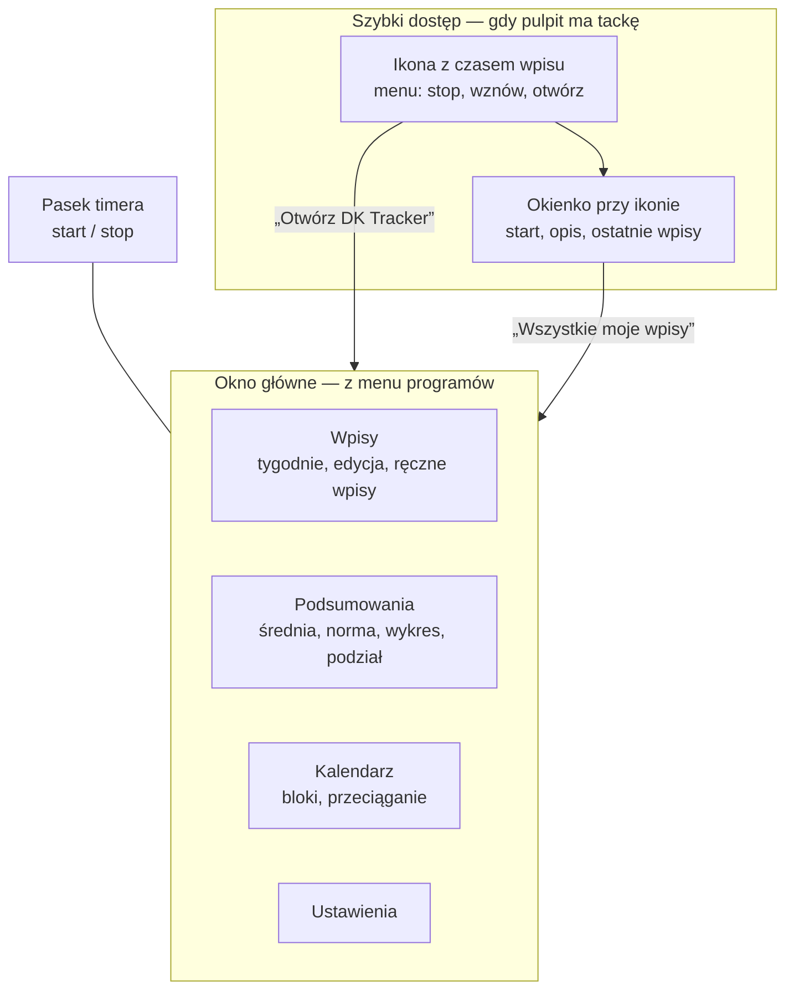
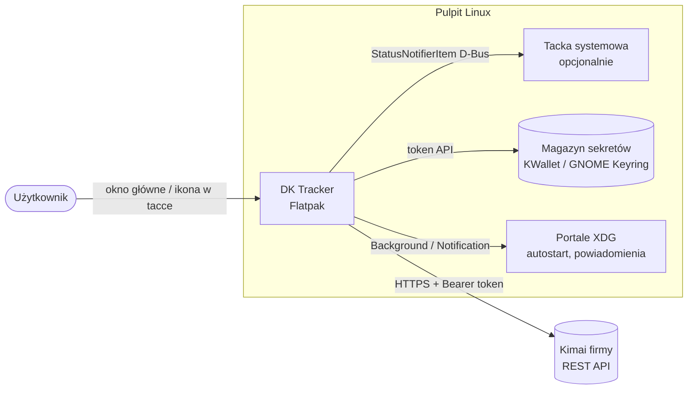

# Przegląd projektu

> [!info] W skrócie
> **DK Tracker** to klient [Kimai](../integracje/kimai-api.md) na pulpit Linuksa, dystrybuowany jako **Flatpak**.
> Sercem jest **okno główne** z trzema widokami — Wpisy, Podsumowania, Kalendarz — w którym przegląda się i poprawia
> czas pracy tak jak w panelu Kimai, tylko wygodniej. **Ikona w tacce** i małe okienko przy niej dają szybki start i
> stop bez szukania okna; na pulpicie bez tacki aplikacja działa w samym oknie.

## Problem

Zespół mierzy czas w self-hostowanym Kimai. Do tej pory służyła do tego wtyczka przeglądarkowa
[WS Tracker](../integracje/kimai-ws-tracker.md) i panel Kimai w przeglądarce:

- wtyczka działa tylko przy otwartej przeglądarce, w jednym profilu, a jej licznik ginie wśród innych rozszerzeń;
- nie ma powiadomień systemowych („timer działa od 9 godzin”) ani startu razem z sesją;
- przejrzenie tygodnia, poprawienie godzin czy sprawdzenie, ile średnio pracuje się dziennie, wymaga panelu Kimai —
  kolejnej karty, formularzy i przeładowań strony.

DK Tracker zbiera to w jednej natywnej aplikacji: bieżący timer i cała historia wpisów są w jednym miejscu, a ikona w
tacce przypomina o trwającym pomiarze niezależnie od tego, co jest na pierwszym planie.

## Dla kogo

- **Główny użytkownik**: pracownik Web Systems na Fedorze z **KDE Plasma** (Wayland).
- **Drugorzędnie**: użytkownicy **GNOME** (Fedora Workstation, Ubuntu) i innych pulpitów Linuksa.

## Jak z niej korzystać

- **Okno główne** ([F-35](funkcje.md#f-35-okno-główne-0100)): pasek timera u góry, po lewej widoki —
  **Wpisy** (tygodnie i dni, okno edycji ze wszystkimi opcjami wpisu, ręczne dodawanie, usuwanie z „Cofnij”),
  **Podsumowania** ([F-36](funkcje.md#f-36-podsumowania-0103)), **Kalendarz**
  ([F-37](funkcje.md#f-37-kalendarz-0105)) i **Ustawienia**. Uruchomienie z menu programów otwiera właśnie je.
- **Tacka i okienko** ([F-02](funkcje.md#f-02-ikona-w-tacce-ze-stanem),
  [F-03](funkcje.md#f-03-okno-szybkiej-obsługi-popup)):
  to, co robiła wtyczka — timer widoczny zawsze, start i stop jednym kliknięciem, ostatnie wpisy. Tackę można wyłączyć
  w ustawieniach; wtedy zamknięcie okna kończy aplikację, a z tacką tylko je chowa (timer i przypomnienia działają).

## Kontekst systemu

Szczegóły każdej strzałki: [Integracje](../integracje/README.md). Budowa aplikacji:
[Architektura aplikacji](architektura-aplikacji.md), wygląd: [Wygląd okna głównego](wyglad-okna-glownego.md).

## Zakres

### Parytet z wtyczką — zrobione (0.9.x)

Pełny opis każdej funkcji: [Katalog funkcji](funkcje.md).

- [x] Konfiguracja: adres Kimai, token API, język, minimalna długość opisu, test połączenia
- [x] Ikona w tacce: stan (bezczynny / trwa / błąd) i czas trwającego wpisu
- [x] Okno szybkiej obsługi przy ikonie (odpowiednik popupu wtyczki)
- [x] Start / stop timera; wybór projektu (grupowanie po kliencie) i rodzaju pracy; zapamiętanie ostatnich
- [x] Edycja trwającego wpisu: opis, projekt, rodzaj pracy, godzina rozpoczęcia (wybierana z listy — 0.10.10),
  billable
- [x] Ostatnie wpisy po dniach z sumami; wznawianie; wyszukiwanie we wszystkich wpisach
- [x] Walidacja jakości opisu; billable jak w Kimai (z obsługą braku uprawnienia)
- [x] Polski i angielski bez restartu ([F-13](funkcje.md)); powiadomienia; autostart; menu ikony; paczka Flatpak

### Pełny klient Kimai — zrobione (0.10.x)

[Specyfikacja 0.10](../specyfikacja/2026-09-26-okno-glowne-0.10.md):

- [x] Okno główne z paskiem timera i widokiem Wpisy (0.10.0–0.10.2)
- [x] Podsumowania: okresy, średnia na dzień roboczy, norma, wykres, podział (0.10.3)
- [x] „O programie” w ustawieniach (0.10.4)
- [x] Kalendarz z tworzeniem, przesuwaniem i zmianą godzin wpisów (0.10.5)

### Do 1.0

- [ ] Minutnik przy ikonie (GNOME) i widżet panelu (KDE) —
  [0062](../../TODO/DO-ZROBIENIA/0062-aplikacja-ws-tracker/todo.md)
- [ ] Testy ręczne na GNOME — [0020](../../TODO/DO-ZROBIENIA/0020-testy-gnome/todo.md)

### Kandydaci na później

Każdy wymaga osobnej decyzji: wykrywanie bezczynności i propozycja odjęcia czasu, globalny skrót klawiszowy (portal
GlobalShortcuts), eksport raportów, kilka kont Kimai.

## Poza zakresem

- Zarządzanie projektami, klientami i fakturami — to robi panel Kimai.
- Przestarzałe uwierzytelnianie `X-AUTH-USER` / `X-AUTH-TOKEN` (jak we wtyczce — tylko token Bearer).
- Windows / macOS.
- Telemetria.

## Ograniczenia i ryzyka

> [!warning] Wayland a pozycjonowanie okna
> Na Waylandzie aplikacja **nie może sama ustawić pozycji swojego okna** — decyduje kompozytor. Dotyczy okienka przy
> tacce: na KDE jest zakotwiczone przy tacce przez `layer-shell`, gdzie indziej pojawia się na środku
> ([ADR-0005](../decyzje/0005-okno-przy-tacce-na-kde.md)). Okno główne zapamiętuje tylko rozmiar.

<!-- osobne callouty -->

> [!note] GNOME nie ma tacki domyślnie
> GNOME Shell pokazuje ikony StatusNotifierItem dopiero z rozszerzeniem
> [AppIndicator and KStatusNotifierItem Support](../integracje/gnome-appindicator.md) (Ubuntu ma je domyślnie, Fedora
> Workstation — nie). Bez niego DK Tracker to po prostu okno główne — wszystkie funkcje są dostępne.

## Kryteria sukcesu

1. Na Fedorze KDE: instalacja z repozytorium Flatpak, konfiguracja w < 2 min, start i stop timera w ≤ 2 kliknięciach
   — z okna głównego albo z ikony w tacce.
2. Tydzień pracy da się przejrzeć, poprawić i podsumować bez otwierania panelu Kimai.
3. Na GNOME bez rozszerzenia AppIndicator aplikacja jest w pełni używalna w oknie głównym.
4. Token przechowywany wyłącznie w magazynie sekretów systemu; aplikacja łączy się tylko z podanym Kimai.

## Powiązane

- [Katalog funkcji](funkcje.md)
- [Architektura aplikacji](architektura-aplikacji.md)
- [Projekt referencyjny: WS Tracker](../integracje/kimai-ws-tracker.md)
- [Decyzje](../decyzje/README.md)
- [Tablica zadań](../../TODO/README.md)
