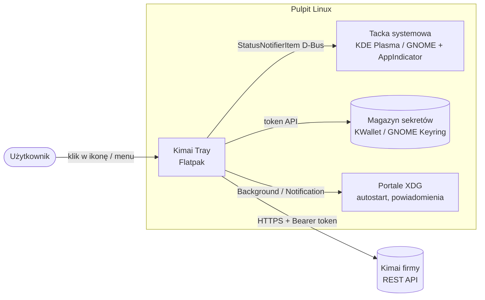

# Przegląd projektu

> [!info] W skrócie
> Natywna aplikacja linuksowa w **tacce systemowej**, dystrybuowana jako **Flatpak**, która
> pozwala mierzyć czas w firmowym **Kimai** jednym kliknięciem — tak jak wtyczka
> przeglądarkowa [[docs/integracje/kimai-ws-tracker|WS Tracker]], ale bez przeglądarki.

## Problem

Zespół mierzy czas w self-hostowanym Kimai. Wtyczka przeglądarkowa WS Tracker rozwiązuje
to dobrze, ale:

- działa tylko, gdy przeglądarka jest otwarta, i jest przywiązana do jednego profilu,
- licznik na ikonie wtyczki ginie wśród innych rozszerzeń,
- nie ma powiadomień systemowych (np. „timer działa od 9 godzin”),
- nie startuje razem z sesją pulpitu.

Ikona w tacce systemowej jest widoczna zawsze, niezależnie od tego, która aplikacja jest
na pierwszym planie.

## Dla kogo

- **Główny użytkownik**: pracownik Web Systems na Fedorze z **KDE Plasma** (Wayland).
- **Drugorzędnie**: użytkownicy **GNOME** (Fedora Workstation, Ubuntu) i innych pulpitów
  obsługujących StatusNotifierItem (XFCE, Cinnamon, Budgie…).

## Kontekst systemu

Szczegóły każdej strzałki: [[docs/integracje/README|Integracje]].

## Zakres — wersja 1.0 (parytet z wtyczką)

Pełny opis każdej funkcji: [[docs/architektura/funkcje|Katalog funkcji]].

- [ ] Konfiguracja: adres Kimai, token API, język, minimalna długość opisu, test połączenia
- [ ] Ikona w tacce: stan (bezczynny / trwa / błąd) i czas trwającego wpisu
- [ ] Okno szybkiej obsługi po kliknięciu ikony (odpowiednik popupu wtyczki)
- [ ] Start / stop timera; wybór projektu (grupowanie po kliencie) i czynności
- [ ] Zapamiętanie ostatniego projektu i czynności
- [ ] Edycja trwającego wpisu: opis, godzina rozpoczęcia, godzina zakończenia, billable
- [ ] Lista ostatnich wpisów pogrupowana po dniach z sumami; wznawianie wpisu
- [ ] Przełącznik billable (z obsługą braku uprawnienia `edit_billable_own_timesheet`)
- [ ] Sumy dzienna i tygodniowa
- [ ] Walidacja jakości opisu (za krótki / zbyt ogólny)
- [ ] Link „Moje czasy” do panelu Kimai
- [ ] Język polski i angielski
- [ ] Paczka Flatpak

## Poza wtyczką — kandydaci na później

Funkcje, które ma sens dodać, bo aplikacja desktopowa może więcej niż wtyczka.
Każda wymaga osobnej decyzji — nie wchodzą do 1.0 automatycznie.

- Menu kontekstowe ikony (prawy klik): szybki stop, wznów ostatni, otwórz Kimai, zakończ
- Powiadomienia systemowe (np. przypomnienie o długo działającym timerze)
- Autostart z sesją (portal Background)
- Wykrywanie bezczynności (idle) i propozycja odjęcia czasu
- Skrót klawiszowy globalny (portal GlobalShortcuts)

## Poza zakresem

- Zarządzanie projektami/klientami/fakturami — to robi panel Kimai.
- Obsługa przestarzałego uwierzytelnienia `X-AUTH-USER`/`X-AUTH-TOKEN` (jak we wtyczce —
  tylko token Bearer).
- Windows / macOS.
- Telemetria.

## Ograniczenia i ryzyka

> [!warning] Wayland a pozycjonowanie okna
> Na Waylandzie aplikacja **nie może sama ustawić pozycji swojego okna**. Okno
> „popupu” nie pojawi się automatycznie tuż przy ikonie w tacce tak jak w przeglądarce —
> o jego położeniu decyduje kompozytor. Menu kontekstowe ikony (renderowane przez hosta
> tacki) nie ma tego problemu. Rozwiązanie jest tematem osobnego zadania i ADR.

> [!warning] GNOME nie ma tacki domyślnie
> GNOME Shell nie wyświetla ikon StatusNotifierItem bez rozszerzenia
> [[docs/integracje/gnome-appindicator|AppIndicator and KStatusNotifierItem Support]].
> Ubuntu ma je domyślnie, Fedora Workstation — nie. Aplikacja musi działać sensownie
> także bez tacki (np. zwykłe okno).

## Kryteria sukcesu

1. Na Fedorze KDE: instalacja z pliku `.flatpak`, konfiguracja w < 2 min, start/stop
   timera w ≤ 2 kliknięciach od ikony w tacce.
2. Na GNOME z rozszerzeniem AppIndicator — to samo; bez rozszerzenia — aplikacja nadal
   używalna jako okno.
3. Wszystkie funkcje z listy „Zakres 1.0” działają tak jak we wtyczce.
4. Token przechowywany wyłącznie w magazynie sekretów systemu.

## Powiązane

- [[docs/architektura/funkcje|Katalog funkcji]]
- [[docs/integracje/kimai-ws-tracker|Projekt referencyjny: WS Tracker]]
- [[docs/decyzje/README|Decyzje]]
- [[TODO/README|Tablica zadań]]
