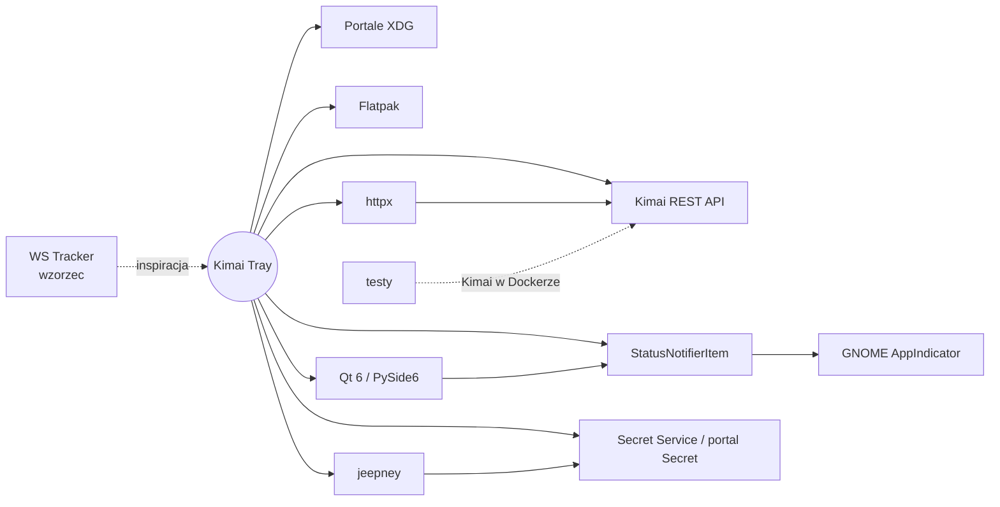

# Integracje

Każda zewnętrzna zależność ma tu osobny plik z faktami ze źródeł i linkami do oficjalnej
dokumentacji. Nową dodajesz skillem `nowa-integracja`.

| Integracja | Rola | Status | Dokument |
|---|---|---|---|
| Kimai REST API | źródło danych | planowana | [kimai-api](kimai-api.md) |
| WS Tracker | projekt referencyjny (wzorzec funkcji i UI) | referencja | [kimai-ws-tracker](kimai-ws-tracker.md) |
| StatusNotifierItem | ikona w tacce przez D-Bus | planowana | [statusnotifieritem](statusnotifieritem.md) |
| GNOME AppIndicator | host tacki w GNOME | planowana | [gnome-appindicator](gnome-appindicator.md) |
| Secret Service / portal Secret | przechowywanie tokenu | planowana | [secret-service](secret-service.md) |
| Portale XDG | autostart, powiadomienia, linki, skróty | planowana | [xdg-portale](xdg-portale.md) |
| Flatpak | budowanie i dystrybucja | planowana | [flatpak](flatpak.md) |
| Qt 6 / PySide6 | UI, tacka, pętla zdarzeń | w użyciu ([ADR-0002](../decyzje/0002-stos-python-pyside6.md)) | [qt-pyside6](qt-pyside6.md) |
| httpx | klient HTTP rdzenia | planowana ([ADR-0004](../decyzje/0004-architektura-rdzen-python-ui-qt.md)) | [httpx](httpx.md) |
| jeepney | D-Bus → Secret Service (token) | planowana ([ADR-0004](../decyzje/0004-architektura-rdzen-python-ui-qt.md)) | [jeepney](jeepney.md) |
| Kimai w Dockerze | środowisko testów kontraktowych | planowana | [kimai-docker](kimai-docker.md) |

> [!note] Narzędzia deweloperskie
> pytest, pytest-qt i flatpak-pip-generator są opisane w dokumentach bibliotek, których
> dotyczą ([qt-pyside6](qt-pyside6.md), [httpx](httpx.md), [flatpak](flatpak.md)).
