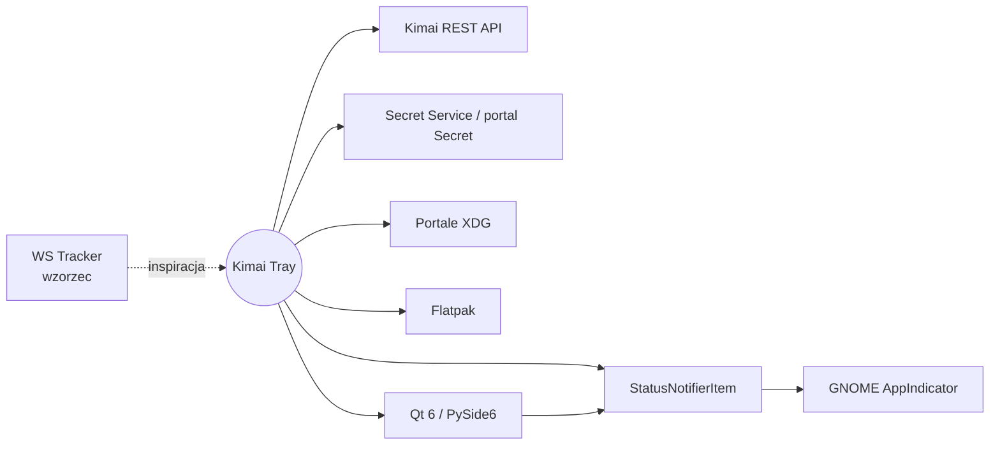

# Integracje

Każda zewnętrzna zależność ma tu osobny plik z faktami ze źródeł i linkami do oficjalnej
dokumentacji. Nową dodajesz skillem `nowa-integracja`.

| Integracja | Rola | Status | Dokument |
|---|---|---|---|
| Kimai REST API | źródło danych | planowana | [[docs/integracje/kimai-api\|kimai-api]] |
| WS Tracker | projekt referencyjny (wzorzec funkcji i UI) | referencja | [[docs/integracje/kimai-ws-tracker\|kimai-ws-tracker]] |
| StatusNotifierItem | ikona w tacce przez D-Bus | planowana | [[docs/integracje/statusnotifieritem\|statusnotifieritem]] |
| GNOME AppIndicator | host tacki w GNOME | planowana | [[docs/integracje/gnome-appindicator\|gnome-appindicator]] |
| Secret Service / portal Secret | przechowywanie tokenu | planowana | [[docs/integracje/secret-service\|secret-service]] |
| Portale XDG | autostart, powiadomienia, linki, skróty | planowana | [[docs/integracje/xdg-portale\|xdg-portale]] |
| Flatpak | budowanie i dystrybucja | planowana | [[docs/integracje/flatpak\|flatpak]] |
| Qt 6 / PySide6 | UI, tacka, pętla zdarzeń | w użyciu (ADR-0002) | [[docs/integracje/qt-pyside6\|qt-pyside6]] |

> [!todo] Do dopisania
> Biblioteka HTTP i biblioteka sekretów, gdy zostaną wybrane.
