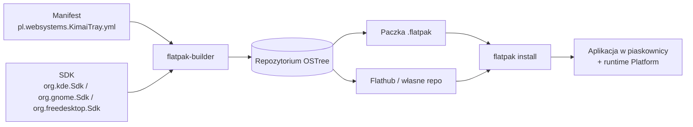

# Flatpak — format dystrybucji

> [!info] W skrócie
> Aplikacja jest budowana i instalowana jako Flatpak: działa w piaskownicy, na wspólnym
> runtime, identycznie na Fedorze KDE, Fedorze GNOME, Ubuntu itd.

## Pojęcia



- **Runtime** — wspólna baza bibliotek (`*.Platform`), **SDK** — to samo + narzędzia
  budowania (`*.Sdk`).
- **Manifest** (YAML/JSON) — ID aplikacji, runtime, uprawnienia (`finish-args`),
  moduły do zbudowania ze źródłami.
- **ID aplikacji** — odwrócona domena. Propozycja: `pl.websystems.KimaiTray`
  (do potwierdzenia w ADR — ID trudno zmienić po publikacji).

## Runtime'y (Flathub, stan 2026-09-25)

| Runtime | Dla kogo | Aktualne gałęzie |
|---|---|---|
| `org.kde.Platform` | Qt / KDE Frameworks | `6.10`, `6.11` |
| `org.gnome.Platform` | GTK / libadwaita | `49`, `50`, `51` |
| `org.freedesktop.Platform` | wszystko inne (np. Tauri, Electron z BaseApp) | `24.08`, `25.08`, `26.08` |

Wybór runtime wynika ze stosu (ADR). Źródło opisów:
[Available Runtimes](https://docs.flatpak.org/en/latest/available-runtimes.html).

## Planowane uprawnienia (`finish-args`)

```yaml
finish-args:
  - --share=ipc
  - --socket=wayland
  - --socket=fallback-x11                    # zgodność: Wayland + X11
  - --device=dri                             # akceleracja grafiki (jeśli UI jej używa)
  - --share=network                          # połączenie z Kimai
  - --talk-name=org.kde.StatusNotifierWatcher  # ikona w tacce (SNI)
  - --talk-name=org.freedesktop.secrets     # token w KWallet / GNOME Keyring (ADR-0004)
```

Zasady z [Sandbox Permissions](https://docs.flatpak.org/en/latest/sandbox-permissions.html):
minimalny zestaw `--talk-name`, nigdy `--socket=session-bus`, portale zamiast
bezpośredniego dostępu. `--share=network` tylko gdy aplikacja naprawdę potrzebuje sieci
(u nas — tak).

Sekrety: [ADR-0004](../decyzje/0004-architektura-rdzen-python-ui-qt.md),
[jeepney](jeepney.md). Autostart i powiadomienia idą przez portale i **nie** wymagają `finish-args`
([Portale XDG](xdg-portale.md)).

## Budowanie lokalnie

> [!note] Narzędzia na maszynie deweloperskiej
> Fedora 44: Flatpak 1.18.2, **flatpak-builder 1.4.10** (`/usr/bin/flatpak-builder`).
> Na innej maszynie: `sudo dnf install flatpak-builder` albo
> `flatpak install flathub org.flatpak.Builder`.

Szkic (dokładne komendy trafią do [AGENTS.md](../../AGENTS.md) → „Komendy” przy szkielecie projektu):

```bash
flatpak-builder --user --install --force-clean build-dir pl.websystems.KimaiTray.yml
flatpak run pl.websystems.KimaiTray
# paczka do rozesłania:
flatpak build-bundle ~/.local/share/flatpak/repo kimai-tray.flatpak pl.websystems.KimaiTray
```

## Dystrybucja — opcje

| Opcja | Zalety | Wady |
|---|---|---|
| Plik `.flatpak` (bundle) | najprościej, np. w wydaniu GitHub | brak automatycznych aktualizacji |
| Własne repo Flatpak (np. GitHub Pages) | aktualizacje przez `flatpak update` | trzeba utrzymać repo i podpisy GPG |
| Flathub | wygoda, widoczność | przegląd, wymagania jakości; aplikacja jest firmowo-niszowa |

## Pliki metadanych wymagane w paczce

- `.desktop` (z `Exec`, `Icon`, kategoria `Utility`/`Office`),
- ikona aplikacji (SVG / PNG 128+),
- **MetaInfo** `*.metainfo.xml` (AppStream) — opis, zrzuty, wydania; wymagany na Flathubie.

## Pułapki

> [!warning]
> - Ikony SNI wymagają `--talk-name=org.kde.StatusNotifierWatcher`, inaczej ikona nie
>   pojawi się bez żadnego błędu ([SNI](statusnotifieritem.md)).
> - Aplikacja w piaskownicy nie może sama dopisać się do `~/.config/autostart` —
>   autostart przez portal Background.
> - Czas budowania i rozmiar: runtime KDE/GNOME ~ setki MB przy pierwszej instalacji
>   (współdzielony z innymi aplikacjami).

## Dokumentacja

- [Dokumentacja Flatpak](https://docs.flatpak.org/en/latest/)
- [Manifesty](https://docs.flatpak.org/en/latest/manifests.html)
- [flatpak-builder — referencja](https://docs.flatpak.org/en/latest/flatpak-builder-command-reference.html)
- [Uprawnienia piaskownicy](https://docs.flatpak.org/en/latest/sandbox-permissions.html)
- [Integracja z pulpitem (tacka, portale)](https://docs.flatpak.org/en/latest/desktop-integration.html)
- [Dostępne runtime'y](https://docs.flatpak.org/en/latest/available-runtimes.html)
- [Konwencje: ID aplikacji, MetaInfo](https://docs.flatpak.org/en/latest/conventions.html)
- [Flathub — wymagania](https://docs.flathub.org/docs/for-app-authors/requirements)

## Powiązane

- [StatusNotifierItem](statusnotifieritem.md)
- [Portale XDG](xdg-portale.md)
- [Sekrety](secret-service.md)
