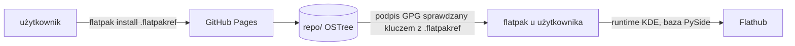

# GitHub Pages

> [!info] W skrócie
> Darmowy hosting statyczny GitHuba. Trzyma nasze podpisane repozytorium Flatpaka, z którego Discover, GNOME Software
> i `flatpak update` pobierają aktualizacje.

## Do czego używamy

Adres: **<https://dragonking026.github.io/WS-Tracker-Linux>** (repozytorium kodu jest publiczne, konto darmowe).
Stronę publikuje workflow [wydanie.yml](../../.github/workflows/wydanie.yml) po tagu wersji
([GitHub Actions](github-actions.md)).

| Ścieżka na stronie | Zawartość |
| --- | --- |
| `repo/` | repozytorium OSTree (aplikacja, `.Locale`, `.Debug`, appstream), podpisane GPG, z deltami statycznymi |
| `ws-tracker-tray.flatpakrepo` | dodaje źródło aktualizacji (`flatpak remote-add`) |
| `pl.websystems.WsTrackerTray.flatpakref` | instaluje aplikację jedną komendą; źródło dodaje się samo |
| `index.html` | krótka instrukcja instalacji |

Format plików `.flatpakrepo` i `.flatpakref`:
[flatpak command reference](https://docs.flatpak.org/en/latest/flatpak-command-reference.html); hosting repozytorium:
[Hosting a repository](https://docs.flatpak.org/en/latest/hosting-a-repository.html). Pliki pisze
[pages.py](../../flatpak/pages.py), całość składa [publikuj.sh](../../flatpak/publikuj.sh).

## Jak to działa

Klucz publiczny `flatpak/ws-tracker-tray-repo.gpg` (tworzy go [klucz-gpg.sh](../../flatpak/klucz-gpg.sh) przy pierwszym
wydaniu) jest wpisany w oba pliki jako `GPGKey`, więc `flatpak` sprawdza każdy commit i podsumowanie repozytorium.
Runtime KDE i baza PySide
przychodzą z Flathuba (`RuntimeRepo`).

## Konfiguracja / uprawnienia

- Ustawienia repozytorium → **Pages → Source: GitHub Actions**
  ([Configuring a publishing source](https://docs.github.com/en/pages/getting-started-with-github-pages/configuring-a-publishing-source-for-your-github-pages-site)).
- Workflow: `pages: write`, `id-token: write` (tylko zadanie `pages`), środowisko `github-pages`.
- Środowisko `github-pages` musi dopuszczać tagi `v*` — domyślnie publikuje tylko gałąź domyślna, a wydanie idzie z
  tagu (komendy: [wydania](../procesy/wydania.md),
  [deployment branch policies](https://docs.github.com/en/rest/deployments/branch-policies)).

## Pułapki i ograniczenia

> [!warning]
>
> - Limity
>   ([GitHub Pages limits](https://docs.github.com/en/pages/getting-started-with-github-pages/github-pages-limits)):
>   strona do **1 GB**, miękki limit transferu **100 GB/miesiąc**, publikacja do 10 minut. Paczka ma ok. 70 MB, więc
>   starczy na wiele wersji; `--prune` w `publikuj.sh` usuwa stare obiekty.
> - Każde wydanie publikuje stronę od nowa z repozytorium z tej budowy — wcześniejsze wersje nie zostają w `repo/`.
> - Aplikacja zainstalowana z pliku `.flatpak` nie ma tego źródła i nie dostaje aktualizacji — trzeba ją odinstalować i
>   zainstalować z `.flatpakref`.

## Gdzie w kodzie

- [flatpak/pages.py](../../flatpak/pages.py), [flatpak/publikuj.sh](../../flatpak/publikuj.sh),
  [flatpak/klucz-gpg.sh](../../flatpak/klucz-gpg.sh)
- Testy: [test_strona_repo.py](../../tests/test_strona_repo.py)

## Dokumentacja

- [GitHub Pages — publishing source](https://docs.github.com/en/pages/getting-started-with-github-pages/configuring-a-publishing-source-for-your-github-pages-site)
- [GitHub Pages limits](https://docs.github.com/en/pages/getting-started-with-github-pages/github-pages-limits)
- [Flatpak — hosting a repository](https://docs.flatpak.org/en/latest/hosting-a-repository.html)

## Powiązane

- [GitHub Actions](github-actions.md), [Flatpak](flatpak.md)
- [ADR-0007](../decyzje/0007-dystrybucja-repozytorium-flatpak-na-github-pages.md)
