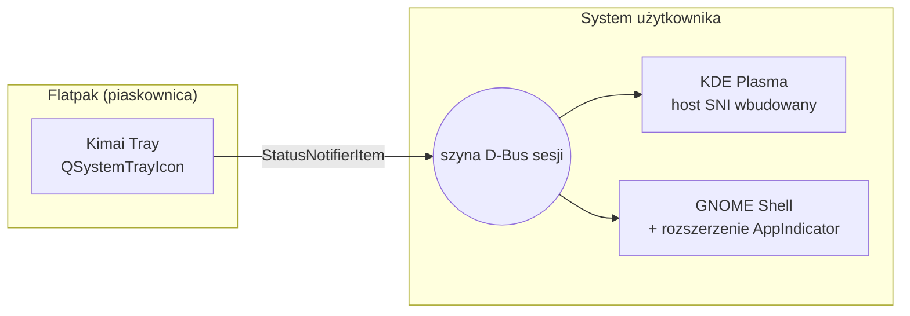
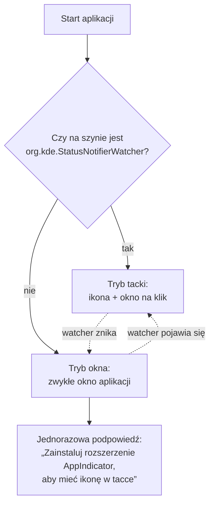

# GNOME — „AppIndicator and KStatusNotifierItem Support”

> [!info] W skrócie
> GNOME Shell **nie ma tacki systemowej** w domyślnej konfiguracji. Ikony SNI pokazuje
> dopiero rozszerzenie *AppIndicator and KStatusNotifierItem Support* (maintainer: 3v1n0,
> rozwijane w repozytorium Ubuntu). Bez niego nasza ikona jest niewidoczna.

## Gdzie jest domyślnie

| Dystrybucja | Stan |
| --- | --- |
| Ubuntu (GNOME) | zainstalowane i włączone domyślnie (`ubuntu-appindicators`) |
| Fedora Workstation (GNOME) | **brak** — trzeba doinstalować |
| Fedora KDE, KDE neon, Kubuntu | nie dotyczy — Plasma ma natywny host SNI |

Instalacja na Fedorze:

```bash
sudo dnf install gnome-shell-extension-appindicator
# wyloguj się i zaloguj ponownie, potem:
gnome-extensions enable appindicatorsupport@rgcjonas.gmail.com
```

albo przez [extensions.gnome.org](https://extensions.gnome.org/extension/615/appindicator-support/)
i aplikację „Rozszerzenia”.

Zweryfikowane 2026-09-25 w repozytorium Fedory 44: pakiet `gnome-shell-extension-appindicator`
(wersja 64, repozytorium `fedora`), identyfikator rozszerzenia
`appindicatorsupport@rgcjonas.gmail.com`.

## Czy to zależność aplikacji? Nie — to część pulpitu

Łatwo pomylić dwie rzeczy o podobnej nazwie:

| | Co to jest | Gdzie działa | Kto instaluje |
| --- | --- | --- | --- |
| **libappindicator / libayatana-appindicator** | biblioteka, przez którą *aplikacja* wystawia ikonę | w aplikacji | autor aplikacji — **u nas niepotrzebna**, bo Qt rozmawia z tacką przez D-Bus (SNI) sam |
| **Rozszerzenie „AppIndicator and KStatusNotifierItem Support”** | *host* tacki: rysuje ikony w panelu GNOME | wewnątrz procesu `gnome-shell` | **użytkownik / administrator systemu** |



- **Flatpak nie może zainstalować rozszerzenia GNOME Shell.** Zależności Flatpaka
  (runtime, rozszerzenia runtime'u, moduły manifestu) żyją wyłącznie w piaskownicy
  aplikacji. Rozszerzenie musi działać w `gnome-shell` na hoście.
- **KDE Plasma** nie potrzebuje niczego, bo host SNI jest wbudowany.
- **Ubuntu** ma rozszerzenie włączone domyślnie. **Fedora Workstation** wymaga jednorazowej
  instalacji przez użytkownika (patrz wyżej) i ponownego zalogowania.
- Automatyczna instalacja byłaby możliwa tylko przy dystrybucji jako pakiet systemowy
  (np. RPM z `Recommends: gnome-shell-extension-appindicator`). Przy Flatpaku zostaje
  **wykrycie braku + instrukcja w aplikacji**.

### Co robi aplikacja, gdy rozszerzenia brak

1. Wykrywa brak hosta tacki (`QSystemTrayIcon.isSystemTrayAvailable()` / brak
   `org.kde.StatusNotifierWatcher` na szynie).
2. Działa jako zwykłe okno (pełna funkcjonalność, poza ikoną).
3. Pokazuje jednorazową podpowiedź z instrukcją dla danej dystrybucji i przyciskiem
   „Otwórz stronę rozszerzenia” (portal OpenURI →
   [extensions.gnome.org](https://extensions.gnome.org/extension/615/appindicator-support/)).
4. Gdy użytkownik doinstaluje i włączy rozszerzenie, aplikacja przełącza się w tryb tacki
   bez restartu (watcher pojawia się na szynie).

## Co obsługuje

Z opisu rozszerzenia: AppIndicator, KStatusNotifierItem oraz starsze ikony tacki (XEmbed).
Obsługiwane wersje (wydanie 66): **GNOME Shell 45–51**.

## Konsekwencje dla aplikacji



- Aplikacja **musi wykrywać** brak hosta i wtedy działać jako zwykłe okno (z opcją
  minimalizacji), zamiast „znikać” po zamknięciu okna.
- Tooltipy SNI w GNOME bywają pomijane — kluczowe informacje (czas) muszą być dostępne
  też w oknie/menu.

## Pułapki

> [!warning] Aplikacja bez okna i bez tacki = niewidzialna
> Jeśli aplikacja startuje „do tacki”, a tacki nie ma, użytkownik GNOME nie ma jak jej
> otworzyć poza ponownym uruchomieniem z menu aplikacji. Ponowne uruchomienie musi
> pokazać okno istniejącej instancji (single instance).

## Stan testów (2026-09-25 20:39)

> [!todo] Niesprawdzone na GNOME
> Stacja deweloperska ma tylko KDE. Testy na GNOME (z rozszerzeniem AppIndicator i bez niego)
> wykonają później inne osoby — osobne zadanie w `TODO/`. Na GNOME okno będzie bezramkowe
> (bez `layer-shell`) — [ADR-0005](../decyzje/0005-okno-przy-tacce-na-kde.md).

## Dokumentacja

- [Rozszerzenie na extensions.gnome.org](https://extensions.gnome.org/extension/615/appindicator-support/)
- [Repozytorium: ubuntu/gnome-shell-extension-appindicator](https://github.com/ubuntu/gnome-shell-extension-appindicator)

## Powiązane

- [StatusNotifierItem](statusnotifieritem.md)
- [Ryzyka projektu](../architektura/przeglad.md)
