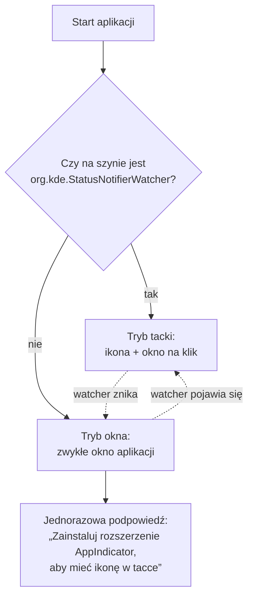

# GNOME — „AppIndicator and KStatusNotifierItem Support”

> [!info] W skrócie
> GNOME Shell **nie ma tacki systemowej** w domyślnej konfiguracji. Ikony SNI pokazuje
> dopiero rozszerzenie *AppIndicator and KStatusNotifierItem Support* (maintainer: 3v1n0,
> rozwijane w repozytorium Ubuntu). Bez niego nasza ikona jest niewidoczna.

## Gdzie jest domyślnie

| Dystrybucja | Stan |
|---|---|
| Ubuntu (GNOME) | zainstalowane i włączone domyślnie (`ubuntu-appindicators`) |
| Fedora Workstation (GNOME) | **brak** — trzeba doinstalować |
| Fedora KDE, KDE neon, Kubuntu | nie dotyczy — Plasma ma natywny host SNI |

Instalacja na Fedorze:

```bash
sudo dnf install gnome-shell-extension-appindicator
# wyloguj się i zaloguj ponownie, potem:
gnome-extensions enable appindicatorsupport@rgcjonas.gmail.com
```

albo przez [extensions.gnome.org](https://extensions.gnome.org/extension/615/appindicator-support/)
i aplikację „Rozszerzenia”.

> [!todo] Nazwę pakietu i UUID rozszerzenia zweryfikować na czystej Fedorze w zadaniu testów GNOME.

## Co obsługuje

Z opisu rozszerzenia: AppIndicator, KStatusNotifierItem oraz starsze ikony tacki (XEmbed).
Obsługiwane wersje (wydanie 66): **GNOME Shell 45–51**.

## Konsekwencje dla aplikacji



- Aplikacja **musi wykrywać** brak hosta i wtedy działać jako zwykłe okno (z opcją
  minimalizacji), zamiast „znikać” po zamknięciu okna.
- Tooltipy SNI w GNOME bywają pomijane — kluczowe informacje (czas) muszą być dostępne
  też w oknie/menu.

## Pułapki

> [!warning] Aplikacja bez okna i bez tacki = niewidzialna
> Jeśli aplikacja startuje „do tacki”, a tacki nie ma, użytkownik GNOME nie ma jak jej
> otworzyć poza ponownym uruchomieniem z menu aplikacji. Ponowne uruchomienie musi
> pokazać okno istniejącej instancji (single instance).

## Dokumentacja

- [Rozszerzenie na extensions.gnome.org](https://extensions.gnome.org/extension/615/appindicator-support/)
- [Repozytorium: ubuntu/gnome-shell-extension-appindicator](https://github.com/ubuntu/gnome-shell-extension-appindicator)

## Powiązane

- [StatusNotifierItem](statusnotifieritem.md)
- [Ryzyka projektu](../architektura/przeglad.md)
