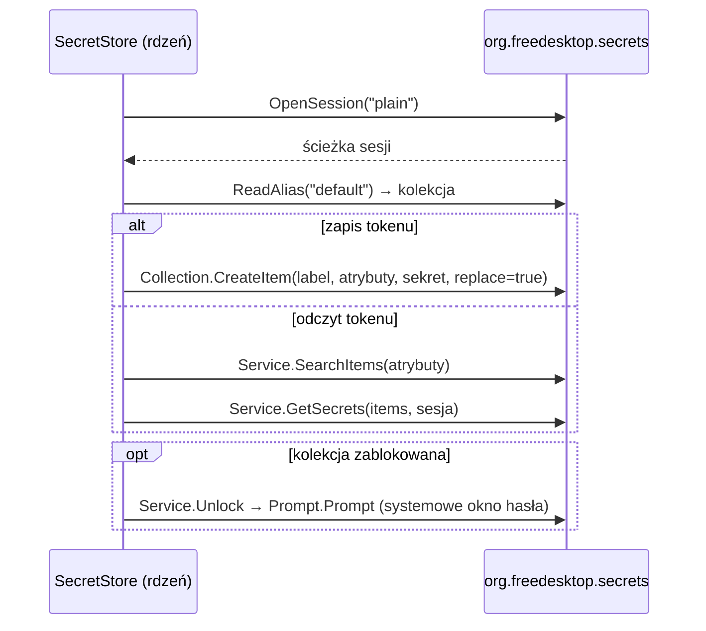

# jeepney — D-Bus w czystym Pythonie

> [!info] W skrócie
> Implementacja protokołu D-Bus w czystym Pythonie, bez zależności. Używamy jej do
> zapisu i odczytu tokenu Kimai w Secret Service (KWallet/ksecretd, GNOME Keyring).
> Decyzja: [ADR-0004](../decyzje/0004-architektura-rdzen-python-ui-qt.md).

## Dlaczego nie `secretstorage`

`secretstorage` (3.5.0) jest zbudowane na jeepney, ale wymaga `cryptography` do sesji
szyfrowanej `dh-ietf1024-sha256-aes128-cbc-pkcs7`. Budowa `cryptography` we Flatpaku
wymaga toolchainu Rusta. My używamy sesji `plain` i piszemy mały moduł sami.

## Jak rozmawiamy z Secret Service

Przykład API z [dokumentacji jeepney](https://jeepney.readthedocs.io/en/latest/integrate.html)
(blokujące I/O):

```python
from jeepney import DBusAddress, new_method_call
from jeepney.io.blocking import open_dbus_connection

service = DBusAddress("/org/freedesktop/secrets",
                      bus_name="org.freedesktop.secrets",
                      interface="org.freedesktop.Secret.Service")

with open_dbus_connection(bus="SESSION") as conn:
    reply = conn.send_and_get_reply(
        new_method_call(service, "OpenSession", "sv", ("plain", ("s", ""))))
    session_path = reply.body[1]
```



Atrybuty wyszukiwania elementu: `application=io.github.dragonking026.WS-Tracker-Linux`,
`url=<adres Kimai>`. Etykieta: „`WS Tracker — <adres Kimai>`”.

## Sprawdzone na stacji deweloperskiej (2026-09-25)

Fedora 44, Plasma 6.7.5, ksecretd:

```text
OpenSession plain      → ('ay', b''), /org/freedesktop/secrets/session/9
ReadAlias default      → /org/freedesktop/secrets/collection/kdewallet
Collections            → ['/org/freedesktop/secrets/collection/kdewallet']
```

## Specyfikacja Secret Service — fakty, na których polegamy

- Algorytm `plain`: bez szyfrowania. Specyfikacja „silnie zaleca” usługom jego
  obsługę ([7.2](https://specifications.freedesktop.org/secret-service/latest/ch07s02.html)).
- Elementy wyszukujemy po **atrybutach**, nie zapamiętujemy ścieżek obiektów.
  Aplikacje bez specjalnych wymagań zapisują w kolekcji **default**
  ([rozdz. 3](https://specifications.freedesktop.org/secret-service/latest/ch03.html),
  [aliasy](https://specifications.freedesktop.org/secret-service/latest/aliases.html)).
- Zablokowany element lub kolekcja → błąd `IsLocked`, trzeba odblokować
  (może pojawić się prompt).

## Flatpak

- `--talk-name=org.freedesktop.secrets`
- jeepney to czysty Python bez zależności. Moduł pip w manifeście.

## Pułapki

> [!warning]
>
> - `CreateItem` i `Unlock` mogą zwrócić obiekt **Prompt** — trzeba wywołać
>   `Prompt(window_id)` i czekać na sygnał `Completed`. Nie wolno blokować wątku UI.
> - Sesja `plain` przesyła token bez szyfrowania po szynie sesji użytkownika.
>   Świadomy kompromis ([ADR-0004](../decyzje/0004-architektura-rdzen-python-ui-qt.md)).
> - Brak usługi `org.freedesktop.secrets` → czytelny komunikat w ustawieniach.
>   Nigdy nie zapisujemy tokenu do pliku.

## Gdzie w kodzie

- [src/ws_tracker/desktop/secrets.py](../../src/ws_tracker/desktop/secrets.py) — `SecretServiceStore`
  (get/set/delete,
  odblokowanie przez prompt).
- [src/ws_tracker/desktop/bus.py](../../src/ws_tracker/desktop/bus.py) — szyna D-Bus na jeepney.
- Testy: [tests/desktop/test_secrets.py](../../tests/desktop/test_secrets.py) (FakeBus).

## Dokumentacja

- [jeepney — dokumentacja](https://jeepney.readthedocs.io/en/latest/)
- [jeepney — integracja z pętlami I/O](https://jeepney.readthedocs.io/en/latest/integrate.html)
- [jeepney — kod źródłowy](https://gitlab.com/takluyver/jeepney)
- [Secret Service API](https://specifications.freedesktop.org/secret-service/latest/)
- [secretstorage (dla porównania)](https://secretstorage.readthedocs.io/)

## Powiązane

- [Przechowywanie tokenu — Secret Service](secret-service.md)
- [ADR-0004](../decyzje/0004-architektura-rdzen-python-ui-qt.md)
- [Flatpak](flatpak.md)
