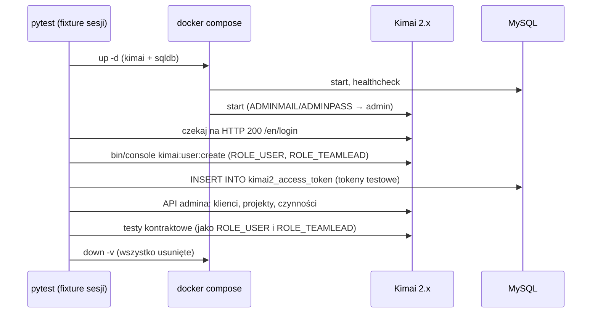

# Kimai w Dockerze — środowisko testowe

> [!info] W skrócie
> Oficjalny obraz `kimai/kimai2` z bazą MySQL, uruchamiany lokalnie na czas testów.
> Testy kontraktowe i integracyjne mogą wtedy tworzyć, zmieniać i usuwać wpisy
> bez dotykania Kimai firmy. Działanie sprawdzone w
> [spike'u](../../TODO/W-TRAKCIE/0002-specyfikacja-projektu/testy/raport-kimai-docker-2026-09-25.md).

## Jak to działa

## Konfiguracja (z dokumentacji Kimai)

- Obrazy ([docs](https://www.kimai.org/documentation/docker.html)): `kimai/kimai2:<major>`
  (zalecane przypięcie, np. `:2`), `:stable`, `:<wersja>`, `:dev` (debug, tylko lokalnie),
  `:apache` — użyty w spike'u.
- Zmienne: `DATABASE_URL`, `APP_SECRET` (**musi** być ustawiony), `TRUSTED_HOSTS`
  (**musi** obejmować host dostępu, np. `localhost|127.0.0.1`), `ADMINMAIL`, `ADMINPASS`.
- Wzór compose: [docker-compose.html](https://www.kimai.org/documentation/docker-compose.html).
- Port wystawiamy **tylko na 127.0.0.1** (`127.0.0.1:8001:8001`).

## Tokeny API bez interfejsu

Kimai nie ma komendy konsoli do tokenów. Token jest jednak przechowywany **jawnie**
w tabeli `kimai2_access_token` (kolumny `user_id`, `token`, `name`, `last_usage`,
`expires_at`) i wyszukiwany po dokładnej wartości (`AccessTokenHandler`), więc
fixture wstawia go SQL-em.

> [!warning] Szczegół implementacji Kimai
> To nie jest publiczne API. Po aktualizacji Kimai (np. haszowanie tokenów) wstawianie
> może przestać działać. Fixture zawsze weryfikuje token przez `GET /api/users/me`
> i przy błędzie przerywa testy czytelnym komunikatem.

## Wersje Kimai w testach

Testujemy na przypiętej wersji głównej (`kimai/kimai2:apache` → obecnie 2.67.0).
Opcjonalnie drugi przebieg na wersji z firmowego Kimai, żeby wyłapać różnice.
Wersję instancji podaje `GET /api/version`.

## Pułapki

> [!warning]
> - **Strefa czasowa:** nowi użytkownicy dostają strefę domyślną serwera (w kontenerze
>   UTC). Testy muszą liczyć czasy w strefie konta, inaczej wpisy lądują w przyszłości —
>   ten sam błąd, który aplikacja ma wykrywać.
> - Pierwsze uruchomienie pobiera obrazy (kilkaset MB). Start ~1 min.
> - Testy z Dockerem oznaczamy `@pytest.mark.kimai` — nie uruchamiają się domyślnie.
> - Zawsze `down -v`, żeby nie zostawiać wolumenów z danymi testowymi.

## Gdzie w kodzie

> [!todo] Po implementacji: `tests/kimai/docker-compose.yml` i fixture w `tests/kimai/conftest.py`.
> Prototyp: [prototyp/kimai-docker](../../TODO/W-TRAKCIE/0002-specyfikacja-projektu/prototyp/kimai-docker/).

## Dokumentacja

- [Kimai — Docker](https://www.kimai.org/documentation/docker.html)
- [Kimai — Docker Compose](https://www.kimai.org/documentation/docker-compose.html)
- [Kimai — środowisko deweloperskie](https://www.kimai.org/documentation/developers.html)
- [Obraz na Docker Hub](https://hub.docker.com/r/kimai/kimai2)

## Powiązane

- [Kimai REST API](kimai-api.md)
- [Raport ze spike'u](../../TODO/W-TRAKCIE/0002-specyfikacja-projektu/testy/raport-kimai-docker-2026-09-25.md)
