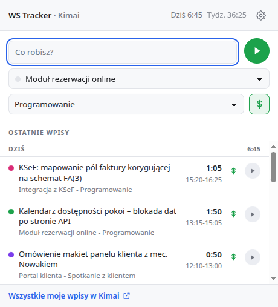
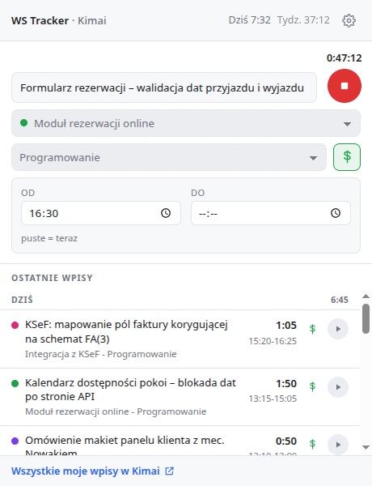
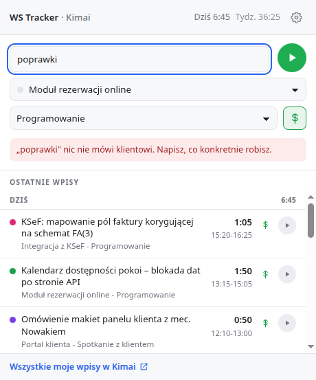
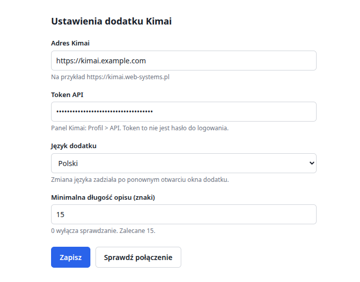

# WS Tracker — wtyczka przeglądarkowa (projekt referencyjny)

> [!info] W skrócie
> Wtyczka Chrome/Edge/Brave/Firefox (Manifest V3) od Web Systems do mierzenia czasu
> w Kimai. **Nie jest zależnością** tej aplikacji — to wzorzec funkcji i zachowania,
> który odtwarzamy natywnie w tacce systemowej.

- Repozytorium: [github.com/websystemspl/kimai-ws-tracker](https://github.com/websystemspl/kimai-ws-tracker)
  (`git@github.com:websystemspl/kimai-ws-tracker.git`)
- Chrome Web Store:
  [Kimai — pomiar czasu (Web Systems)](https://chromewebstore.google.com/detail/kimai-pomiar-czasu-web-sy/eliiemekophpilppaobljfjkhbkmchjg)
- Licencja: MIT (napisana od zera — nie jest forkiem „Time Tracker Addon for Kimai”,
  którego licencja zabrania modyfikacji).
- Przeanalizowana wersja: **1.5.1**.

## Wygląd (wzorzec UI)

Zrzuty wykonane z kopii wtyczki z podstawioną atrapą API (dane fikcyjne).

| Bezczynny | Trwa |
| --- | --- |
|  |  |

| Błąd walidacji opisu | Ustawienia |
| --- | --- |
|  |  |

Elementy okna (od góry): nagłówek „WS Tracker · Kimai” z sumą dnia i tygodnia oraz
zębatką ustawień → pole opisu z zegarem i okrągłym przyciskiem start (zielony ▶) / stop
(czerwony ■) → wybór projektu z kolorową kropką (grupy po klientach) → wybór czynności
i przełącznik `$` → (tylko gdy trwa) pola „Od / Do” → pasek komunikatu → „Ostatnie
wpisy” z nagłówkami dni i sumami → link „Wszystkie moje wpisy w Kimai”.

### Motyw jasny i ciemny

> [!warning] Zrzuty powyżej pokazują tylko motyw jasny
> Wtyczka ma **oba motywy** i wybiera je według systemu (`@media (prefers-color-scheme: dark)`),
> [popup/popup.css](https://github.com/websystemspl/kimai-ws-tracker/blob/main/popup/popup.css)
> (commit `86d4594`, sprawdzone 2026-09-25 21:52). DK Tracker robi tak samo: motyw według systemu.

Paleta okna (`popup.css`, zmienne `:root`):

| Zmienna | Jasny | Ciemny | Do czego |
| --- | --- | --- | --- |
| `--bg` | `#ffffff` | `#16181d` | tło okna |
| `--surface` | `#f7f8fa` | `#1e2127` | pola, karty |
| `--surface-2` | `#eceef2` | `#272b33` | pola wyboru, przyciski wtórne |
| `--fg` | `#17181c` | `#eceef2` | tekst |
| `--muted` | `#71757f` | `#9aa0ac` | tekst pomocniczy |
| `--line` | `#e3e5ea` | `#2f333c` | linie podziału, ramki |
| `--accent` | `#2563eb` | `#6f9bff` | linki, akcent |
| `--start` | `#16a34a` | (bez zmian) | przycisk start, `$` aktywny |
| `--stop` | `#e02f2f` | (bez zmian) | przycisk stop |
| `--ok-bg` / `--ok-fg` | `#eaf7ee` / `#12703a` | `#14301f` / `#6ee7a0` | komunikat sukcesu |
| `--err-bg` / `--err-fg` | `#fdecec` / `#a41d1d` | `#3a1a1a` / `#ff9d9d` | komunikat błędu |
| `--focus` | `#2563eb` | `#7aa2ff` | obwódka fokusu |

Odstępy: 4 / 8 / 12 px, margines wewnętrzny 14 px. Okno ma szerokość 460 px i najwyżej
600 px wysokości (limit popupu Chrome). Przewija się tylko lista wpisów.

Strona ustawień (`options/options.css`) ma własną, prostszą paletę. Jasny motyw:
`#ffffff` / `#111827` / `#6b7280` / `#d1d5db`, ciemny: `#111827` / `#f3f4f6` / `#9ca3af` / `#374151`.

## Struktura kodu wtyczki

```text
manifest.json         MV3: uprawnienia storage + alarms, opcjonalne https://*/*
background.js         service worker: badge z czasem co 1 min (chrome.alarms)
lib/api.js            klient Kimai REST API (Bearer), obsługa błędów, localStamp
lib/i18n.js           własne ładowanie tłumaczeń z wyborem języka
lib/validate.js       walidacja jakości opisu (lista ogólników PL/EN)
popup/                okno (HTML/CSS/JS, ~1450 linii)
options/              ustawienia: URL, token, język, min. długość opisu
_locales/pl, /en      teksty
```

## Co przenosimy, a co zmieniamy

| Element wtyczki | W aplikacji |
| --- | --- |
| `lib/api.js` | Przenosimy logikę 1:1 (endpointy, obsługa 400 „extra fields”, `localStamp`, stronicowanie `range`). [Kimai API](kimai-api.md) |
| `lib/validate.js` | Przenosimy 1:1 łącznie z listą ogólników — dobry kandydat na testy jednostkowe. |
| `_locales/*/messages.json` | Teksty i klucze jako punkt wyjścia tłumaczeń aplikacji. |
| `background.js` badge | Ikona w tacce + tooltip. [SNI](statusnotifieritem.md) |
| `popup/` | Okno aplikacji (forma zależna od ADR o Waylandzie). |
| `chrome.storage.sync` token | Magazyn sekretów systemu. [Secret Service](secret-service.md) |
| `chrome.storage.local` (lastProject, billableAllowed, kimaiLocale) | Plik stanu w katalogu XDG aplikacji. |
| `optional_host_permissions` | Niepotrzebne — Flatpak: `--share=network`. |

> [!bug] Drobny błąd zauważony przy zrzutach
> W stanie bezczynnym z przywróconym ostatnim projektem kropka koloru projektu bywa szara:
> `enterIdleState()` wywołuje `paintProjectDot()` bez koloru już po tym, jak
> `fillPickers()` go ustawiło. W aplikacji — nie powielać.

<!-- osobne callouty -->

> [!bug] Strefa czasowa (potwierdzone na Kimai 2.67 w Dockerze)
> `localStamp()` wysyła czas **przeglądarki**, a Kimai dokleja do niego strefę **konta
> Kimai** bez przeliczania. Gdy strefy się różnią (np. konto w UTC, system Europe/Warsaw),
> wpis zaczyna się 2 h w przyszłości, a stop i kolejny start są odrzucane.
> [Raport](../../TODO/ZROBIONE/0002-specyfikacja-projektu/testy/raport-kimai-docker-2026-09-25.md).
> W aplikacji czas liczymy w strefie z `/api/users/me → timezone`.

## Pełny opis zachowań

[Katalog funkcji F-01…F-14](../architektura/funkcje.md) — każda funkcja wtyczki
rozpisana z endpointami i przypadkami brzegowymi.

## Powiązane

- [Kimai REST API](kimai-api.md)
- [Przegląd projektu](../architektura/przeglad.md)
