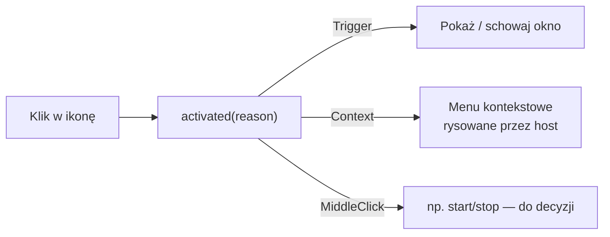

# Qt 6 / PySide6

> [!info] W skrócie
> Oficjalne wiązania Pythona do Qt 6 (Qt for Python). Dają UI aplikacji, ikonę w tacce
> (`QSystemTrayIcon`, na Linuksie przez SNI), pętlę zdarzeń i sieć. Decyzja:
> [[docs/decyzje/0002-stos-python-pyside6|ADR-0002]].

## Do czego używamy

| Obszar | Klasa Qt | Funkcje |
|---|---|---|
| Ikona w tacce | `QSystemTrayIcon` (+ `QMenu` jako menu kontekstowe) | F-02, F-20 |
| Okno szybkiej obsługi, ustawienia | Qt Widgets lub QML (do decyzji) | F-03…F-13 |
| Zegar / odświeżanie | `QTimer` | F-02, F-12 |
| Powiadomienia | `QSystemTrayIcon.showMessage` albo portal Notification | F-21 |
| Otwieranie linków | `QDesktopServices.openUrl` (w Flatpaku przez portal OpenURI) | F-08 |

## QSystemTrayIcon na Linuksie

Z [dokumentacji Qt 6](https://doc.qt.io/qt-6/qsystemtrayicon.html):

- Działa we wszystkich pulpitach implementujących **D-Bus StatusNotifierItem**
  (KDE, GNOME, Xfce, LXQt, DDE) oraz w tackach **XEmbed** pod X11.
- Sygnał `activated(reason)`: `Trigger` (lewy klik), `Context`, `DoubleClick`,
  `MiddleClick`.
- `isSystemTrayAvailable()` pozwala sprawdzić, czy jest host tacki. Używamy go do
  przełączenia w tryb okna ([[docs/integracje/gnome-appindicator|GNOME bez tacki]]).
- `geometry()` zwraca położenie ikony. Na Waylandzie i tak nie ustawimy według niego okna.

> [!warning] Ograniczenia z dokumentacji Qt
> - „Od GNOME Shell 3.26 nie wszystkie `ActivationReason` są obsługiwane bez rozszerzeń.”
> - Zdarzenia `QEvent::ToolTip` i kółka myszy są dostępne **tylko na X11**.
>   Na Waylandzie tooltip ustawiamy wyłącznie właściwością `setToolTip()`.



## Flatpak

Baza [io.qt.PySide.BaseApp](https://github.com/flathub/io.qt.PySide.BaseApp):

```yaml
runtime: org.kde.Platform
runtime-version: '6.11'
sdk: org.kde.Sdk
base: io.qt.PySide.BaseApp
base-version: '6.11'
cleanup-commands:
  - /app/cleanup-BaseApp.sh        # wymagane przez bazę
build-options:
  env:
    BASEAPP_REMOVE_WEBENGINE: '1'  # nie potrzebujemy WebEngine
```

- Baza zawiera wszystkie moduły PySide6 poza Qt6Quick3D, Qt6SerialBus,
  Qt6DataVisualization, Qt6Graphs i Qt6HttpServer.
- Utrzymywane gałęzie: 6.7–6.11.

## Testy

- Logika domenowa bez Qt: zwykły `pytest`.
- Widżety i sygnały: [pytest-qt](https://pytest-qt.readthedocs.io/) (fixture `qtbot`).

## Pułapki

> [!warning]
> - Na Waylandzie aplikacja nie ustawia pozycji okna
>   ([Wayland and Qt](https://doc.qt.io/qt-6/wayland-and-qt.html)).
> - `layer-shell-qt` (panele i popupy zakotwiczone w KDE) nie wchodzi w skład
>   `org.kde.Platform` 6.10/6.11 — sprawdzone lokalnie 2026-09-25.
> - Wersja Pythona w runtime KDE może różnić się od lokalnej (3.14). Testy uruchamiamy
>   też w Flatpaku.

## Gdzie w kodzie

> [!todo] Uzupełnić po utworzeniu modułów `tray` i `ui`.

## Dokumentacja

- [Qt for Python (PySide6)](https://doc.qt.io/qtforpython-6/)
- [PySide6 — QSystemTrayIcon](https://doc.qt.io/qtforpython-6/PySide6/QtWidgets/QSystemTrayIcon.html)
- [Qt 6 — QSystemTrayIcon (uwagi o platformach)](https://doc.qt.io/qt-6/qsystemtrayicon.html)
- [Wayland and Qt](https://doc.qt.io/qt-6/wayland-and-qt.html)
- [Flathub: io.qt.PySide.BaseApp](https://github.com/flathub/io.qt.PySide.BaseApp)
- [pytest-qt](https://pytest-qt.readthedocs.io/)

## Powiązane

- [[docs/decyzje/0002-stos-python-pyside6|ADR-0002]]
- [[docs/integracje/statusnotifieritem|StatusNotifierItem]]
- [[docs/integracje/flatpak|Flatpak]]
