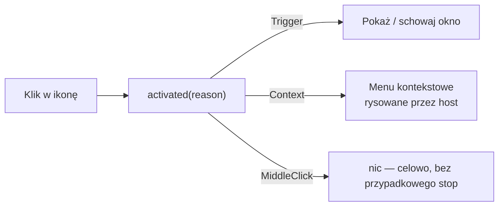

# Qt 6 / PySide6

> [!info] W skrócie
> Oficjalne wiązania Pythona do Qt 6 (Qt for Python). Dają UI aplikacji, ikonę w tacce
> (`QSystemTrayIcon`, na Linuksie przez SNI), pętlę zdarzeń i sieć. Decyzja:
> [ADR-0002](../decyzje/0002-stos-python-pyside6.md).

## Do czego używamy

| Obszar | Klasa Qt | Funkcje |
| --- | --- | --- |
| Ikona w tacce | `QSystemTrayIcon` (+ `QMenu` jako menu kontekstowe) | F-02, F-20 |
| Okno główne | Qt Quick / QML (`QQmlApplicationEngine`, Qt Quick Controls w stylu Basic, `QQuickImageProvider`) — logika w Pythonie (`QObject`, `QAbstractListModel`) | F-35 |
| Okno szybkiej obsługi, ustawienia | Qt Widgets ([ADR-0004](../decyzje/0004-architektura-rdzen-python-ui-qt.md)) | F-03…F-13 |
| Zegar / odświeżanie | `QTimer` | F-02, F-12 |
| Powiadomienia | `QSystemTrayIcon.showMessage` albo portal Notification | F-21 |
| Otwieranie linków | `QDesktopServices.openUrl` (w Flatpaku przez portal OpenURI) | F-08 |

## QSystemTrayIcon na Linuksie

Z [dokumentacji Qt 6](https://doc.qt.io/qt-6/qsystemtrayicon.html):

- Działa we wszystkich pulpitach implementujących **D-Bus StatusNotifierItem**
  (KDE, GNOME, Xfce, LXQt, DDE) oraz w tackach **XEmbed** pod X11.
- Sygnał `activated(reason)`: `Trigger` (lewy klik), `Context`, `DoubleClick`,
  `MiddleClick`.
- `isSystemTrayAvailable()` pozwala sprawdzić, czy jest host tacki. Używamy go do
  przełączenia w tryb okna ([GNOME bez tacki](gnome-appindicator.md)).
- `geometry()` zwraca położenie ikony. Na Waylandzie i tak nie ustawimy według niego okna.

> [!warning] Ograniczenia z dokumentacji Qt
>
> - „Od GNOME Shell 3.26 nie wszystkie `ActivationReason` są obsługiwane bez rozszerzeń.”
> - Zdarzenia `QEvent::ToolTip` i kółka myszy są dostępne **tylko na X11**.
>   Na Waylandzie tooltip ustawiamy wyłącznie właściwością `setToolTip()`.



## Flatpak

Baza [io.qt.PySide.BaseApp](https://github.com/flathub/io.qt.PySide.BaseApp):

```yaml
runtime: org.kde.Platform
runtime-version: '6.11'
sdk: org.kde.Sdk
base: io.qt.PySide.BaseApp
base-version: '6.11'
cleanup-commands:
  - /app/cleanup-BaseApp.sh        # wymagane przez bazę
build-options:
  env:
    BASEAPP_REMOVE_WEBENGINE: '1'  # nie potrzebujemy WebEngine
```

- Baza zawiera wszystkie moduły PySide6 poza Qt6Quick3D, Qt6SerialBus,
  Qt6DataVisualization, Qt6Graphs i Qt6HttpServer.
- Utrzymywane gałęzie: 6.7–6.11.

## Testy

- Logika domenowa bez Qt: zwykły `pytest`.
- Widżety i sygnały: [pytest-qt](https://pytest-qt.readthedocs.io/) (fixture `qtbot`).

## Pułapki

> [!warning]
>
> - Na Waylandzie aplikacja nie ustawia pozycji okna
>   ([Wayland and Qt](https://doc.qt.io/qt-6/wayland-and-qt.html)).
> - `layer-shell-qt` (panele i popupy zakotwiczone w KDE) nie wchodzi w skład
>   `org.kde.Platform` 6.10/6.11 — sprawdzone lokalnie 2026-09-25.
> - Wersja Pythona w runtime KDE może różnić się od lokalnej (3.14). Testy uruchamiamy
>   też w Flatpaku.

- **QML**: `checked` w `Button` jest `FINAL` — własna właściwość musi mieć inną nazwę (`active`). Brak klucza w mapie
  `QVariantMap` to tylko ostrzeżenie w QML — `MainBridge` zakłada wszystkie klucze od startu, a test pada na każdym
  ostrzeżeniu przy ładowaniu. Wiersze `ListView` mają tylko rodzica wizualnego, więc `findChild` ich nie widzi —
  testy szukają po `childItems()`.
- **Styl Basic** ma własne, jasne kolory kontrolek — paleta `ApplicationWindow` musi przyjść z motywu aplikacji.
- **Zamykanie**: okno QML ma rodzica `MainBridge`, a `MainWindow.dispose()` usuwa okno i silnik od razu
  (`DeferredDelete`) — inaczej przy wyjściu QML zgłasza „app is null”.

## Gdzie w kodzie

Wszystko, co importuje PySide6, leży w [src/dk_tracker/ui/](../../src/dk_tracker/ui/) (test architektury
pilnuje, by
`core/` i `desktop/` nie importowały Qt):

- [app.py](../../src/dk_tracker/ui/app.py) — `Controller`: wątki, odświeżanie, akcje, powiadomienia, ustawienia,
  autostart.
- [main.py](../../src/dk_tracker/ui/main.py) — start: `--hidden`, jedna instancja (`QLocalServer`), logi,
  `QTranslator`
  dla `qtbase`, czekanie na tackę.
- [state.py](../../src/dk_tracker/ui/state.py) — `AppState`: ostatni Snapshot, ustawienia, język; jeden sygnał
  `changed`.
- [worker.py](../../src/dk_tracker/ui/worker.py) — `Worker`: jeden wątek, wynik wraca do wątku GUI sygnałem w
  kolejce.
- [tray.py](../../src/dk_tracker/ui/tray.py) — `QSystemTrayIcon` i menu.
- [popup.py](../../src/dk_tracker/ui/popup.py), [form.py](../../src/dk_tracker/ui/form.py),
  [recent.py](../../src/dk_tracker/ui/recent.py) — okno szybkiej obsługi.
- [settings_dialog.py](../../src/dk_tracker/ui/settings_dialog.py) — okno ustawień.
- [main_window/](../../src/dk_tracker/ui/main_window/) — okno główne: `window.py` (silnik QML, ikony
  `image://glyph/…`), `bridge.py` (`MainBridge` jako `app` w kontekście QML), `models.py`, widoki w `qml/`.
- [placement.py](../../src/dk_tracker/ui/placement.py) — layer-shell / bez ramki / zwykłe okno.
- [desktop_bridge.py](../../src/dk_tracker/ui/desktop_bridge.py) — usługi D-Bus w wątku, `ClickListener` jako
  `QThread`.
- [theme.py](../../src/dk_tracker/ui/theme.py), [icons.py](../../src/dk_tracker/ui/icons.py) — palety wtyczki
  (motyw z
  `QStyleHints.colorScheme()`), ikony rysowane `QPainter` / `QSvgRenderer`.
- Testy: [tests/ui/](../../tests/ui/) — pytest-qt na platformie `offscreen`.

## Sprawdzone w prototypie 0004 (2026-09-25 20:39)

- `QSystemTrayIcon` na Plasmie 6.7.5 Wayland: `isSystemTrayAvailable()=True`, `platformName()="wayland"`,
  lewy klik = `Trigger`, prawy klik obsługuje host (menu z `setContextMenu` eksportowane przez dbusmenu).
- Okno `Qt.Tool | FramelessWindowHint`: KWin stawia je na środku; `WindowDeactivate` po kliknięciu obok działa.
- `layer-shell-qt` z PySide: bez wiązań, przez `ctypes` + `setProperty` — [layer-shell-qt](layer-shell-qt.md).
- Budowa Flatpaka z `io.qt.PySide.BaseApp` na Fedorze 44 wymaga kontenera —
  [ADR-0006](../decyzje/0006-budowanie-flatpaka-w-kontenerze.md).
  Alternatywa: PySide6 z PyPI (`pyside6-essentials` + `shiboken6`, 80 MB) — działa, ale z własnym Qt (bez
  `layer-shell-qt`).

## Dokumentacja

- [Qt for Python (PySide6)](https://doc.qt.io/qtforpython-6/)
- [PySide6 — QSystemTrayIcon](https://doc.qt.io/qtforpython-6/PySide6/QtWidgets/QSystemTrayIcon.html)
- [Qt 6 — QSystemTrayIcon (uwagi o platformach)](https://doc.qt.io/qt-6/qsystemtrayicon.html)
- [Wayland and Qt](https://doc.qt.io/qt-6/wayland-and-qt.html)
- [Flathub: io.qt.PySide.BaseApp](https://github.com/flathub/io.qt.PySide.BaseApp)
- [pytest-qt](https://pytest-qt.readthedocs.io/)

## Powiązane

- [ADR-0002](../decyzje/0002-stos-python-pyside6.md)
- [StatusNotifierItem](statusnotifieritem.md)
- [Flatpak](flatpak.md)
