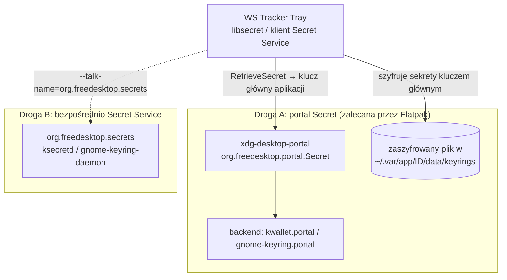

# Przechowywanie tokenu API

> [!info] W skrócie
> Token Kimai daje pełny dostęp do czasu pracy użytkownika, więc **nie może** leżeć
> w pliku konfiguracyjnym. Trzymamy go w magazynie sekretów systemu: KWallet (KDE)
> lub GNOME Keyring (GNOME), przez standard **Secret Service** albo **portal Secret**.

## Wybrana droga

> [!success] Decyzja: droga B — bezpośrednio Secret Service
> Moduł na [jeepney](jeepney.md), sesja `plain`, kolekcja `default`, uprawnienie
> `--talk-name=org.freedesktop.secrets`. Uzasadnienie:
> [ADR-0004](../decyzje/0004-architektura-rdzen-python-ui-qt.md). Droga A (portal)
> zostaje opcją na przyszłość, bo moduł sekretów jest za interfejsem.

## Dwie drogi z piaskownicy Flatpaka



| | A: portal Secret | B: Secret Service bezpośrednio |
| --- | --- | --- |
| Uprawnienia Flatpaka | brak dodatkowych | `--talk-name=org.freedesktop.secrets` |
| Izolacja | sekret per aplikacja | aplikacja widzi (potencjalnie) cały magazyn użytkownika |
| Widoczność w KWallet/Seahorse | tylko klucz główny aplikacji | wpis „WS Tracker Tray” widoczny i usuwalny przez użytkownika |
| Działanie poza Flatpakiem (dev) | libsecret wtedy używa Secret Service bezpośrednio | tak |

**Portal Secret**
([dokumentacja](https://flatpak.github.io/xdg-desktop-portal/docs/doc-org.freedesktop.portal.Secret.html)):
metoda `RetrieveSecret` zwraca przez deskryptor pliku **klucz główny unikalny dla
aplikacji**, niezmienny dopóki aplikacja jest zainstalowana; typowo trzymany w keyringu
użytkownika pod ID aplikacji. Klucz może być za krótki dla niektórych algorytmów —
wtedy stosuje się KDF. **libsecret** w piaskownicy korzysta z tego automatycznie
(„file backend”).

## Stan na maszynie deweloperskiej (zweryfikowane 2026-09-25)

Fedora 44, **KDE Plasma 6.7.5, Wayland**:

```text
/usr/share/xdg-desktop-portal/portals/
  gnome-keyring.portal   Secret  (UseIn=gnome)
  kwallet.portal         Secret  (UseIn=kde)  → org.freedesktop.impl.portal.desktop.kwallet
kde-portals.conf:  org.freedesktop.impl.portal.Secret=kwallet
szyna sesji:       org.freedesktop.secrets  → ksecretd
                   org.kde.kwalletd6        → kwalletd6
```

Czyli na Plasmie 6 **obie drogi są dostępne**: backend portalu Secret dostarcza
KWallet (`ksecretd`), a Secret Service również obsługuje `ksecretd`.

> [!warning] Starsze KDE
> Materiały z sieci (np. [issue #970 xdg-desktop-portal](https://github.com/flatpak/xdg-desktop-portal/issues/970),
> [dyskusja KDE](https://discuss.kde.org/t/kwallet-secrets-portal-cant-get-secret-for-flatpak/15566))
> opisują, że portal Secret był długo tylko dla GNOME, a na KDE Flatpaki nie mogły
> zapisać sekretów. KWallet obsługuje API `org.freedesktop.secrets` od **KF 5.97**.
> Na starszych Plasmach 5 może być potrzebna droga B albo tryb awaryjny.

## Zachowanie aplikacji

- Zapis tokenu tylko po jawnym „Zapisz” w ustawieniach.
- Brak dostępnego magazynu → komunikat i **żadnego** cichego zapisu do pliku tekstowego.
  Trybu „token tylko w pamięci do końca sesji” w 1.0 **nie ma** (decyzja użytkownika 2026-09-25,
  [0028](../../TODO/ZROBIONE/0028-plan3-projekt-ui/todo.md)).
- Zmiana URL Kimai = token przypisany do nowego URL (atrybuty sekretu: `application=pl.websystems.WsTrackerTray`, `url`
  bez
  końcowego `/`).
- Błędy (`SecretServiceStore`): brak usługi, odmowa z piaskownicy, usługa, która nie wystartowała (`Spawn.*`),
  brak odpowiedzi (timeout) lub zerwane połączenie → `SecretsUnavailable`; odrzucone okno odblokowania →
  `SecretsLocked`.
- Po restarcie usługi (ksecretd / gnome-keyring) zapamiętana sesja znika (`NoSession` / `UnknownObject`) —
  sesja jest otwierana ponownie raz; drugi błąd → `SecretsUnavailable`.
- Brak domyślnego portfela (alias `default`) → `SecretsUnavailable`; aplikacja **nie** zakłada portfela sama,
  komunikat w UI podpowiada, jak go utworzyć (decyzja:
  [0027](../../TODO/ZROBIONE/0027-drobne-uwagi-z-recenzji-planu-2/todo.md)).
- Nigdy nie logujemy tokenu, nawet w trybie debug.

## Pułapki

> [!warning]
>
> - Portfel KWallet może być zamknięty — pierwszy odczyt może pokazać systemowe okno
>   z hasłem portfela. Aplikacja nie może blokować UI w tym czasie.
> - Po odinstalowaniu Flatpaka klucz główny portalu może zostać w keyringu.

## Gdzie w kodzie

- [src/ws_tracker_tray/desktop/secrets.py](../../src/ws_tracker_tray/desktop/secrets.py) — `SecretServiceStore`
  (get/set/delete,
  odblokowanie przez prompt).
- [src/ws_tracker_tray/desktop/bus.py](../../src/ws_tracker_tray/desktop/bus.py) — szyna D-Bus na jeepney.
- Testy: [tests/desktop/test_secrets.py](../../tests/desktop/test_secrets.py) (FakeBus).

## Dokumentacja

- [Secret Service API — specyfikacja](https://specifications.freedesktop.org/secret-service-spec/latest/)
- [Portal Secret (org.freedesktop.portal.Secret)](https://flatpak.github.io/xdg-desktop-portal/docs/doc-org.freedesktop.portal.Secret.html)
- [Backend portalu Secret (impl)](https://flatpak.github.io/xdg-desktop-portal/docs/doc-org.freedesktop.impl.portal.Secret.html)
- [libsecret](https://wiki.gnome.org/Projects/Libsecret)
- [KDE Wallet — ArchWiki](https://wiki.archlinux.org/title/KDE_Wallet)

## Powiązane

- [Flatpak](flatpak.md)
- [Portale XDG](xdg-portale.md)
- [F-01](../architektura/funkcje.md)
