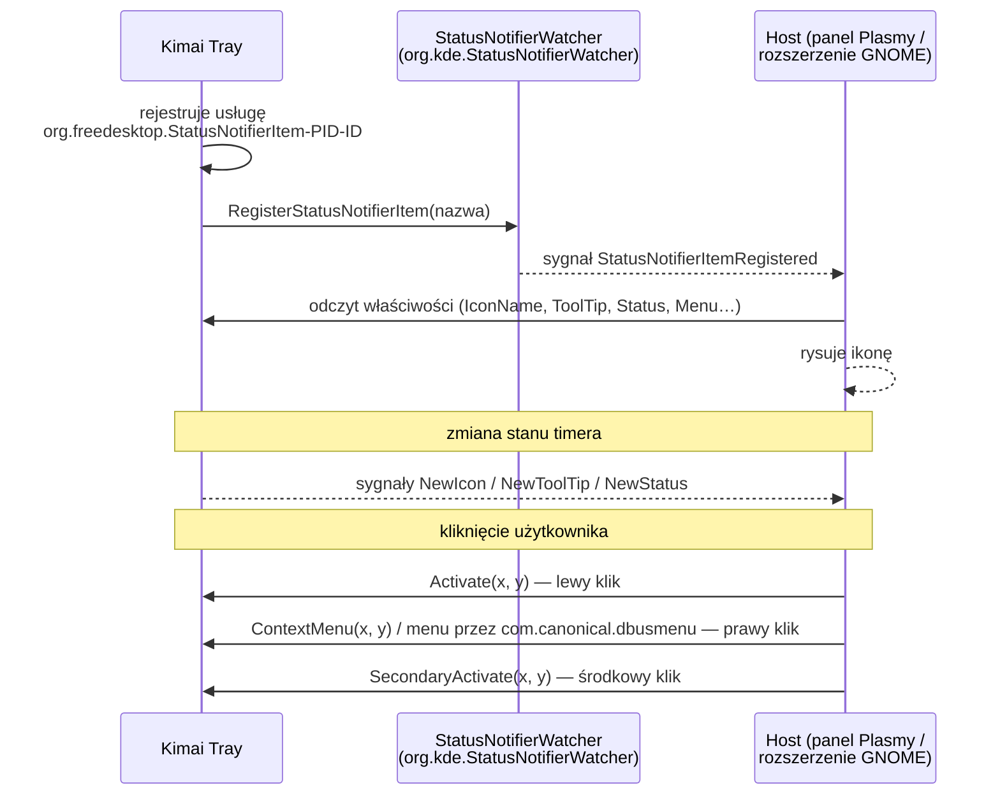

# StatusNotifierItem (SNI) — ikona w tacce

> [!info] W skrócie
> Standard freedesktop.org (pochodzi z KDE), w którym ikona tacki to **obiekt D-Bus**
> wystawiany przez aplikację, a panel pulpitu (host) sam ją rysuje. Na Waylandzie to
> jedyny praktyczny sposób na ikonę w tacce — stary XEmbed działa tylko pod X11.

## Jak to działa



## Właściwości istotne dla nas

| Właściwość | Wartość u nas |
|---|---|
| `Category` | `ApplicationStatus` |
| `Id`, `Title` | identyfikator aplikacji / „Kimai Tray” |
| `Status` | `Active` gdy timer trwa; `Passive` gdy bezczynny (host **może ukryć** ikonę Passive — Plasma chowa ją do „ukrytych”, dlatego raczej zawsze `Active`); `NeedsAttention` — błąd lub bardzo długi timer |
| `IconName` / `IconPixmap` | ikona stanu: bezczynny / trwa / błąd (odpowiednik kolorów badge wtyczki) |
| `OverlayIconName` | alternatywnie: nakładka stanu na stałą ikonę |
| `ToolTip` | tytuł + opis (podzbiór HTML): np. „1:22 — Moduł rezerwacji online”, opis wpisu, suma dnia |
| `ItemIsMenu` | `false` — lewy klik otwiera okno, prawy menu |
| `Menu` | ścieżka D-Bus obiektu `com.canonical.dbusmenu` (menu kontekstowe) |

## Uprawnienia Flatpaka

Z [dokumentacji Flatpaka](https://docs.flatpak.org/en/latest/desktop-integration.html):
ikony SNI **nie działają bez dodatkowych uprawnień**, bo wymagają rozmowy z usługą hosta
poza piaskownicą.

```yaml
finish-args:
  - --talk-name=org.kde.StatusNotifierWatcher
```

> [!warning] `--own-name=org.kde.*`
> Część starszych bibliotek wymagała też `--own-name=org.kde.*`, co pozwala podszywać się
> pod usługi KDE. Dokumentacja Flatpaka podaje, że aktualne Electron (≥ 23.3.0),
> Chromium, KNotifications i libappindicator **nie potrzebują** tego uprawnienia.
> Wybrana biblioteka musi to spełniać — do sprawdzenia w prototypie.

## Pułapki i ograniczenia

> [!warning] Brak pozycji kliknięcia na Waylandzie
> `Activate(x, y)` przekazuje współrzędne, ale na Waylandzie aplikacja i tak **nie może
> ustawić okna** w tym miejscu. Okno „popupu” trzeba zaprojektować tak, by miało sens
> w dowolnym miejscu ekranu (albo polegać tylko na menu, które rysuje host).

- Brak natywnego „badge z liczbą” jak w Chrome — czas pokazujemy w tooltipie, ikonie
  generowanej z tekstem albo etykiecie (tylko niektóre hosty, np. AppIndicator w GNOME).
- Tooltip w KDE pojawia się po najechaniu; w GNOME z rozszerzeniem AppIndicator tooltipy
  bywają niewyświetlane — nie może to być jedyne źródło informacji.
- Host może zrestartować się (np. restart plasmashell) — aplikacja musi ponownie się
  zarejestrować, gdy `StatusNotifierWatcher` pojawi się znów na szynie.
- Brak hosta (czysty GNOME) → ikona niewidoczna; wtedy potrzebny tryb okna
  ([GNOME AppIndicator](gnome-appindicator.md)).

## Obsługa w bibliotekach (kandydaci — do ADR stosu)

| Biblioteka | SNI | Uwagi |
|---|---|---|
| Qt `QSystemTrayIcon` | tak, na Linuksie przez SNI (fallback XEmbed) | natywnie w KDE; przez D-Bus działa też w GNOME z rozszerzeniem |
| KDE `KStatusNotifierItem` (osobny framework w KF6) | tak, implementacja referencyjna | pełne API SNI (overlay, status, tooltip) |
| libayatana-appindicator | tak | używane przez GTK/Tauri; ograniczone API (brak zdarzenia lewego kliku w części wersji) |
| Czysty D-Bus (np. zbus, dbus-next, QtDBus) | tak | pełna kontrola, więcej kodu |

> [!todo] Tabelę zweryfikować przez Context7/dokumentację w zadaniu wyboru stosu.

## Dokumentacja

- [Specyfikacja StatusNotifierItem (freedesktop)](https://www.freedesktop.org/wiki/Specifications/StatusNotifierItem/)
- [StatusNotifierItem — właściwości, metody, sygnały](https://www.freedesktop.org/wiki/Specifications/StatusNotifierItem/StatusNotifierItem/)
- [StatusNotifierWatcher](https://www.freedesktop.org/wiki/Specifications/StatusNotifierItem/StatusNotifierWatcher/)
- [Flatpak — integracja z pulpitem (status icons)](https://docs.flatpak.org/en/latest/desktop-integration.html)
- [KStatusNotifierItem — framework KF6 (API)](https://api.kde.org/kstatusnotifieritem.html) · [kod źródłowy](https://invent.kde.org/frameworks/kstatusnotifieritem)
- [QSystemTrayIcon (Qt 6)](https://doc.qt.io/qt-6/qsystemtrayicon.html)

## Powiązane

- [GNOME — rozszerzenie AppIndicator](gnome-appindicator.md)
- [Flatpak](flatpak.md)
- [F-02 Ikona w tacce](../architektura/funkcje.md)
