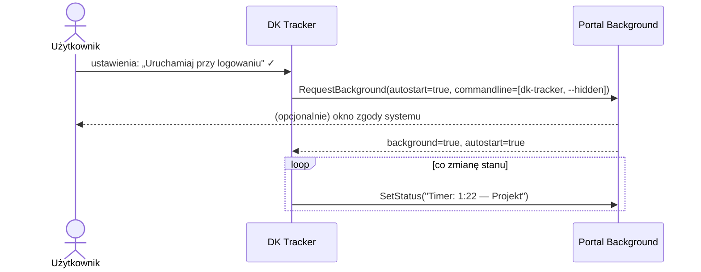

# Portale XDG Desktop

> [!info] W skrócie
> Portale to API D-Bus (`org.freedesktop.portal.*`), przez które aplikacja w piaskownicy
> prosi system o usługi. System (backend KDE/GNOME) może zapytać użytkownika o zgodę.
> Nie wymagają `finish-args`.

## Portale, których potrzebujemy

| Portal | Po co | Funkcja | Priorytet |
| --- | --- | --- | --- |
| **Background** | autostart z sesją, zgoda na działanie w tle, status w tle | F-22 | wysoki — timer i przypomnienia działają od zalogowania |
| **Notification** | powiadomienia (długi timer, błąd połączenia) | F-21 | średni |
| **OpenURI** | otwarcie „Moje czasy” / tokenów API w przeglądarce | F-08 | wysoki |
| **Secret** | klucz główny do szyfrowania tokenu | F-01 | wysoki — [osobny dokument](secret-service.md) |
| **GlobalShortcuts** | globalny skrót start/stop | F-24 | niski |
| **Inhibit** | (opcjonalnie) informacja o wylogowaniu/wyłączeniu przy trwającym timerze | — | niski |

## Background — autostart

([dokumentacja, wersja 2](https://flatpak.github.io/xdg-desktop-portal/docs/doc-org.freedesktop.portal.Background.html))

- `RequestBackground(parent_window, options)`:
  - `autostart` (b) — uruchamiaj przy logowaniu,
  - `commandline` (as) — komenda autostartu (domyślnie `Exec` z pliku `.desktop`),
  - `dbus-activatable` (b) — aktywacja przez D-Bus zamiast komendy.
  - Wynik: czy działanie w tle jest dozwolone i czy autostart włączono.
- `SetStatus(message)` (od v2) — krótki (≤ 96 znaków) status aplikacji w tle, np.
  „Timer: 1:22 — Moduł rezerwacji”. KDE/GNOME pokazują go w listach aplikacji w tle.



> [!tip] Start „do tacki”
> Autostart powinien uruchamiać aplikację z flagą w rodzaju `--hidden` (bez okna),
> ale **tylko gdy jest host tacki** — inaczej pokazać okno
> ([GNOME bez tacki](gnome-appindicator.md)).

## Notification

([dokumentacja](https://flatpak.github.io/xdg-desktop-portal/docs/doc-org.freedesktop.portal.Notification.html))

- `AddNotification(id, notification)` / `RemoveNotification(id)`; powiadomienie może mieć
  przyciski akcji (np. „Zatrzymaj timer”), które wracają do aplikacji jako akcje.
- Na maszynie deweloperskiej backend: `plasmanotify` (`kde-portals.conf`).
- Toolkity (Qt/GTK) często używają portalu automatycznie w piaskownicy.
- Kliknięcie wraca jako sygnał `ActionInvoked(id, action, parameter)`. Portal rozgłasza go **bez adresata**
  ([`action_invoked_cb`](https://github.com/flatpak/xdg-desktop-portal/blob/main/desktop-portal/notification.c)
  woła `xdp_dbus_notification_emit_action_invoked`, sprawdzone 2026-09-25 21:30). Dlatego nasłuch może działać na
  **osobnym połączeniu** w wątku roboczym, innym niż to, którym wysyłamy powiadomienia. Konsekwencja: sygnał słyszy
  każdy proces sesji. Nasze identyfikatory mają przedrostek (`long-timer-<id>`), a obce są ignorowane
  (`entry_id=None`). Na żywo sprawdzimy to w Planie 3.

## OpenURI

([dokumentacja](https://flatpak.github.io/xdg-desktop-portal/docs/doc-org.freedesktop.portal.OpenURI.html))
— `OpenURI(parent, uri, options)` otwiera link w domyślnej przeglądarce użytkownika.

## GlobalShortcuts

([dokumentacja, wersja 2](https://flatpak.github.io/xdg-desktop-portal/docs/doc-org.freedesktop.portal.GlobalShortcuts.html))
— skróty działają oparte o sesję: `CreateSession` → `BindShortcuts` (system zwykle
pokazuje okno konfiguracji skrótu) → sygnały `Activated`/`Deactivated`.

## Stan backendów na maszynie deweloperskiej (2026-09-25)

```text
kde-portals.conf:
  default=kde
  org.freedesktop.impl.portal.Secret=kwallet
  org.freedesktop.impl.portal.Notification=plasmanotify
```

## Pułapki

> [!warning]
>
> - Obsługa danego portalu zależy od backendu pulpitu i jego wersji — każdą funkcję
>   opartą o portal trzeba mieć z łagodną degradacją (brak portalu → funkcja wyłączona,
>   bez awarii).
> - Autostart spoza piaskownicy (uruchomienie z `cargo run`/`python` w dev) nie przechodzi
>   przez portal tak samo — testować w zbudowanym Flatpaku.

<!-- osobne callouty -->

> [!warning] Powiadomienie o tym samym identyfikatorze nie pokaże się drugi raz (KDE)
> Backend portalu w Plasmie 6.7.5 traktuje znany mu identyfikator jako aktualizację powiadomienia; jeśli
> poprzednie już zniknęło z ekranu, nic się nie wyświetla (sprawdzone 2026-09-26 00:13: `action` → nic, unikalne id →
> jest).
> Dlatego [`PortalNotifier`](../../src/dk_tracker/desktop/notifications.py) nadaje każdemu powiadomieniu nowy
> identyfikator (`action.1790374275`) i najpierw wycofuje poprzednie tego samego rodzaju.

<!-- osobne callouty -->

> [!note] Aplikacja uruchomiona poza Flatpakiem
> Portal rozpoznaje aplikację po grupie systemd. Uruchomiona z terminala edytora dostaje jego nazwę
> (np. powiadomienia „od VS Code”). Wywołanie `org.freedesktop.host.portal.Registry.Register` z identyfikatorem
> `io.github.dragonking026.DK-Tracker-Linux` jako pierwsze na połączeniu to naprawia (xdg-desktop-portal ≥ 1.19; na
> Fedorze 44:
> 1.22.1).
>
## Gdzie w kodzie

- [src/dk_tracker/desktop/notifications.py](../../src/dk_tracker/desktop/notifications.py) — `PortalNotifier`
  (AddNotification, RemoveNotification, ActionInvoked).
- [src/dk_tracker/desktop/autostart.py](../../src/dk_tracker/desktop/autostart.py) — `BackgroundPortal`
  (RequestBackground, SetStatus).
- [src/dk_tracker/desktop/bus.py](../../src/dk_tracker/desktop/bus.py) — `portal_request` (Request/Response).

## Dokumentacja

- [XDG Desktop Portal — dokumentacja](https://flatpak.github.io/xdg-desktop-portal/docs/)
- [Flatpak — portale](https://docs.flatpak.org/en/latest/portals.html)
- Linki do poszczególnych portali — w sekcjach powyżej.

## Powiązane

- [Flatpak](flatpak.md)
- [Sekrety](secret-service.md)
- [Katalog funkcji F-20…F-24](../architektura/funkcje.md)
