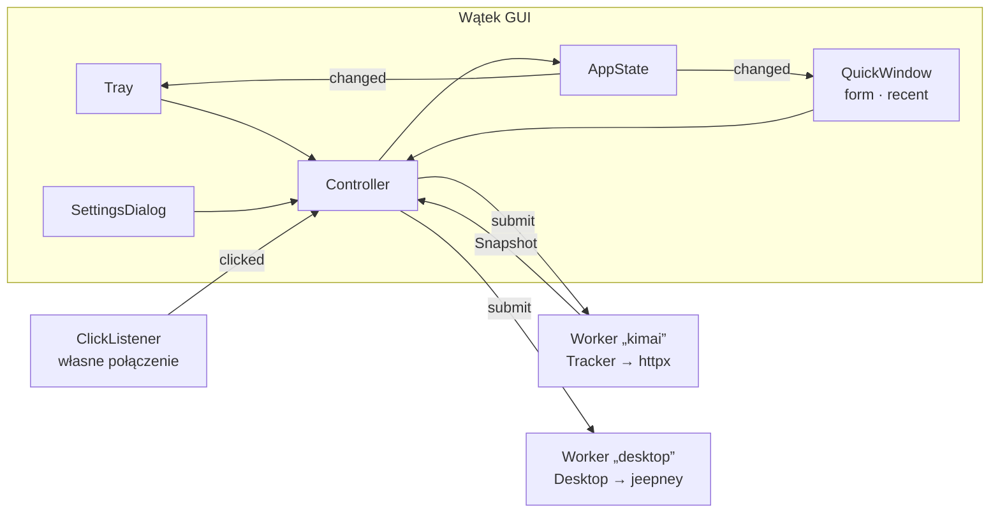

# Plan 3: Interfejs Qt (ui) — plan implementacji

> **For agentic workers:** REQUIRED SUB-SKILL: Use superpowers:subagent-driven-development (recommended) or
> superpowers:executing-plans to implement this plan task-by-task. Steps use checkbox (`- [ ]`) syntax for tracking.

**Goal:** Zbudować warstwę `kimai_tray.ui`: ikonę w tacce z czasem (F-02), okno szybkiej obsługi przy tacce (F-03 …
F-12), ustawienia (F-01, F-13, F-21, F-22), powiadomienia z przyciskami i autostart — gotową aplikację uruchamianą
`python -m kimai_tray [--hidden]`.

**Architecture:** Qt Widgets (PySide6) tylko w `ui/`. Kontroler (`ui/app.py`) trzyma `AppState` (ostatni Snapshot +
ustawienia + język) i uruchamia tracker w wątku „kimai”, a D-Bus (portfel, powiadomienia, autostart) w wątku „desktop”
(`ui/worker.py`, po jednym zadaniu naraz). Widżety tylko czytają stan i emitują prośby. Tekst i formaty liczy czysty
moduł rdzenia `core/presentation.py`. Okno przy tacce na KDE przez `layer-shell-qt` tylko dla tego jednego okna
(`ui/placement.py`); ustawienia to zwykłe okno.

**Tech Stack:** Python ≥ 3.13, PySide6 6.11 (QtWidgets, QtSvg, QtNetwork), pytest-qt (`QT_QPA_PLATFORM=offscreen`),
rdzeń i `desktop/` z Planów 1–2.

**Spec:** [docs/specyfikacja/2026-09-25-kimai-tray-1.0.md](../specyfikacja/2026-09-25-kimai-tray-1.0.md) (sekcje 4–12),
wzorzec [kimai-ws-tracker](../integracje/kimai-ws-tracker.md) (wygląd, palety),
[katalog funkcji](../architektura/funkcje.md), decyzje [ADR-0004](../decyzje/0004-architektura-rdzen-python-ui-qt.md),
[ADR-0005](../decyzje/0005-okno-przy-tacce-na-kde.md) oraz decyzje użytkownika z
[zadania 0028](../../TODO/ZROBIONE/0028-plan3-projekt-ui/todo.md).

## Global Constraints

- Pracujemy bezpośrednio na `main`, małe commity po polsku z linią `Co-Authored-By`; bez pusha.
- `PySide6` importuje wyłącznie `src/kimai_tray/ui/`; `core/` i `desktop/` nigdy nie importują `kimai_tray.ui` (test
  architektury).
- PySide6 **nie** jest twardą zależnością (we Flatpaku daje go `io.qt.PySide.BaseApp`): extra
  `ui = ["PySide6>=6.11,<6.12"]`, testy przez `pytest-qt>=4.4`.
- Każdy tekst dla użytkownika przez `t(klucz)`; PL i EN z identycznymi kluczami i parametrami.
- Motyw według systemu (`QStyleHints.colorScheme()`), palety **1:1** z `popup.css` wtyczki (jasna i ciemna).
- Ikona w tacce — wariant **C**: szary zegar gdy nic nie trwa, `47m` / `1:22` na zielonym `#16a34a`, `!` na czerwonym
  `#dc2626`; pełna informacja w tooltipie.
- Lewy klik ikony → okno; prawy → menu; **środkowy → nic** (decyzja użytkownika).
- Brak domyślnego portfela / zablokowany portfel → komunikat (`secretsUnavailable` / `secretsLocked`), bez zakładania
  portfela i bez trybu tokenu w pamięci.
- Okno przy tacce: `LayerShellQt::Window::get()` **tylko na oknie szybkiej obsługi**, bez
  `QT_WAYLAND_SHELL_INTEGRATION`; poza KDE — okno bez ramki; bez tacki — zwykłe okno.
- Token nigdy w logach, wyjątkach ani widżetach (pole tokenu zawsze puste; pusty = zostaw zapisany).
- Tracker i połączenie D-Bus używane tylko z jednego wątku każde (`Worker` = jeden wątek).
- Przed commitem: `.venv/bin/ruff format . && .venv/bin/ruff check . && .venv/bin/pytest`.

## Review Focus

1. **Kimai nieosiągalny przy otwartym oknie** — czerwony pasek z opisem, `!` w ikonie, bez wyjątku w wątku GUI. Test:
   zadanie 8 (`test_refresh_error_is_shown_in_the_window`), zadanie 2 (`test_error_wins_over_a_running_entry`).
2. **Portfel zablokowany / niedostępny przy starcie** — aplikacja startuje nieskonfigurowana z wyjaśnieniem. Test:
   zadanie 11 (`test_locked_wallet_is_reported`).
3. **„Zatrzymaj” w starym powiadomieniu**, gdy trwa już inny wpis — ignorowane. Test: zadanie 11
   (`test_stop_clicked_in_a_notification_stops_that_entry`).
4. **Odświeżenie w trakcie pisania opisu** — wpisany tekst zostaje. Test: zadanie 6
   (`test_refresh_keeps_what_the_user_is_typing`, `test_idle_render_keeps_a_typed_description`).
5. **Brak tacki (GNOME bez rozszerzenia)** — zwykłe okno od razu i podpowiedź raz na pierwszą sesję. Test: zadanie 8
   (`test_window_mode`), zadanie 11 (`test_without_a_tray_the_window_explains_it_for_this_session_only`).

> [!note] Uruchamianie na żywo a testy
> `layer-shell-qt` z systemu wymaga Qt systemu (prywatne API `Qt_6.11_PRIVATE_API`), a PySide6 z pip
> ma własne Qt — wtedy `placement.layer_available()` zwraca `False` i okno jest bez ramki.
> Testy idą na PySide6 z pip (`.venv`), uruchomienie na KDE — systemowym Pythonem Fedory
> (`python3-pyside6`, `python3-httpx`, `python3-jeepney`): `PYTHONPATH=src python3 -m kimai_tray`.
> Sprawdzone na żywo 2026-09-25 22:57 z Kimai w Dockerze (lista kontrolna w zadaniu 13).

## Struktura plików

```text
pyproject.toml                                  zadania 1, 3   extra ui, pytest-qt, skrypt kimai-tray
src/kimai_tray/core/locales/{pl,en}.json      zadanie 1      teksty UI
src/kimai_tray/core/presentation.py             zadanie 2      TrayStatus, tooltip, nazwy dni, wiersze
src/kimai_tray/ui/theme.py, icons.py            zadanie 3      palety wtyczki, ikona tacki (C), glify SVG
src/kimai_tray/ui/worker.py                     zadanie 4      Worker (jeden wątek, odpowiedź w GUI)
src/kimai_tray/ui/state.py, tray.py             zadanie 5      AppState, Tray (ikona + menu)
src/kimai_tray/ui/form.py                       zadanie 6      TrackerForm (opis, start/stop, pickery, $)
src/kimai_tray/ui/recent.py                     zadanie 7      RecentList (dni, wiersze, $, ▶)
src/kimai_tray/ui/popup.py, placement.py        zadanie 8      QuickWindow, layer-shell / bez ramki / okno
src/kimai_tray/ui/settings_dialog.py            zadanie 9      SettingsDialog
src/kimai_tray/ui/desktop_bridge.py             zadanie 10     Desktop (D-Bus w wątku), ClickListener
src/kimai_tray/core/settings.py, tracker.py     zadanie 11     Memory.tray_hint_shown, Tracker.remember
src/kimai_tray/ui/app.py                        zadanie 11     Controller
src/kimai_tray/ui/main.py, __main__.py          zadanie 12     start, jedna instancja, logi, tłumaczenia Qt
tests/ui/…                                      zadania 1–12
```



---

### Task 1: Zależności UI, testy Qt i teksty interfejsu

**Files:**

- Modify: `pyproject.toml`
- Modify: `src/kimai_tray/core/locales/pl.json`, `src/kimai_tray/core/locales/en.json`
- Modify: `tests/core/test_i18n.py` (wzorzec kluczy), `tests/test_architektura.py`
- Create: `tests/ui/__init__.py`, `tests/ui/conftest.py`, `tests/ui/test_i18n_ui.py`

**Interfaces:**

- Consumes: `kimai_tray.core.i18n.Translator`, `load_messages`.
- Produces: klucze tekstów UI (lista w teście niżej); fixture `qtbot` / `qapp` z pytest-qt na platformie `offscreen`;
  komenda `kimai-tray` (działa od zadania 12).

- [ ] **Step 1: `pyproject.toml`** — w `[project.optional-dependencies]` i niżej:

```toml
[project.optional-dependencies]
dev = ["pytest>=8", "pytest-cov>=5", "ruff>=0.6", "pytest-qt>=4.4"]
# In Flatpak PySide6 comes from io.qt.PySide.BaseApp, so it is not a hard dependency.
ui = ["PySide6>=6.11,<6.12"]

[project.scripts]
kimai-tray = "kimai_tray.__main__:main"
```

W `[tool.pytest.ini_options]` pod `addopts` dopisz `qt_api = "pyside6"`.

Run: `.venv/bin/pip install -e ".[dev,ui]"` → instaluje PySide6 6.11 i pytest-qt.

- [ ] **Step 2: Napisz testy (padające)**

Utwórz pusty plik `tests/ui/__init__.py`.

`tests/ui/conftest.py`:

```python
"""UI tests run without a display: Qt's offscreen platform, set before QApplication exists."""

import os

os.environ.setdefault("QT_QPA_PLATFORM", "offscreen")
```

`tests/ui/test_i18n_ui.py`:

```python
from kimai_tray.core.i18n import Translator, load_messages

UI_KEYS = {
    "menuStop",
    "menuResumeLast",
    "menuOpen",
    "menuOpenKimai",
    "menuQuit",
    "tooltipIdle",
    "tooltipMoreRunning",
    "winClose",
    "hintNoTray",
    "secretsUnavailable",
    "secretsLocked",
    "optLongTimer",
    "optLongTimerHint",
    "optNotifyConnection",
    "optNotifyMenu",
    "optAutostart",
    "optAutostartReason",
    "optAutostartDenied",
    "optUrlRequired",
    "optTokenRequired",
    "optTesting",
    "optTokenKeep",
    "statusRunning",
    "weekdaysShort",
    "monthsShort",
    "dayOther",
}


def test_ui_texts_exist_in_both_languages():
    for language in ("pl", "en"):
        assert UI_KEYS <= set(load_messages(language)), language


def test_weekday_and_month_lists_have_the_right_length():
    for language in ("pl", "en"):
        t = Translator(language)
        assert len(t("weekdaysShort").split(",")) == 7
        assert len(t("monthsShort").split(",")) == 12
```

Na końcu `tests/test_architektura.py` dopisz strażnika (przechodzi od razu — pilnuje kolejnych zadań):

```python
@pytest.mark.parametrize("layer", ["core", "desktop"])
def test_lower_layers_never_import_the_ui(layer):
    offenders = []
    for path in sorted((SRC / layer).rglob("*.py")):
        tree = ast.parse(path.read_text(encoding="utf-8"))
        for node in ast.walk(tree):
            if isinstance(node, ast.ImportFrom):
                module = node.module or ""
                if module.startswith("kimai_tray.ui") or (node.level >= 2 and module.split(".")[0] == "ui"):
                    offenders.append(str(path.relative_to(SRC)))
    assert offenders == []
```

W `tests/core/test_i18n.py` zamień `KEY_LITERAL` na (nowe przedrostki kluczy UI też muszą istnieć w plikach tłumaczeń):

```python
KEY_LITERAL = re.compile(
    r"\"((?:err|warn|notif|action|opt|day|saved|billable|menu|tooltip|win|hint|secrets|status)[A-Z][A-Za-z]*)\""
)
```

- [ ] **Step 3: Uruchom — mają paść**

Run: `.venv/bin/pytest tests/ui/test_i18n_ui.py -q`
Expected: 2 FAIL (brak kluczy `menuStop` … w plikach tłumaczeń).

- [ ] **Step 4: Dopisz teksty** — na koniec obiektu w `pl.json`:

```json
{
  "menuStop": "Zatrzymaj timer",
  "menuResumeLast": "Wznów ostatni wpis",
  "menuOpen": "Otwórz okno",
  "menuOpenKimai": "Otwórz Kimai w przeglądarce",
  "menuQuit": "Zakończ",
  "tooltipIdle": "Nic nie jest mierzone",
  "tooltipMoreRunning": "i jeszcze trwające: {count}",
  "winClose": "Zamknij okno (Esc)",
  "hintNoTray": "Nie znaleziono tacki systemowej, więc Kimai Tray działa jako zwykłe okno. Na GNOME zainstaluj rozszerzenie „AppIndicator and KStatusNotifierItem Support”, żeby mieć ikonę w tacce.",
  "secretsUnavailable": "Magazyn haseł systemu jest niedostępny, więc token nie może zostać zapisany. Utwórz portfel w Menedżerze portfeli KDE albo w aplikacji „Hasła i klucze” (GNOME).",
  "secretsLocked": "Portfel z hasłami jest zablokowany. Odblokuj go, żeby Kimai Tray mógł odczytać token.",
  "optLongTimer": "Przypomnij o długim timerze po (godzinach)",
  "optLongTimerHint": "0 wyłącza przypomnienie.",
  "optNotifyConnection": "Powiadamiaj o problemach z połączeniem",
  "optNotifyMenu": "Potwierdzaj start i stop z menu ikony",
  "optAutostart": "Uruchamiaj razem z systemem",
  "optAutostartReason": "Kimai Tray pokazuje w tacce, czy mierzysz czas.",
  "optAutostartDenied": "System nie zezwolił na autostart.",
  "optUrlRequired": "Podaj adres Kimai.",
  "optTokenRequired": "Podaj token API.",
  "optTesting": "Sprawdzam…",
  "optTokenKeep": "Token jest zapisany w portfelu. Zostaw puste, żeby go nie zmieniać.",
  "optClose": "Zamknij",
  "statusRunning": "Timer {time} — {project}",
  "weekdaysShort": "pon.,wt.,śr.,czw.,pt.,sob.,niedz.",
  "monthsShort": "sty,lut,mar,kwi,maj,cze,lip,sie,wrz,paź,lis,gru",
  "dayOther": "{weekday}, {day} {month}"
}
```

i w `en.json`:

```json
{
  "menuStop": "Stop timer",
  "menuResumeLast": "Resume last entry",
  "menuOpen": "Open window",
  "menuOpenKimai": "Open Kimai in the browser",
  "menuQuit": "Quit",
  "tooltipIdle": "Nothing is being tracked",
  "tooltipMoreRunning": "and {count} more running",
  "winClose": "Close window (Esc)",
  "hintNoTray": "No system tray was found, so Kimai Tray runs as a regular window. On GNOME, install the “AppIndicator and KStatusNotifierItem Support” extension to get a tray icon.",
  "secretsUnavailable": "The system password store is unavailable, so the token cannot be saved. Create a wallet in KDE Wallet Manager or in “Passwords and Keys” (GNOME).",
  "secretsLocked": "The password wallet is locked. Unlock it so Kimai Tray can read the token.",
  "optLongTimer": "Remind about a long timer after (hours)",
  "optLongTimerHint": "0 turns the reminder off.",
  "optNotifyConnection": "Notify about connection problems",
  "optNotifyMenu": "Confirm start and stop from the icon menu",
  "optAutostart": "Start with the system",
  "optAutostartReason": "Kimai Tray shows in the tray whether you are tracking time.",
  "optAutostartDenied": "The system did not allow autostart.",
  "optUrlRequired": "Enter the Kimai address.",
  "optTokenRequired": "Enter the API token.",
  "optTesting": "Checking…",
  "optTokenKeep": "A token is saved in the wallet. Leave this empty to keep it.",
  "optClose": "Close",
  "statusRunning": "Timer {time} — {project}",
  "weekdaysShort": "Mon,Tue,Wed,Thu,Fri,Sat,Sun",
  "monthsShort": "Jan,Feb,Mar,Apr,May,Jun,Jul,Aug,Sep,Oct,Nov,Dec",
  "dayOther": "{weekday}, {day} {month}"
}
```

- [ ] **Step 5: Uruchom — mają przejść**

Run: `.venv/bin/pytest -q`
Expected: 227 passed (223 + 2 testy tekstów + 2 strażniki architektury), `ruff` bez uwag.

- [ ] **Step 6: Commit**

```bash
.venv/bin/ruff format . && .venv/bin/ruff check . && .venv/bin/pytest
git add pyproject.toml src/kimai_tray/core/locales tests/ui tests/core/test_i18n.py tests/test_architektura.py
git commit -m "build(ui): PySide6 jako extra, pytest-qt i teksty interfejsu PL/EN" -m "Co-Authored-By: Claude Opus 5.5 (1M context) <noreply@anthropic.com>"
```

---

### Task 2: Teksty tacki i listy w rdzeniu (`core/presentation.py`)

**Files:**

- Create: `src/kimai_tray/core/presentation.py`
- Test: `tests/core/test_presentation.py`

**Interfaces:**

- Consumes: `Snapshot`, `Entry`, `describe`, `timefmt` (Plan 1); klucze z zadania 1.
- Produces: `TrayStatus(kind: "unconfigured"|"idle"|"running"|"error", label: str, tooltip: str)`;
  `tray_status(snapshot, configured: bool, now: datetime, t) -> TrayStatus`;
  `display_zone(snapshot, local_now: datetime) -> tzinfo`; `day_label(day: date, today: date, t) -> str`;
  `RowText(description, empty, meta, duration, span)`; `entry_row(entry, tz, t) -> RowText`.

- [ ] **Step 1: Napisz testy (padające)**

`tests/core/test_presentation.py`:

```python
from dataclasses import replace
from datetime import UTC, date, datetime, timedelta
from zoneinfo import ZoneInfo

from kimai_tray.core.errors import ApiError, ErrorKind
from kimai_tray.core.i18n import Translator
from kimai_tray.core.presentation import day_label, display_zone, entry_row, tray_status
from kimai_tray.core.tracker import Snapshot, Totals

from .fakes import NOW, FakeClient, make_entry

WARSAW = ZoneInfo("Europe/Warsaw")
PL = Translator("pl")
USER = FakeClient().user


def running(minutes, **kwargs):
    return make_entry(7, NOW - timedelta(minutes=minutes), **kwargs)


def test_unconfigured_has_no_label():
    status = tray_status(Snapshot(), False, NOW, PL)
    assert (status.kind, status.label) == ("unconfigured", "")
    assert status.tooltip == "Kimai Tray\nAplikacja nie jest jeszcze skonfigurowana."


def test_idle_shows_today_total_in_the_tooltip():
    status = tray_status(Snapshot(user=USER, totals=Totals(today=27120, week=0)), True, NOW, PL)
    assert (status.kind, status.label) == ("idle", "")
    assert status.tooltip == "Kimai Tray\nNic nie jest mierzone\nDziś 7:32"


def test_running_label_switches_format_at_an_hour():
    assert tray_status(Snapshot(user=USER, running=(running(47),)), True, NOW, PL).label == "47m"
    status = tray_status(Snapshot(user=USER, running=(running(82),)), True, NOW, PL)
    assert (status.kind, status.label) == ("running", "1:22")
    assert status.tooltip == "Kimai Tray — 1:22:00\nModuł rezerwacji — Formularz rezerwacji pokoi"


def test_running_without_description_or_project():
    entry = replace(running(5, description=""), project_name=None)
    assert tray_status(Snapshot(user=USER, running=(entry,)), True, NOW, PL).tooltip.endswith("\n(bez opisu)")


def test_several_running_entries_are_counted():
    entries = (running(10), make_entry(8, NOW - timedelta(minutes=90)))
    tooltip = tray_status(Snapshot(user=USER, running=entries), True, NOW, PL).tooltip
    assert tooltip.endswith("\ni jeszcze trwające: 1")


def test_error_wins_over_a_running_entry():
    error = ApiError(ErrorKind.CONNECTION, 0, "down")
    status = tray_status(Snapshot(user=USER, running=(running(5),), error=error), True, NOW, PL)
    assert (status.kind, status.label) == ("error", "!")
    assert status.tooltip == "Kimai Tray\nBrak połączenia z Kimai."


def test_display_zone_prefers_the_kimai_account():
    assert display_zone(Snapshot(user=USER), datetime.now(UTC)) == WARSAW
    assert display_zone(Snapshot(), datetime(2026, 1, 1, tzinfo=UTC)) == UTC


def test_day_labels():
    today = date(2026, 9, 25)  # Friday
    assert day_label(today, today, PL) == "Dziś"
    assert day_label(date(2026, 9, 24), today, PL) == "Wczoraj"
    assert day_label(date(2026, 9, 22), today, PL) == "wt., 22 wrz"
    assert day_label(date(2026, 9, 22), today, Translator("en")) == "Tue, 22 Sep"


def test_entry_row_texts():
    entry = make_entry(
        5,
        datetime(2026, 9, 25, 13, 15, tzinfo=UTC),
        datetime(2026, 9, 25, 15, 5, tzinfo=UTC),
        description="Kalendarz\ndostępności",
    )
    row = entry_row(entry, WARSAW, PL)
    assert row.description == "Kalendarz dostępności"
    assert row.empty is False
    assert row.meta == "Moduł rezerwacji - Programowanie"
    assert (row.duration, row.span) == ("1:50", "15:15-17:05")


def test_entry_row_without_description():
    entry = make_entry(5, NOW - timedelta(hours=1), NOW, description="  ")
    row = entry_row(entry, WARSAW, PL)
    assert (row.description, row.empty) == ("(bez opisu)", True)
```

- [ ] **Step 2: Uruchom — mają paść**

Run: `.venv/bin/pytest tests/core/test_presentation.py -q`
Expected: błąd importu — `No module named 'kimai_tray.core.presentation'`.

- [ ] **Step 3: Zaimplementuj**

`src/kimai_tray/core/presentation.py`:

```python
"""What the tray icon and the window say, as plain text — computed here, without Qt,
so every wording and format is tested on its own (F-02, F-08, F-12)."""

from __future__ import annotations

from collections.abc import Callable
from dataclasses import dataclass
from datetime import UTC, date, datetime, timedelta, tzinfo
from typing import Literal

from .errors import describe
from .models import Entry
from .timefmt import badge_label, clock, elapsed_seconds, hhmm, short_duration, zone
from .tracker import Snapshot

Kind = Literal["unconfigured", "idle", "running", "error"]


@dataclass(frozen=True)
class TrayStatus:
    kind: Kind
    label: str  # drawn inside the icon: "47m", "1:22", "!" or nothing
    tooltip: str


@dataclass(frozen=True)
class RowText:
    description: str
    empty: bool  # "(no description)" is shown dimmed
    meta: str  # "project - activity"
    duration: str  # "1:50"
    span: str  # "15:15-17:05"


def display_zone(snapshot: Snapshot, local_now: datetime) -> tzinfo:
    """Times are shown in the Kimai account's zone — the one they are saved in."""
    user = snapshot.user
    return (zone(user.timezone) if user else None) or local_now.tzinfo or UTC


def tray_status(snapshot: Snapshot, configured: bool, now: datetime, t: Callable[..., str]) -> TrayStatus:
    title = t("appName")
    if not configured:
        return TrayStatus("unconfigured", "", f"{title}\n{t('notConfigured')}")
    if snapshot.error is not None:
        # As in the add-on: a failed poll is shown even while an entry runs.
        return TrayStatus("error", "!", f"{title}\n{describe(snapshot.error, t)}")
    current = snapshot.current
    if current is None:
        lines = [title, t("tooltipIdle")]
        if snapshot.totals is not None:
            lines.append(t("todayTotal", time=short_duration(snapshot.totals.today)))
        return TrayStatus("idle", "", "\n".join(lines))
    seconds = elapsed_seconds(current.begin, now)
    lines = [f"{title} — {clock(seconds)}", _what(current, t)]
    if len(snapshot.running) > 1:
        lines.append(t("tooltipMoreRunning", count=len(snapshot.running) - 1))
    return TrayStatus("running", badge_label(seconds), "\n".join(lines))


def day_label(day: date, today: date, t: Callable[..., str]) -> str:
    if day == today:
        return t("dayToday")
    if day == today - timedelta(days=1):
        return t("dayYesterday")
    weekdays = t("weekdaysShort").split(",")
    months = t("monthsShort").split(",")
    return t("dayOther", weekday=weekdays[day.weekday()], day=day.day, month=months[day.month - 1])


def entry_row(entry: Entry, tz: tzinfo, t: Callable[..., str]) -> RowText:
    text = " ".join(entry.description.split())
    names = [name for name in (entry.project_name, entry.activity_name) if name]
    span = hhmm(entry.begin, tz) + (f"-{hhmm(entry.end, tz)}" if entry.end else "")
    return RowText(
        description=text or t("noDescription"),
        empty=not text,
        meta=" - ".join(names),
        duration=short_duration(entry.duration),
        span=span,
    )


def _what(entry: Entry, t: Callable[..., str]) -> str:
    text = " ".join(entry.description.split()) or t("noDescription")
    return f"{entry.project_name} — {text}" if entry.project_name else text
```

- [ ] **Step 4: Uruchom — mają przejść**

Run: `.venv/bin/pytest tests/core/test_presentation.py -q && .venv/bin/pytest -q`
Expected: 10 PASS; całość 237 passed (rdzeń nadal bez PySide6 — test architektury).

- [ ] **Step 5: Commit**

```bash
.venv/bin/ruff format . && .venv/bin/ruff check . && .venv/bin/pytest
git add src/kimai_tray/core/presentation.py tests/core/test_presentation.py
git commit -m "feat(core): teksty ikony, tooltipa, dni i wierszy listy" -m "Co-Authored-By: Claude Opus 5.5 (1M context) <noreply@anthropic.com>"
```

---

### Task 3: Motyw i ikony (`ui/theme.py`, `ui/icons.py`)

**Files:**

- Create: `src/kimai_tray/ui/__init__.py`, `src/kimai_tray/ui/theme.py`, `src/kimai_tray/ui/icons.py`
- Modify: `pyproject.toml` (wyjątek E501 dla danych SVG/QSS)
- Test: `tests/ui/test_theme_icons.py`

**Interfaces:**

- Consumes: PySide6 (QtGui, QtSvg).
- Produces: `LIGHT`, `DARK` (klucze `bg, surface, surface2, fg, muted, line, accent, start, stop, ok_bg, ok_fg, err_bg,
  err_fg, focus`); `palette_for(scheme: Qt.ColorScheme, window: QColor) -> dict`; `stylesheet(palette) -> str` (nazwy
  obiektów: `popup, header, brand, totals, iconButton, description, clock, toggle[state], billable[on], times,
  timesLabel, hint, error, saved, warning, recentHead, recentPanel, recentDayName, recentDaySum, day, entry, entryDesc,
  entryDescEmpty, entryMeta, entrySpan, entryDuration, rowBillable, resume, recentList, empty, allEntries, primary,
  notConfigured`); `tray_pixmap(kind, label, size) -> QPixmap`; `tray_icon(kind, label) -> QIcon` (rozmiary 16–64);
  `GLYPHS`; `glyph(name, color, size=20) -> QIcon` dla `play, stop, gear, close, money, money_off, external`.

- [ ] **Step 1: Napisz testy (padające)**

`tests/ui/test_theme_icons.py`:

```python
import pytest
from PySide6.QtCore import Qt
from PySide6.QtGui import QColor

from kimai_tray.ui.icons import GLYPHS, glyph, tray_icon, tray_pixmap
from kimai_tray.ui.theme import DARK, LIGHT, palette_for, stylesheet


def test_palettes_match_the_add_on():
    assert (LIGHT["bg"], DARK["bg"]) == ("#ffffff", "#16181d")
    assert set(LIGHT) == set(DARK)
    assert LIGHT["start"] == DARK["start"] == "#16a34a"


def test_scheme_is_taken_from_qt_or_from_the_window_colour():
    assert palette_for(Qt.ColorScheme.Dark, QColor("#ffffff")) is DARK
    assert palette_for(Qt.ColorScheme.Light, QColor("#000000")) is LIGHT
    assert palette_for(Qt.ColorScheme.Unknown, QColor("#202326")) is DARK
    assert palette_for(Qt.ColorScheme.Unknown, QColor("#eff0f1")) is LIGHT


def test_stylesheet_uses_the_palette():
    css = stylesheet(DARK)
    assert "#16181d" in css and "#e02f2f" in css
    assert "#ffffff" not in stylesheet(DARK).replace("color: #ffffff", "")  # white only as text on buttons


def centre(image):
    return QColor(image.pixel(image.width() // 2, image.height() // 2))


def edge(image):
    return QColor(image.pixel(image.width() // 2, 2))


@pytest.mark.parametrize(
    ("kind", "label", "colour"), [("running", "1:22", "#16a34a"), ("error", "!", "#dc2626")]
)
def test_badge_background_has_the_state_colour(qapp, kind, label, colour):
    image = tray_pixmap(kind, label, 44).toImage()
    assert edge(image).name() == colour


def test_idle_and_unconfigured_draw_a_grey_clock(qapp):
    for kind in ("idle", "unconfigured"):
        assert edge(tray_pixmap(kind, "", 44).toImage()).name() == "#6b7280"


def test_label_changes_the_picture(qapp):
    assert tray_pixmap("running", "47m", 22).toImage() != tray_pixmap("running", "48m", 22).toImage()


def test_tray_icon_has_every_panel_size(qapp):
    sizes = {size.width() for size in tray_icon("running", "47m").availableSizes()}
    assert {16, 22, 24, 32, 44, 64} <= sizes


def test_glyphs_render_in_the_given_colour(qapp):
    for name in GLYPHS:
        assert not glyph(name, "#16a34a").isNull(), name
    image = glyph("stop", "#ffffff", 20).pixmap(20, 20).toImage()
    assert centre(image).name() == "#ffffff"
```

- [ ] **Step 2: Uruchom — mają paść**

Run: `.venv/bin/pytest tests/ui/test_theme_icons.py -q`
Expected: błąd importu — `No module named 'kimai_tray.ui'`.

- [ ] **Step 3: Zaimplementuj**

`src/kimai_tray/ui/__init__.py`:

```python
"""Qt Widgets user interface: tray icon, quick window, settings. The only layer that imports PySide6."""
```

`src/kimai_tray/ui/theme.py` — palety skopiowane z `popup/popup.css` (commit `86d4594`), patrz
[kimai-ws-tracker](../integracje/kimai-ws-tracker.md):

```python
"""Colours of the WS Tracker add-on (popup/popup.css), light and dark, following the system.

The add-on switches on `prefers-color-scheme`; here Qt reports the scheme (through the
desktop portal on KDE and GNOME) and the window colour decides when it cannot tell.
"""

from __future__ import annotations

from PySide6.QtCore import Qt
from PySide6.QtGui import QColor

LIGHT = {
    "bg": "#ffffff",
    "surface": "#f7f8fa",
    "surface2": "#eceef2",
    "fg": "#17181c",
    "muted": "#71757f",
    "line": "#e3e5ea",
    "accent": "#2563eb",
    "start": "#16a34a",
    "stop": "#e02f2f",
    "ok_bg": "#eaf7ee",
    "ok_fg": "#12703a",
    "err_bg": "#fdecec",
    "err_fg": "#a41d1d",
    "focus": "#2563eb",
}
DARK = {
    **LIGHT,
    "bg": "#16181d",
    "surface": "#1e2127",
    "surface2": "#272b33",
    "fg": "#eceef2",
    "muted": "#9aa0ac",
    "line": "#2f333c",
    "accent": "#6f9bff",
    "ok_bg": "#14301f",
    "ok_fg": "#6ee7a0",
    "err_bg": "#3a1a1a",
    "err_fg": "#ff9d9d",
    "focus": "#7aa2ff",
}
PROJECT_NONE = "line"  # palette key of the grey dot when no project is chosen


def palette_for(scheme: Qt.ColorScheme, window: QColor) -> dict[str, str]:
    if scheme == Qt.ColorScheme.Dark:
        return DARK
    if scheme == Qt.ColorScheme.Light:
        return LIGHT
    return DARK if window.lightness() < 128 else LIGHT


def stylesheet(p: dict[str, str]) -> str:
    """QSS for the quick window; widgets are addressed by objectName, as popup.css does by id."""
    return f"""
#popup {{ background: {p["bg"]}; color: {p["fg"]}; font-size: 14px; }}
#popup QLabel {{ color: {p["fg"]}; background: transparent; }}
#header {{ background: {p["surface"]}; border-bottom: 1px solid {p["line"]}; }}
#brand {{ font-size: 13px; font-weight: 600; }}
#brandDim {{ color: {p["muted"]}; font-size: 13px; }}
#popup QLabel#totals {{ color: {p["muted"]}; font-size: 12px; }}
#iconButton {{ border: 0; border-radius: 7px; background: transparent; padding: 6px; }}
#iconButton:hover {{ background: {p["surface2"]}; }}
#description {{ border: 1px solid {p["line"]}; border-radius: 8px; background: {p["surface"]};
    color: {p["fg"]}; font-size: 15px; padding: 6px 8px; }}
#description:focus, #popup QLineEdit:focus {{ border: 1px solid {p["focus"]}; }}
#clock {{ font-size: 12px; font-weight: 600; }}
#toggle {{ border: 0; border-radius: 21px; min-width: 42px; max-width: 42px; min-height: 42px; max-height: 42px; }}
#toggle[state="start"] {{ background: {p["start"]}; }}
#toggle[state="stop"] {{ background: {p["stop"]}; }}
#toggle:disabled {{ background: {p["surface2"]}; }}
#popup QComboBox {{ border: 1px solid {p["line"]}; border-radius: 8px; background: {p["surface"]};
    color: {p["fg"]}; min-height: 32px; padding: 0 9px; font-size: 13px; }}
#popup QComboBox:disabled {{ color: {p["muted"]}; background: {p["surface2"]}; border-style: dashed; }}
#popup QComboBox QAbstractItemView {{ background: {p["bg"]}; color: {p["fg"]};
    selection-background-color: {p["surface2"]}; selection-color: {p["fg"]}; }}
#billable {{ border: 1px solid {p["start"]}; border-radius: 8px; background: rgba(22, 163, 74, 26);
    min-width: 32px; max-width: 32px; min-height: 32px; max-height: 32px; }}
#billable[on="false"] {{ border-color: {p["line"]}; background: {p["surface"]}; }}
#billable:disabled {{ border-style: dashed; }}
#times {{ border: 1px solid {p["line"]}; border-radius: 8px; background: {p["surface"]}; }}
#timesLabel, #hint {{ color: {p["muted"]}; font-size: 11px; }}
#popup QLineEdit {{ border: 1px solid {p["line"]}; border-radius: 6px; background: {p["bg"]};
    color: {p["fg"]}; min-height: 28px; padding: 0 8px; font-size: 13px; }}
#popup QLabel#error {{ margin: 0 14px 12px 14px; background: {p["err_bg"]}; color: {p["err_fg"]}; border-radius: 8px; padding: 8px 10px; font-size: 12px; }}
#popup QLabel#saved {{ margin: 0 14px 12px 14px; background: {p["ok_bg"]}; color: {p["ok_fg"]}; border-radius: 8px; padding: 8px 10px; font-size: 12px; }}
#popup QLabel#warning {{ margin: 0 14px 12px 14px; background: {p["surface2"]}; color: {p["fg"]}; border-radius: 8px; padding: 8px 10px; font-size: 12px; }}
#recentHead, #popup QLabel#recentDayName, #popup QLabel#recentDaySum {{ color: {p["muted"]}; font-size: 10px; font-weight: 700; }}
#recentPanel {{ border-top: 1px solid {p["line"]}; }}
#day {{ background: {p["bg"]}; border-bottom: 1px solid {p["line"]}; }}
#entry {{ border-bottom: 1px solid {p["line"]}; }}
#entry:hover {{ background: {p["surface"]}; }}
#popup QLabel#entryDesc {{ font-size: 13px; }}
#popup QLabel#entryDescEmpty {{ font-size: 13px; color: {p["muted"]}; font-style: italic; }}
#popup QLabel#entryMeta, #popup QLabel#entrySpan {{ color: {p["muted"]}; font-size: 11px; }}
#popup QLabel#entryDuration {{ font-size: 13px; font-weight: 600; }}
#rowBillable {{ border: 0; border-radius: 11px; background: transparent; }}
#rowBillable:hover {{ background: {p["surface2"]}; }}
#resume {{ border: 0; border-radius: 13px; background: {p["surface2"]};
    min-width: 26px; max-width: 26px; min-height: 26px; max-height: 26px; }}
#resume:hover {{ background: {p["start"]}; }}
#recentList, #recentList > QWidget > QWidget {{ background: {p["bg"]}; border: 0; }}
#popup QLabel#empty {{ color: {p["muted"]}; font-size: 12px; }}
#allEntries {{ border: 0; border-top: 1px solid {p["line"]}; background: {p["surface"]}; color: {p["accent"]};
    font-size: 12px; font-weight: 600; text-align: left; padding: 10px 14px; }}
#allEntries:hover {{ text-decoration: underline; }}
#primary {{ border: 0; border-radius: 8px; background: {p["accent"]}; color: #ffffff;
    min-height: 40px; font-size: 14px; font-weight: 600; }}
#popup QLabel#notConfigured {{ color: {p["muted"]}; font-size: 13px; }}
"""
```

`src/kimai_tray/ui/icons.py` — ścieżki SVG z `popup.html`/`popup.js` wtyczki:

```python
"""Icons drawn at runtime: the tray icon (F-02, variant C chosen by the user) and the small
glyphs of the window, taken from the add-on's SVG markup so the look stays the same."""

from __future__ import annotations

from PySide6.QtCore import QByteArray, QPointF, QRectF, Qt
from PySide6.QtGui import QColor, QFont, QIcon, QPainter, QPen, QPixmap
from PySide6.QtSvg import QSvgRenderer

GREY, GREEN, RED = "#6b7280", "#16a34a", "#dc2626"  # background.js badge colours
TRAY_SIZES = (16, 22, 24, 32, 44, 48, 64)

_PATHS = {
    "play": '<path fill="currentColor" d="M8 5v14l11-7z"/>',
    "stop": '<rect fill="currentColor" x="7" y="7" width="10" height="10" rx="1.5"/>',
    "gear": (
        '<g fill="none" stroke="currentColor" stroke-width="1.8" stroke-linecap="round" stroke-linejoin="round">'
        '<circle cx="12" cy="12" r="3"/><path d="M19.4 15a1.65 1.65 0 0 0 .33 1.82l.06.06a2 2 0 1 1-2.83 2.83'
        "l-.06-.06a1.65 1.65 0 0 0-1.82-.33 1.65 1.65 0 0 0-1 1.51V21a2 2 0 1 1-4 0v-.09A1.65 1.65 0 0 0 9 19.4"
        "a1.65 1.65 0 0 0-1.82.33l-.06.06a2 2 0 1 1-2.83-2.83l.06-.06A1.65 1.65 0 0 0 4.6 15a1.65 1.65 0 0 0"
        "-1.51-1H3a2 2 0 1 1 0-4h.09A1.65 1.65 0 0 0 4.6 9a1.65 1.65 0 0 0-.33-1.82l-.06-.06a2 2 0 1 1 2.83-2.83"
        "l.06.06A1.65 1.65 0 0 0 9 4.6 1.65 1.65 0 0 0 10 3.09V3a2 2 0 1 1 4 0v.09a1.65 1.65 0 0 0 1 1.51"
        " 1.65 1.65 0 0 0 1.82-.33l.06-.06a2 2 0 1 1 2.83 2.83l-.06.06A1.65 1.65 0 0 0 19.4 9c.14.35.4.64.73.83"
        'H21a2 2 0 1 1 0 4h-.09a1.65 1.65 0 0 0-1.51 1z"/></g>'
    ),
    "close": '<path fill="none" stroke="currentColor" stroke-width="2" stroke-linecap="round" d="M6 6l12 12M18 6 6 18"/>',
    "money": (
        '<g fill="none" stroke="currentColor" stroke-width="2" stroke-linecap="round"><path d="M12 2v20"/>'
        '<path d="M17 6.5c0-1.9-2.2-3-5-3s-5 1.1-5 3 2.2 3 5 3.5 5 1.6 5 3.5-2.2 3-5 3-5-1.1-5-3"/></g>'
    ),
    "money_off": (
        '<g fill="none" stroke="currentColor" stroke-width="2" stroke-linecap="round"><path d="M12 2v20"/>'
        '<path d="M17 6.5c0-1.9-2.2-3-5-3s-5 1.1-5 3 2.2 3 5 3.5 5 1.6 5 3.5-2.2 3-5 3-5-1.1-5-3"/>'
        '<path d="M3 21 21 3"/></g>'
    ),
    "external": (
        '<g fill="none" stroke="currentColor" stroke-width="2.2" stroke-linecap="round" stroke-linejoin="round">'
        '<path d="M14 4h6v6"/><path d="M20 4 10 14"/><path d="M19 14v5a1 1 0 0 1-1 1H5a1 1 0 0 1-1-1V6a1 1 0 0 1 1-1h5"/></g>'
    ),
}
GLYPHS = tuple(_PATHS)


def glyph(name: str, color: str, size: int = 20) -> QIcon:
    svg = f'<svg xmlns="http://www.w3.org/2000/svg" viewBox="0 0 24 24">{_PATHS[name]}</svg>'
    renderer = QSvgRenderer(QByteArray(svg.replace("currentColor", color).encode()))
    icon = QIcon()
    for scale in (1, 2):
        pixmap = QPixmap(size * scale, size * scale)
        pixmap.fill(Qt.GlobalColor.transparent)
        painter = QPainter(pixmap)
        renderer.render(painter)
        painter.end()
        pixmap.setDevicePixelRatio(scale)
        icon.addPixmap(pixmap)
    return icon


def tray_pixmap(kind: str, label: str, size: int) -> QPixmap:
    """Grey clock when nothing runs; the time (or "!") on a coloured square otherwise."""
    pixmap = QPixmap(size, size)
    pixmap.fill(Qt.GlobalColor.transparent)
    painter = QPainter(pixmap)
    painter.setRenderHint(QPainter.RenderHint.Antialiasing)
    painter.setRenderHint(QPainter.RenderHint.TextAntialiasing)
    rect = QRectF(0, 0, size, size)
    if not label:
        _clock(painter, rect, GREY)
    else:
        painter.setPen(Qt.PenStyle.NoPen)
        painter.setBrush(QColor(RED if kind == "error" else GREEN))
        painter.drawRoundedRect(rect, size * 0.2, size * 0.2)
        font = QFont()
        font.setBold(True)
        font.setPixelSize(max(6, round(size * (0.62 if len(label) <= 2 else 0.47))))
        painter.setFont(font)
        painter.setPen(QColor("white"))
        painter.drawText(rect, Qt.AlignmentFlag.AlignCenter, label)
    painter.end()
    return pixmap


def tray_icon(kind: str, label: str) -> QIcon:
    icon = QIcon()
    for size in TRAY_SIZES:
        icon.addPixmap(tray_pixmap(kind, label, size))
    return icon


def _clock(painter: QPainter, rect: QRectF, color: str) -> None:
    painter.setPen(Qt.PenStyle.NoPen)
    painter.setBrush(QColor(color))
    painter.drawEllipse(rect)
    pen = QPen(QColor("white"), max(1.5, rect.width() * 0.09))
    pen.setCapStyle(Qt.PenCapStyle.RoundCap)
    painter.setPen(pen)
    centre = rect.center()
    painter.drawLine(centre, centre + QPointF(0, -rect.height() * 0.3))
    painter.drawLine(centre, centre + QPointF(rect.width() * 0.22, 0))
```

Na końcu `pyproject.toml`:

```toml
[tool.ruff.lint.per-file-ignores]
# SVG paths and QSS rules copied from the add-on read better unbroken.
"src/kimai_tray/ui/icons.py" = ["E501"]
"src/kimai_tray/ui/theme.py" = ["E501"]
```

- [ ] **Step 4: Uruchom — mają przejść**

Run: `.venv/bin/pytest tests/ui/test_theme_icons.py -q && .venv/bin/pytest -q`
Expected: 9 PASS; całość 246 passed.

- [ ] **Step 5: Commit**

```bash
.venv/bin/ruff format . && .venv/bin/ruff check . && .venv/bin/pytest
git add pyproject.toml src/kimai_tray/ui tests/ui/test_theme_icons.py
git commit -m "feat(ui): palety wtyczki (jasna/ciemna) i ikona tacki z czasem" -m "Co-Authored-By: Claude Opus 5.5 (1M context) <noreply@anthropic.com>"
```

---

### Task 4: Praca w tle (`ui/worker.py`)

**Files:**

- Create: `src/kimai_tray/ui/worker.py`
- Test: `tests/ui/test_worker.py`

**Interfaces:**

- Consumes: PySide6 QtCore.
- Produces: `Worker(name: str, parent=None)` z `submit(job, on_done=None, on_error=None, *, key=None) -> bool` (klucz:
  drugi taki sam odrzucony, dopóki pierwszy czeka lub trwa), `busy: bool`, `shutdown(wait=False)`. Wyniki i błędy
  wracają w wątku GUI.

- [ ] **Step 1: Napisz testy (padające)**

`tests/ui/test_worker.py`:

```python
import threading

from kimai_tray.ui.worker import Worker


def test_job_runs_in_the_background_and_answers_on_the_gui_thread(qtbot):
    worker = Worker("test")
    gui = threading.get_ident()
    seen = {}

    def job():
        seen["job"] = threading.get_ident()
        return 42

    def done(value):
        seen["done"] = (threading.get_ident(), value)

    worker.submit(job, done)
    qtbot.waitUntil(lambda: "done" in seen)
    assert seen["job"] != gui
    assert seen["done"] == (gui, 42)
    worker.shutdown()


def test_jobs_run_one_at_a_time_in_order(qtbot):
    worker = Worker("test")
    order = []
    for number in range(5):
        worker.submit(lambda number=number: order.append(number))
    qtbot.waitUntil(lambda: len(order) == 5)
    assert order == [0, 1, 2, 3, 4]
    worker.shutdown()


def test_errors_reach_the_error_callback(qtbot):
    worker = Worker("test")
    caught = []

    def boom():
        raise ValueError("nope")

    worker.submit(boom, on_error=caught.append)
    qtbot.waitUntil(lambda: bool(caught))
    assert isinstance(caught[0], ValueError)
    worker.shutdown()


def test_a_keyed_job_is_not_queued_twice(qtbot):
    worker = Worker("test")
    gate = threading.Event()
    runs = []
    worker.submit(gate.wait)  # keeps the thread busy
    assert worker.submit(lambda: runs.append(1), key="refresh") is True
    assert worker.submit(lambda: runs.append(2), key="refresh") is False
    gate.set()
    qtbot.waitUntil(lambda: runs == [1])
    qtbot.wait(50)
    assert runs == [1]
    assert worker.submit(lambda: runs.append(3), key="refresh") is True  # free again once done
    qtbot.waitUntil(lambda: runs == [1, 3])
    worker.shutdown()


def test_nothing_is_accepted_after_shutdown(qtbot):
    worker = Worker("test")
    worker.shutdown()
    assert worker.submit(lambda: None) is False


def test_busy_until_every_answer_arrived(qtbot):
    worker = Worker("test")
    gate = threading.Event()
    worker.submit(gate.wait)
    assert worker.busy
    gate.set()
    qtbot.waitUntil(lambda: not worker.busy)
    worker.shutdown()
```

- [ ] **Step 2: Uruchom — mają paść**

Run: `.venv/bin/pytest tests/ui/test_worker.py -q`
Expected: błąd importu — `No module named 'kimai_tray.ui.worker'`.

- [ ] **Step 3: Zaimplementuj**

`src/kimai_tray/ui/worker.py`:

```python
"""Background jobs for the UI: HTTP to Kimai and D-Bus calls never run on the GUI thread.

Each Worker owns one thread, so its jobs run one at a time in submission order — the tracker
and a D-Bus connection are not thread-safe, and actions reach Kimai in the order they were
clicked (spec, section 5). Results come back on the GUI thread through a queued signal.
"""

from __future__ import annotations

import logging
from collections.abc import Callable
from concurrent.futures import ThreadPoolExecutor
from functools import partial
from typing import Any

from PySide6.QtCore import QObject, Signal

log = logging.getLogger(__name__)


class Worker(QObject):
    _finished = Signal(object)  # a callable to run on the GUI thread

    def __init__(self, name: str, parent: QObject | None = None) -> None:
        super().__init__(parent)
        self._executor = ThreadPoolExecutor(max_workers=1, thread_name_prefix=f"kimai-tray-{name}")
        self._pending: set[str] = set()
        self._inflight = 0  # submitted and not yet answered
        self._closed = False
        # Emitted from the worker thread; the receiver lives on the GUI thread, so Qt queues it.
        self._finished.connect(self._deliver)

    def submit(
        self,
        job: Callable[[], Any],
        on_done: Callable[[Any], None] | None = None,
        on_error: Callable[[Exception], None] | None = None,
        *,
        key: str | None = None,
    ) -> bool:
        """Queue a job; with a key, a second one is dropped while the first still waits or runs."""
        if self._closed or (key is not None and key in self._pending):
            return False
        if key is not None:
            self._pending.add(key)
        self._inflight += 1

        def run() -> None:
            try:
                result = job()
            except Exception as error:  # noqa: BLE001 - handed to the caller on the GUI thread
                outcome = partial(self._complete, key, on_error, error, failed=True)
            else:
                outcome = partial(self._complete, key, on_done, result, failed=False)
            self._finished.emit(outcome)

        self._executor.submit(run)
        return True

    @property
    def busy(self) -> bool:
        return self._inflight > 0

    def shutdown(self, wait: bool = False) -> None:
        self._closed = True
        self._executor.shutdown(wait=wait, cancel_futures=True)

    def _complete(
        self, key: str | None, callback: Callable[[Any], None] | None, value: Any, *, failed: bool
    ) -> None:
        self._inflight -= 1
        if key is not None:
            self._pending.discard(key)
        if callback is not None:
            callback(value)
        elif failed:
            log.error("Background job failed", exc_info=value)

    @staticmethod
    def _deliver(outcome: Callable[[], None]) -> None:
        outcome()
```

- [ ] **Step 4: Uruchom — mają przejść**

Run: `.venv/bin/pytest tests/ui/test_worker.py -q && .venv/bin/pytest -q`
Expected: 6 PASS; całość 252 passed.

- [ ] **Step 5: Commit**

```bash
.venv/bin/ruff format . && .venv/bin/ruff check . && .venv/bin/pytest
git add src/kimai_tray/ui/worker.py tests/ui/test_worker.py
git commit -m "feat(ui): Worker — zadania po kolei w jednym wątku, wynik w wątku GUI" -m "Co-Authored-By: Claude Opus 5.5 (1M context) <noreply@anthropic.com>"
```

---

### Task 5: Stan aplikacji i ikona w tacce (`ui/state.py`, `ui/tray.py`)

**Files:**

- Create: `src/kimai_tray/ui/state.py`, `src/kimai_tray/ui/tray.py`
- Test: `tests/ui/test_tray.py`
- Modify: `docs/integracje/statusnotifieritem.md` („Gdzie w kodzie”)

**Interfaces:**

- Consumes: `tray_status`, `tray_icon`, `Snapshot`, `Settings`, `utc_now`.
- Produces: `AppState(settings, t)` z polami `snapshot, settings, t, configured, secrets_problem, warnings:
  list[tuple[str, dict]]`, `update(**changes)` i sygnałem `changed`; `Tray(state, now=utc_now)` z
  `icon: QSystemTrayIcon`, `menu`, akcjami `stop_action, resume_action, open_action, open_kimai_action, settings_action,
  quit_action`, polami `status: TrayStatus`, `drawn: int`, metodami `available()`, `show()`, `render()` i sygnałami
  `openRequested, stopRequested, resumeLastRequested, openKimaiRequested, settingsRequested, quitRequested`.

- [ ] **Step 1: Napisz testy (padające)**

`tests/ui/test_tray.py`:

```python
from datetime import timedelta

from PySide6.QtWidgets import QSystemTrayIcon

from kimai_tray.core.i18n import Translator
from kimai_tray.core.settings import Settings
from kimai_tray.core.tracker import Snapshot
from kimai_tray.ui.state import AppState
from kimai_tray.ui.tray import Tray

from ..core.fakes import NOW, FakeClient, make_entry

USER = FakeClient().user
RUNNING = make_entry(7, NOW - timedelta(minutes=82))
DONE = make_entry(6, NOW - timedelta(hours=3), NOW - timedelta(hours=2))


def make(qtbot, **state):
    app_state = AppState(Settings(url="https://kimai.test"), Translator("pl"))
    app_state.update(configured=True, **state)
    tray = Tray(app_state, now=lambda: NOW)
    return app_state, tray


def test_running_entry_enables_stop_and_shows_the_time(qtbot):
    _, tray = make(qtbot, snapshot=Snapshot(user=USER, running=(RUNNING,), recent=(DONE,)))
    assert tray.status.label == "1:22"
    assert tray.stop_action.isEnabled()
    assert not tray.resume_action.isEnabled()
    assert tray.icon.toolTip().startswith("Kimai Tray — 1:22:00")


def test_idle_with_history_enables_resume(qtbot):
    _, tray = make(qtbot, snapshot=Snapshot(user=USER, recent=(DONE,)))
    assert tray.status.kind == "idle"
    assert tray.resume_action.isEnabled()
    assert not tray.stop_action.isEnabled()


def test_unconfigured_disables_actions_that_need_kimai(qtbot):
    state, tray = make(qtbot)
    state.update(configured=False)
    assert tray.status.kind == "unconfigured"
    assert not tray.open_kimai_action.isEnabled()
    assert not tray.resume_action.isEnabled()


def test_menu_actions_emit_requests(qtbot):
    _, tray = make(qtbot, snapshot=Snapshot(user=USER, running=(RUNNING,)))
    with qtbot.waitSignal(tray.stopRequested):
        tray.stop_action.trigger()
    with qtbot.waitSignal(tray.settingsRequested):
        tray.settings_action.trigger()
    with qtbot.waitSignal(tray.quitRequested):
        tray.quit_action.trigger()


def test_left_click_opens_and_middle_click_does_nothing(qtbot):
    _, tray = make(qtbot)
    with qtbot.waitSignal(tray.openRequested):
        tray.icon.activated.emit(QSystemTrayIcon.ActivationReason.Trigger)
    with qtbot.assertNotEmitted(tray.openRequested), qtbot.assertNotEmitted(tray.stopRequested):
        tray.icon.activated.emit(QSystemTrayIcon.ActivationReason.MiddleClick)


def test_language_switch_retranslates_the_menu(qtbot):
    state, tray = make(qtbot)
    assert tray.quit_action.text() == "Zakończ"
    state.update(t=Translator("en"))
    assert tray.quit_action.text() == "Quit"


def test_icon_is_redrawn_only_when_the_label_changes(qtbot):
    state, tray = make(qtbot, snapshot=Snapshot(user=USER, running=(RUNNING,)))
    drawn = tray.drawn
    state.update(snapshot=Snapshot(user=USER, running=(RUNNING,)))
    assert tray.drawn == drawn
```

- [ ] **Step 2: Uruchom — mają paść**

Run: `.venv/bin/pytest tests/ui/test_tray.py -q`
Expected: błąd importu — `No module named 'kimai_tray.ui.state'`.

- [ ] **Step 3: Zaimplementuj**

`src/kimai_tray/ui/state.py`:

```python
"""What the UI shows, in one place: the last Snapshot plus settings, language and flags.

Widgets never ask the tracker; they read this and redraw on `changed` (spec, section 5).
"""

from __future__ import annotations

from collections.abc import Callable
from typing import Any

from PySide6.QtCore import QObject, Signal

from kimai_tray.core.settings import Settings
from kimai_tray.core.tracker import Snapshot


class AppState(QObject):
    changed = Signal()

    def __init__(self, settings: Settings, t: Callable[..., str], parent: QObject | None = None) -> None:
        super().__init__(parent)
        self.snapshot = Snapshot()
        self.settings = settings
        self.t = t
        self.configured = False  # address and token known
        self.secrets_problem: str | None = None  # i18n key: "secretsUnavailable" | "secretsLocked"
        self.warnings: list[tuple[str, dict[str, object]]] = []  # standing notes: timezone, no tray

    def update(self, **changes: Any) -> None:
        for name, value in changes.items():
            if not hasattr(self, name):
                raise AttributeError(name)
            setattr(self, name, value)
        self.changed.emit()
```

`src/kimai_tray/ui/tray.py`:

```python
"""The tray icon (F-02) and its context menu (F-20).

Left click opens the window. The middle button does nothing on purpose — the user chose
that nothing should start or stop without the window or the menu. The menu is drawn by the
tray host from dbusmenu, so it always appears next to the icon.
"""

from __future__ import annotations

from collections.abc import Callable
from datetime import datetime

from PySide6.QtCore import QObject, Signal
from PySide6.QtGui import QAction
from PySide6.QtWidgets import QMenu, QSystemTrayIcon

from kimai_tray.core.presentation import TrayStatus, tray_status
from kimai_tray.core.tracker import utc_now

from .icons import tray_icon
from .state import AppState


class Tray(QObject):
    openRequested = Signal()
    stopRequested = Signal()
    resumeLastRequested = Signal()
    openKimaiRequested = Signal()
    settingsRequested = Signal()
    quitRequested = Signal()

    def __init__(
        self, state: AppState, now: Callable[[], datetime] = utc_now, parent: QObject | None = None
    ) -> None:
        super().__init__(parent)
        self._state = state
        self._now = now
        self.drawn = 0  # how many times the icon was painted (redraws cost the tray host a D-Bus update)
        self._painted: tuple[str, str] | None = None
        self.status = TrayStatus("unconfigured", "", "")

        self.menu = QMenu()
        self.stop_action = self._action(self.stopRequested)
        self.resume_action = self._action(self.resumeLastRequested)
        self.menu.addSeparator()
        self.open_action = self._action(self.openRequested)
        self.open_kimai_action = self._action(self.openKimaiRequested)
        self.settings_action = self._action(self.settingsRequested)
        self.menu.addSeparator()
        self.quit_action = self._action(self.quitRequested)

        self.icon = QSystemTrayIcon(self)
        self.icon.setContextMenu(self.menu)
        self.icon.activated.connect(self._on_activated)
        state.changed.connect(self.render)
        self.render()

    @staticmethod
    def available() -> bool:
        return QSystemTrayIcon.isSystemTrayAvailable()

    def show(self) -> None:
        self.icon.show()

    def render(self) -> None:
        state, t = self._state, self._state.t
        snapshot = state.snapshot
        self.status = tray_status(snapshot, state.configured, self._now(), t)
        if self._painted != (self.status.kind, self.status.label):
            self._painted = (self.status.kind, self.status.label)
            self.icon.setIcon(tray_icon(self.status.kind, self.status.label))
            self.drawn += 1
        self.icon.setToolTip(self.status.tooltip)

        self.stop_action.setText(t("menuStop"))
        self.resume_action.setText(t("menuResumeLast"))
        self.open_action.setText(t("menuOpen"))
        self.open_kimai_action.setText(t("menuOpenKimai"))
        self.settings_action.setText(t("settings"))
        self.quit_action.setText(t("menuQuit"))
        self.stop_action.setEnabled(state.configured and snapshot.current is not None)
        self.resume_action.setEnabled(state.configured and snapshot.current is None and bool(snapshot.recent))
        self.open_kimai_action.setEnabled(state.configured)

    def _action(self, signal: Signal) -> QAction:
        action = QAction(self.menu)
        action.triggered.connect(lambda _checked=False: signal.emit())
        self.menu.addAction(action)
        return action

    def _on_activated(self, reason: QSystemTrayIcon.ActivationReason) -> None:
        if reason == QSystemTrayIcon.ActivationReason.Trigger:
            self.openRequested.emit()
```

- [ ] **Step 4: Uruchom — mają przejść**

Run: `.venv/bin/pytest tests/ui/test_tray.py -q && .venv/bin/pytest -q`
Expected: 7 PASS; całość 259 passed.

- [ ] **Step 5: Dokumentacja** — w `docs/integracje/statusnotifieritem.md` dopisz przed „## Dokumentacja”:

```markdown
## Gdzie w kodzie

- [src/kimai_tray/ui/tray.py](../../src/kimai_tray/ui/tray.py) — `Tray`: `QSystemTrayIcon` (SNI), menu z dbusmenu, lewy klik → okno, środkowy → nic.
- [src/kimai_tray/ui/icons.py](../../src/kimai_tray/ui/icons.py) — ikona w wariancie C (czas w ikonie), rysowana w rozmiarach 16–64 px.
- [src/kimai_tray/core/presentation.py](../../src/kimai_tray/core/presentation.py) — tekst ikony i tooltipa (`tray_status`).
```

Run: `python3 .claude/skills/sprawdz-linki/linki.py sprawdz` → „Wszystkie linki OK.”

- [ ] **Step 6: Commit**

```bash
.venv/bin/ruff format . && .venv/bin/ruff check . && .venv/bin/pytest
git add src/kimai_tray/ui/state.py src/kimai_tray/ui/tray.py tests/ui/test_tray.py docs/integracje/statusnotifieritem.md
git commit -m "feat(ui): ikona w tacce z menu i AppState" -m "Co-Authored-By: Claude Opus 5.5 (1M context) <noreply@anthropic.com>"
```

---

### Task 6: Pasek trackera (`ui/form.py`)

**Files:**

- Create: `src/kimai_tray/ui/form.py`
- Test: `tests/ui/test_form.py`

**Interfaces:**

- Consumes: `glyph` (zadanie 3), `default_billable`, `group_projects`, `clock`, `elapsed_seconds`, `hhmm`, `Snapshot`,
  `Entry`, `Activity`, `Project`.
- Produces: `dot(color, size=10) -> QIcon`; `GREY_DOT`; `DescriptionEdit` (sygnały `submitted`, `focusLost`);
  `TrackerForm(t)` z polami `description, clock, toggle, project, activity, billable, times, begin, end`, atrybutem
  `save_delay_ms` (1200), właściwościami `billable_value`, `running`, metodami
  `set_catalog(snapshot, remembered_project)`, `set_activities(activities, remembered_activity)`, `select_project(id)`,
  `render(snapshot, tz, now)`, `tick(now)`, `retranslate(t)` i sygnałami `startRequested(dict)`, `stopRequested(str)`,
  `descriptionCommitted(str, bool)`, `beginCommitted(str)`, `billableChanged(bool)`, `projectChosen(object)`,
  `edited()`.

- [ ] **Step 1: Napisz testy (padające)**

`tests/ui/test_form.py`:

```python
from dataclasses import replace
from datetime import timedelta
from zoneinfo import ZoneInfo

import pytest
from PySide6.QtCore import QEvent, Qt
from PySide6.QtGui import QFocusEvent
from PySide6.QtWidgets import QApplication

from kimai_tray.core.i18n import Translator
from kimai_tray.core.models import Activity
from kimai_tray.core.tracker import Snapshot
from kimai_tray.ui.form import TrackerForm

from ..core.fakes import NOW, FakeClient, make_entry

WARSAW = ZoneInfo("Europe/Warsaw")
CLIENT = FakeClient()
CATALOG = Snapshot(
    user=CLIENT.user,
    projects=tuple(CLIENT.projects_list),
    non_billable_customers=frozenset({20}),
)
ACTIVITIES = [Activity(1, "Programowanie", True, None), Activity(2, "Spotkanie", True, None)]
RUNNING = make_entry(7, NOW - timedelta(minutes=82), description="Formularz rezerwacji pokoi")


@pytest.fixture
def form(qtbot):
    widget = TrackerForm(Translator("pl"))
    widget.save_delay_ms = 30
    qtbot.addWidget(widget)
    widget.set_catalog(CATALOG, remembered_project=1)
    widget.set_activities(ACTIVITIES, remembered_activity=1)
    widget.render(CATALOG, WARSAW, NOW)
    return widget


def press(widget, key, modifiers=Qt.KeyboardModifier.NoModifier):
    from PySide6.QtTest import QTest

    QTest.keyClick(widget, key, modifiers)


def test_enter_starts_with_the_chosen_project_and_activity(form, qtbot):
    form.description.setPlainText("Walidacja dat przyjazdu")
    with qtbot.waitSignal(form.startRequested) as signal:
        press(form.description, Qt.Key.Key_Return)
    assert signal.args[0] == {
        "project_id": 1,
        "activity_id": 1,
        "description": "Walidacja dat przyjazdu",
        "billable": None,  # an untouched switch is not sent (F-09)
    }


def test_shift_enter_adds_a_line(form, qtbot):
    form.description.setPlainText("a")
    with qtbot.assertNotEmitted(form.startRequested):
        press(form.description, Qt.Key.Key_Return, Qt.KeyboardModifier.ShiftModifier)
    assert "\n" in form.description.toPlainText()


def test_touched_billable_is_sent(form, qtbot):
    form.billable.click()
    with qtbot.waitSignal(form.startRequested) as signal:
        form.toggle.click()
    assert signal.args[0]["billable"] is False


def test_project_of_a_non_billable_customer_defaults_to_non_billable(form, qtbot):
    with qtbot.waitSignal(form.projectChosen) as signal:
        form.select_project(2)
    assert signal.args == [2]
    assert form.billable_value is False
    assert form.billable.property("on") == "false"


def test_customer_headers_cannot_be_chosen(form):
    model = form.project.model()
    headers = [row for row in range(model.rowCount()) if form.project.itemData(row) is None and row > 0]
    assert headers
    assert all(not model.item(row).isEnabled() for row in headers)


def test_running_entry_locks_pickers_and_shows_times(form):
    form.render(replace(CATALOG, running=(RUNNING,)), WARSAW, NOW)
    assert not form.project.isEnabled() and not form.activity.isEnabled()
    assert form.toggle.property("state") == "stop"
    assert not form.times.isHidden()
    assert form.begin.text() == "16:42"  # 14:42 UTC in Warsaw
    assert form.clock.text() == "1:22:00"
    assert form.description.toPlainText() == "Formularz rezerwacji pokoi"


def test_stop_sends_the_typed_end(form, qtbot):
    form.render(replace(CATALOG, running=(RUNNING,)), WARSAW, NOW)
    form.end.setText("17:30")
    with qtbot.waitSignal(form.stopRequested) as signal:
        form.toggle.click()
    assert signal.args == ["17:30"]


def test_typing_saves_quietly_after_a_pause(form, qtbot):
    form.render(replace(CATALOG, running=(RUNNING,)), WARSAW, NOW)
    with qtbot.waitSignal(form.descriptionCommitted) as signal:
        form.description.setPlainText("Formularz rezerwacji — walidacja")
    assert signal.args == ["Formularz rezerwacji — walidacja", True]


def test_leaving_the_field_saves_loudly(form, qtbot):
    form.render(replace(CATALOG, running=(RUNNING,)), WARSAW, NOW)
    form.description.blockSignals(True)
    form.description.setPlainText("Nowy opis zadania dla klienta")
    form.description.blockSignals(False)
    with qtbot.waitSignal(form.descriptionCommitted) as signal:
        QApplication.sendEvent(form.description, QFocusEvent(QEvent.Type.FocusOut))
    assert signal.args == ["Nowy opis zadania dla klienta", False]


def test_enter_on_a_running_entry_saves_instead_of_starting(form, qtbot):
    form.render(replace(CATALOG, running=(RUNNING,)), WARSAW, NOW)
    form.description.blockSignals(True)
    form.description.setPlainText("Formularz rezerwacji — poprawka dat")
    form.description.blockSignals(False)
    with qtbot.assertNotEmitted(form.startRequested), qtbot.waitSignal(form.descriptionCommitted) as signal:
        press(form.description, Qt.Key.Key_Return)
    assert signal.args == ["Formularz rezerwacji — poprawka dat", False]


def test_unchanged_description_is_not_saved(form, qtbot):
    form.render(replace(CATALOG, running=(RUNNING,)), WARSAW, NOW)
    with qtbot.assertNotEmitted(form.descriptionCommitted, wait=100):
        press(form.description, Qt.Key.Key_Return)


def test_billable_on_a_running_entry_is_saved_at_once(form, qtbot):
    form.render(replace(CATALOG, running=(RUNNING,)), WARSAW, NOW)
    with qtbot.waitSignal(form.billableChanged) as signal:
        form.billable.click()
    assert signal.args == [False]


def test_begin_edit_is_committed(form, qtbot):
    form.render(replace(CATALOG, running=(RUNNING,)), WARSAW, NOW)
    form.begin.setText("16:30")
    with qtbot.waitSignal(form.beginCommitted) as signal:
        form.begin.editingFinished.emit()
    assert signal.args == ["16:30"]


def test_refresh_keeps_what_the_user_is_typing(form):
    form.render(replace(CATALOG, running=(RUNNING,)), WARSAW, NOW)
    form.description.setPlainText("w trakcie pisania")
    form.render(replace(CATALOG, running=(RUNNING,)), WARSAW, NOW)
    assert form.description.toPlainText() == "w trakcie pisania"


def test_stopping_clears_the_form(form):
    form.render(replace(CATALOG, running=(RUNNING,)), WARSAW, NOW)
    form.end.setText("17:30")
    form.render(CATALOG, WARSAW, NOW)
    assert form.description.toPlainText() == ""
    assert form.end.text() == ""
    assert form.times.isHidden()
    assert form.project.isEnabled()


def test_idle_render_keeps_a_typed_description(form):
    form.description.setPlainText("zaczynam za chwilę")
    form.render(CATALOG, WARSAW, NOW)
    assert form.description.toPlainText() == "zaczynam za chwilę"


def test_locked_billable_is_disabled(form):
    form.render(replace(CATALOG, billable_allowed=False), WARSAW, NOW)
    assert not form.billable.isEnabled()
    assert form.billable.toolTip().startswith("Twoje konto Kimai nie ma uprawnienia")


def test_language_switch(form):
    form.retranslate(Translator("en"))
    assert form.description.placeholderText() == "What are you working on?"


def test_short_description_has_no_scroll_bar(form):
    form.description.setPlainText("jedna linia")
    assert form.description.verticalScrollBarPolicy() == Qt.ScrollBarPolicy.ScrollBarAlwaysOff
    form.description.setPlainText("\n".join(["linia"] * 12))
    assert form.description.height() == 96
    assert form.description.verticalScrollBarPolicy() == Qt.ScrollBarPolicy.ScrollBarAsNeeded
```

- [ ] **Step 2: Uruchom — mają paść**

Run: `.venv/bin/pytest tests/ui/test_form.py -q`
Expected: błąd importu — `No module named 'kimai_tray.ui.form'`.

- [ ] **Step 3: Zaimplementuj**

`src/kimai_tray/ui/form.py` — zachowania z [F-04 … F-09](../architektura/funkcje.md): Enter/Shift+Enter, zapis opisu po
1,2 s i przy utracie fokusu, nietknięty `$` nie jest wysyłany, zmiana projektu wraca do domyślnego billable, pickery
zablokowane przy trwającym wpisie:

```python
"""The tracker bar of the quick window (F-04 … F-09): description, start/stop, project,
activity, the billable switch and — while an entry runs — its start and end times.

The form never talks to Kimai. It emits what the user asked for and redraws from Snapshots;
the controller (app.py) runs the tracker on a worker thread.
"""

from __future__ import annotations

from collections.abc import Callable, Iterable
from datetime import datetime, tzinfo

from PySide6.QtCore import QRegularExpression, QSize, Qt, QTimer, Signal
from PySide6.QtGui import (
    QColor,
    QIcon,
    QKeyEvent,
    QPainter,
    QPixmap,
    QRegularExpressionValidator,
    QStandardItem,
)
from PySide6.QtWidgets import (
    QComboBox,
    QFrame,
    QGridLayout,
    QHBoxLayout,
    QLabel,
    QLineEdit,
    QPlainTextEdit,
    QPushButton,
    QVBoxLayout,
    QWidget,
)

from kimai_tray.core.billable import default_billable
from kimai_tray.core.grouping import group_projects
from kimai_tray.core.models import Activity, Entry, Project
from kimai_tray.core.timefmt import clock, elapsed_seconds, hhmm
from kimai_tray.core.tracker import Snapshot

from .icons import glyph

GREY_DOT = "#9aa0ac"
_HHMM = QRegularExpression(r"^([01]?\d|2[0-3]):[0-5]\d$")


def dot(color: str | None, size: int = 10) -> QIcon:
    pixmap = QPixmap(size, size)
    pixmap.fill(Qt.GlobalColor.transparent)
    painter = QPainter(pixmap)
    painter.setRenderHint(QPainter.RenderHint.Antialiasing)
    painter.setPen(Qt.PenStyle.NoPen)
    painter.setBrush(QColor(color or GREY_DOT))
    painter.drawEllipse(0, 0, size, size)
    painter.end()
    return QIcon(pixmap)


class DescriptionEdit(QPlainTextEdit):
    """Enter submits, Shift+Enter adds a line; grows from one line up to 96 px (popup.css)."""

    submitted = Signal()
    focusLost = Signal()

    def __init__(self) -> None:
        super().__init__()
        self.setObjectName("description")
        self.setTabChangesFocus(True)
        self.setVerticalScrollBarPolicy(Qt.ScrollBarPolicy.ScrollBarAlwaysOff)
        self.textChanged.connect(self._grow)
        self._grow()

    def keyPressEvent(self, event: QKeyEvent) -> None:  # noqa: N802 - Qt API
        if event.key() in (Qt.Key.Key_Return, Qt.Key.Key_Enter) and not (
            event.modifiers() & Qt.KeyboardModifier.ShiftModifier
        ):
            self.submitted.emit()
            return
        super().keyPressEvent(event)

    def focusOutEvent(self, event) -> None:  # noqa: N802 - Qt API
        super().focusOutEvent(event)
        self.focusLost.emit()

    def _grow(self) -> None:
        lines = max(1, self.document().size().height())
        height = int(lines * self.fontMetrics().lineSpacing()) + 18
        self.setFixedHeight(max(38, min(96, height)))
        # A scroll bar only once the text is taller than the field may grow.
        self.setVerticalScrollBarPolicy(
            Qt.ScrollBarPolicy.ScrollBarAsNeeded if height > 96 else Qt.ScrollBarPolicy.ScrollBarAlwaysOff
        )


class TrackerForm(QWidget):
    startRequested = Signal(object)  # {"project_id", "activity_id", "description", "billable"}
    stopRequested = Signal(str)  # "HH:MM" typed in "to", or "" for now
    descriptionCommitted = Signal(str, bool)  # text, quiet (the save-while-typing path)
    beginCommitted = Signal(str)
    billableChanged = Signal(bool)  # the running entry's switch
    projectChosen = Signal(object)  # project id or None — the controller loads its activities
    edited = Signal()  # any typing: the window clears a stale error, as the add-on does

    def __init__(self, t: Callable[..., str], parent: QWidget | None = None) -> None:
        super().__init__(parent)
        self.setObjectName("tracker")
        self.save_delay_ms = 1200  # F-07: quiet save 1.2 s after typing stops
        self._t = t
        self._running: Entry | None = None
        self._shown_text = ""  # the description as last rendered; differs once the user types
        self._projects: dict[int, Project] = {}
        self._non_billable: frozenset[int] = frozenset()
        self._activities: dict[int, Activity] = {}
        self._billable = True
        self._touched = False
        self._allowed = True
        self._tz: tzinfo | None = None

        self.description = DescriptionEdit()
        self.clock = QLabel(objectName="clock")
        self.toggle = QPushButton(objectName="toggle")
        self.toggle.setIconSize(QSize(20, 20))
        self.project = QComboBox()
        self.activity = QComboBox()
        self.billable = QPushButton(objectName="billable")
        self.billable.setIconSize(QSize(17, 17))
        self.times = QFrame(objectName="times")
        self.begin = QLineEdit()
        self.end = QLineEdit()
        self.from_label = QLabel(objectName="timesLabel")
        self.to_label = QLabel(objectName="timesLabel")
        self.end_hint = QLabel(objectName="hint")
        for field in (self.begin, self.end):
            field.setValidator(QRegularExpressionValidator(_HHMM, field))
            field.setPlaceholderText("--:--")
            field.setMaxLength(5)

        right = QVBoxLayout()
        right.setSpacing(4)
        right.addWidget(self.clock, alignment=Qt.AlignmentFlag.AlignHCenter)
        right.addWidget(self.toggle, alignment=Qt.AlignmentFlag.AlignHCenter)
        main = QHBoxLayout()
        main.setSpacing(12)
        main.addWidget(self.description, 1, Qt.AlignmentFlag.AlignBottom)
        main.addLayout(right)
        second = QHBoxLayout()
        second.setSpacing(8)
        second.addWidget(self.activity, 1)
        second.addWidget(self.billable)
        times = QGridLayout(self.times)
        times.setContentsMargins(11, 10, 11, 10)
        times.addWidget(self.from_label, 0, 0)
        times.addWidget(self.to_label, 0, 1)
        times.addWidget(self.begin, 1, 0)
        times.addWidget(self.end, 1, 1)
        times.addWidget(self.end_hint, 2, 0, 1, 2)
        layout = QVBoxLayout(self)
        layout.setContentsMargins(14, 12, 14, 12)
        layout.setSpacing(8)
        layout.addLayout(main)
        layout.addWidget(self.project)
        layout.addLayout(second)
        layout.addWidget(self.times)

        self._save_timer = QTimer(self, singleShot=True)
        self._save_timer.timeout.connect(lambda: self._commit_description(quiet=True))
        self.description.submitted.connect(self._on_enter)
        self.description.focusLost.connect(lambda: self._commit_description(quiet=False))
        self.description.textChanged.connect(self._on_typed)
        self.toggle.clicked.connect(self._on_toggle)
        self.billable.clicked.connect(self._on_billable)
        self.project.activated.connect(lambda _index: self._on_project(user=True))
        self.activity.activated.connect(lambda _index: self._on_activity())
        self.begin.editingFinished.connect(self._on_begin)
        self.clock.hide()
        self.times.hide()
        self.retranslate(t)

    # -- data from the controller ---------------------------------------------

    @property
    def billable_value(self) -> bool:
        return self._billable

    @property
    def running(self) -> Entry | None:
        return self._running

    def set_catalog(self, snapshot: Snapshot, remembered_project: int | None) -> None:
        """Projects grouped by customer, as in the add-on (a flat list of 75 was unusable)."""
        self._projects = {project.id: project for project in snapshot.projects}
        self._non_billable = snapshot.non_billable_customers
        chosen = self.project.currentData() or remembered_project
        self.project.clear()
        self.project.addItem(dot(None), self._t("chooseProject"), None)
        model = self.project.model()
        for customer, projects in group_projects(snapshot.projects):
            header = QStandardItem(customer)
            header.setEnabled(False)
            model.appendRow(header)
            for project in projects:
                self.project.addItem(dot(project.color), f"   {project.name}", project.id)
        self._select(self.project, chosen)
        if self._running is None:
            self._reset_billable()

    def set_activities(self, activities: Iterable[Activity], remembered_activity: int | None) -> None:
        if self._running is not None:
            return  # the picker holds the running entry's activity; rebuilt after stop
        chosen = self.activity.currentData() or remembered_activity
        self._activities = {activity.id: activity for activity in activities}
        self.activity.clear()
        self.activity.addItem(self._t("chooseActivity"), None)
        for activity in self._activities.values():
            self.activity.addItem(activity.name, activity.id)
        self._select(self.activity, chosen)
        if not self._touched:
            self._reset_billable()

    def select_project(self, project_id: int | None) -> None:
        self._select(self.project, project_id)
        self._on_project(user=True)

    def render(self, snapshot: Snapshot, tz: tzinfo, now: datetime) -> None:
        self._tz = tz
        self._allowed = snapshot.billable_allowed
        current = snapshot.current
        previous, self._running = self._running, current
        if current is None:
            if previous is not None:
                self._enter_idle()
        else:
            self._enter_running(current, changed=previous is None or previous.id != current.id)
        self._paint_toggle()
        self._paint_billable()
        self.tick(now)

    def tick(self, now: datetime) -> None:
        if self._running is not None:
            self.clock.setText(clock(elapsed_seconds(self._running.begin, now)))

    def retranslate(self, t: Callable[..., str]) -> None:
        self._t = t
        self.description.setPlaceholderText(t("descriptionPlaceholder"))
        self.description.setToolTip(t("descriptionLabel"))
        self.project.setToolTip(t("projectLabel"))
        self.activity.setToolTip(t("activityLabel"))
        self.from_label.setText(t("fromLabel").upper())
        self.to_label.setText(t("toLabel").upper())
        self.end_hint.setText(t("endHint"))
        if self.project.count():
            self.project.setItemText(0, t("chooseProject"))
        if self.activity.count() and self._running is None:
            self.activity.setItemText(0, t("chooseActivity"))
        self._paint_toggle()
        self._paint_billable()

    # -- states -----------------------------------------------------------------

    def _enter_running(self, entry: Entry, *, changed: bool) -> None:
        typed = self.description.toPlainText() != self._shown_text
        if changed or not typed:
            self._set_text(entry.description)
        if changed or not self.begin.hasFocus():
            self.begin.setText(hhmm(entry.begin, self._tz))  # type: ignore[arg-type]
        if changed:
            self.end.clear()
        if entry.project_id not in self._projects:
            self.project.addItem(dot(entry.project_color), entry.project_name or "?", entry.project_id)
        self._select(self.project, entry.project_id)
        self.activity.clear()
        self.activity.addItem(entry.activity_name or "", entry.activity_id)
        self.project.setEnabled(False)
        self.activity.setEnabled(False)
        self._billable = entry.billable
        self._touched = False
        self.times.show()
        self.clock.show()

    def _enter_idle(self) -> None:
        self._save_timer.stop()
        self._set_text("")
        self.end.clear()
        self.times.hide()
        self.clock.hide()
        self.project.setEnabled(True)
        self.activity.setEnabled(True)
        self._touched = False
        # The activity picker held only the stopped entry's label: ask for the real list again.
        self.projectChosen.emit(self.project.currentData())

    # -- user actions -------------------------------------------------------------

    def _on_enter(self) -> None:
        if self._running is not None:
            self._commit_description(quiet=False)
        else:
            self._on_toggle()

    def _on_toggle(self) -> None:
        if self._running is not None:
            self.stopRequested.emit(self.end.text().strip() if self.end.hasAcceptableInput() else "")
            return
        self.startRequested.emit(
            {
                "project_id": self.project.currentData(),
                "activity_id": self.activity.currentData(),
                "description": self.description.toPlainText(),
                "billable": self._billable if self._touched else None,
            }
        )

    def _on_typed(self) -> None:
        self.edited.emit()
        if self._running is not None and self.description.toPlainText() != self._shown_text:
            self._save_timer.start(self.save_delay_ms)

    def _commit_description(self, *, quiet: bool) -> None:
        self._save_timer.stop()
        if self._running is None:
            return
        text = self.description.toPlainText()
        if text.strip() == self._running.description:
            return
        self._shown_text = text
        self.descriptionCommitted.emit(text, quiet)

    def _on_begin(self) -> None:
        if self._running is not None and self.begin.hasAcceptableInput():
            if self.begin.text() != hhmm(self._running.begin, self._tz):  # type: ignore[arg-type]
                self.beginCommitted.emit(self.begin.text())

    def _on_billable(self) -> None:
        if not self._allowed:
            return
        self._billable = not self._billable
        self._paint_billable()
        if self._running is not None:
            self.billableChanged.emit(self._billable)
        else:
            self._touched = True

    def _on_project(self, *, user: bool) -> None:
        if user:
            self._touched = False
            self._reset_billable()
        self.projectChosen.emit(self.project.currentData())

    def _on_activity(self) -> None:
        if not self._touched:
            self._reset_billable()

    # -- painting -------------------------------------------------------------------

    def _reset_billable(self) -> None:
        project = self._projects.get(self.project.currentData())
        activity = self._activities.get(self.activity.currentData())
        self._billable = default_billable(project, activity, self._non_billable)
        self._paint_billable()

    def _paint_toggle(self) -> None:
        running = self._running is not None
        self.toggle.setProperty("state", "stop" if running else "start")
        self.toggle.setIcon(glyph("stop" if running else "play", "#ffffff"))
        self.toggle.setToolTip(self._t("stop" if running else "start"))
        self.toggle.style().unpolish(self.toggle)
        self.toggle.style().polish(self.toggle)

    def _paint_billable(self) -> None:
        on = self._billable
        self.billable.setProperty("on", "true" if on else "false")
        self.billable.setIcon(glyph("money" if on else "money_off", "#16a34a" if on else GREY_DOT))
        self.billable.setEnabled(self._allowed)
        self.billable.setToolTip(
            self._t("billableOn" if on else "billableOff") if self._allowed else self._t("billableLocked")
        )
        self.billable.setAccessibleName(self._t("billableChipOn" if on else "billableChipOff"))
        self.billable.style().unpolish(self.billable)
        self.billable.style().polish(self.billable)

    def _set_text(self, text: str) -> None:
        self.description.blockSignals(True)
        self.description.setPlainText(text)
        self.description.blockSignals(False)
        self.description._grow()
        self._shown_text = text

    @staticmethod
    def _select(combo: QComboBox, value: object) -> None:
        index = combo.findData(value) if value is not None else -1
        combo.setCurrentIndex(index if index >= 0 else 0)
```

- [ ] **Step 4: Uruchom — mają przejść**

Run: `.venv/bin/pytest tests/ui/test_form.py -q && .venv/bin/pytest -q`
Expected: 19 PASS; całość 278 passed.

- [ ] **Step 5: Commit**

```bash
.venv/bin/ruff format . && .venv/bin/ruff check . && .venv/bin/pytest
git add src/kimai_tray/ui/form.py tests/ui/test_form.py
git commit -m "feat(ui): pasek trackera — opis, start/stop, projekt, czynność, billable, godziny" -m "Co-Authored-By: Claude Opus 5.5 (1M context) <noreply@anthropic.com>"
```

---

### Task 7: Ostatnie wpisy (`ui/recent.py`)

**Files:**

- Create: `src/kimai_tray/ui/recent.py`
- Test: `tests/ui/test_recent.py`

**Interfaces:**

- Consumes: `dot`, `GREY_DOT` (zadanie 6), `glyph`, `day_label`, `entry_row` (zadanie 2), `group_by_day`, `day_total`.
- Produces: `EntryRow(entry, tz, t, *, allowed)` z przyciskami `billable`, `resume`; `RecentList()` z `head`, `empty`,
  `scroll`, `rows: list[EntryRow]`, `render(snapshot, tz, now, t)` i sygnałami `resumeRequested(Entry)`,
  `billableRequested(int, bool)`.

- [ ] **Step 1: Napisz testy (padające)**

`tests/ui/test_recent.py`:

```python
from dataclasses import replace
from datetime import UTC, datetime
from zoneinfo import ZoneInfo

from PySide6.QtWidgets import QLabel

from kimai_tray.core.i18n import Translator
from kimai_tray.core.tracker import Snapshot
from kimai_tray.ui.recent import RecentList

from ..core.fakes import NOW, make_entry

WARSAW = ZoneInfo("Europe/Warsaw")
TODAY_A = make_entry(5, datetime(2026, 9, 25, 13, 15, tzinfo=UTC), datetime(2026, 9, 25, 15, 5, tzinfo=UTC))
TODAY_B = make_entry(
    4,
    datetime(2026, 9, 25, 7, 0, tzinfo=UTC),
    datetime(2026, 9, 25, 8, 0, tzinfo=UTC),
    description="",
    billable=False,
)
YESTERDAY = make_entry(3, datetime(2026, 9, 24, 9, 0, tzinfo=UTC), datetime(2026, 9, 24, 9, 30, tzinfo=UTC))
SNAPSHOT = Snapshot(recent=(TODAY_A, TODAY_B, YESTERDAY))


def texts(widget, name):
    return [label.text() for label in widget.findChildren(QLabel, name)]


def make(qtbot, snapshot=SNAPSHOT, t=None):
    recent = RecentList()
    qtbot.addWidget(recent)
    recent.render(snapshot, WARSAW, NOW, t or Translator("pl"))
    return recent


def test_days_have_labels_and_sums(qtbot):
    recent = make(qtbot)
    assert texts(recent, "recentDayName") == ["DZIŚ", "WCZORAJ"]
    assert texts(recent, "recentDaySum") == ["2:50", "0:30"]


def test_rows_show_the_entry(qtbot):
    recent = make(qtbot)
    assert texts(recent, "entryDesc")[0] == "Formularz rezerwacji pokoi"
    assert texts(recent, "entryDescEmpty") == ["(bez opisu)"]
    assert texts(recent, "entryDuration") == ["1:50", "1:00", "0:30"]
    assert texts(recent, "entrySpan")[0] == "15:15-17:05"
    assert texts(recent, "entryMeta")[0] == "Moduł rezerwacji - Programowanie"


def test_resume_emits_the_entry(qtbot):
    recent = make(qtbot)
    with qtbot.waitSignal(recent.resumeRequested) as signal:
        recent.rows[0].resume.click()
    assert signal.args == [TODAY_A]


def test_billable_click_is_optimistic_until_the_next_render(qtbot):
    recent = make(qtbot)
    button = recent.rows[1].billable
    with qtbot.waitSignal(recent.billableRequested) as signal:
        button.click()
    assert signal.args == [4, True]
    assert not button.isEnabled()  # pending
    recent.render(SNAPSHOT, WARSAW, NOW, Translator("pl"))  # e.g. Kimai refused: back to the truth
    assert recent.rows[1].billable.isEnabled()
    assert recent.rows[1].billable.property("on") == "false"


def test_billable_is_locked_without_permission_or_after_export(qtbot):
    exported = replace(TODAY_A, exported=True)
    recent = make(qtbot, Snapshot(recent=(exported, TODAY_B)))
    assert not recent.rows[0].billable.isEnabled()
    assert recent.rows[1].billable.isEnabled()
    recent = make(qtbot, Snapshot(recent=(TODAY_A,), billable_allowed=False))
    assert not recent.rows[0].billable.isEnabled()


def test_empty_list(qtbot):
    recent = make(qtbot, Snapshot())
    assert not recent.empty.isHidden()
    assert recent.rows == []


def test_english(qtbot):
    recent = make(qtbot, t=Translator("en"))
    assert texts(recent, "recentDayName") == ["TODAY", "YESTERDAY"]
    assert recent.head.text() == "RECENT ENTRIES"
```

- [ ] **Step 2: Uruchom — mają paść**

Run: `.venv/bin/pytest tests/ui/test_recent.py -q`
Expected: błąd importu — `No module named 'kimai_tray.ui.recent'`.

- [ ] **Step 3: Zaimplementuj**

`src/kimai_tray/ui/recent.py`:

```python
"""The list of recent entries (F-08): days with totals, rows with the billable switch (F-09)
and the resume button (F-10). Rebuilt from each Snapshot; the scroll position is kept."""

from __future__ import annotations

from collections.abc import Callable
from datetime import datetime, tzinfo

from PySide6.QtCore import QSize, Qt, Signal
from PySide6.QtWidgets import (
    QFrame,
    QGridLayout,
    QHBoxLayout,
    QLabel,
    QScrollArea,
    QToolButton,
    QVBoxLayout,
    QWidget,
)

from kimai_tray.core.grouping import day_total, group_by_day
from kimai_tray.core.models import Entry
from kimai_tray.core.presentation import day_label, entry_row
from kimai_tray.core.timefmt import local_day, short_duration
from kimai_tray.core.tracker import Snapshot

from .form import GREY_DOT, dot
from .icons import glyph

LIST_HEIGHT = 236  # popup.css .recent max-height


class EntryRow(QFrame):
    def __init__(self, entry: Entry, tz: tzinfo, t: Callable[..., str], *, allowed: bool) -> None:
        super().__init__(objectName="entry")
        self.entry = entry
        text = entry_row(entry, tz, t)
        marker = QLabel()
        marker.setPixmap(dot(entry.project_color, 9).pixmap(9, 9))
        description = QLabel(text.description, objectName="entryDescEmpty" if text.empty else "entryDesc")
        description.setWordWrap(True)
        description.setMaximumHeight(
            description.fontMetrics().lineSpacing() * 2 + 2
        )  # two lines, as in the add-on
        description.setToolTip(entry.description)
        meta = QLabel(text.meta, objectName="entryMeta")
        meta.setWordWrap(True)
        duration = QLabel(text.duration, objectName="entryDuration")
        span = QLabel(text.span, objectName="entrySpan")
        for label in (duration, span):
            label.setAlignment(Qt.AlignmentFlag.AlignRight)

        self.billable = QToolButton(objectName="rowBillable")
        self.billable.setIconSize(QSize(13, 13))
        self.billable.setFixedSize(22, 22)
        self._paint_billable(entry.billable, t)
        self.billable.setEnabled(allowed and not entry.exported)
        if entry.exported:
            self.billable.setToolTip(t("errExported"))
        elif not allowed:
            self.billable.setToolTip(t("billableLocked"))
        self.resume = QToolButton(objectName="resume")
        self.resume.setIcon(glyph("play", "#9aa0ac", 12))
        self.resume.setToolTip(t("resume"))

        grid = QGridLayout(self)
        grid.setContentsMargins(14, 9, 14, 9)
        grid.setHorizontalSpacing(8)
        grid.setVerticalSpacing(2)
        grid.addWidget(marker, 0, 0, Qt.AlignmentFlag.AlignTop)
        grid.addWidget(description, 0, 1)
        grid.addWidget(meta, 1, 1)
        grid.addWidget(duration, 0, 2)
        grid.addWidget(span, 1, 2)
        grid.addWidget(self.billable, 0, 3, Qt.AlignmentFlag.AlignTop)
        grid.addWidget(self.resume, 0, 4, Qt.AlignmentFlag.AlignTop)
        grid.setColumnStretch(1, 1)

    def mark_pending(self, value: bool, t: Callable[..., str]) -> None:
        self._paint_billable(value, t)
        self.billable.setEnabled(False)

    def _paint_billable(self, on: bool, t: Callable[..., str]) -> None:
        self.billable.setProperty("on", "true" if on else "false")
        self.billable.setIcon(glyph("money" if on else "money_off", "#16a34a" if on else GREY_DOT, 13))
        self.billable.setToolTip(t("billableRowOn" if on else "billableRowOff"))


class RecentList(QWidget):
    resumeRequested = Signal(object)  # Entry
    billableRequested = Signal(int, bool)  # entry id, new value

    def __init__(self, parent: QWidget | None = None) -> None:
        super().__init__(parent)
        self.setObjectName("recentPanel")
        self.rows: list[EntryRow] = []
        self._t: Callable[..., str] = str
        self.head = QLabel(objectName="recentHead")
        self.empty = QLabel(objectName="empty")
        self.scroll = QScrollArea(objectName="recentList")
        self.scroll.setWidgetResizable(True)
        self.scroll.setFrameShape(QFrame.Shape.NoFrame)
        self.scroll.setHorizontalScrollBarPolicy(Qt.ScrollBarPolicy.ScrollBarAlwaysOff)
        self.scroll.setMaximumHeight(LIST_HEIGHT)
        layout = QVBoxLayout(self)
        layout.setContentsMargins(0, 0, 0, 0)
        layout.setSpacing(0)
        head = QHBoxLayout()
        head.setContentsMargins(14, 10, 14, 6)
        head.addWidget(self.head)
        layout.addLayout(head)
        layout.addWidget(self.scroll)
        layout.addWidget(self.empty)
        self.empty.setContentsMargins(14, 18, 14, 18)

    def render(self, snapshot: Snapshot, tz: tzinfo, now: datetime, t: Callable[..., str]) -> None:
        self._t = t
        self.head.setText(t("recent").upper())
        self.empty.setText(t("recentEmpty"))
        position = self.scroll.verticalScrollBar().value()
        body = QWidget()
        column = QVBoxLayout(body)
        column.setContentsMargins(0, 0, 0, 0)
        column.setSpacing(0)
        self.rows = []
        today = local_day(now, tz)
        for day, entries in group_by_day(snapshot.recent, tz):
            column.addWidget(self._day(day_label(day, today, t).upper(), short_duration(day_total(entries))))
            for entry in entries:
                row = EntryRow(entry, tz, t, allowed=snapshot.billable_allowed)
                row.resume.clicked.connect(lambda _checked=False, e=entry: self.resumeRequested.emit(e))
                row.billable.clicked.connect(lambda _checked=False, r=row: self._on_billable(r))
                self.rows.append(row)
                column.addWidget(row)
        column.addStretch(1)
        self.scroll.setWidget(body)
        self.scroll.verticalScrollBar().setValue(position)
        self.scroll.setVisible(bool(self.rows))
        self.empty.setVisible(not self.rows)

    def _on_billable(self, row: EntryRow) -> None:
        value = not row.entry.billable
        row.mark_pending(value, self._t)  # optimistic; the next render shows what Kimai kept
        self.billableRequested.emit(row.entry.id, value)

    @staticmethod
    def _day(name: str, total: str) -> QFrame:
        frame = QFrame(objectName="day")
        layout = QHBoxLayout(frame)
        layout.setContentsMargins(14, 6, 14, 5)
        layout.addWidget(QLabel(name, objectName="recentDayName"))
        layout.addStretch(1)
        layout.addWidget(QLabel(total, objectName="recentDaySum"))
        return frame
```

- [ ] **Step 4: Uruchom — mają przejść**

Run: `.venv/bin/pytest tests/ui/test_recent.py -q && .venv/bin/pytest -q`
Expected: 7 PASS; całość 285 passed.

- [ ] **Step 5: Commit**

```bash
.venv/bin/ruff format . && .venv/bin/ruff check . && .venv/bin/pytest
git add src/kimai_tray/ui/recent.py tests/ui/test_recent.py
git commit -m "feat(ui): lista ostatnich wpisów z sumami dni, billable i wznowieniem" -m "Co-Authored-By: Claude Opus 5.5 (1M context) <noreply@anthropic.com>"
```

---

### Task 8: Okno szybkiej obsługi i jego miejsce (`ui/popup.py`, `ui/placement.py`)

**Files:**

- Create: `src/kimai_tray/ui/popup.py`, `src/kimai_tray/ui/placement.py`
- Test: `tests/ui/test_popup.py`
- Modify: `docs/integracje/layer-shell-qt.md` („Gdzie w kodzie”, „Pułapki”)

**Interfaces:**

- Consumes: `AppState` (zadanie 5), `TrackerForm` (6), `RecentList` (7), `glyph`, `palette_for`, `stylesheet` (3),
  `display_zone` (2), `live_totals`, `describe`.
- Produces: `QuickWindow(state, now=utc_now)` z polami `form, recent, error, saved, warning, today, week, unconfigured,
  open_settings, settings_button, close_button, all_entries`, atrybutami `hide_on_deactivate`, `flash_delay_ms`,
  metodami `render()`, `tick()`, `show_error(text)`, `clear_error()`, `flash(text)`, `apply_theme()` i sygnałami
  `settingsRequested`, `openKimaiRequested`, `shownChanged(bool)`; `placement.choose_mode(platform, desktop, *,
  tray_available, layer_available) -> str`, `layer_available()`, `detect_mode(platform, tray_available)`,
  `apply(window, mode) -> str` (zwraca faktyczny tryb), stałe `LAYER_LIBRARY`, `LAYER_SYMBOL`.

- [ ] **Step 1: Napisz testy (padające)**

`tests/ui/test_popup.py`:

```python
from dataclasses import replace
from datetime import timedelta

import pytest
from PySide6.QtCore import Qt
from PySide6.QtTest import QTest

from kimai_tray.core.errors import ApiError, ErrorKind
from kimai_tray.core.i18n import Translator
from kimai_tray.core.settings import Settings
from kimai_tray.core.tracker import Snapshot, Totals
from kimai_tray.ui import placement
from kimai_tray.ui.popup import QuickWindow
from kimai_tray.ui.state import AppState

from ..core.fakes import NOW, FakeClient, make_entry

USER = FakeClient().user
RUNNING = make_entry(7, NOW - timedelta(minutes=30))
IDLE = Snapshot(
    user=USER,
    totals=Totals(today=3600, week=7200),
    recent=(make_entry(3, NOW - timedelta(hours=3), NOW - timedelta(hours=2)),),
)


@pytest.fixture
def window(qtbot):
    state = AppState(Settings(url="https://kimai.test"), Translator("pl"))
    popup = QuickWindow(state, now=lambda: NOW)
    qtbot.addWidget(popup)
    state.update(configured=True, snapshot=IDLE)
    return state, popup


def test_unconfigured_shows_only_the_settings_button(window, qtbot):
    state, popup = window
    state.update(configured=False)
    assert not popup.unconfigured.isHidden()
    assert popup.form.isHidden() and popup.recent.isHidden()
    with qtbot.waitSignal(popup.settingsRequested):
        popup.open_settings.click()


def test_header_totals_include_the_running_entry(window):
    state, popup = window
    assert popup.today.text() == "Dziś 1:00"
    assert popup.week.text() == "Tydz. 2:00"
    state.update(snapshot=replace(IDLE, running=(RUNNING,)))
    assert popup.today.text() == "Dziś 1:30"


def test_totals_are_hidden_when_kimai_did_not_give_them(window):
    state, popup = window
    state.update(snapshot=replace(IDLE, totals=None))
    assert popup.today.isHidden()


def test_error_and_saved_messages(window, qtbot):
    _, popup = window
    popup.flash_delay_ms = 30
    popup.show_error("Wybierz projekt.")
    assert popup.error.text() == "Wybierz projekt." and not popup.error.isHidden()
    popup.form.description.setPlainText("x")  # typing clears a stale error
    assert popup.error.isHidden()
    popup.flash("Opis zapisany.")
    assert not popup.saved.isHidden()
    qtbot.waitUntil(popup.saved.isHidden)


def test_refresh_error_is_shown_in_the_window(window):
    state, popup = window
    state.update(snapshot=replace(IDLE, error=ApiError(ErrorKind.CONNECTION, 0, "down")))
    assert popup.error.text() == "Brak połączenia z Kimai."


def test_notice_from_the_tracker_is_flashed(window):
    state, popup = window
    state.update(snapshot=replace(IDLE, notice="savedDescription"))
    assert popup.saved.text() == "Opis zapisany."


def test_warnings_are_listed(window):
    state, popup = window
    state.update(warnings=[("warnTimezoneMissing", {"system": "CEST"})], secrets_problem="secretsLocked")
    assert "CEST" in popup.warning.text()
    assert "zablokowany" in popup.warning.text()


def test_escape_and_close_button_hide(window, qtbot):
    _, popup = window
    popup.show()
    QTest.keyClick(popup, Qt.Key.Key_Escape)
    assert not popup.isVisible()
    popup.show()
    popup.close_button.click()
    assert not popup.isVisible()


def test_footer_opens_kimai(window, qtbot):
    _, popup = window
    with qtbot.waitSignal(popup.openKimaiRequested):
        popup.all_entries.click()


def test_language_switch(window):
    state, popup = window
    state.update(t=Translator("en"))
    assert popup.today.text() == "Today 1:00"
    assert popup.all_entries.text() == "All my entries in Kimai"


@pytest.mark.parametrize(
    ("platform", "desktop", "tray", "layer", "mode"),
    [
        ("wayland", "KDE", True, True, "layer"),
        ("wayland", "KDE", True, False, "frameless"),
        ("wayland", "GNOME", True, True, "frameless"),
        ("xcb", "KDE", True, True, "frameless"),
        ("wayland", "KDE", False, True, "window"),
    ],
)
def test_window_mode(platform, desktop, tray, layer, mode):
    assert placement.choose_mode(platform, desktop, tray_available=tray, layer_available=layer) == mode


def test_modes_set_window_flags(window):
    _, popup = window
    placement.apply(popup, "window")
    assert not popup.windowFlags() & Qt.WindowType.FramelessWindowHint
    assert popup.hide_on_deactivate is False
    placement.apply(popup, "frameless")
    assert popup.windowFlags() & Qt.WindowType.FramelessWindowHint
    assert popup.hide_on_deactivate is True


def test_layer_shell_symbol_is_present_when_the_library_is():
    """ADR-0005: the C++ symbol is fragile; this fails loudly if a new layer-shell-qt renames it."""
    try:
        import ctypes

        library = ctypes.CDLL(placement.LAYER_LIBRARY)
    except OSError:
        pytest.skip("layer-shell-qt is not installed here")
    assert hasattr(library, placement.LAYER_SYMBOL)
```

- [ ] **Step 2: Uruchom — mają paść**

Run: `.venv/bin/pytest tests/ui/test_popup.py -q`
Expected: błąd importu — `No module named 'kimai_tray.ui.placement'`.

- [ ] **Step 3: Zaimplementuj**

`src/kimai_tray/ui/placement.py`:

```python
"""Where the quick window appears (ADR-0005).

KDE Plasma on Wayland: a layer-shell surface anchored bottom-right, just above the panel.
Other desktops: a frameless window (the compositor centres it). No tray host: an ordinary
window with a frame. layer-shell-qt has no Python bindings, so one C++ symbol is called
through ctypes; in 6.7.5 `Window::get()` turns only that window into a layer surface.
"""

from __future__ import annotations

import ctypes
import logging
import os

from PySide6.QtCore import QMargins, QObject, Qt
from PySide6.QtWidgets import QWidget

LAYER_LIBRARY = "libLayerShellQtInterface.so.6"
LAYER_SYMBOL = "_ZN12LayerShellQt6Window3getEP7QWindow"  # LayerShellQt::Window::get(QWindow*)
_ANCHOR_BOTTOM, _ANCHOR_RIGHT = 2, 8
_LAYER_TOP, _KEYBOARD_ON_DEMAND = 2, 2
log = logging.getLogger(__name__)


def choose_mode(platform: str, desktop: str, *, tray_available: bool, layer_available: bool) -> str:
    if not tray_available:
        return "window"
    if platform == "wayland" and "KDE" in desktop.upper().split(":") and layer_available:
        return "layer"
    return "frameless"


def layer_available() -> bool:
    try:
        return hasattr(ctypes.CDLL(LAYER_LIBRARY), LAYER_SYMBOL)
    except OSError:
        return False


def detect_mode(platform: str, tray_available: bool) -> str:
    return choose_mode(
        platform,
        os.environ.get("XDG_CURRENT_DESKTOP", ""),
        tray_available=tray_available,
        layer_available=platform == "wayland" and layer_available(),
    )


def apply(window: QWidget, mode: str) -> str:
    """Configure the window before it is first shown; returns the mode actually used."""
    if mode == "window":
        window.setWindowFlags(Qt.WindowType.Window)
        window.hide_on_deactivate = False
        return mode
    window.setWindowFlags(Qt.WindowType.Tool | Qt.WindowType.FramelessWindowHint)
    window.hide_on_deactivate = True
    if mode == "layer" and not _anchor_to_panel(window):
        return "frameless"
    return mode


def _anchor_to_panel(window: QWidget) -> bool:
    try:
        import shiboken6

        window.winId()  # creates the QWindow; layer-shell hooks in when its surface is made
        get = ctypes.CDLL(LAYER_LIBRARY)[LAYER_SYMBOL]
        get.restype, get.argtypes = ctypes.c_void_p, [ctypes.c_void_p]
        pointer = get(shiboken6.getCppPointer(window.windowHandle())[0])
        layer = shiboken6.wrapInstance(pointer, QObject)
        layer.setProperty("anchors", _ANCHOR_BOTTOM | _ANCHOR_RIGHT)
        layer.setProperty("layer", _LAYER_TOP)
        layer.setProperty("keyboardInteractivity", _KEYBOARD_ON_DEMAND)
        layer.setProperty("margins", QMargins(0, 0, 12, 12))
        layer.setProperty("scope", "kimai-tray")
    except (OSError, AttributeError, RuntimeError, ImportError) as error:
        log.warning("layer-shell unavailable, using a frameless window: %s", error)
        return False
    return True
```

`src/kimai_tray/ui/popup.py`:

```python
"""The quick window (F-03): header with totals, the tracker bar, messages and recent entries.

It hides on Esc, on its close button and — as a popup — when it loses focus. A click on the
tray icon cannot close it: Plasma does not deliver that click while the window is open
(prototype 0004).
"""

from __future__ import annotations

from collections.abc import Callable
from datetime import datetime

from PySide6.QtCore import QEvent, QSize, Qt, QTimer, Signal
from PySide6.QtGui import QGuiApplication, QKeyEvent
from PySide6.QtWidgets import (
    QApplication,
    QFrame,
    QHBoxLayout,
    QLabel,
    QPushButton,
    QToolButton,
    QVBoxLayout,
    QWidget,
)

from kimai_tray.core.errors import describe
from kimai_tray.core.presentation import display_zone
from kimai_tray.core.timefmt import short_duration
from kimai_tray.core.tracker import live_totals, utc_now

from .form import TrackerForm
from .icons import glyph
from .recent import RecentList
from .state import AppState
from .theme import palette_for, stylesheet

WIDTH = 460  # popup.css body width


class QuickWindow(QWidget):
    settingsRequested = Signal()
    openKimaiRequested = Signal()
    shownChanged = Signal(bool)

    def __init__(
        self, state: AppState, now: Callable[[], datetime] = utc_now, parent: QWidget | None = None
    ) -> None:
        super().__init__(parent)
        self.setObjectName("popup")
        self.setAttribute(Qt.WidgetAttribute.WA_StyledBackground, True)
        self.setFixedWidth(WIDTH)
        self.hide_on_deactivate = True
        self.flash_delay_ms = 2000  # F-07: the green "saved" strip stays 2 s
        self._state = state
        self._now = now
        self._notice_shown: object = None

        header = QFrame(objectName="header")
        self.brand = QLabel(objectName="brand")
        self.today = QLabel(objectName="totals")
        self.week = QLabel(objectName="totals")
        self.settings_button = self._icon_button("gear")
        self.close_button = self._icon_button("close")
        top = QHBoxLayout(header)
        top.setContentsMargins(14, 8, 8, 8)
        top.setSpacing(8)
        top.addWidget(self.brand)
        top.addStretch(1)
        top.addWidget(self.today)
        top.addWidget(self.week)
        top.addWidget(self.settings_button)
        top.addWidget(self.close_button)

        self.unconfigured = QWidget()
        self.not_configured = QLabel(objectName="notConfigured")
        self.not_configured.setWordWrap(True)
        self.open_settings = QPushButton(objectName="primary")
        box = QVBoxLayout(self.unconfigured)
        box.setContentsMargins(14, 20, 14, 20)
        box.setSpacing(12)
        box.addWidget(self.not_configured)
        box.addWidget(self.open_settings)

        self.form = TrackerForm(state.t)
        self.warning = self._message("warning")
        self.error = self._message("error")
        self.saved = self._message("saved")
        self.recent = RecentList()
        self.all_entries = QPushButton(objectName="allEntries")
        self.all_entries.setCursor(Qt.CursorShape.PointingHandCursor)
        self.all_entries.setLayoutDirection(Qt.LayoutDirection.RightToLeft)  # icon after the text

        layout = QVBoxLayout(self)
        layout.setContentsMargins(0, 0, 0, 0)
        layout.setSpacing(0)
        layout.addWidget(header)
        layout.addWidget(self.unconfigured)
        layout.addWidget(self.form)
        for message in (self.warning, self.error, self.saved):
            layout.addWidget(message)
        layout.addWidget(self.recent)
        layout.addWidget(self.all_entries)

        self._flash_timer = QTimer(self, singleShot=True)
        self._flash_timer.timeout.connect(self.saved.hide)
        self.settings_button.clicked.connect(self.settingsRequested.emit)
        self.open_settings.clicked.connect(self.settingsRequested.emit)
        self.all_entries.clicked.connect(self.openKimaiRequested.emit)
        self.close_button.clicked.connect(self.hide)
        self.form.edited.connect(self.clear_error)
        state.changed.connect(self.render)
        QGuiApplication.styleHints().colorSchemeChanged.connect(lambda _scheme: self.apply_theme())
        self.apply_theme()
        self.render()

    # -- drawing -------------------------------------------------------------------

    def apply_theme(self) -> None:
        palette = palette_for(QGuiApplication.styleHints().colorScheme(), self.palette().window().color())
        self.setStyleSheet(stylesheet(palette))
        self.settings_button.setIcon(glyph("gear", palette["muted"], 17))
        self.close_button.setIcon(glyph("close", palette["muted"], 17))
        self.all_entries.setIcon(glyph("external", palette["accent"], 13))

    def render(self) -> None:
        state, t = self._state, self._state.t
        snapshot = state.snapshot
        now = self._now()
        tz = display_zone(snapshot, now.astimezone())
        self._texts(t)
        configured = state.configured
        self.unconfigured.setVisible(not configured)
        for part in (self.form, self.recent, self.all_entries):
            part.setVisible(configured)
        notes = [t(key, **params) for key, params in state.warnings]
        if state.secrets_problem:
            notes.append(t(state.secrets_problem))
        self.warning.setText("\n\n".join(notes))
        self.warning.setVisible(bool(notes))
        if configured:
            self.form.retranslate(t)
            self.form.render(snapshot, tz, now)
            self.recent.render(snapshot, tz, now, t)
            if snapshot.error is not None:
                self.show_error(describe(snapshot.error, t))
            if (
                snapshot.notice
                and snapshot.notice != self._notice_shown
                and not snapshot.notice.startswith("err")
            ):
                self.flash(t(snapshot.notice))
            elif snapshot.notice and snapshot.notice.startswith("err"):
                self.show_error(t(snapshot.notice))
        self._notice_shown = snapshot.notice
        self.tick()
        self.adjustSize()

    def tick(self) -> None:
        """Every second while the window is open: the clock and the live totals."""
        snapshot, t = self._state.snapshot, self._state.t
        now = self._now()
        self.form.tick(now)
        if snapshot.totals is None or not self._state.configured:
            self.today.hide()
            self.week.hide()
            return
        totals = live_totals(snapshot, now, display_zone(snapshot, now.astimezone()))
        self.today.setText(t("todayTotal", time=short_duration(totals.today)))
        self.week.setText(t("weekTotal", time=short_duration(totals.week)))
        self.today.show()
        self.week.show()

    def show_error(self, text: str) -> None:
        self.error.setText(text)
        self.error.setVisible(bool(text))

    def clear_error(self) -> None:
        self.show_error("")

    def flash(self, text: str) -> None:
        self.saved.setText(text)
        self.saved.show()
        self._flash_timer.start(self.flash_delay_ms)

    # -- window behaviour ------------------------------------------------------------

    def keyPressEvent(self, event: QKeyEvent) -> None:  # noqa: N802 - Qt API
        if event.key() == Qt.Key.Key_Escape:
            self.hide()
            return
        super().keyPressEvent(event)

    def event(self, event: QEvent) -> bool:
        if event.type() == QEvent.Type.WindowDeactivate and self.hide_on_deactivate:
            # A combo box list is a popup of our own: wait a moment and look again.
            QTimer.singleShot(150, self._hide_if_left)
        return super().event(event)

    def showEvent(self, event) -> None:  # noqa: N802 - Qt API
        super().showEvent(event)
        self.shownChanged.emit(True)

    def hideEvent(self, event) -> None:  # noqa: N802 - Qt API
        super().hideEvent(event)
        self.shownChanged.emit(False)

    def _hide_if_left(self) -> None:
        if self.isVisible() and not self.isActiveWindow() and QApplication.activePopupWidget() is None:
            self.hide()

    # -- helpers -----------------------------------------------------------------------

    def _texts(self, t: Callable[..., str]) -> None:
        self.brand.setText(t("appName"))
        self.setWindowTitle(t("appName"))
        self.not_configured.setText(t("notConfigured"))
        self.open_settings.setText(t("openSettings"))
        self.all_entries.setText(t("allEntries"))
        self.settings_button.setToolTip(t("settings"))
        self.close_button.setToolTip(t("winClose"))

    @staticmethod
    def _icon_button(name: str) -> QToolButton:
        button = QToolButton(objectName="iconButton")
        button.setIconSize(QSize(17, 17))
        return button

    @staticmethod
    def _message(name: str) -> QLabel:
        label = QLabel(objectName=name)
        label.setWordWrap(True)
        label.hide()
        return label
```

- [ ] **Step 4: Uruchom — mają przejść**

Run: `.venv/bin/pytest tests/ui/test_popup.py -q && .venv/bin/pytest -q`
Expected: 16 PASS, 1 SKIP (symbol layer-shell nie ładuje się przy Qt z pip — patrz notka wyżej); całość 301 passed, 1
skipped.

- [ ] **Step 5: Dokumentacja** — w `docs/integracje/layer-shell-qt.md` zamień blok `> [!todo] Plan 3: …` w sekcji „##
      Gdzie w kodzie” na:

```markdown
- [src/kimai_tray/ui/placement.py](../../src/kimai_tray/ui/placement.py) — `choose_mode` / `detect_mode` (layer / bez ramki / okno), `apply`, wywołanie `LayerShellQt::Window::get` przez ctypes tylko dla okna szybkiej obsługi.
- Test obecności symbolu: [tests/ui/test_popup.py](../../tests/ui/test_popup.py) (`test_layer_shell_symbol_is_present_when_the_library_is`).
```

oraz w „## Pułapki” dopisz punkt:

```markdown
> - **Qt z pip nie wystarczy**: biblioteka systemowa wymaga `Qt_6.11_PRIVATE_API`, którego nie eksportuje Qt z koła PySide6 —
>   `CDLL` rzuca `OSError`, aplikacja przechodzi na okno bez ramki. Na żywo uruchamiamy systemowym Pythonem, we Flatpaku moduł jest budowany na Qt runtime'u.
```

Run: `python3 .claude/skills/sprawdz-linki/linki.py sprawdz` → „Wszystkie linki OK.”

- [ ] **Step 6: Commit**

```bash
.venv/bin/ruff format . && .venv/bin/ruff check . && .venv/bin/pytest
git add src/kimai_tray/ui/popup.py src/kimai_tray/ui/placement.py tests/ui/test_popup.py docs/integracje/layer-shell-qt.md
git commit -m "feat(ui): okno szybkiej obsługi przy tacce (layer-shell na KDE, bez ramki gdzie indziej)" -m "Co-Authored-By: Claude Opus 5.5 (1M context) <noreply@anthropic.com>"
```

---

### Task 9: Ustawienia (`ui/settings_dialog.py`)

**Files:**

- Create: `src/kimai_tray/ui/settings_dialog.py`
- Test: `tests/ui/test_settings_dialog.py`

**Interfaces:**

- Consumes: `Settings` (Plan 1), klucze `opt*` (zadanie 1).
- Produces: `SettingsDialog(t)` z polami `url, token, language, min_description, long_timer, notify_connection,
  notify_menu, autostart, warning, status, test_button, save_button, close_button`, metodami
  `load(settings, *, has_token)`, `current() -> Settings`, `set_secrets_problem(key)`, `show_status(text, *, ok)`,
  `set_busy(bool)`, `retranslate(t)` i sygnałami `saveRequested(Settings, str | None)`, `testRequested(str, str)`.

- [ ] **Step 1: Napisz testy (padające)**

`tests/ui/test_settings_dialog.py`:

```python
import pytest

from kimai_tray.core.i18n import Translator
from kimai_tray.core.settings import Settings
from kimai_tray.ui.settings_dialog import SettingsDialog

SAVED = Settings(
    url="https://kimai.test", language="pl", min_description=20, long_timer_hours=6.0, autostart=True
)


@pytest.fixture
def dialog(qtbot):
    widget = SettingsDialog(Translator("pl"))
    qtbot.addWidget(widget)
    widget.load(SAVED, has_token=True)
    return widget


def test_load_fills_the_fields(dialog):
    assert dialog.url.text() == "https://kimai.test"
    assert dialog.language.currentData() == "pl"
    assert dialog.min_description.value() == 20
    assert dialog.long_timer.value() == 6.0
    assert dialog.autostart.isChecked()
    assert dialog.token.text() == ""
    assert dialog.token.placeholderText().startswith("Token jest zapisany")


def test_save_keeps_the_stored_token_when_left_empty(dialog, qtbot):
    dialog.url.setText(" https://kimai.firma.pl/ ")
    dialog.language.setCurrentIndex(dialog.language.findData("en"))
    with qtbot.waitSignal(dialog.saveRequested) as signal:
        dialog.save_button.click()
    settings, token = signal.args
    assert settings.url == "https://kimai.firma.pl"
    assert settings.language == "en"
    assert settings.min_description == 20
    assert token is None


def test_save_sends_a_new_token(dialog, qtbot):
    dialog.token.setText("  abc123\n")
    with qtbot.waitSignal(dialog.saveRequested) as signal:
        dialog.save_button.click()
    assert signal.args[1] == "abc123"


def test_address_is_required(dialog, qtbot):
    dialog.url.setText("")
    with qtbot.assertNotEmitted(dialog.saveRequested):
        dialog.save_button.click()
    assert dialog.status.text() == "Podaj adres Kimai."


def test_token_is_required_the_first_time(qtbot):
    dialog = SettingsDialog(Translator("pl"))
    qtbot.addWidget(dialog)
    dialog.load(Settings(), has_token=False)
    dialog.url.setText("https://kimai.test")
    with qtbot.assertNotEmitted(dialog.saveRequested):
        dialog.save_button.click()
    assert dialog.status.text() == "Podaj token API."


def test_http_warning_while_typing(dialog):
    dialog.url.setText("http://kimai.test")
    assert "http://" in dialog.warning.text() and not dialog.warning.isHidden()
    dialog.url.setText("https://kimai.test")
    assert dialog.warning.isHidden()


def test_connection_test_uses_the_typed_values(dialog, qtbot):
    dialog.token.setText("xyz")
    with qtbot.waitSignal(dialog.testRequested) as signal:
        dialog.test_button.click()
    assert signal.args == ["https://kimai.test", "xyz"]
    assert dialog.status.text() == "Sprawdzam…"
    dialog.show_status("Połączono jako jan.", ok=True)
    assert dialog.status.property("ok") == "true"


def test_secrets_problem_is_explained(dialog):
    dialog.set_secrets_problem("secretsUnavailable")
    assert "Magazyn haseł" in dialog.warning.text()


def test_english(dialog):
    dialog.retranslate(Translator("en"))
    assert dialog.windowTitle() == "Kimai Tray settings"
    assert dialog.save_button.text() == "Save"
```

- [ ] **Step 2: Uruchom — mają paść**

Run: `.venv/bin/pytest tests/ui/test_settings_dialog.py -q`
Expected: błąd importu — `No module named 'kimai_tray.ui.settings_dialog'`.

- [ ] **Step 3: Zaimplementuj**

`src/kimai_tray/ui/settings_dialog.py`:

```python
"""Settings (F-01, F-13, F-21, F-22): an ordinary window with a frame, not a layer surface.

The token field starts empty. A token already in the wallet stays there unless a new one is
typed, so the token is never read back into a widget (spec, section 8).
"""

from __future__ import annotations

from collections.abc import Callable
from dataclasses import replace

from PySide6.QtCore import Signal
from PySide6.QtWidgets import (
    QCheckBox,
    QComboBox,
    QDialog,
    QDoubleSpinBox,
    QFormLayout,
    QHBoxLayout,
    QLabel,
    QLineEdit,
    QPushButton,
    QSpinBox,
    QVBoxLayout,
    QWidget,
)

from kimai_tray.core.settings import Settings

LANGUAGES = (("auto", "optLangAuto"), ("pl", "optLangPl"), ("en", "optLangEn"))


class SettingsDialog(QDialog):
    saveRequested = Signal(object, object)  # Settings, new token or None to keep the stored one
    testRequested = Signal(str, str)  # address, token as typed ("" = the stored one)

    def __init__(self, t: Callable[..., str], parent: QWidget | None = None) -> None:
        super().__init__(parent)
        self.setMinimumWidth(480)
        self._t = t
        self._loaded = Settings()
        self._has_token = False
        self._secrets_problem: str | None = None

        self.url = QLineEdit()
        self.token = QLineEdit()
        self.token.setEchoMode(QLineEdit.EchoMode.Password)
        self.token_hint = QLabel(wordWrap=True)
        self.language = QComboBox()
        for code, _key in LANGUAGES:
            self.language.addItem("", code)
        self.min_description = QSpinBox(minimum=0, maximum=200)
        self.min_hint = QLabel(wordWrap=True)
        self.long_timer = QDoubleSpinBox(minimum=0.0, maximum=24.0, singleStep=0.5, decimals=1)
        self.long_hint = QLabel(wordWrap=True)
        self.notify_connection = QCheckBox()
        self.notify_menu = QCheckBox()
        self.autostart = QCheckBox()
        self.warning = QLabel(wordWrap=True)
        self.status = QLabel(wordWrap=True)
        self.test_button = QPushButton()
        self.save_button = QPushButton()
        self.save_button.setDefault(True)
        self.close_button = QPushButton()

        self.form = QFormLayout()
        self._labels = {name: QLabel() for name in ("url", "token", "language", "min", "long")}
        self.form.addRow(self._labels["url"], self.url)
        self.form.addRow(self._labels["token"], self.token)
        self.form.addRow("", self.token_hint)
        self.form.addRow(self._labels["language"], self.language)
        self.form.addRow(self._labels["min"], self.min_description)
        self.form.addRow("", self.min_hint)
        self.form.addRow(self._labels["long"], self.long_timer)
        self.form.addRow("", self.long_hint)
        buttons = QHBoxLayout()
        buttons.addWidget(self.test_button)
        buttons.addStretch(1)
        buttons.addWidget(self.close_button)
        buttons.addWidget(self.save_button)
        layout = QVBoxLayout(self)
        layout.addLayout(self.form)
        for box in (self.notify_connection, self.notify_menu, self.autostart):
            layout.addWidget(box)
        layout.addWidget(self.warning)
        layout.addWidget(self.status)
        layout.addLayout(buttons)

        self.url.textChanged.connect(lambda _text: self._paint_warning())
        self.test_button.clicked.connect(self._on_test)
        self.save_button.clicked.connect(self._on_save)
        self.close_button.clicked.connect(self.reject)
        self.warning.hide()
        self.status.hide()
        self.retranslate(t)

    def load(self, settings: Settings, *, has_token: bool) -> None:
        self._loaded = settings
        self._has_token = has_token
        self.url.setText(settings.url)
        self.token.clear()
        self.language.setCurrentIndex(max(0, self.language.findData(settings.language)))
        self.min_description.setValue(settings.min_description)
        self.long_timer.setValue(settings.long_timer_hours)
        self.notify_connection.setChecked(settings.notify_connection)
        self.notify_menu.setChecked(settings.notify_menu_actions)
        self.autostart.setChecked(settings.autostart)
        self.status.hide()
        self.retranslate(self._t)

    def set_secrets_problem(self, key: str | None) -> None:
        self._secrets_problem = key
        self._paint_warning()

    def show_status(self, text: str, *, ok: bool) -> None:
        self.status.setText(text)
        self.status.setProperty("ok", "true" if ok else "false")
        self.status.setStyleSheet(f"color: {'#16a34a' if ok else '#dc2626'};")
        self.status.setVisible(bool(text))

    def set_busy(self, busy: bool) -> None:
        self.save_button.setEnabled(not busy)
        self.test_button.setEnabled(not busy)

    def retranslate(self, t: Callable[..., str]) -> None:
        self._t = t
        self.setWindowTitle(t("optTitle"))
        self._labels["url"].setText(t("optUrl"))
        self._labels["token"].setText(t("optToken"))
        self._labels["language"].setText(t("optLang"))
        self._labels["min"].setText(t("optMinDesc"))
        self._labels["long"].setText(t("optLongTimer"))
        self.url.setPlaceholderText(t("optUrlHint"))
        self.token.setPlaceholderText(t("optTokenKeep") if self._has_token else "")
        self.token_hint.setText(t("optTokenHint"))
        for index, (_code, key) in enumerate(LANGUAGES):
            self.language.setItemText(index, t(key))
        self.min_hint.setText(t("optMinDescHint"))
        self.long_hint.setText(t("optLongTimerHint"))
        self.notify_connection.setText(t("optNotifyConnection"))
        self.notify_menu.setText(t("optNotifyMenu"))
        self.autostart.setText(t("optAutostart"))
        self.test_button.setText(t("optTest"))
        self.save_button.setText(t("optSave"))
        self.close_button.setText(t("optClose"))
        self._paint_warning()

    def current(self) -> Settings:
        return replace(
            self._loaded,
            url=self.url.text(),
            language=self.language.currentData(),
            min_description=self.min_description.value(),
            long_timer_hours=self.long_timer.value(),
            notify_connection=self.notify_connection.isChecked(),
            notify_menu_actions=self.notify_menu.isChecked(),
            autostart=self.autostart.isChecked(),
        ).normalized()

    def _on_test(self) -> None:
        self.show_status(self._t("optTesting"), ok=True)
        self.testRequested.emit(self.url.text().strip().rstrip("/"), self.token.text().strip())

    def _on_save(self) -> None:
        settings = self.current()
        token = self.token.text().strip()
        if not settings.url:
            self.show_status(self._t("optUrlRequired"), ok=False)
            return
        if not token and not self._has_token:
            self.show_status(self._t("optTokenRequired"), ok=False)
            return
        self.saveRequested.emit(settings, token or None)

    def _paint_warning(self) -> None:
        notes = [self._t(key) for key in replace(self._loaded, url=self.url.text()).warnings()]
        if self._secrets_problem:
            notes.append(self._t(self._secrets_problem))
        self.warning.setText("\n\n".join(notes))
        self.warning.setVisible(bool(notes))
```

- [ ] **Step 4: Uruchom — mają przejść**

Run: `.venv/bin/pytest tests/ui/test_settings_dialog.py -q && .venv/bin/pytest -q`
Expected: 9 PASS; całość 310 passed.

- [ ] **Step 5: Commit**

```bash
.venv/bin/ruff format . && .venv/bin/ruff check . && .venv/bin/pytest
git add src/kimai_tray/ui/settings_dialog.py tests/ui/test_settings_dialog.py
git commit -m "feat(ui): okno ustawień — adres, token, język, przypomnienia, autostart, test połączenia" -m "Co-Authored-By: Claude Opus 5.5 (1M context) <noreply@anthropic.com>"
```

---

### Task 10: Usługi pulpitu w wątkach UI (`ui/desktop_bridge.py`)

**Files:**

- Create: `src/kimai_tray/ui/desktop_bridge.py`
- Test: `tests/ui/test_desktop_bridge.py`

**Interfaces:**

- Consumes: `SessionBus`, `SecretServiceStore`, `SecretsUnavailable`, `PortalNotifier`, `BackgroundPortal` (Plan 2),
  `RenderedNotification`; w testach `tests/desktop/fakes.py:FakeBus`.
- Produces: `Desktop(bus_factory=SessionBus)` z `get_token(url)`, `set_token(url, token)`, `notify(rendered)`,
  `request_background(*, autostart, reason) -> BackgroundResult`, `set_status(message) -> bool`, `close()`;
  `AUTOSTART_COMMAND = ["kimai-tray", "--hidden"]`; `ClickListener(bus_factory=SessionBus, poll_seconds=0.5)` (QThread)
  z sygnałem `clicked(NotificationAction)` i `stop()`.

- [ ] **Step 1: Napisz testy (padające)**

`tests/ui/test_desktop_bridge.py`:

```python
from kimai_tray.core.notification_policy import RenderedNotification
from kimai_tray.desktop.bus import PORTAL_PATH
from kimai_tray.desktop.notifications import NotificationAction
from kimai_tray.ui.desktop_bridge import ClickListener, Desktop

from ..desktop.fakes import FakeBus

NOTIFY = "org.freedesktop.portal.Notification"


def test_bus_is_opened_once_and_lazily():
    opened = []

    def factory():
        bus = FakeBus()
        bus.on(PORTAL_PATH, NOTIFY, "AddNotification", ())
        opened.append(bus)
        return bus

    desktop = Desktop(factory)
    assert opened == []
    desktop.notify(RenderedNotification("connection", "Brak połączenia", "", ()))
    desktop.notify(RenderedNotification("connection", "Brak połączenia", "", ()))
    assert len(opened) == 1
    assert opened[0].members() == ["AddNotification", "AddNotification"]


def test_listener_emits_parsed_clicks(qtbot):
    bus = FakeBus()
    bus.emit(PORTAL_PATH, NOTIFY, "ActionInvoked", ("long-timer-7", "stop", []))
    listener = ClickListener(lambda: bus, poll_seconds=0.01)
    with qtbot.waitSignal(listener.clicked, timeout=2000) as signal:
        listener.start()
    assert signal.args == [NotificationAction("long-timer-7", "stop", 7)]
    listener.stop()
    assert listener.wait(2000)


def test_listener_without_a_bus_just_ends(qtbot):
    def broken():
        raise OSError("no session bus")

    listener = ClickListener(broken, poll_seconds=0.01)
    listener.start()
    assert listener.wait(2000)
```

- [ ] **Step 2: Uruchom — mają paść**

Run: `.venv/bin/pytest tests/ui/test_desktop_bridge.py -q`
Expected: błąd importu — `No module named 'kimai_tray.ui.desktop_bridge'`.

- [ ] **Step 3: Zaimplementuj**

`src/kimai_tray/ui/desktop_bridge.py`:

```python
"""The desktop services of Plan 2, arranged for the UI's threads.

`Desktop` owns one SessionBus and is used only from the desktop worker thread (a jeepney
connection is not thread-safe). Clicks on notifications are heard by `ClickListener` on a
connection of its own: the portal broadcasts ActionInvoked without a destination, so a
second connection receives them (docs/integracje/xdg-portale.md).
"""

from __future__ import annotations

import logging
from collections.abc import Callable
from typing import Any

from PySide6.QtCore import QThread, Signal

from kimai_tray.core.notification_policy import RenderedNotification
from kimai_tray.desktop.autostart import BackgroundPortal, BackgroundResult
from kimai_tray.desktop.bus import Bus, SessionBus
from kimai_tray.desktop.notifications import PortalNotifier
from kimai_tray.desktop.secrets import SecretServiceStore, SecretsUnavailable

log = logging.getLogger(__name__)
AUTOSTART_COMMAND = ["kimai-tray", "--hidden"]


class Desktop:
    def __init__(self, bus_factory: Callable[[], Bus] = SessionBus) -> None:
        self._factory = bus_factory
        self._bus: Bus | None = None

    def _connection(self) -> Bus:
        if self._bus is None:
            self._bus = self._factory()
        return self._bus

    def get_token(self, url: str) -> str | None:
        return SecretServiceStore(self._secrets_bus()).get(url)

    def set_token(self, url: str, token: str) -> None:
        SecretServiceStore(self._secrets_bus()).set(url, token)

    def notify(self, rendered: RenderedNotification) -> None:
        PortalNotifier(self._connection()).show(rendered)

    def request_background(self, *, autostart: bool, reason: str) -> BackgroundResult:
        return BackgroundPortal(self._connection()).request(
            autostart=autostart, reason=reason, commandline=AUTOSTART_COMMAND if autostart else None
        )

    def set_status(self, message: str) -> bool:
        return BackgroundPortal(self._connection()).set_status(message)

    def close(self) -> None:
        close = getattr(self._bus, "close", None)
        if close is not None:
            close()
        self._bus = None

    def _secrets_bus(self) -> Bus:
        try:
            return self._connection()
        except (OSError, KeyError, ValueError) as error:  # no session bus at all
            raise SecretsUnavailable(type(error).__name__) from None


class ClickListener(QThread):
    clicked = Signal(object)  # NotificationAction

    def __init__(self, bus_factory: Callable[[], Any] = SessionBus, poll_seconds: float = 0.5) -> None:
        super().__init__()
        self._factory = bus_factory
        self._poll = poll_seconds
        self._stopping = False

    def stop(self) -> None:
        self._stopping = True

    def run(self) -> None:
        try:
            bus = self._factory()
            expectation = PortalNotifier(bus).listen()
        except Exception as error:  # noqa: BLE001 - no clicks is better than no app
            log.warning("Notification clicks will not be heard: %s", error)
            return
        try:
            while not self._stopping:
                try:
                    body = expectation.wait(self._poll)
                except TimeoutError:
                    continue
                self.clicked.emit(PortalNotifier.parse(body))
        finally:
            expectation.close()
            close = getattr(bus, "close", None)
            if close is not None:
                close()
```

- [ ] **Step 4: Uruchom — mają przejść**

Run: `.venv/bin/pytest tests/ui/test_desktop_bridge.py -q && .venv/bin/pytest -q`
Expected: 3 PASS; całość 313 passed.

- [ ] **Step 5: Commit**

```bash
.venv/bin/ruff format . && .venv/bin/ruff check . && .venv/bin/pytest
git add src/kimai_tray/ui/desktop_bridge.py tests/ui/test_desktop_bridge.py
git commit -m "feat(ui): most do D-Bus — portfel, powiadomienia i autostart w wątku, nasłuch kliknięć" -m "Co-Authored-By: Claude Opus 5.5 (1M context) <noreply@anthropic.com>"
```

---

### Task 11: Kontroler aplikacji (`ui/app.py`)

**Files:**

- Modify: `src/kimai_tray/core/settings.py` (`Memory.tray_hint_shown`), `src/kimai_tray/core/tracker.py`
  (`Tracker.remember`)
- Modify: `tests/core/test_tracker_refresh.py`
- Create: `src/kimai_tray/ui/app.py`
- Test: `tests/ui/test_app.py`

**Interfaces:**

- Consumes: wszystko z zadań 2–10; `Tracker`, `evaluate`, `PolicyState`, `render`, `action_confirmation`,
  `all_entries_url`, `Translator`, `resolve_language`, `system_locale`; `PortalError`, `SecretsLocked`,
  `SecretsUnavailable`, `NotificationAction`.
- Produces: `Memory.tray_hint_shown: bool = False`; `Tracker.remember(**changes) -> None`; `Controller(*, settings,
  memory, desktop, client_factory, save_settings, save_memory, now=utc_now, tray_available, window_mode,
  listen_for_clicks=True)` z polami `state, popup, tray (albo None), dialog, kimai, dbus, listener, mode`, metodami
  `start(*, hidden)`, `shutdown()`, `idle() -> bool`, `refresh_active()`, `refresh_full()`, `show_popup()`,
  `open_settings() -> SettingsDialog`, `open_kimai()`, `save_settings(settings, token | None)`,
  `on_notification(action)` i sygnałami `languageChanged(str)`, `quitRequested()`.

- [ ] **Step 1: Napisz test rdzenia (padający)** — na końcu `tests/core/test_tracker_refresh.py`:

```python
def test_remember_saves_a_flag_next_to_what_the_tracker_keeps():
    saved = []
    tracker = Tracker(
        FakeClient(), Settings(), Memory(last_project=1), save_memory=saved.append, now=lambda: NOW
    )
    tracker.remember(tray_hint_shown=True)
    assert tracker.memory == Memory(last_project=1, tray_hint_shown=True)
    assert saved[-1].tray_hint_shown is True
```

Run: `.venv/bin/pytest tests/core/test_tracker_refresh.py -q`
Expected: 1 FAIL — `AttributeError: 'Tracker' object has no attribute 'remember'`.

- [ ] **Step 2: Rdzeń** — w `Memory` (`core/settings.py`) pod `kimai_locale` dopisz:

```python
    tray_hint_shown: bool = False  # the "no system tray" hint is shown once (spec, section 7)
```

W `Tracker` (`core/tracker.py`) przed `apply_settings`:

```python
    def remember(self, **changes: Any) -> None:
        """Remembered UI state (e.g. a hint already shown), saved with the tracker's own memory."""
        self._update_memory(**changes)
```

Run: `.venv/bin/pytest tests/core -q` → wszystkie PASS.

- [ ] **Step 3: Napisz testy kontrolera (padające)**

`tests/ui/test_app.py`:

```python
from datetime import timedelta

import pytest

from kimai_tray.core.errors import ApiError, ErrorKind
from kimai_tray.core.settings import Memory, Settings
from kimai_tray.desktop.autostart import BackgroundResult
from kimai_tray.desktop.notifications import NotificationAction
from kimai_tray.desktop.secrets import SecretsLocked
from kimai_tray.ui.app import Controller

from ..core.fakes import NOW, FakeClient, make_entry

URL = "https://kimai.test"


class FakeDesktop:
    def __init__(self, token="secret-token", fail=None):
        self.tokens = {URL: token} if token else {}
        self.fail = fail
        self.notified = []
        self.background = []

    def get_token(self, url):
        if self.fail:
            raise self.fail
        return self.tokens.get(url)

    def set_token(self, url, token):
        self.tokens[url] = token

    def notify(self, rendered):
        self.notified.append(rendered)

    def request_background(self, *, autostart, reason):
        self.background.append(autostart)
        return BackgroundResult(True, autostart)

    def set_status(self, message):
        return False

    def close(self):
        pass


class Harness:
    def __init__(self, qtbot, *, settings=None, desktop=None, client=None, tray=True):
        self.client = client or FakeClient()
        self.desktop = desktop or FakeDesktop()
        self.saved_settings = []
        self.saved_memory = []
        self.clients = []

        def factory(url, token):
            self.clients.append((url, token))
            return self.client

        self.controller = Controller(
            settings=settings if settings is not None else Settings(url=URL, language="pl"),
            memory=Memory(),
            desktop=self.desktop,
            client_factory=factory,
            save_settings=self.saved_settings.append,
            save_memory=self.saved_memory.append,
            now=lambda: self.client.now,
            tray_available=tray,
            window_mode="frameless" if tray else "window",
            listen_for_clicks=False,
        )
        qtbot.addWidget(self.controller.popup)
        self.qtbot = qtbot

    @property
    def state(self):
        return self.controller.state

    def start(self):
        self.controller.start(hidden=True)
        return self

    def settle(self):
        self.qtbot.waitUntil(self.controller.idle, timeout=3000)


@pytest.fixture
def harness(qtbot):
    made = []

    def make(**kwargs):
        made.append(Harness(qtbot, **kwargs).start())
        made[-1].settle()
        return made[-1]

    yield make
    for item in made:
        item.controller.shutdown()


def test_without_an_address_the_app_asks_for_settings(harness):
    h = harness(settings=Settings())
    assert h.state.configured is False
    assert h.controller.tray.status.kind == "unconfigured"
    assert h.clients == []


def test_token_from_the_wallet_configures_the_tracker(harness):
    h = harness()
    assert h.clients == [(URL, "secret-token")]
    assert h.state.configured is True
    assert h.state.snapshot.user.username == "jan"


def test_locked_wallet_is_reported(harness):
    h = harness(desktop=FakeDesktop(fail=SecretsLocked("dismissed")))
    assert h.state.configured is False
    assert h.state.secrets_problem == "secretsLocked"


def test_start_from_the_window(harness):
    h = harness()
    h.controller.popup.form.startRequested.emit(
        {"project_id": 1, "activity_id": 1, "description": "Walidacja dat przyjazdu", "billable": None}
    )
    h.settle()
    assert h.state.snapshot.current.description == "Walidacja dat przyjazdu"
    assert h.controller.tray.status.kind == "running"


def test_rule_errors_are_shown_in_the_window(harness):
    h = harness()
    h.controller.popup.form.startRequested.emit(
        {"project_id": None, "activity_id": 1, "description": "Walidacja dat przyjazdu", "billable": None}
    )
    h.settle()
    assert h.controller.popup.error.text() == "Wybierz projekt."


def test_stop_from_the_menu_is_confirmed(harness):
    client = FakeClient()
    client.add(make_entry(7, NOW - timedelta(minutes=30)))
    h = harness(client=client)
    h.controller.tray.stopRequested.emit()
    h.settle()
    assert h.state.snapshot.current is None
    assert [n.title for n in h.desktop.notified] == ["Stop: 0:30 — Moduł rezerwacji"]


def test_long_timer_notification_after_a_refresh(harness):
    client = FakeClient()
    client.add(make_entry(7, NOW - timedelta(hours=9)))
    h = harness(client=client)
    assert h.desktop.notified[0].id == "long-timer-7"
    assert h.desktop.notified[0].buttons == (("Zatrzymaj", "stop"), ("Działa dalej", "keep"))


def test_stop_clicked_in_a_notification_stops_that_entry(harness):
    client = FakeClient()
    client.add(make_entry(7, NOW - timedelta(hours=9)))
    h = harness(client=client)
    h.controller.on_notification(NotificationAction("long-timer-8", "stop", 8))  # another entry: ignored
    h.settle()
    assert h.state.snapshot.current is not None
    h.controller.on_notification(NotificationAction("long-timer-7", "stop", 7))
    h.settle()
    assert h.state.snapshot.current is None


def test_saving_settings_stores_the_token_and_switches_language(harness):
    h = harness()
    h.controller.save_settings(Settings(url=URL, language="en", autostart=True), "new-token")
    h.settle()
    assert h.desktop.tokens[URL] == "new-token"
    assert h.saved_settings[-1].language == "en"
    assert h.clients[-1] == (URL, "new-token")
    assert h.controller.tray.quit_action.text() == "Quit"
    assert h.desktop.background == [True]


def test_connection_test_reports_the_user(harness):
    h = harness()
    dialog = h.controller.open_settings()
    dialog.testRequested.emit(URL, "")
    h.settle()
    assert dialog.status.text() == "Połączono jako jan."


def test_open_kimai_uses_the_remembered_locale(harness, monkeypatch):
    opened = []
    monkeypatch.setattr(
        "kimai_tray.ui.app.QDesktopServices.openUrl", lambda url: opened.append(url.toString())
    )
    h = harness()
    h.controller.tray.openKimaiRequested.emit()
    assert opened == ["https://kimai.test/en/timesheet/"]


def test_window_open_before_the_token_arrives_still_gets_projects(qtbot):
    h = Harness(qtbot)
    h.controller.start(hidden=False)  # the window opens at once, the wallet answers later
    h.settle()
    form = h.controller.popup.form
    assert form.project.findData(1) > 0
    assert form.activity.findData(1) > 0
    h.controller.shutdown()


def test_failed_actions_are_logged_without_the_token(harness, caplog):
    h = harness()
    h.client.fail["start"] = [ApiError(ErrorKind.REJECTED, 400, "Overlapping entry")]
    with caplog.at_level("WARNING", logger="kimai_tray.ui.app"):
        h.controller.popup.form.startRequested.emit(
            {"project_id": 1, "activity_id": 1, "description": "Walidacja dat przyjazdu", "billable": None}
        )
        h.settle()
    assert "Overlapping entry" in caplog.text
    assert "secret-token" not in caplog.text


def test_without_a_tray_the_window_explains_it_for_this_session_only(harness):
    h = harness(tray=False)
    assert h.controller.tray is None
    assert h.controller.popup.isVisible()  # no icon to click, so the window opens at start
    h.controller.refresh_active()
    h.settle()
    assert ("hintNoTray", {}) in h.state.warnings
    assert h.saved_memory[-1].tray_hint_shown is True  # the next start stays quiet
```

- [ ] **Step 4: Uruchom — mają paść**

Run: `.venv/bin/pytest tests/ui/test_app.py -q`
Expected: błąd importu — `No module named 'kimai_tray.ui.app'`.

- [ ] **Step 5: Zaimplementuj**

`src/kimai_tray/ui/app.py`:

```python
"""The controller: wires the tray, the window and the settings to the tracker and the desktop.

Threads: the GUI thread only draws. The tracker (HTTP to Kimai) runs on the "kimai" worker,
D-Bus calls (wallet, notifications, autostart) on the "desktop" worker, and notification
clicks arrive from ClickListener. Every result comes back as a Snapshot into AppState.
"""

from __future__ import annotations

import logging
import time
from collections.abc import Callable
from dataclasses import replace
from datetime import datetime
from typing import Any

from PySide6.QtCore import QObject, QTimer, QUrl, Signal
from PySide6.QtGui import QDesktopServices

from kimai_tray.core.errors import TrackerError, describe
from kimai_tray.core.i18n import Translator, resolve_language, system_locale
from kimai_tray.core.models import Entry
from kimai_tray.core.notification_policy import PolicyState, action_confirmation, evaluate, render
from kimai_tray.core.settings import Memory, Settings
from kimai_tray.core.timefmt import short_duration
from kimai_tray.core.tracker import Snapshot, Tracker, all_entries_url, utc_now
from kimai_tray.desktop.bus import PortalError
from kimai_tray.desktop.notifications import NotificationAction
from kimai_tray.desktop.secrets import SecretsLocked, SecretsUnavailable

from . import placement
from .desktop_bridge import ClickListener
from .popup import QuickWindow
from .settings_dialog import SettingsDialog
from .state import AppState
from .tray import Tray
from .worker import Worker

log = logging.getLogger(__name__)
POLL_MS = 60_000  # F-02: GET /api/timesheets/active once a minute
TICK_MS = 1_000  # the clock, only while the window is open
TRAY_MS = 15_000  # tray label and clock-jump check
JUMP_SECONDS = 120  # wall clock moved more than monotonic time: sleep or a clock change
_ENGLISH = Translator("en")


class Controller(QObject):
    languageChanged = Signal(str)
    quitRequested = Signal()

    def __init__(
        self,
        *,
        settings: Settings,
        memory: Memory,
        desktop: Any,
        client_factory: Callable[[str, str], Any],
        save_settings: Callable[[Settings], None],
        save_memory: Callable[[Memory], None],
        now: Callable[[], datetime] = utc_now,
        tray_available: bool,
        window_mode: str,
        listen_for_clicks: bool = True,
    ) -> None:
        super().__init__()
        self._settings = settings.normalized()
        self._memory = memory
        self._desktop = desktop
        self._client_factory = client_factory
        self._save_settings = save_settings
        self._save_memory = save_memory
        self._now = now
        self._tray_available = tray_available
        self._tray_hint = not tray_available and not memory.tray_hint_shown  # spec 7: a one-time hint
        self._tray_hint_saved = False
        self._token: str | None = None
        self._client: Any = None  # the tracker's HTTP client, closed when replaced
        self._tracker: Tracker | None = None
        self._policy = PolicyState()
        self._catalog_loaded = False
        self._last_wall = time.time()
        self._last_mono = time.monotonic()
        self._day = now().astimezone().date()

        self.state = AppState(self._settings, self._translator(self._settings.language))
        self.kimai = Worker("kimai", self)
        self.dbus = Worker("desktop", self)
        self.popup = QuickWindow(self.state, now)
        self.mode = placement.apply(self.popup, window_mode)
        self.tray = Tray(self.state, now) if tray_available else None
        self.dialog: SettingsDialog | None = None
        self.listener = ClickListener() if listen_for_clicks else None

        self._poll = QTimer(self, interval=POLL_MS, timeout=self.refresh_active)
        self._tick = QTimer(self, interval=TICK_MS, timeout=self.popup.tick)
        self._tray_timer = QTimer(self, interval=TRAY_MS, timeout=self._on_tray_timer)
        self._connect()

    # -- lifecycle -------------------------------------------------------------------

    def start(self, *, hidden: bool) -> None:
        if self.tray is not None:
            self.tray.show()
        if self.listener is not None:
            self.listener.clicked.connect(self.on_notification)
            self.listener.start()
        self._poll.start()
        self._tray_timer.start()
        self._load_token(self._settings.url)
        if not hidden or self.tray is None:
            self.show_popup()

    def shutdown(self) -> None:
        for timer in (self._poll, self._tick, self._tray_timer):
            timer.stop()
        if self.listener is not None:
            self.listener.stop()
            self.listener.wait(2000)
        self.kimai.shutdown()
        self.dbus.submit(self._desktop.close)
        self.dbus.shutdown(wait=True)
        self.popup.hide()
        if self.tray is not None:
            self.tray.icon.hide()

    def idle(self) -> bool:
        """No job waits for an answer (tests wait for this)."""
        return not self.kimai.busy and not self.dbus.busy

    # -- wiring ------------------------------------------------------------------------

    def _connect(self) -> None:
        form, recent, popup = self.popup.form, self.popup.recent, self.popup
        form.startRequested.connect(lambda payload: self._act(lambda t: t.start(**payload)))
        form.stopRequested.connect(lambda end: self._act(lambda t: t.stop(end=end or None)))
        form.descriptionCommitted.connect(
            lambda text, quiet: self._act(lambda t: t.update_description(text, quiet=quiet) or t.snapshot)
        )
        form.beginCommitted.connect(lambda value: self._act(lambda t: t.update_begin(value)))
        form.billableChanged.connect(self._on_running_billable)
        form.projectChosen.connect(self._load_activities)
        recent.resumeRequested.connect(lambda entry: self._act(lambda t: t.resume(entry)))
        recent.billableRequested.connect(
            lambda entry_id, value: self._act(lambda t: t.set_billable(entry_id, value))
        )
        popup.settingsRequested.connect(self.open_settings)
        popup.openKimaiRequested.connect(self.open_kimai)
        popup.shownChanged.connect(self._on_popup_shown)
        if self.tray is not None:
            self.tray.openRequested.connect(self.show_popup)
            self.tray.stopRequested.connect(self._menu_stop)
            self.tray.resumeLastRequested.connect(self._menu_resume)
            self.tray.openKimaiRequested.connect(self.open_kimai)
            self.tray.settingsRequested.connect(self.open_settings)
            self.tray.quitRequested.connect(self.quitRequested.emit)

    # -- configuration -------------------------------------------------------------------

    def _load_token(self, url: str) -> None:
        if not url:
            self.state.update(configured=False)
            return
        self.dbus.submit(lambda: self._desktop.get_token(url), self._on_token, self._on_secrets_error)

    def _on_token(self, token: str | None) -> None:
        self._token = token
        self.state.update(secrets_problem=None)
        if not token:
            self.state.update(configured=False)
            return
        self._client = self._client_factory(self._settings.url, token)
        self._tracker = Tracker(
            self._client,
            self._settings,
            self._memory,
            save_memory=self._save_memory,
            now=self._now,
        )
        self.state.update(configured=True)
        if self.popup.isVisible():
            self.refresh_full()
            self._load_catalog()
        else:
            self.refresh_active()

    def _on_secrets_error(self, error: Exception) -> None:
        if isinstance(error, SecretsLocked):
            self.state.update(configured=False, secrets_problem="secretsLocked")
        elif isinstance(error, SecretsUnavailable):
            self.state.update(configured=False, secrets_problem="secretsUnavailable")
        else:
            log.error("Reading the token failed", exc_info=error)
            self.state.update(configured=False, secrets_problem="secretsUnavailable")

    # -- refreshing -------------------------------------------------------------------------

    def refresh_active(self) -> None:
        self._run(lambda t: t.refresh_active(), key="active")

    def refresh_full(self) -> None:
        self._run(lambda t: t.refresh_full(), key="full")

    def _load_catalog(self) -> None:
        if self._catalog_loaded:
            return
        tracker = self._tracker
        if tracker is None:
            return

        def done(result: tuple[Snapshot, list]) -> None:
            self._catalog_loaded = True
            self._apply(result)
            self.popup.form.set_catalog(result[0], tracker.memory.last_project)
            self._load_activities(self.popup.form.project.currentData())

        self.kimai.submit(
            lambda: (tracker.load_catalog(), tracker.warnings()), done, self._on_error, key="catalog"
        )

    def _load_activities(self, project_id: int | None) -> None:
        tracker = self._tracker
        if tracker is None:
            return
        self.kimai.submit(
            lambda: tracker.activities(project_id),
            lambda items: self.popup.form.set_activities(items, tracker.memory.last_activity),
            self._on_error,
            key=f"activities-{project_id}",
        )

    def _run(self, job: Callable[[Tracker], Snapshot], *, key: str | None = None) -> None:
        tracker = self._tracker
        if tracker is None:
            return
        self.kimai.submit(lambda: (job(tracker), tracker.warnings()), self._apply, self._on_error, key=key)

    def _act(
        self, job: Callable[[Tracker], Snapshot], after: Callable[[Snapshot], None] | None = None
    ) -> None:
        """A user action: errors go to the window, the Snapshot as it is then is redrawn."""
        tracker = self._tracker
        if tracker is None:
            return

        def done(result: tuple[Snapshot, list]) -> None:
            self._apply(result)
            if after is not None:
                after(result[0])

        self.popup.clear_error()
        self.kimai.submit(lambda: (job(tracker), tracker.warnings()), done, self._on_error)

    def _apply(self, result: tuple[Snapshot, list]) -> None:
        snapshot, warnings = result
        warnings = list(warnings)
        if self._tray_hint:
            warnings.append(("hintNoTray", {}))
            tracker = self._tracker
            if tracker is not None and not self._tray_hint_saved:
                self._tray_hint_saved = True  # shown this session; the next start stays quiet
                self.kimai.submit(lambda: tracker.remember(tray_hint_shown=True))
        self.state.update(snapshot=snapshot, warnings=warnings)
        notes, self._policy = evaluate(snapshot, self._settings, self._policy, self._now())
        for note in notes:
            self._notify(render(note, self.state.t))

    def _on_error(self, error: Exception) -> None:
        self.popup.show_error(describe(error, self.state.t))
        # In English, whatever the UI language; errors never carry the token (core/errors.py).
        level = logging.INFO if isinstance(error, TrackerError) else logging.WARNING
        log.log(level, "Action failed: %s", describe(error, _ENGLISH))
        if self._tracker is not None:
            # Redraw what is true now (e.g. an optimistic billable switch goes back).
            self.state.update(snapshot=self._tracker.snapshot)

    # -- actions from the tray and notifications --------------------------------------------------

    def _on_running_billable(self, value: bool) -> None:
        current = self.state.snapshot.current
        if current is not None:
            self._act(lambda t: t.set_billable(current.id, value))

    def _menu_stop(self) -> None:
        current = self.state.snapshot.current
        if current is None:
            return
        self._act(lambda t: t.stop(), after=lambda _snapshot: self._confirm("stop", current))

    def _menu_resume(self) -> None:
        snapshot = self.state.snapshot
        if snapshot.current is not None or not snapshot.recent:
            return
        last = snapshot.recent[0]
        self._act(lambda t: t.resume(last), after=lambda s: s.current and self._confirm("start", s.current))

    def _confirm(self, kind: str, entry: Entry) -> None:
        note = action_confirmation(kind, entry, self._settings, self._now())
        if note is not None:
            self._notify(render(note, self.state.t))

    def on_notification(self, action: NotificationAction) -> None:
        if action.action == "settings":
            self.open_settings()
        elif action.action == "stop":
            current = self.state.snapshot.current
            # Only the entry the reminder was about: it may have been stopped and another started.
            if current is not None and current.id == action.entry_id:
                self._act(lambda t: t.stop())

    def _notify(self, rendered: Any) -> None:
        self.dbus.submit(
            lambda: self._desktop.notify(rendered), on_error=lambda e: log.warning("Notify: %s", e)
        )

    # -- window, settings, links ---------------------------------------------------------------

    def show_popup(self) -> None:
        self.popup.show()
        self.popup.raise_()
        self.popup.activateWindow()
        self.popup.form.description.setFocus()

    def _on_popup_shown(self, shown: bool) -> None:
        if not shown:
            self._tick.stop()
            self._catalog_loaded = False  # projects and activities are read again on the next open
            return
        self._tick.start()
        if self._tracker is not None:
            self.refresh_full()
            self._load_catalog()

    def open_kimai(self) -> None:
        if self._settings.url:
            locale = self._tracker.memory.kimai_locale if self._tracker else self._memory.kimai_locale
            QDesktopServices.openUrl(QUrl(all_entries_url(self._settings.url, locale)))

    def open_settings(self) -> SettingsDialog:
        if self.dialog is None:
            self.dialog = SettingsDialog(self.state.t)
            self.dialog.saveRequested.connect(self.save_settings)
            self.dialog.testRequested.connect(self._test_connection)
        self.dialog.load(self._settings, has_token=bool(self._token))
        self.dialog.set_secrets_problem(self.state.secrets_problem)
        self.popup.hide()
        self.dialog.show()
        self.dialog.raise_()
        self.dialog.activateWindow()
        return self.dialog

    def _test_connection(self, url: str, token: str) -> None:
        dialog, t = self.dialog, self.state.t
        token = token or self._token or ""

        def probe() -> str:
            client = self._client_factory(url, token)
            try:
                return client.me().display_name
            finally:
                _close(client)

        self.kimai.submit(
            probe,
            lambda name: dialog and dialog.show_status(t("optTestOk", user=name), ok=True),
            lambda error: dialog and dialog.show_status(t("optTestFail", err=describe(error, t)), ok=False),
        )

    def save_settings(self, settings: Settings, token: str | None) -> None:
        if self.dialog is not None:
            self.dialog.set_busy(True)
        url = settings.url

        def store() -> str | None:
            if token:
                self._desktop.set_token(url, token)
                return token
            return self._desktop.get_token(url)

        self.dbus.submit(store, lambda stored: self._settings_saved(settings, stored), self._settings_failed)

    def _settings_saved(self, settings: Settings, token: str | None) -> None:
        dialog, t = self.dialog, self.state.t
        if dialog is not None:
            dialog.set_busy(False)
        if not token:
            if dialog is not None:
                dialog.show_status(t("optTokenRequired"), ok=False)
            return
        previous = self._settings
        self._settings = settings.normalized()
        self._token = token
        self._save_settings(self._settings)
        if previous.language != self._settings.language:
            self.state.update(t=self._translator(self._settings.language))
            self.languageChanged.emit(self.state.t.language)
            if dialog is not None:
                dialog.retranslate(self.state.t)
        self.state.update(settings=self._settings, secrets_problem=None)
        if previous.autostart != self._settings.autostart:
            self._request_autostart(self._settings.autostart)
        if self._tracker is None:
            self._on_token(token)
        else:
            old, settings_now = self._client, self._settings
            self._client = client = self._client_factory(settings_now.url, token)
            self._catalog_loaded = False

            def switch(tracker: Tracker) -> Snapshot:
                snapshot = tracker.apply_settings(settings_now, client)
                if old is not client:
                    _close(old)
                return snapshot

            self._act(switch)
        self.state.update(configured=True)
        if dialog is not None:
            dialog.show_status(t("optSaved"), ok=True)

    def _settings_failed(self, error: Exception) -> None:
        if self.dialog is None:
            return
        self.dialog.set_busy(False)
        key = "secretsLocked" if isinstance(error, SecretsLocked) else "secretsUnavailable"
        self.dialog.show_status(self.state.t(key), ok=False)

    def _request_autostart(self, enabled: bool) -> None:
        reason = self.state.t("optAutostartReason")

        def denied(error: Exception) -> None:
            if isinstance(error, PortalError | TimeoutError):
                self._settings = replace(self._settings, autostart=False)
                self._save_settings(self._settings)
                if self.dialog is not None:
                    self.dialog.autostart.setChecked(False)
                    self.dialog.show_status(self.state.t("optAutostartDenied"), ok=False)
            else:
                log.warning("Autostart request failed: %s", error)

        self.dbus.submit(
            lambda: self._desktop.request_background(autostart=enabled, reason=reason), on_error=denied
        )

    # -- time ---------------------------------------------------------------------------

    def _on_tray_timer(self) -> None:
        if self.tray is not None:
            self.tray.render()
        wall, mono = time.time(), time.monotonic()
        jumped = abs((wall - self._last_wall) - (mono - self._last_mono)) > JUMP_SECONDS
        self._last_wall, self._last_mono = wall, mono
        today = self._now().astimezone().date()
        if jumped or today != self._day:
            self._day = today
            self.refresh_full()  # after sleep or midnight the totals and the day names change
        current = self.state.snapshot.current
        if current is not None:
            seconds = max(0, int((self._now() - current.begin).total_seconds()))
            message = self.state.t(
                "statusRunning", time=short_duration(seconds), project=current.project_name or ""
            )
            self.dbus.submit(lambda: self._desktop.set_status(message), on_error=lambda _e: None)

    @staticmethod
    def _translator(language: str) -> Translator:
        return Translator(resolve_language(language, system_locale()))


def _close(client: Any) -> None:
    close = getattr(client, "close", None)
    if close is not None:
        close()
```

- [ ] **Step 6: Uruchom — mają przejść**

Run: `.venv/bin/pytest tests/ui/test_app.py -q && .venv/bin/pytest -q`
Expected: 14 PASS; całość 328 passed, 1 skipped.

- [ ] **Step 7: Commit** (dwa commity: rdzeń osobno)

```bash
git add src/kimai_tray/core/settings.py src/kimai_tray/core/tracker.py tests/core/test_tracker_refresh.py
git commit -m "feat(core): Tracker.remember i pamięć podpowiedzi o braku tacki" -m "Co-Authored-By: Claude Opus 5.5 (1M context) <noreply@anthropic.com>"
.venv/bin/ruff format . && .venv/bin/ruff check . && .venv/bin/pytest
git add src/kimai_tray/ui/app.py tests/ui/test_app.py
git commit -m "feat(ui): kontroler — wątki, odświeżanie, akcje, powiadomienia, ustawienia, autostart" -m "Co-Authored-By: Claude Opus 5.5 (1M context) <noreply@anthropic.com>"
```

---

### Task 12: Start aplikacji (`ui/main.py`, `__main__.py`)

**Files:**

- Create: `src/kimai_tray/ui/main.py`, `src/kimai_tray/__main__.py`
- Test: `tests/ui/test_main.py`
- Modify: `docs/integracje/qt-pyside6.md` („Gdzie w kodzie”), `docs/architektura/architektura-aplikacji.md`,
  `docs/architektura/struktura-repozytorium.md`, `AGENTS.md` („Komendy”)

**Interfaces:**

- Consumes: `Controller` (zadanie 11), `Desktop` (10), `placement.detect_mode` (8), `Tray.available` (5), `KimaiClient`,
  `load_json`, `save_json`, `config_path`, `state_path`.
- Produces: `parse_args(argv) -> Namespace(hidden: bool)`; `setup_logging(directory, level=INFO) -> Path`
  (`kimai-tray.log`, 512 kB × 3); `SingleInstance(name)` z `claim() -> bool`, `release()`, sygnałem `showRequested`;
  `QtTranslations().switch(language)`; `wait_for_tray(app, limit_ms=30000) -> bool`; `main(argv=None) -> int`;
  `python -m kimai_tray [--hidden]`.

- [ ] **Step 1: Napisz testy (padające)**

`tests/ui/test_main.py`:

```python
import logging
import subprocess
import sys
import uuid

from PySide6.QtCore import QCoreApplication

from kimai_tray.ui.main import QtTranslations, SingleInstance, parse_args, setup_logging


def test_hidden_flag():
    assert parse_args(["--hidden"]).hidden is True
    assert parse_args([]).hidden is False


def test_second_instance_asks_the_first_to_show_its_window(qtbot):
    name = f"kimai-tray-test-{uuid.uuid4().hex[:8]}"
    first = SingleInstance(name)
    assert first.claim() is True
    second = SingleInstance(name)
    with qtbot.waitSignal(first.showRequested, timeout=3000):
        assert second.claim() is False
    first.release()


def test_a_stale_server_name_is_taken_over(qtbot):
    name = f"kimai-tray-test-{uuid.uuid4().hex[:8]}"
    crashed = SingleInstance(name)
    crashed.claim()
    crashed.server.close()  # the socket file of a crashed instance stays; nobody answers
    assert SingleInstance(name).claim() is True


def test_log_file_rotates_and_says_where_it_is(tmp_path):
    path = setup_logging(tmp_path / "state", level=logging.INFO)
    logging.getLogger("kimai_tray.test").info("hello")
    for handler in logging.getLogger().handlers:
        handler.flush()
    assert path == tmp_path / "state" / "kimai-tray.log"
    assert "hello" in path.read_text(encoding="utf-8")
    logging.getLogger().handlers.clear()


def test_qt_standard_texts_follow_the_language(qapp):
    translations = QtTranslations()
    translations.switch("pl")
    assert QCoreApplication.translate("QPlatformTheme", "Cancel") == "Anuluj"
    translations.switch("en")
    assert QCoreApplication.translate("QPlatformTheme", "Cancel") == "Cancel"


def test_module_runs_and_shows_help():
    result = subprocess.run(
        [sys.executable, "-m", "kimai_tray", "--help"], capture_output=True, text=True, timeout=60
    )
    assert result.returncode == 0
    assert "--hidden" in result.stdout
```

- [ ] **Step 2: Uruchom — mają paść**

Run: `.venv/bin/pytest tests/ui/test_main.py -q`
Expected: błąd importu — `No module named 'kimai_tray.ui.main'`.

- [ ] **Step 3: Zaimplementuj**

`src/kimai_tray/ui/main.py` — `SingleInstance` emituje `showRequested` na samo połączenie — lambda przypięta do
`readyRead` połączenia usuwanego przez `deleteLater` kończyła się segfaultem przy sprzątaniu testu:

```python
"""Start-up: arguments, logging, one instance, Qt's own translations, waiting for the tray.

`--hidden` is what autostart runs: the app starts in the tray without opening the window.
"""

from __future__ import annotations

import argparse
import logging
import os
import sys
from logging.handlers import RotatingFileHandler
from pathlib import Path

from PySide6.QtCore import (
    QCoreApplication,
    QElapsedTimer,
    QEventLoop,
    QLibraryInfo,
    QObject,
    QTimer,
    QTranslator,
    Signal,
)
from PySide6.QtNetwork import QLocalServer, QLocalSocket
from PySide6.QtWidgets import QApplication

from kimai_tray.core.settings import Memory, Settings, config_path, load_json, save_json, state_path

APP_ID = "pl.websystems.KimaiTray"
TRAY_WAIT_MS = 30_000  # at login the tray host may register after the autostarted app
log = logging.getLogger(__name__)


def parse_args(argv: list[str]) -> argparse.Namespace:
    parser = argparse.ArgumentParser(prog="kimai-tray", description="Kimai time tracking in the system tray.")
    parser.add_argument("--hidden", action="store_true", help="start in the tray without opening the window")
    return parser.parse_args(argv)


def setup_logging(directory: Path, level: int = logging.INFO) -> Path:
    """A small rotating file next to the app state; tokens and headers are never logged."""
    directory.mkdir(parents=True, exist_ok=True)
    path = directory / "kimai-tray.log"
    handler = RotatingFileHandler(path, maxBytes=512_000, backupCount=3, encoding="utf-8")
    handler.setFormatter(logging.Formatter("%(asctime)s %(levelname)s %(name)s: %(message)s"))
    root = logging.getLogger()
    root.addHandler(handler)
    root.setLevel(level)
    return path


class SingleInstance(QObject):
    """A second start shows the running instance's window and exits (spec, section 5)."""

    showRequested = Signal()

    def __init__(self, name: str) -> None:
        super().__init__()
        self.name = name
        self.server = QLocalServer(self)
        self.server.newConnection.connect(self._on_connection)

    def claim(self) -> bool:
        socket = QLocalSocket()
        socket.connectToServer(self.name)
        if socket.waitForConnected(500):
            socket.write(b"show\n")
            socket.waitForBytesWritten(500)
            socket.disconnectFromServer()
            return False
        QLocalServer.removeServer(self.name)  # left behind by a crash
        return self.server.listen(self.name)

    def release(self) -> None:
        self.server.close()

    def _on_connection(self) -> None:
        # Any connection means "show the window"; its bytes do not matter.
        while (connection := self.server.nextPendingConnection()) is not None:
            connection.disconnected.connect(connection.deleteLater)
            self.showRequested.emit()


class QtTranslations:
    """Texts inside Qt's own widgets (context menus of text fields, "Cancel" …) in our language."""

    def __init__(self) -> None:
        self._translator: QTranslator | None = None

    def switch(self, language: str) -> None:
        if self._translator is not None:
            QCoreApplication.removeTranslator(self._translator)
            self._translator = None
        translator = QTranslator()
        path = QLibraryInfo.path(QLibraryInfo.LibraryPath.TranslationsPath)
        if language != "en" and translator.load(f"qtbase_{language}", path):
            QCoreApplication.installTranslator(translator)
            self._translator = translator


def wait_for_tray(app: QApplication, limit_ms: int = TRAY_WAIT_MS) -> bool:
    from .tray import Tray

    clock = QElapsedTimer()
    clock.start()
    while not Tray.available() and clock.elapsed() < limit_ms:
        loop = QEventLoop()
        QTimer.singleShot(1000, loop.quit)
        loop.exec()
    return Tray.available()


def main(argv: list[str] | None = None) -> int:
    args = parse_args(sys.argv[1:] if argv is None else argv)
    log_path = setup_logging(state_path().parent)
    app = QApplication(sys.argv[:1])
    app.setApplicationName("kimai-tray")
    app.setDesktopFileName(APP_ID)
    app.setQuitOnLastWindowClosed(False)

    instance = SingleInstance(f"kimai-tray-{os.getuid()}")
    if not instance.claim():
        return 0  # the running instance opens its window

    from kimai_tray.core.kimai_client import KimaiClient

    from . import placement
    from .app import Controller
    from .desktop_bridge import Desktop
    from .tray import Tray

    tray_available = Tray.available() or (args.hidden and wait_for_tray(app))
    settings = load_json(Settings, config_path())
    memory = load_json(Memory, state_path())
    controller = Controller(
        settings=settings,
        memory=memory,
        desktop=Desktop(),
        client_factory=lambda url, token: KimaiClient(url, token),
        save_settings=lambda value: save_json(value, config_path()),
        save_memory=lambda value: save_json(value, state_path()),
        tray_available=tray_available,
        window_mode=placement.detect_mode(app.platformName(), tray_available),
    )
    translations = QtTranslations()
    translations.switch(controller.state.t.language)
    controller.languageChanged.connect(translations.switch)
    instance.showRequested.connect(controller.show_popup)
    controller.quitRequested.connect(app.quit)
    app.aboutToQuit.connect(controller.shutdown)
    log.info("Kimai Tray started (tray: %s, window: %s, log: %s)", tray_available, controller.mode, log_path)
    controller.start(hidden=args.hidden)
    return app.exec()
```

`src/kimai_tray/__main__.py`:

```python
"""`python -m kimai_tray [--hidden]` — the Flatpak's command (`kimai-tray`) runs the same."""

import sys

from kimai_tray.ui.main import main

if __name__ == "__main__":
    sys.exit(main())
```

- [ ] **Step 4: Uruchom — mają przejść**

Run: `.venv/bin/pytest tests/ui/test_main.py -q && .venv/bin/pytest -q`
Expected: 6 PASS; całość 334 passed, 1 skipped (trzy przebiegi pod rząd — sprawdzone).

- [ ] **Step 5: Dokumentacja**

1. `docs/integracje/qt-pyside6.md` — zamień `> [!todo] Uzupełnić po utworzeniu modułów…` w „## Gdzie w kodzie” na listę
   modułów `src/kimai_tray/ui/` (app, main, state, worker, tray, popup, form, recent, settings_dialog, placement,
   desktop_bridge, theme, icons) z jednym zdaniem każdy, linki względne `../../src/kimai_tray/ui/<plik>.py`.
2. `docs/architektura/architektura-aplikacji.md` — po „### Moduły rdzenia (Plan 1)” dodaj „### Moduły UI (Plan 3)”
   (tabela: moduł → odpowiedzialność → funkcje F-xx) i diagram wątków z nagłówka tego planu.
3. `docs/architektura/struktura-repozytorium.md` — w drzewie `src/kimai_tray/` dopisz `ui/` („Qt Widgets: tacka, okno,
   ustawienia (plan 3)”) i `__main__.py`, w `tests/` — `ui/` („pytest-qt, offscreen”); nota „Stan po Planie 3”.
4. `AGENTS.md` → „Komendy”, blok Python: `pip install -e ".[dev,ui]"` zamiast `".[dev]"` i nowe linie:

```bash
PYTHONPATH=src python3 -m kimai_tray            # uruchomienie na KDE (systemowy PySide6 — layer-shell działa)
.venv/bin/python -m kimai_tray                  # uruchomienie z .venv (okno bez ramki, bez layer-shell)
```

Callout pod blokiem: `> [!todo] Plan 4 dopisze: budowę Flatpaka.`

Run: `python3 .claude/skills/sprawdz-linki/linki.py sprawdz && python3 .claude/skills/frontmatter/frontmatter.py
sprawdz`

- [ ] **Step 6: Commit**

```bash
.venv/bin/ruff format . && .venv/bin/ruff check . && .venv/bin/pytest
git add src/kimai_tray/ui/main.py src/kimai_tray/__main__.py tests/ui/test_main.py docs AGENTS.md
git commit -m "feat(ui): start aplikacji — --hidden, jedna instancja, logi, tłumaczenia Qt" -m "Co-Authored-By: Claude Opus 5.5 (1M context) <noreply@anthropic.com>"
```

---

### Task 13: Test na żywo na KDE z Kimai w Dockerze

**Files:**

- Create (w folderze zadania TODO): `testy/lista-kontrolna.md`, `zrzuty/*.png` (tylko wycinki okna aplikacji i ikony —
  **nigdy** cały pulpit)
- Modify: `README.md` (status), `docs/plany/README.md`

**Interfaces:**

- Consumes: cała aplikacja; `tests/kimai/kimai-testowe.sh`.
- Produces: raport testu ręcznego; potwierdzenie kryteriów 1, 3, 4, 5 ze
  [specyfikacji, sekcja 12](../specyfikacja/2026-09-25-kimai-tray-1.0.md) dla KDE.

- [ ] **Step 1: Kimai testowy i izolowana konfiguracja**

```bash
tests/kimai/kimai-testowe.sh up
eval "$(tests/kimai/kimai-testowe.sh env)"
export XDG_CONFIG_HOME="$SCRATCH/live/config" XDG_STATE_HOME="$SCRATCH/live/state"   # nie rusza prawdziwych ustawień
PYTHONPATH=src python3 -m kimai_tray
```

(`$SCRATCH` — katalog roboczy sesji. Token testowy wpisuje użytkownik w oknie ustawień; po teście usuwamy go z
portfela.)

- [ ] **Step 2: Lista kontrolna z użytkownikiem** (w `testy/lista-kontrolna.md`, wynik przy każdym punkcie):

1. Pierwsze uruchomienie: ikona szarego zegara, okno „nieskonfigurowana” → „Otwórz ustawienia” otwiera zwykłe okno z
   ramką.
2. Ustawienia: adres `http://127.0.0.1:8001`, token użytkownika `jan` → „Sprawdź połączenie” pokazuje „Połączono jako
   jan.”; ostrzeżenie o `http://`; zapis.
3. Okno przy tacce: lista projektów pogrupowana po klientach, wybór czynności, `$` domyślnie według projektu.
4. Start z Enter; ikona zielona z `0m`; tooltip z czasem i opisem; zegar w oknie tyka.
5. Edycja opisu (zapis po chwili), godziny „od”, `$` przy trwającym wpisie (u `jan` — blokada z wyjaśnieniem).
6. Klik obok okna chowa je; `Esc` i ✕ też; klik ikony przy otwartym oknie nic nie robi.
7. Menu: „Zatrzymaj timer” → powiadomienie „Stop: …”; „Wznów ostatni wpis” → „Start: …”.
8. Lista: ▶ wznawia wpis, `$` na wierszu, „Wszystkie moje wpisy w Kimai” otwiera przeglądarkę.
9. Przełączenie języka na English bez restartu — menu, okno i ustawienia po angielsku.
10. Motyw: przełączenie jasny/ciemny w Plasmie zmienia kolory okna na żywo.
11. Długi timer: próg 0,1 h w ustawieniach → po ~6 min powiadomienie z przyciskami; „Zatrzymaj” zatrzymuje wpis.
12. Drugie uruchomienie `python3 -m kimai_tray` pokazuje okno pierwszej instancji.

- [ ] **Step 3: Zrzuty** — tylko wycinki okna i ikony (jasny i ciemny motyw, stan „trwa”, ustawienia) do `zrzuty/`,
      osadzone w `todo.md`.

- [ ] **Step 4: Sprzątanie** — zamknij aplikację, usuń token testowy z portfela, `tests/kimai/kimai-testowe.sh down`.

- [ ] **Step 5: Status** — `README.md`: status „w budowie — działa interfejs w tacce (KDE); paczka Flatpak w
      przygotowaniu”; `docs/plany/README.md`: Plan 3 wykonany.

- [ ] **Step 6: Commit** — raport, zrzuty, README i indeks planów osobnymi commitami (`todo(NNNN): …`, `docs: …`).

---

## Poza tym planem

- **Plan 4 (Flatpak):** manifest z `io.qt.PySide.BaseApp`, moduły pip `httpx`, `jeepney`, moduł `layer-shell-qt` na Qt
  runtime'u, uprawnienia ze specyfikacji (sekcja 8), `.desktop` z `Name[pl]`, MetaInfo, ikona aplikacji, budowa w
  kontenerze ([ADR-0006](../decyzje/0006-budowanie-flatpaka-w-kontenerze.md)); komenda autostartu `kimai-tray --hidden`
  zgodna z `AUTOSTART_COMMAND`.
- **GNOME** ([0020](../../TODO/DO-ZROBIENIA/0020-testy-gnome/todo.md)): ikona przez AppIndicator, okno bez ramki na
  środku, tryb bez tacki z podpowiedzią.
- Poza 1.0 (specyfikacja): bezczynność (F-23), globalny skrót (F-24).
