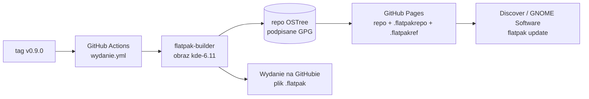

# Plan 4: Flatpak i wydanie — plan implementacji

> **For agentic workers:** REQUIRED SUB-SKILL: Use superpowers:subagent-driven-development (recommended) or
> superpowers:executing-plans to implement this plan task-by-task. Steps use checkbox (`- [ ]`) syntax for tracking.

**Goal:** Wydać WS Tracker Tray 0.9.0 (beta) jako Flatpak: paczka `.flatpak` budowana lokalnie i przez GitHub Actions,
podpisane repozytorium Flatpaka na GitHub Pages z automatycznymi aktualizacjami, licencja AGPL-3.0-or-later.

**Architecture:** Jeden manifest (`flatpak/pl.websystems.WsTrackerTray.yml`: runtime `org.kde.Platform` 6.11, baza
`io.qt.PySide.BaseApp`, moduły `layer-shell-qt` i zależności Pythona) budowany zawsze w tym samym obrazie
`ghcr.io/flathub-infra/flatpak-github-actions:kde-6.11` — lokalnie (`flatpak/buduj.sh`) i w CI (`wydanie.yml`).
Po tagu `v<wersja>` CI podpisuje repozytorium OSTree kluczem GPG, publikuje je na GitHub Pages z plikami
`.flatpakrepo`/`.flatpakref` (`flatpak/pages.py`, `flatpak/publikuj.sh`) i dołącza paczkę do wydania na GitHubie.
Spójność wersji, licencji, identyfikatorów i uprawnień pilnują testy `tests/test_pakiet.py`.

**Tech Stack:** Flatpak 1.18.1 / flatpak-builder 1.4.9 (w obrazie flathub-infra), flatpak-pip-generator, AppStream,
GitHub Actions (`flatpak/flatpak-github-actions/flatpak-builder@v6`, `crazy-max/ghaction-import-gpg@v6`,
`actions/upload-pages-artifact@v3`, `actions/deploy-pages@v4`, `softprops/action-gh-release@v2`), GnuPG, pytest.

**Spec:** [docs/specyfikacja/2026-09-25-kimai-tray-1.0.md](../specyfikacja/2026-09-25-kimai-tray-1.0.md) (sekcje 8, 10,
12),
decyzje: [zadanie 0045](../../TODO/ZROBIONE/0045-plan4-projekt-flatpak/todo.md), próba budowy:
[proba-budowy.md](../../TODO/ZROBIONE/0045-plan4-projekt-flatpak/notatki/proba-budowy.md),
[ADR-0002](../decyzje/0002-stos-python-pyside6.md), [ADR-0006](../decyzje/0006-budowanie-flatpaka-w-kontenerze.md).

## Global Constraints

- Pracujemy na `main`, małe commity po polsku z `Co-Authored-By`. **Push, tagi, sekrety GitHuba i ustawienia Pages —
  tylko za wyraźną zgodą użytkownika w danej chwili** (zadanie 8).
- Identyfikator `pl.websystems.WsTrackerTray`, nazwa „WS Tracker Tray”, wersja **0.9.0**, licencja
  **AGPL-3.0-or-later**.
- Uprawnienia dokładnie ze specyfikacji (sekcja 8): `--share=network`, `--share=ipc`, `--socket=wayland`,
  `--socket=fallback-x11`, `--device=dri`, `--talk-name=org.kde.StatusNotifierWatcher`,
  `--talk-name=org.freedesktop.secrets`.
- Budowa zawsze w obrazie `ghcr.io/flathub-infra/flatpak-github-actions:kde-6.11` (Flatpak 1.18.1 — bez regresji
  flatpak#6818 z Fedory 44).
- Repozytorium kodu jest publiczne; adres Pages: `https://dragonking026.github.io/Kimai-App--Linux-`.
- Klucz prywatny GPG nigdy w repozytorium ani w logach — tylko sekret `FLATPAK_GPG_PRIVATE_KEY`; w repo wyłącznie
  klucz publiczny `flatpak/ws-tracker-tray-repo.gpg`.
- Każdy plik `.md` bez uwag markdownlint; pliki w `.github/` bez frontmattera.
- Przed commitem: `mdfix.py sprawdz`, `ruff format`, `ruff check`, `pytest`.

## Review Focus

1. **Tag niezgodny z wersją** (np. `v0.9.1` przy `0.9.0` w `pyproject.toml`) — wydanie zatrzymuje się przed budową.
   Test: krok „Tag zgodny z wersją” w `wydanie.yml` (zadanie 6) i `test_version_is_the_same_everywhere` (zadanie 1).
2. **Brak lub zły sekret GPG** — import klucza przerywa wydanie; nic niepodpisanego nie trafia na Pages. Test: kolejność
   kroków w `wydanie.yml` (zadanie 6), sprawdzona `actionlint`.
3. **Niepodpisane dodatki (`.Locale`, `.Debug`)** — `flatpak install` ostrzega. Test: próba na sucho w zadaniu 5 —
   instalacja z `.flatpakref` bez ostrzeżeń.
4. **Aplikacja zainstalowana z pliku `.flatpak`** nie dostaje aktualizacji z Pages (inne źródło). Instrukcja w
   `docs/procesy/wydania.md` i README (zadanie 7): odinstaluj, zainstaluj z `.flatpakref`; sprawdzone w
   zadaniu 8.
5. **Wersja deweloperska przesłania Flatpak** (ten sam `pl.websystems.WsTrackerTray.desktop` w `~/.local/share`) —
   `scripts/instaluj-dev.sh --usun` przed instalacją paczki (zadanie 7, instrukcja; zadanie 8, sprawdzenie).

## Struktura plików

```text
LICENSE                                        (już w repo) AGPL-3.0 — tekst z gnu.org
pyproject.toml, src/ws_tracker_tray/__init__.py     zadanie 1   wersja 0.9.0, licencja, pyyaml/packaging w dev
tests/test_pakiet.py                           zadania 1–3, 6, 8   spójność paczki
data/pl.websystems.WsTrackerTray.metainfo.xml      zadanie 2   AppStream (PL/EN), wydanie 0.9.0
flatpak/pl.websystems.WsTrackerTray.yml            zadanie 3   manifest
flatpak/python3-deps.yaml                      zadanie 3   httpx + jeepney (flatpak-pip-generator)
flatpak/buduj.sh                               zadanie 4   budowa w kontenerze, walidacja, lint, --zainstaluj
flatpak/pages.py, tests/test_strona_repo.py    zadanie 5   .flatpakrepo, .flatpakref, index.html
flatpak/publikuj.sh, flatpak/klucz-gpg.sh      zadanie 5   podpis i strona repozytorium; klucz
.github/workflows/testy.yml, wydanie.yml       zadanie 6   CI i wydanie
docs/procesy/wydania.md, .github/README.md     zadanie 7   proces wydania, instalacja
flatpak/ws-tracker-tray-repo.gpg                    zadanie 8   klucz publiczny (pierwsze wydanie)
```



---

### Task 1: Wersja 0.9.0 i licencja w pakiecie

**Files:**

- Modify: `pyproject.toml`, `src/ws_tracker_tray/__init__.py`, `tests/core/test_package.py`
- Create: `tests/test_pakiet.py`

**Interfaces:**

- Consumes: `LICENSE` (już w repozytorium, commit „chore: licencja AGPL-3.0-or-later”).
- Produces: `ws_tracker_tray.__version__ == "0.9.0"`; w `tests/test_pakiet.py`: `ROOT`, `APP_ID`, `PYPROJECT`, `LANG`,
  `metainfo()`, `desktop_entry()` — używane w zadaniach 2, 3, 6, 8.

- [ ] **Step 1: Napisz testy (padające)** — `tests/test_pakiet.py`:

```python
"""The package and its metadata agree with each other (Plan 4): version, licence, ids, commands.

A Flatpak mistake here shows up only after a release — a wrong Exec or version in the store —
so the files are checked together on every test run.
"""

import tomllib
import xml.etree.ElementTree as ET
from pathlib import Path

import ws_tracker_tray

ROOT = Path(__file__).resolve().parents[1]
APP_ID = "pl.websystems.WsTrackerTray"
PYPROJECT = tomllib.loads((ROOT / "pyproject.toml").read_text(encoding="utf-8"))["project"]
LANG = "{http://www.w3.org/XML/1998/namespace}lang"


def metainfo() -> ET.Element:
    return ET.parse(ROOT / "data" / f"{APP_ID}.metainfo.xml").getroot()


def desktop_entry() -> dict[str, str]:
    lines = (ROOT / "data" / f"{APP_ID}.desktop").read_text(encoding="utf-8").splitlines()
    return dict(line.split("=", 1) for line in lines if "=" in line)


def test_version_is_the_same_everywhere():
    assert PYPROJECT["version"] == ws_tracker_tray.__version__ == "0.9.0"


def test_licence_is_agpl():
    assert PYPROJECT["license"] == "AGPL-3.0-or-later"
    licence = (ROOT / "LICENSE").read_text(encoding="utf-8")
    assert licence.lstrip().startswith("GNU AFFERO GENERAL PUBLIC LICENSE")
```

W `tests/core/test_package.py` zmień oczekiwaną wersję na `"0.9.0"`.

- [ ] **Step 2: Uruchom — mają paść**

Run: `.venv/bin/pytest tests/test_pakiet.py tests/core/test_package.py -q`
Expected: `test_version_is_the_same_everywhere`, `test_licence_is_agpl` i `test_package_has_version` FAIL (wersja 0.1.0,
brak `license`).

- [ ] **Step 3: Zaimplementuj** — w `pyproject.toml`:

```toml
[build-system]
requires = ["setuptools>=77"]      # PEP 639: license = "SPDX" (SDK Flatpaka ma setuptools 80.10.2)

[project]
version = "0.9.0"
license = "AGPL-3.0-or-later"
license-files = ["LICENSE"]

[project.optional-dependencies]
dev = ["pytest>=8", "pytest-cov>=5", "ruff>=0.6", "pytest-qt>=4.4", "pyyaml>=6", "packaging>=24"]
```

(pola `license` i `license-files` pod `description`; resztę sekcji zostaw). W `src/ws_tracker_tray/__init__.py`:
`__version__ = "0.9.0"`. Potem `.venv/bin/pip install -e ".[dev,ui]"` (dochodzą `pyyaml`, `packaging`).

- [ ] **Step 4: Uruchom — mają przejść**

Run: `.venv/bin/pytest -q`
Expected: całość zielona — 399 passed, 1 skipped (397 + 2 nowe testy).

- [ ] **Step 5: Commit**

```bash
python3 .claude/skills/markdownlint/mdfix.py sprawdz && .venv/bin/ruff format . && .venv/bin/ruff check . && .venv/bin/pytest
git add pyproject.toml src/ws_tracker_tray/__init__.py tests/core/test_package.py tests/test_pakiet.py
git commit -m "build: wersja 0.9.0 i licencja AGPL-3.0-or-later w pakiecie" -m "Co-Authored-By: Claude Opus 5.5 (1M context) <noreply@anthropic.com>"
```

---

### Task 2: MetaInfo (AppStream) i plik `.desktop`

**Files:**

- Create: `data/pl.websystems.WsTrackerTray.metainfo.xml`
- Modify: `tests/test_pakiet.py`
- Uses: `data/pl.websystems.WsTrackerTray.desktop`, `docs/assets/zrzuty/okno-ciemny-motyw.png` (już w repozytorium)

**Interfaces:**

- Consumes: `metainfo()`, `desktop_entry()`, `PYPROJECT` (zadanie 1).
- Produces: MetaInfo instalowane przez manifest (zadanie 3); jego `<release>` to lista zmian wydania (zadanie 7).

- [ ] **Step 1: Napisz testy (padające)** — Na końcu `tests/test_pakiet.py` dopisz:

```python
# -- Task 2: MetaInfo and the desktop entry ----------------------------------------


def test_metainfo_release_and_licence_match_the_package():
    root = metainfo()
    assert root.find("releases/release").get("version") == ws_tracker_tray.__version__
    assert root.findtext("project_license") == PYPROJECT["license"]


def test_metainfo_names_the_app_in_both_languages():
    root = metainfo()
    assert root.findtext("id") == APP_ID
    assert root.findtext("name") == "WS Tracker Tray"
    summaries = {s.get(LANG, "en"): s.text for s in root.findall("summary")}
    assert set(summaries) == {"en", "pl"}
    assert root.find("launchable").text == f"{APP_ID}.desktop"


def test_screenshot_points_to_a_file_in_this_repository():
    image = metainfo().findtext("screenshots/screenshot/image")
    prefix = "https://raw.githubusercontent.com/DragonKing026/Kimai-App--Linux-/main/"
    assert image.startswith(prefix)
    assert (ROOT / image.removeprefix(prefix)).is_file()


def test_desktop_entry_starts_the_installed_command():
    entry = desktop_entry()
    assert entry["Exec"] == "ws-tracker-tray"
    assert "ws-tracker-tray" in PYPROJECT["scripts"]
    assert entry["Icon"] == APP_ID
    assert entry["Name"] == "WS Tracker Tray"
```

- [ ] **Step 2: Uruchom — mają paść**

Run: `.venv/bin/pytest tests/test_pakiet.py -q`
Expected: 3 FAIL (`FileNotFoundError` — brak pliku MetaInfo); `test_desktop_entry_starts_the_installed_command` PASS.

- [ ] **Step 3: Zaimplementuj**

`data/pl.websystems.WsTrackerTray.metainfo.xml` — opis PL/EN, wydawca Web Systems, zrzut z repozytorium; sprawdzone
`appstreamcli validate` (próba budowy):

```xml
<?xml version="1.0" encoding="UTF-8"?>
<component type="desktop-application">
  <id>pl.websystems.WsTrackerTray</id>
  <metadata_license>CC0-1.0</metadata_license>
  <project_license>AGPL-3.0-or-later</project_license>
  <name>WS Tracker Tray</name>
  <summary>Track your Kimai time from the system tray</summary>
  <summary xml:lang="pl">Mierzenie czasu w Kimai z tacki systemowej</summary>
  <developer id="pl.websystems">
    <name>Web Systems</name>
  </developer>
  <description>
    <p>Start, stop and resume Kimai timesheets without opening the browser. The tray icon shows how long the timer runs.</p>
    <p xml:lang="pl">Start, stop i wznawianie pomiaru czasu w Kimai bez otwierania przeglądarki. Ikona w tacce pokazuje, jak długo trwa pomiar.</p>
    <ul>
      <li>Quick window next to the tray icon with the running entry, projects and recent entries</li>
      <li xml:lang="pl">Okno przy ikonie w tacce z trwającym wpisem, projektami i ostatnimi wpisami</li>
      <li>Reminders about long timers and lost connection</li>
      <li xml:lang="pl">Przypomnienia o długim timerze i utracie połączenia</li>
      <li>The API token is kept in the system wallet</li>
      <li xml:lang="pl">Token API trzymany w portfelu systemu</li>
    </ul>
  </description>
  <launchable type="desktop-id">pl.websystems.WsTrackerTray.desktop</launchable>
  <url type="homepage">https://github.com/DragonKing026/Kimai-App--Linux-</url>
  <url type="bugtracker">https://github.com/DragonKing026/Kimai-App--Linux-/issues</url>
  <screenshots>
    <screenshot type="default">
      <image>https://raw.githubusercontent.com/DragonKing026/Kimai-App--Linux-/main/docs/assets/zrzuty/okno-ciemny-motyw.png</image>
      <caption>The quick window next to the tray</caption>
    </screenshot>
  </screenshots>
  <content_rating type="oars-1.1"/>
  <provides>
    <binary>ws-tracker-tray</binary>
  </provides>
  <supports>
    <control>pointing</control>
    <control>keyboard</control>
  </supports>
  <releases>
    <release version="0.9.0" date="2026-09-26">
      <description>
        <p>First beta: tray icon, quick window, settings, notifications and autostart.</p>
      </description>
    </release>
  </releases>
</component>
```

- [ ] **Step 4: Uruchom — mają przejść**

Run: `.venv/bin/pytest -q`
Expected: 403 passed, 1 skipped.

- [ ] **Step 5: Commit**

```bash
python3 .claude/skills/markdownlint/mdfix.py sprawdz && .venv/bin/ruff format . && .venv/bin/ruff check . && .venv/bin/pytest
git add data/pl.websystems.WsTrackerTray.metainfo.xml tests/test_pakiet.py
git commit -m "feat(flatpak): MetaInfo AppStream — opis PL/EN i wydanie 0.9.0" -m "Co-Authored-By: Claude Opus 5.5 (1M context) <noreply@anthropic.com>"
```

---

### Task 3: Manifest Flatpaka i zależności Pythona

**Files:**

- Create: `flatpak/pl.websystems.WsTrackerTray.yml`, `flatpak/python3-deps.yaml`
- Modify: `tests/test_pakiet.py`

**Interfaces:**

- Consumes: `ws_tracker_tray.ui.desktop_bridge.AUTOSTART_COMMAND` (`["ws-tracker-tray", "--hidden"]`), MetaInfo (zadanie
  2),
  `data/pl.websystems.WsTrackerTray.desktop`, `src/ws_tracker_tray/ui/assets/kimai.png`.
- Produces: manifest `flatpak/pl.websystems.WsTrackerTray.yml` (budują go zadania 4 i 6); `manifest()` w testach.

- [ ] **Step 1: Napisz testy (padające)** — Na końcu `tests/test_pakiet.py` dopisz:

```python
# -- Task 3: the Flatpak manifest --------------------------------------------------


def manifest() -> dict:
    import yaml

    return yaml.safe_load((ROOT / "flatpak" / f"{APP_ID}.yml").read_text(encoding="utf-8"))


def test_manifest_builds_on_the_kde_runtime_with_pyside():
    data = manifest()
    assert data["id"] == APP_ID
    assert (data["runtime"], data["runtime-version"]) == ("org.kde.Platform", "6.11")
    assert (data["base"], data["base-version"]) == ("io.qt.PySide.BaseApp", "6.11")


def test_permissions_are_exactly_those_of_the_specification():
    """Spec, section 8 — nothing more (no home directory, no session bus at large)."""
    assert set(manifest()["finish-args"]) == {
        "--share=network",
        "--share=ipc",
        "--socket=wayland",
        "--socket=fallback-x11",
        "--device=dri",
        "--talk-name=org.kde.StatusNotifierWatcher",
        "--talk-name=org.freedesktop.secrets",
    }


def test_autostart_runs_the_command_the_manifest_installs():
    from ws_tracker_tray.ui.desktop_bridge import AUTOSTART_COMMAND

    assert manifest()["command"] == AUTOSTART_COMMAND[0] == "ws-tracker-tray"


def test_bundled_python_libraries_satisfy_pyproject():
    import re

    import yaml
    from packaging.requirements import Requirement

    deps = yaml.safe_load((ROOT / "flatpak" / "python3-deps.yaml").read_text(encoding="utf-8"))
    wheels = {
        m.group(1).lower(): m.group(2)
        for module in deps["modules"]
        for source in module["sources"]
        if (m := re.search(r"/([A-Za-z0-9_]+)-([0-9][^-]*)-py3-none-any\.whl$", source["url"]))
    }
    for requirement in map(Requirement, PYPROJECT["dependencies"]):
        assert requirement.name in wheels, requirement.name
        version = wheels[requirement.name]
        assert requirement.specifier.contains(version), (requirement, version)
    assert "python3-deps.yaml" in manifest()["modules"]


def test_build_does_not_copy_the_virtualenv_or_git():
    app = next(m for m in manifest()["modules"] if isinstance(m, dict) and m["name"] == "ws-tracker-tray")
    skipped = set(app["sources"][0]["skip"])
    assert {".venv", ".git"} <= skipped
```

- [ ] **Step 2: Uruchom — mają paść**

Run: `.venv/bin/pytest tests/test_pakiet.py -q`
Expected: 5 FAIL (`FileNotFoundError` — brak manifestu).

- [ ] **Step 3: Zaimplementuj**

`flatpak/pl.websystems.WsTrackerTray.yml`:

```yaml
# WS Tracker Tray as a Flatpak. Built in the flathub-infra container (flatpak/buduj.sh, GitHub Actions).
id: pl.websystems.WsTrackerTray
runtime: org.kde.Platform
runtime-version: '6.11'
sdk: org.kde.Sdk
base: io.qt.PySide.BaseApp
base-version: '6.11'
command: ws-tracker-tray
finish-args:
  - --share=network # only the Kimai address the user types (no telemetry)
  - --share=ipc
  - --socket=wayland
  - --socket=fallback-x11
  - --device=dri
  - --talk-name=org.kde.StatusNotifierWatcher # tray icon (KDE, GNOME AppIndicator)
  - --talk-name=org.freedesktop.secrets # API token in KWallet / GNOME Keyring
cleanup-commands:
  - /app/cleanup-BaseApp.sh
build-options:
  env:
    BASEAPP_REMOVE_WEBENGINE: '1'
modules:
  # Not in org.kde.Platform; built against the runtime's Qt (private QtWaylandClient API).
  - name: layer-shell-qt
    buildsystem: cmake-ninja
    config-opts:
      - -DCMAKE_BUILD_TYPE=Release
      - -DBUILD_TESTING=OFF
    sources:
      - type: archive
        url: https://download.kde.org/stable/plasma/6.7.5/layer-shell-qt-6.7.5.tar.xz
        sha256: ccdcfec7081ca956f7a52c9113a4df3a226575bfbe98b56a2a9a4d7d7e19e8f0
  - python3-deps.yaml
  - name: ws-tracker-tray
    buildsystem: simple
    build-commands:
      - pip3 install --no-index --no-deps --no-build-isolation --prefix=${FLATPAK_DEST} .
      - install -Dm644 data/pl.websystems.WsTrackerTray.desktop -t ${FLATPAK_DEST}/share/applications
      - install -Dm644 data/pl.websystems.WsTrackerTray.metainfo.xml -t ${FLATPAK_DEST}/share/metainfo
      - install -Dm644 src/ws_tracker_tray/ui/assets/kimai.png ${FLATPAK_DEST}/share/icons/hicolor/512x512/apps/pl.websystems.WsTrackerTray.png
    sources:
      - type: dir
        path: ..
        skip: [.venv, .git, .superpowers, .pytest_cache, .ruff_cache, TODO, docs, build, .flatpak-builder]
```

`flatpak/python3-deps.yaml` — wygenerowany narzędziem
[flatpak-pip-generator](https://github.com/flatpak/flatpak-builder-tools/tree/master/pip) (koła `py3-none-any`, sumy
SHA256):

```bash
python3 flatpak-pip-generator.py --runtime org.kde.Sdk//6.11 --yaml --output flatpak/python3-deps httpx==0.28.1 jeepney==0.9.0
```

Wynik (zweryfikowany w próbie budowy):

```yaml
# Generated with flatpak-pip-generator (flatpak-builder-tools) --runtime org.kde.Sdk//6.11 --yaml httpx==0.28.1 jeepney==0.9.0
name: python3-deps
buildsystem: simple
build-commands: []
modules:
  - name: python3-httpx
    buildsystem: simple
    build-commands:
      - pip3 install --verbose --exists-action=i --no-index --find-links="file://${PWD}"
        --prefix=${FLATPAK_DEST} "httpx==0.28.1" --no-build-isolation
    sources:
      - type: file
        url: https://files.pythonhosted.org/packages/12/b8/4bd346e22b28902df4d651910f5242c28d84e4a5c2435ca5c3f797ed7e2e/anyio-4.15.1-py3-none-any.whl
        sha256: 6152fdbbf9a77fdec97731721bebf7c4c44f7c29b424b0065826173efc7ed101
      - type: file
        url: https://files.pythonhosted.org/packages/0b/a7/71ac2cff56fec219ed242bb11b8efb69fcc4bec75db06fb7bfe35de520e6/certifi-2026.7.22-py3-none-any.whl
        sha256: 62f22742b58a1a33014a2b6b706588a8d7e2a88ae7bd1a6ebe8c992928483775
      - type: file
        url: https://files.pythonhosted.org/packages/04/4b/29cac41a4d98d144bf5f6d33995617b185d14b22401f75ca86f384e87ff1/h11-0.16.0-py3-none-any.whl
        sha256: 63cf8bbe7522de3bf65932fda1d9c2772064ffb3dae62d55932da54b31cb6c86
      - type: file
        url: https://files.pythonhosted.org/packages/7e/f5/f66802a942d491edb555dd61e3a9961140fd64c90bce1eafd741609d334d/httpcore-1.0.9-py3-none-any.whl
        sha256: 2d400746a40668fc9dec9810239072b40b4484b640a8c38fd654a024c7a1bf55
      - type: file
        url: https://files.pythonhosted.org/packages/2a/39/e50c7c3a983047577ee07d2a9e53faf5a69493943ec3f6a384bdc792deb2/httpx-0.28.1-py3-none-any.whl
        sha256: d909fcccc110f8c7faf814ca82a9a4d816bc5a6dbfea25d6591d6985b8ba59ad
      - type: file
        url: https://files.pythonhosted.org/packages/58/a2/bb081bab032533a855d44de1d56f8e8426114ff1ba5d1f07a438a0a654f8/idna-3.20-py3-none-any.whl
        sha256: ab7ae7122974553370f0bdb919e1a960b2cd1bc1ef0276416d896db81c14582c
      - type: file
        url: https://files.pythonhosted.org/packages/49/d3/b8441a820a491ddfc024b0b0cf0393375b75ea13866d9c66727e54c2fc80/typing_extensions-4.16.0-py3-none-any.whl
        sha256: 481caa481374e813c1b176ada14e97f1f67a4539ce9cfeb3f350d78d6370c2e8
  - name: python3-jeepney
    buildsystem: simple
    build-commands:
      - pip3 install --verbose --exists-action=i --no-index --find-links="file://${PWD}"
        --prefix=${FLATPAK_DEST} "jeepney==0.9.0" --no-build-isolation
    sources:
      - type: file
        url: https://files.pythonhosted.org/packages/b2/a3/e137168c9c44d18eff0376253da9f1e9234d0239e0ee230d2fee6cea8e55/jeepney-0.9.0-py3-none-any.whl
        sha256: 97e5714520c16fc0a45695e5365a2e11b81ea79bba796e26f9f1d178cb182683
```

- [ ] **Step 4: Uruchom — mają przejść**

Run: `.venv/bin/pytest -q`
Expected: 408 passed, 1 skipped.

- [ ] **Step 5: Commit**

```bash
python3 .claude/skills/markdownlint/mdfix.py sprawdz && .venv/bin/ruff format . && .venv/bin/ruff check . && .venv/bin/pytest
git add flatpak/pl.websystems.WsTrackerTray.yml flatpak/python3-deps.yaml tests/test_pakiet.py
git commit -m "feat(flatpak): manifest — KDE 6.11, baza PySide, layer-shell-qt, httpx i jeepney" -m "Co-Authored-By: Claude Opus 5.5 (1M context) <noreply@anthropic.com>"
```

---

### Task 4: Budowa lokalna w kontenerze (`flatpak/buduj.sh`)

**Files:**

- Create: `flatpak/buduj.sh`
- Modify: `.gitignore` (`dist/`), `docs/decyzje/0006-budowanie-flatpaka-w-kontenerze.md`, `docs/integracje/flatpak.md`,
  `AGENTS.md` („Komendy”)

**Interfaces:**

- Consumes: manifest (zadanie 3), MetaInfo (zadanie 2), `pyproject.toml` (wersja).
- Produces: `dist/pl.websystems.WsTrackerTray-<wersja>.flatpak`; repozytorium OSTree i cache w
  `~/.cache/ws-tracker-tray-flatpak`
  (`repo/` — używa go próba publikacji w zadaniu 5); stała `IMAGE` (sprawdzana w zadaniu 6).

- [ ] **Step 1: Skrypt**

`flatpak/buduj.sh`:

```bash
#!/usr/bin/env bash
# Build the Flatpak in the same container GitHub Actions uses, then check it and (optionally) install it.
#
#   flatpak/buduj.sh              → dist/pl.websystems.WsTrackerTray-<version>.flatpak (+ OSTree repo in the cache)
#   flatpak/buduj.sh --zainstaluj → the same, then `flatpak install --user --bundle` on this computer
#
# Why a container: Fedora 44's Flatpak 1.18.2 cannot build with a `base:` app (flatpak#6818, ADR-0006);
# the flathub-infra image carries Flatpak 1.18.1 and the KDE 6.11 SDK, plus appstreamcli and the linter.
# Downloads (runtime, PySide base) and build state are cached in ~/.cache/ws-tracker-tray-flatpak.
set -euo pipefail
ROOT="$(cd "$(dirname "$0")/.." && pwd)"
APP=pl.websystems.WsTrackerTray
IMAGE=ghcr.io/flathub-infra/flatpak-github-actions:kde-6.11
CACHE="${XDG_CACHE_HOME:-$HOME/.cache}/ws-tracker-tray-flatpak"
VERSION="$(sed -n 's/^version = "\(.*\)"/\1/p' "$ROOT/pyproject.toml")"
BUNDLE="$APP-$VERSION.flatpak"
# Findings that only matter for Flathub, not for our own repository on GitHub Pages:
# the websystems.pl certificate (from the app id) and screenshots mirrored into the OSTree repo or Flathub media.
ALLOWED_LINT="appid-url-not-reachable appstream-screenshots-not-mirrored-in-ostree appstream-missing-screenshots appstream-external-screenshot-url"

mkdir -p "$CACHE" "$ROOT/dist"
docker run --rm --privileged \
  -v "$ROOT":/src:ro -v "$CACHE":/work -v "$ROOT/dist":/dist \
  -e HOME=/work/home -e APP="$APP" -e BUNDLE="$BUNDLE" -e ALLOWED_LINT="$ALLOWED_LINT" \
  "$IMAGE" bash -euo pipefail -c '
    rm -rf /tmp/src && mkdir /tmp/src
    tar -C /src --exclude=.venv --exclude=.git --exclude=dist -cf - . | tar -C /tmp/src -xf -
    appstreamcli validate --no-net "/tmp/src/data/$APP.metainfo.xml"
    desktop-file-validate "/tmp/src/data/$APP.desktop"
    flatpak remote-add --user --if-not-exists flathub https://dl.flathub.org/repo/flathub.flatpakrepo
    flatpak-builder --user --install-deps-from=flathub --force-clean --disable-rofiles-fuse \
      --state-dir=/work/state --repo=/work/repo /work/build "/tmp/src/flatpak/$APP.yml" > /work/build.log 2>&1 \
      || { tail -40 /work/build.log; exit 1; }
    flatpak build-bundle --runtime-repo=https://flathub.org/repo/flathub.flatpakrepo /work/repo "/dist/$BUNDLE" "$APP"
    for target in "manifest /tmp/src/flatpak/$APP.yml" "repo /work/repo"; do
      set -- $target
      flatpak-builder-lint "$1" "$2" > /work/lint.json || true
      python3 - "$1" <<PY
import json, os, sys
found = set(json.load(open("/work/lint.json")).get("errors", []))
unexpected = found - set(os.environ["ALLOWED_LINT"].split())
print(f"lint {sys.argv[1]}: " + (", ".join(sorted(unexpected)) or "OK"))
sys.exit(1 if unexpected else 0)
PY
    done
    chmod -R a+rwX /work /dist
  '
echo "Paczka: $ROOT/dist/$BUNDLE"
if [[ "${1:-}" == "--zainstaluj" ]]; then
  flatpak install --user -y --noninteractive --bundle "$ROOT/dist/$BUNDLE"
fi
```

`chmod +x flatpak/buduj.sh`; w `.gitignore` dopisz `dist/`.

- [ ] **Step 2: Uruchom budowę**

Run: `flatpak/buduj.sh` (Docker, poza piaskownicą Claude; pierwszy raz ok. 15 min — pobiera runtime i bazę PySide)
Expected: `✔ Validation was successful`, `lint manifest: OK`, `lint repo: OK`,
`Paczka: …/dist/pl.websystems.WsTrackerTray-0.9.0.flatpak` (ok. 70 MB).

- [ ] **Step 3: Sprawdź skrypt** — `docker run --rm -v "$PWD":/mnt -w /mnt koalaman/shellcheck:stable flatpak/buduj.sh`
  → brak uwag.

- [ ] **Step 4: Dokumentacja**

1. [ADR-0006](../decyzje/0006-budowanie-flatpaka-w-kontenerze.md): sekcja „Aktualizacja” — obraz Debiana z prototypu
   zastąpiony obrazem `ghcr.io/flathub-infra/flatpak-github-actions:kde-6.11` (Flatpak 1.18.1, ten sam w CI; zbudował
   z bazą PySide na Fedorze 44 z SELinux —
   [próba](../../TODO/ZROBIONE/0045-plan4-projekt-flatpak/notatki/proba-budowy.md)).
2. [docs/integracje/flatpak.md](../integracje/flatpak.md): „Budowanie lokalnie” → `flatpak/buduj.sh` (zamiast szkicu),
   „Dystrybucja” → wybrany wariant (repozytorium na Pages + wydania), „Gdzie w kodzie” → manifest, `python3-deps.yaml`,
   `buduj.sh`, `pages.py`, `publikuj.sh`.
3. `AGENTS.md` → „Komendy”: nowy blok „Flatpak” z `flatpak/buduj.sh` i `flatpak/buduj.sh --zainstaluj`; callout
   `> [!todo] Plan 4 …` usuń.

Run: `python3 .claude/skills/sprawdz-linki/linki.py sprawdz && python3 .claude/skills/markdownlint/mdfix.py sprawdz`

- [ ] **Step 5: Commit** (skrypt i dokumentacja osobno)

```bash
python3 .claude/skills/markdownlint/mdfix.py sprawdz && .venv/bin/ruff format . && .venv/bin/ruff check . && .venv/bin/pytest
git add flatpak/buduj.sh .gitignore
git commit -m "build(flatpak): budowa w obrazie flathub-infra — walidacja, lint, paczka w dist/" -m "Co-Authored-By: Claude Opus 5.5 (1M context) <noreply@anthropic.com>"
```

---

### Task 5: Repozytorium Flatpaka dla GitHub Pages

**Files:**

- Create: `flatpak/pages.py`, `flatpak/publikuj.sh`, `flatpak/klucz-gpg.sh`
- Test: `tests/test_strona_repo.py`

**Interfaces:**

- Consumes: repozytorium OSTree z budowy (zadanie 4 lokalnie, akcja `flatpak-builder` w CI — katalog `repo`).
- Produces: `pages.flatpakrepo(base_url, public_key) -> str`, `pages.flatpakref(base_url, public_key) -> str`,
  `pages.index_html(base_url) -> str`, `pages.write_site(site, base_url, public_key_file)`;
  `flatpak/publikuj.sh <repo> <site> <url> <klucz> [gpg-homedir]`; `flatpak/klucz-gpg.sh` (zadanie 8).

- [ ] **Step 1: Napisz testy (padające)**

`tests/test_strona_repo.py`:

```python
"""Files of the Flatpak repository published on GitHub Pages (flatpak/pages.py)."""

import base64
import configparser
import importlib.util
from pathlib import Path

ROOT = Path(__file__).resolve().parents[1]
spec = importlib.util.spec_from_file_location("pages", ROOT / "flatpak" / "pages.py")
pages = importlib.util.module_from_spec(spec)
spec.loader.exec_module(pages)

URL = "https://dragonking026.github.io/Kimai-App--Linux-"
KEY = b"\x99\x01\x0dfake public key bytes"


def parse(text: str, section: str) -> dict[str, str]:
    parser = configparser.ConfigParser(interpolation=None)
    parser.optionxform = str
    parser.read_string(text)
    return dict(parser[section])


def test_repo_file_lets_flatpak_add_the_remote():
    data = parse(pages.flatpakrepo(URL, KEY), "Flatpak Repo")
    assert data["Url"] == f"{URL}/repo/"
    assert data["Title"] == "WS Tracker Tray"
    assert base64.b64decode(data["GPGKey"]) == KEY
    assert data["RuntimeRepo"] == "https://dl.flathub.org/repo/flathub.flatpakrepo"


def test_ref_file_installs_the_app_from_that_remote():
    data = parse(pages.flatpakref(URL, KEY), "Flatpak Ref")
    assert (data["Name"], data["Branch"], data["IsRuntime"]) == ("pl.websystems.WsTrackerTray", "master", "false")
    assert data["Url"] == f"{URL}/repo/"
    assert data["SuggestRemoteName"] == "ws-tracker-tray"
    assert base64.b64decode(data["GPGKey"]) == KEY


def test_site_writes_both_files_and_an_index(tmp_path):
    key = tmp_path / "key.gpg"
    key.write_bytes(KEY)
    pages.write_site(tmp_path / "site", URL + "/", key)
    names = sorted(path.name for path in (tmp_path / "site").iterdir())
    assert names == ["index.html", "ws-tracker-tray.flatpakrepo", "pl.websystems.WsTrackerTray.flatpakref"]
    index = (tmp_path / "site" / "index.html").read_text(encoding="utf-8")
    assert f"flatpak install --user {URL}/pl.websystems.WsTrackerTray.flatpakref" in index
```

- [ ] **Step 2: Uruchom — mają paść**

Run: `.venv/bin/pytest tests/test_strona_repo.py -q`
Expected: błąd — brak `flatpak/pages.py`.

- [ ] **Step 3: Zaimplementuj**

`flatpak/pages.py`:

```python
"""Files that turn an OSTree repository on GitHub Pages into a Flatpak remote people can install from.

    python3 flatpak/pages.py <site-dir> <base-url> <public-key.gpg>

writes <site-dir>/ws-tracker-tray.flatpakrepo (adds the remote, updates come through Discover or GNOME
Software), <site-dir>/pl.websystems.WsTrackerTray.flatpakref (installs the app in one command) and a
small index.html. The repository itself goes to <site-dir>/repo (flatpak/publikuj.sh copies it).
Format: https://docs.flatpak.org/en/latest/flatpak-command-reference.html (.flatpakrepo, .flatpakref).
"""

from __future__ import annotations

import base64
import html
import sys
from pathlib import Path

APP_ID = "pl.websystems.WsTrackerTray"
TITLE = "WS Tracker Tray"
REMOTE = "ws-tracker-tray"
BRANCH = "master"  # flatpak-builder's default branch; the GitHub action builds it too
FLATHUB = "https://dl.flathub.org/repo/flathub.flatpakrepo"  # where the KDE runtime and PySide base come from


def _key(public_key: bytes) -> str:
    return base64.b64encode(public_key).decode("ascii")


def flatpakrepo(base_url: str, public_key: bytes) -> str:
    return (
        "[Flatpak Repo]\n"
        f"Title={TITLE}\n"
        f"Url={base_url.rstrip('/')}/repo/\n"
        f"Homepage={base_url.rstrip('/')}/\n"
        f"Comment=Kimai time tracking in the system tray\n"
        f"RuntimeRepo={FLATHUB}\n"
        f"GPGKey={_key(public_key)}\n"
    )


def flatpakref(base_url: str, public_key: bytes) -> str:
    return (
        "[Flatpak Ref]\n"
        f"Title={TITLE}\n"
        f"Name={APP_ID}\n"
        f"Branch={BRANCH}\n"
        f"Url={base_url.rstrip('/')}/repo/\n"
        f"SuggestRemoteName={REMOTE}\n"
        "IsRuntime=false\n"
        f"RuntimeRepo={FLATHUB}\n"
        f"GPGKey={_key(public_key)}\n"
    )


def index_html(base_url: str) -> str:
    url = html.escape(base_url.rstrip("/"))
    return f"""<!doctype html>
<html lang="pl">
<head><meta charset="utf-8"><title>{TITLE} — repozytorium Flatpak</title></head>
<body>
<h1>{TITLE}</h1>
<p>Instalacja — aktualizacje przyjdą same (Discover, GNOME Software, <code>flatpak update</code>):</p>
<pre>flatpak install --user {url}/{APP_ID}.flatpakref</pre>
<p>Samo źródło aktualizacji: <a href="{REMOTE}.flatpakrepo">{REMOTE}.flatpakrepo</a> ·
<a href="https://github.com/DragonKing026/Kimai-App--Linux-">kod źródłowy</a></p>
</body>
</html>
"""


def write_site(site: Path, base_url: str, public_key_file: Path) -> None:
    key = public_key_file.read_bytes()
    site.mkdir(parents=True, exist_ok=True)
    (site / f"{REMOTE}.flatpakrepo").write_text(flatpakrepo(base_url, key), encoding="utf-8")
    (site / f"{APP_ID}.flatpakref").write_text(flatpakref(base_url, key), encoding="utf-8")
    (site / "index.html").write_text(index_html(base_url), encoding="utf-8")


if __name__ == "__main__":
    if len(sys.argv) != 4:
        sys.exit(__doc__)
    write_site(Path(sys.argv[1]), sys.argv[2], Path(sys.argv[3]))
```

`flatpak/publikuj.sh` — podpisuje każdy ref aplikacji (także `.Locale` i `.Debug`):

```bash
#!/usr/bin/env bash
# Turn a built OSTree repo into the site GitHub Pages serves: signed repo + .flatpakrepo/.flatpakref.
#
#   flatpak/publikuj.sh <repo> <site-dir> <base-url> <gpg-key-id> [gpg-homedir]
#
# Runs inside the flathub-infra container (GitHub Actions: wydanie.yml; locally for a dry run).
# The app commit is signed (again — idempotent) and the summary too, so `flatpak` on people's
# computers verifies everything with the public key in flatpak/ws-tracker-tray-repo.gpg.
set -euo pipefail
REPO="$1"; SITE="$2"; URL="$3"; KEY="$4"; HOMEDIR="${5:-}"
APP=pl.websystems.WsTrackerTray
HERE="$(cd "$(dirname "$0")" && pwd)"
GPG=(--gpg-sign="$KEY")
[[ -n "$HOMEDIR" ]] && GPG+=(--gpg-homedir="$HOMEDIR")

# Every ref of the app — the app itself and its .Locale/.Debug extensions — must carry a signature.
for ref in $(ostree --repo="$REPO" refs | grep -F "$APP"); do
  kind="${ref%%/*}"; rest="${ref#*/}"; id="${rest%%/*}"; branch="${ref##*/}"
  if [[ "$kind" == runtime ]]; then
    flatpak build-sign "${GPG[@]}" --runtime "$REPO" "$id" "$branch"
  else
    flatpak build-sign "${GPG[@]}" "$REPO" "$id" "$branch"
  fi
done
flatpak build-update-repo "${GPG[@]}" --generate-static-deltas --prune "$REPO"
mkdir -p "$SITE"
rm -rf "$SITE/repo"
cp -a "$REPO" "$SITE/repo"
python3 "$HERE/pages.py" "$SITE" "$URL" "$HERE/ws-tracker-tray-repo.gpg"
echo "Strona repozytorium: $SITE ($URL)"
```

`flatpak/klucz-gpg.sh` — klucz w tymczasowym `GNUPGHOME`, prywatny z uprawnieniami 0600, bez nadpisywania:

```bash
#!/usr/bin/env bash
# One-off: the key that signs the Flatpak repository on GitHub Pages.
#
#   flatpak/klucz-gpg.sh
#
# Creates the key in a throwaway GnuPG home (your own keyring stays untouched), writes the PUBLIC key
# to flatpak/ws-tracker-tray-repo.gpg (committed — it goes into .flatpakrepo/.flatpakref) and the PRIVATE key
# to ~/ws-tracker-tray-repo-private.asc for the GitHub secret FLATPAK_GPG_PRIVATE_KEY. Then delete that file.
set -euo pipefail
HERE="$(cd "$(dirname "$0")" && pwd)"
PRIVATE="$HOME/ws-tracker-tray-repo-private.asc"
[[ -e "$PRIVATE" ]] && { echo "$PRIVATE już istnieje — nie nadpisuję." >&2; exit 1; }
HOMEDIR="$(mktemp -d)"
trap 'rm -rf "$HOMEDIR"' EXIT
export GNUPGHOME="$HOMEDIR"
gpg --batch --pinentry-mode loopback --passphrase '' \
  --quick-gen-key "WS Tracker Tray Flatpak repository <ws-tracker-tray@users.noreply.github.com>" rsa4096 sign never
KEY_ID="$(gpg --list-keys --with-colons | awk -F: '/^fpr/ {print $10; exit}')"
gpg --export "$KEY_ID" > "$HERE/ws-tracker-tray-repo.gpg"
( umask 077; gpg --armor --export-secret-keys "$KEY_ID" > "$PRIVATE" )
echo "Klucz: $KEY_ID"
echo "Publiczny: $HERE/ws-tracker-tray-repo.gpg (do commita)"
echo "Prywatny:  $PRIVATE → gh secret set FLATPAK_GPG_PRIVATE_KEY < \"$PRIVATE\" && shred -u \"$PRIVATE\""
```

`chmod +x flatpak/publikuj.sh flatpak/klucz-gpg.sh`.

- [ ] **Step 4: Uruchom — mają przejść**

Run: `.venv/bin/pytest -q`
Expected: 411 passed, 1 skipped.

- [ ] **Step 5: Próba na sucho w kontenerze** (tymczasowy klucz, repozytorium z zadania 4):

```bash
docker run --rm --privileged -v "$PWD":/src:ro -v ~/.cache/ws-tracker-tray-flatpak:/work:ro \
  ghcr.io/flathub-infra/flatpak-github-actions:kde-6.11 bash -euo pipefail -c '
export GNUPGHOME=$(mktemp -d)
gpg --batch --pinentry-mode loopback --passphrase "" --quick-gen-key "Test <t@example.com>" rsa2048 sign never
KEY=$(gpg --list-keys --with-colons | awk -F: "/^fpr/ {print \$10; exit}")
mkdir /tmp/f && cp -a /src/flatpak/. /tmp/f/ && gpg --export $KEY > /tmp/f/ws-tracker-tray-repo.gpg
cp -a /work/repo /tmp/repo
/tmp/f/publikuj.sh /tmp/repo /tmp/site http://127.0.0.1:8765 $KEY "$GNUPGHOME"
cd /tmp/site && (python3 -m http.server 8765 >/dev/null 2>&1 &) && sleep 1
export HOME=/tmp/home; mkdir -p $HOME
flatpak remote-add --user --if-not-exists flathub https://dl.flathub.org/repo/flathub.flatpakrepo
flatpak install --user -y --noninteractive http://127.0.0.1:8765/pl.websystems.WsTrackerTray.flatpakref
flatpak update --user -y --noninteractive'
```

Expected: instalacja `.Locale` i aplikacji **bez** ostrzeżeń GPG, `Nothing to update.` (sprawdzone przy pisaniu planu).
Shellcheck trzech skryptów → brak uwag.

- [ ] **Step 6: Commit**

```bash
python3 .claude/skills/markdownlint/mdfix.py sprawdz && .venv/bin/ruff format . && .venv/bin/ruff check . && .venv/bin/pytest
git add flatpak/pages.py flatpak/publikuj.sh flatpak/klucz-gpg.sh tests/test_strona_repo.py
git commit -m "feat(flatpak): podpisane repozytorium dla GitHub Pages — .flatpakrepo i .flatpakref" -m "Co-Authored-By: Claude Opus 5.5 (1M context) <noreply@anthropic.com>"
```

---

### Task 6: GitHub Actions — testy i wydanie

**Files:**

- Create: `.github/workflows/testy.yml`, `.github/workflows/wydanie.yml`
- Modify: `tests/test_pakiet.py`
- Create (skill `nowa-integracja`): `docs/integracje/github-actions.md`, `docs/integracje/github-pages.md`
- Create (skill `nowa-decyzja`): `docs/decyzje/0007-dystrybucja-repozytorium-flatpak-na-github-pages.md`

**Interfaces:**

- Consumes: `flatpak/buduj.sh` (`IMAGE`), manifest, `flatpak/publikuj.sh`, sekret `FLATPAK_GPG_PRIVATE_KEY`.
- Produces: wydanie po tagu `v*`: paczka `pl.websystems.WsTrackerTray-<tag>.flatpak` w wydaniu GitHuba, strona Pages.

- [ ] **Step 1: Napisz testy (padające)** — Na końcu `tests/test_pakiet.py` dopisz:

```python
# -- Task 6: GitHub Actions and the signing key ------------------------------------


def workflow(name: str) -> dict:
    import yaml

    return yaml.safe_load((ROOT / ".github" / "workflows" / name).read_text(encoding="utf-8"))


def test_release_builds_in_the_same_container_as_the_local_script():
    import re

    script = (ROOT / "flatpak" / "buduj.sh").read_text(encoding="utf-8")
    local_image = re.search(r"^IMAGE=(\S+)$", script, re.M).group(1)
    job = workflow("wydanie.yml")["jobs"]["flatpak"]
    assert job["container"]["image"] == local_image
    builder = next(step for step in job["steps"] if "flatpak-builder" in step.get("uses", ""))
    assert builder["with"]["manifest-path"] == f"flatpak/{APP_ID}.yml"


def test_release_runs_only_for_version_tags():
    triggers = workflow("wydanie.yml")[True]  # YAML 1.1 reads the key "on" as True
    assert triggers == {"push": {"tags": ["v*"]}}
```

- [ ] **Step 2: Uruchom — mają paść**

Run: `.venv/bin/pytest tests/test_pakiet.py -q`
Expected: 2 FAIL (`FileNotFoundError` — brak workflowów).

- [ ] **Step 3: Zaimplementuj**

`.github/workflows/testy.yml`:

```yaml
# Tests on every push to main and every pull request: the same checks as before a local commit.
name: Testy
on:
  push:
    branches: [main]
  pull_request:
permissions:
  contents: read
jobs:
  testy:
    runs-on: ubuntu-24.04
    steps:
      - uses: actions/checkout@v4
      - uses: actions/setup-python@v5
        with:
          python-version: "3.13"
      - name: Biblioteki systemowe dla Qt (platforma offscreen)
        run: |
          sudo apt-get update
          sudo apt-get install -y --no-install-recommends libegl1 libgl1 libxkbcommon0 libfontconfig1 libdbus-1-3
      - name: Instalacja
        run: pip install -e ".[dev,ui]"
      - name: Format i lint
        run: ruff format --check . && ruff check .
      - name: Testy (bez Dockera i pulpitu)
        run: pytest
        env:
          QT_QPA_PLATFORM: offscreen
      - name: Dokumentacja
        run: |
          python3 .claude/skills/sprawdz-linki/linki.py sprawdz
          python3 .claude/skills/frontmatter/frontmatter.py sprawdz
          python3 .claude/skills/markdownlint/mdfix.py sprawdz
```

`.github/workflows/wydanie.yml` — tag musi zgadzać się z wersją, bez klucza nie ma budowy:

```yaml
# A release: pushing the tag v<version> builds the signed Flatpak, publishes the Flatpak repository
# on GitHub Pages (updates reach everyone who installed from it) and attaches the bundle to a release.
# Needs: secret FLATPAK_GPG_PRIVATE_KEY (flatpak/klucz-gpg.sh), Pages source = GitHub Actions.
name: Wydanie
on:
  push:
    tags: ["v*"]
permissions:
  contents: write # the GitHub release with the bundle
  pages: write
  id-token: write
concurrency:
  group: pages
  cancel-in-progress: false
jobs:
  flatpak:
    runs-on: ubuntu-24.04
    container:
      # The same image as flatpak/buduj.sh: Flatpak 1.18.1, KDE 6.11 SDK, appstreamcli, linter.
      image: ghcr.io/flathub-infra/flatpak-github-actions:kde-6.11
      options: --privileged
    steps:
      - uses: actions/checkout@v4
      - name: Tag zgodny z wersją w pyproject.toml
        run: |
          version="$(sed -n 's/^version = "\(.*\)"/\1/p' pyproject.toml)"
          if [ "v$version" != "$GITHUB_REF_NAME" ]; then
            echo "Tag $GITHUB_REF_NAME, a pyproject.toml ma $version" >&2
            exit 1
          fi
      - name: Klucz podpisujący repozytorium
        id: gpg
        uses: crazy-max/ghaction-import-gpg@v6
        with:
          gpg_private_key: ${{ secrets.FLATPAK_GPG_PRIVATE_KEY }}
      - name: Budowa Flatpaka
        uses: flatpak/flatpak-github-actions/flatpak-builder@v6
        with:
          manifest-path: flatpak/pl.websystems.WsTrackerTray.yml
          bundle: pl.websystems.WsTrackerTray-${{ github.ref_name }}.flatpak
          gpg-sign: ${{ steps.gpg.outputs.fingerprint }}
      - name: Repozytorium Flatpak dla GitHub Pages
        run: >-
          flatpak/publikuj.sh repo site "https://dragonking026.github.io/Kimai-App--Linux-"
          "${{ steps.gpg.outputs.fingerprint }}"
      - uses: actions/upload-pages-artifact@v3
        with:
          path: site
      - name: Wydanie na GitHubie z paczką
        uses: softprops/action-gh-release@v2
        with:
          files: pl.websystems.WsTrackerTray-${{ github.ref_name }}.flatpak
          generate_release_notes: true
          prerelease: ${{ startsWith(github.ref_name, 'v0.') }}
  pages:
    needs: flatpak
    runs-on: ubuntu-24.04
    environment:
      name: github-pages
      url: ${{ steps.deploy.outputs.page_url }}
    steps:
      - name: Publikacja na GitHub Pages
        id: deploy
        uses: actions/deploy-pages@v4
```

- [ ] **Step 4: Uruchom — mają przejść**

Run: `.venv/bin/pytest -q && docker run --rm -v "$PWD":/repo -w /repo rhysd/actionlint:latest -no-color`
Expected: 413 passed, 1 skipped; `actionlint` bez uwag (sprawdza też skrypty `run:` shellcheckiem).

- [ ] **Step 5: Dokumentacja**

1. `docs/integracje/github-actions.md` (skill `nowa-integracja`): po co (testy na każdy push, wydanie po tagu), użyte
   akcje z wersjami i linkami do README każdej, obraz kontenera, sekret `FLATPAK_GPG_PRIVATE_KEY`, uprawnienia
   workflowu (`contents: write`, `pages: write`, `id-token: write`), „Gdzie w kodzie”.
2. `docs/integracje/github-pages.md`: źródło „GitHub Actions”, adres, struktura strony (`repo/`, `.flatpakrepo`,
   `.flatpakref`, `index.html`), podpis GPG,
   [format plików](https://docs.flatpak.org/en/latest/flatpak-command-reference.html),
   dostęp publiczny (repozytorium publiczne, darmowe konto).
3. ADR-0007 (skill `nowa-decyzja`): dystrybucja — repozytorium Flatpaka na GitHub Pages + wydania na GitHubie; opcje
   rozważone (sam plik, Actions bez repo, Flathub), decyzja użytkownika z
   [0045](../../TODO/ZROBIONE/0045-plan4-projekt-flatpak/todo.md).

- [ ] **Step 6: Commit** (workflowy, integracje, ADR osobno)

```bash
python3 .claude/skills/markdownlint/mdfix.py sprawdz && .venv/bin/ruff format . && .venv/bin/ruff check . && .venv/bin/pytest
git add .github/workflows tests/test_pakiet.py
git commit -m "ci: testy na każdy push i wydanie Flatpaka po tagu wersji" -m "Co-Authored-By: Claude Opus 5.5 (1M context) <noreply@anthropic.com>"
```

---

### Task 7: Proces wydania i instrukcja instalacji

**Files:**

- Create: `docs/procesy/wydania.md`
- Modify: `.github/README.md` (instalacja), `README.md` (instalacja, status),
  `docs/architektura/struktura-repozytorium.md`
  (`flatpak/`, `data/`, `.github/`), `docs/README.md` (link do wydań)

**Interfaces:**

- Consumes: wszystko powyżej.
- Produces: instrukcje, według których zadanie 8 robi pierwsze wydanie.

- [ ] **Step 1: `docs/procesy/wydania.md`** — treść:
  1. **Jednorazowo:** `flatpak/klucz-gpg.sh` → commit `flatpak/ws-tracker-tray-repo.gpg`; `gh secret set
     FLATPAK_GPG_PRIVATE_KEY <
     ~/ws-tracker-tray-repo-private.asc` i `shred -u` pliku; GitHub → Settings → Pages → Source: **GitHub Actions**.
  2. **Każde wydanie:** wersja w `pyproject.toml` i `src/ws_tracker_tray/__init__.py`; nowy `<release version date>` na
     początku `<releases>` w MetaInfo (lista zmian po angielsku, zdanie po polsku w commicie); `pytest` (test
     spójności wersji); commit; `git tag v<wersja>`; `git push origin main v<wersja>` (za zgodą); śledzenie
     `gh run watch`; sprawdzenie strony i wydania.
  3. **Instalacja dla ludzi:** `flatpak install --user
     https://dragonking026.github.io/Kimai-App--Linux-/pl.websystems.WsTrackerTray.flatpakref`
     (aktualizacje przez Discover / GNOME Software / `flatpak update`); plik `.flatpak` z wydania — tylko bez dostępu do
     repozytorium (bez aktualizacji); przejście z pliku na repozytorium:
     `flatpak uninstall pl.websystems.WsTrackerTray`,
     potem instalacja z `.flatpakref` (ustawienia w `~/.var/app` zostają).
  4. **Wersja deweloperska a Flatpak:** `scripts/instaluj-dev.sh --usun` przed instalacją paczki (ten sam
     identyfikator).
  5. Wersje 0.x oznaczane jako „pre-release”; 1.0.0 po testach GNOME
     ([0020](../../TODO/DO-ZROBIENIA/0020-testy-gnome/todo.md)).
- [ ] **Step 2: `.github/README.md` i `README.md` → „Instalacja”** (oba z tą samą treścią — pilnuje tego
  `tests/test_readme.py`; w głównym zostaje frontmatter, w `.github/` linki zaczynają się od `../`) — polecenie z
  `.flatpakref`, link do najnowszego wydania
  (`https://github.com/DragonKing026/Kimai-App--Linux-/releases/latest`), link do `wydania.md`. Bez frontmattera.
- [ ] **Step 3: Struktura** — `struktura-repozytorium.md`
  — katalogi `flatpak/`, `data/`, `.github/` (workflowy, README strony repozytorium).
- [ ] **Step 4: Kontrole** — `linki.py sprawdz`, `frontmatter.py sprawdz`, `mdfix.py napraw` + `sprawdz`.
- [ ] **Step 5: Commit** (proces, README, struktura osobno) — `docs(procesy): wydania…`, `docs: instalacja…`.

---

### Task 8: Pierwsze wydanie 0.9.0 (z użytkownikiem)

**Files:**

- Create: `flatpak/ws-tracker-tray-repo.gpg` (klucz publiczny)
- Modify: `tests/test_pakiet.py`

**Interfaces:**

- Consumes: `flatpak/klucz-gpg.sh`, workflow `wydanie.yml`, instrukcja z zadania 7.
- Produces: wydanie `v0.9.0` na GitHubie, repozytorium na Pages, instalacja z repozytorium u użytkownika.

- [ ] **Step 1: Test klucza (padający)** — Na końcu `tests/test_pakiet.py` dopisz:

```python
# -- Task 8: the repository signing key (created for the first release) ------------


def test_repository_signing_key_is_public_only():
    """`gpg --export` writes binary, so the check reads the key packets instead of looking for text."""
    import subprocess

    key = ROOT / "flatpak" / "ws-tracker-tray-repo.gpg"
    listing = subprocess.run(
        ["gpg", "--show-keys", "--with-colons", key], capture_output=True, text=True, check=True
    ).stdout.splitlines()
    kinds = {line.split(":")[0] for line in listing}
    assert "pub" in kinds
    assert not kinds & {"sec", "ssb"}
```

Run: `.venv/bin/pytest tests/test_pakiet.py -q` → 1 FAIL (brak `flatpak/ws-tracker-tray-repo.gpg`).

- [ ] **Step 2: Klucz** — `flatpak/klucz-gpg.sh` (**za zgodą użytkownika**: plik prywatny powstaje w jego `~`);
  `.venv/bin/pytest -q` → 414 passed, 1 skipped; commit klucza publicznego i testu.
- [ ] **Step 3: Sekret i Pages — za zgodą użytkownika w tej chwili:**
  `gh secret set FLATPAK_GPG_PRIVATE_KEY < ~/ws-tracker-tray-repo-private.asc && shred -u
  ~/ws-tracker-tray-repo-private.asc`;
  `gh api -X POST repos/DragonKing026/Kimai-App--Linux-/pages -f build_type=workflow` (albo w ustawieniach repo);
  reguła środowiska `github-pages` dla tagów `v*` — komendy w [wydania.md](../procesy/wydania.md) (bez niej publikacja
  z tagu zostanie odrzucona).
- [ ] **Step 4: Wypchnięcie i tag — za zgodą:** `git push origin main`, potem
      `git tag v0.9.0 && git push origin v0.9.0`;
  `gh run watch` dla „Testy” i „Wydanie”.
  Expected: oba zielone; wydanie `v0.9.0` (pre-release) z plikiem `pl.websystems.WsTrackerTray-v0.9.0.flatpak`;
  `https://dragonking026.github.io/Kimai-App--Linux-/` pokazuje instrukcję.
- [ ] **Step 5: Instalacja z repozytorium u użytkownika:** `flatpak uninstall --user -y pl.websystems.WsTrackerTray`
  (wersja z pliku), `flatpak install --user
  https://dragonking026.github.io/Kimai-App--Linux-/pl.websystems.WsTrackerTray.flatpakref`;
  `flatpak remotes --user` pokazuje `ws-tracker-tray`; Discover pokazuje WS Tracker Tray ze źródłem „WS Tracker Tray”;
  aplikacja
  działa jak w próbie (tacka, okno przy tacce, portfel, powiadomienia).
- [ ] **Step 6: Zamknięcie** — raport w zadaniu TODO (zrzut strony Pages i Discover — tylko wycinki), status planu
  „wykonany”, README/AGENTS: status „0.9.0 wydana”.

---

## Poprawki po recenzji końcowej (2026-09-26)

Recenzja całości przed zadaniem 8 (dziennik wykonania, wpisy „Final”) — zmiany względem kodu z zadań 3, 5 i 6:

- `wydanie.yml`: najpierw testy (`testy.yml` jako `workflow_call`) i walidacja MetaInfo; wydanie na GitHubie dopiero
  **po** publikacji na Pages (osobne zadanie `wydanie`, paczka przez artefakt); uprawnienia zapisu tylko w zadaniach
  `pages` i `wydanie`; opis wydania z instalacją z `.flatpakref`.
- `publikuj.sh` odmawia podpisu kluczem innym niż `flatpak/ws-tracker-tray-repo.gpg`; `klucz-gpg.sh` nie nadpisuje
  istniejącego klucza publicznego (testy: `tests/test_skrypty_flatpak.py`).
- Manifest pomija katalogi, które akcja CI zostawia w checkoutcie (`flatpak_app`, `repo`, `site`) i `dist`.
- Środowisko `github-pages` wymaga reguły dla tagów `v*` (zadanie 8, krok 3).
- Identyfikator aplikacji i wydawca — do decyzji właściciela firmy
  ([0056](../../TODO/W-TRAKCIE/0056-identyfikator-i-wydawca/todo.md)); wydanie czeka.

## Poza tym planem

- **1.0.0** — po testach na GNOME ([0020](../../TODO/DO-ZROBIENIA/0020-testy-gnome/todo.md)).
- **Flathub** — wymagałby działającej strony `websystems.pl` (weryfikacja domeny z identyfikatora) i przeglądu;
  na razie niepotrzebny (repozytorium własne).
- Architektura `aarch64` — akcja wspiera budowę wieloarchitekturową; dziś nie ma takiej potrzeby.
