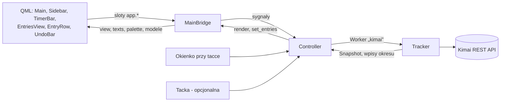

# Plan 5: okno główne (0.10.0) — plan implementacji

> **For agentic workers:** REQUIRED SUB-SKILL: Use superpowers:subagent-driven-development (recommended) or
> superpowers:executing-plans to implement this plan task-by-task. Steps use checkbox (`- [ ]`) syntax for tracking.

**Goal:** Wydać DK Tracker 0.10.0: okno główne na wzór Toggl Track (pasek boczny, pasek timera z trybem ręcznym ⏱/✎,
widok „Wpisy” z edycją w wierszu, ręcznymi wpisami, usuwaniem z „Cofnij” i przewijaniem bez końca) oraz nowe zasady
uruchamiania, tacki i zamykania.

**Architecture:** Rdzeń (`core/`, bez Qt) dostaje operacje na zakończonych wpisach (`KimaiClient.create_entry` /
`delete_entry`, `Tracker.entries` / `add_entry` / `edit_entry` / `delete_entry`) i czystą funkcję listy tygodni
(`core/entry_list.py`). Okno główne to Qt Quick (QML) w `ui/main_window/`: QML tylko rysuje, logika jest w Pythonie —
`MainBridge` (właściwość kontekstu `app`: stan, teksty, paleta, sloty akcji, pasek „Cofnij”) i modele
`QAbstractListModel`. `Controller` łączy okno z trackerem przez istniejący wątek roboczy, tak samo jak okienko przy
tacce; tacka jest opcjonalna.

**Tech Stack:** Python 3 (we Flatpaku 3.13), PySide6 6.11 — Qt Quick, QML, Qt Quick Controls (styl Basic), Qt Widgets
(tacka, okienko, ustawienia); httpx; pytest, pytest-qt (`offscreen`); Kimai 2.67.0 w Dockerze do testów kontraktowych.

**Spec:** [docs/specyfikacja/2026-09-26-okno-glowne-0.10.md](../specyfikacja/2026-09-26-okno-glowne-0.10.md)
(sekcje 2–5, 7, 9, 10, 12; podsumowania i kalendarz — kolejne plany). Kod planu sprawdzony w prototypie (gałąź
robocza `proto-plan5`, poza repozytorium): cały zestaw `554 passed`, testy kontraktowe `14 passed` dwa razy z rzędu.

## Global Constraints

- Pracujemy na `main`, małe commity po polsku (Conventional Commits) z `Co-Authored-By`. **Push, tagi, sekrety GitHuba
  i ustawienia Pages — tylko za wyraźną zgodą użytkownika w danej chwili** (zadanie 12).
- Każde zadanie planu = zadanie w `TODO/` (skill `nowe-zadanie`, potem `zmien-status-zadania`), numery od **0069**.
- Wersja **0.10.0**; kolejne kroki to 0.10.1, 0.10.2… (nie 0.11). Działających wydań nie usuwamy.
- Bez nowych zależności: `QtQuick`, `QtQml`, `QtQuickControls2` są w PySide6 z `.venv` i w bazie PySide Flatpaka
  (sprawdzone 2026-09-26).
- Identyfikatory, komentarze i nazwy plików kodu po angielsku; teksty interfejsu w `core/locales/pl.json` i `en.json`
  (te same klucze w obu — pilnuje test).
- Okno główne: minimum **800×560**, domyślnie 1000×700; „Cofnij” po usunięciu przez **6 s**; lista doładowuje po
  tygodniu, najwyżej **8** pustych tygodni z rzędu.
- Testy zapisu tylko na Kimai w Dockerze (`tests/kimai/kimai-testowe.sh`), nigdy na Kimai firmy. Zrzutów z firmowymi
  wpisami nie commitujemy.
- Token API nigdy w logach, wyjątkach ani plikach.
- Każdy plik `.md` bez uwag markdownlint, linki względne (bez wikilinków), frontmatter z `noteId` i `tags`.
- Przed commitem: `.venv/bin/ruff format . && .venv/bin/ruff check .`, `.venv/bin/pytest`; przy dokumentacji
  `mdfix.py sprawdz`, `linki.py sprawdz`, `frontmatter.py sprawdz`.

## Review Focus

1. **Godziny wpisane w dniu zmiany czasu** (2026-10-25: 02:00–03:00 dwa razy; 2026-03-29: brak 02:00–03:00) —
   użytkownik oczekuje, że Kimai dostanie dokładnie to, co wpisał. Test:
   `test_hours_typed_on_a_day_the_clocks_change_are_sent_as_typed` (zadanie 2).
2. **Odświeżenie co minutę w czasie „Cofnij”** — usunięty wiersz nie może wrócić na listę, zanim minie 6 s. Test:
   `test_a_refresh_during_the_undo_time_keeps_the_row_hidden` (zadanie 6).
3. **Odświeżenie w trakcie pisania w wierszu** — przebudowa listy zgubiłaby wpisywany tekst i kursor. Test:
   `test_a_refresh_waits_while_a_field_is_being_edited` (zadanie 8).
4. **Przewijanie wyników wyszukiwania** — koniec listy wyników nie doładowuje tygodni i nie miesza ich z wynikami.
   Test: `test_scrolling_through_search_results_does_not_load_weeks` (zadanie 8).
5. **Brak połączenia** — ostatnie dane widoczne, lista się przewija, ale edycja i pasek timera zablokowane do powrotu
   połączenia (spec, sekcja 9). Test: `test_offline_locks_editing_but_not_the_list` (zadanie 8).

## Rozstrzygnięcia względem specyfikacji

| Nr | Rozstrzygnięcie | Dlaczego | Koszt, gdyby było źle |
| --- | --- | --- | --- |
| R1 | Zapamiętujemy rozmiar i widok okna, **bez pozycji** | Wayland nie pozwala aplikacji ustawić położenia okna; decyduje kompozytor | pole w `Memory` i dwie linie w kontrolerze |
| R2 | W menu tacki „Otwórz” zmienia nazwę na **„Szybkie okienko”**, obok nowe „Otwórz DK Tracker” | dwie pozycje „Otwórz…” byłyby mylące | jeden klucz tekstu |
| R3 | Ręczny wpis mieści się w jednym dniu; koniec ≤ początek → `errEndBeforeBegin` | spec nie mówi o wpisie przez północ; Toggl dzieli go na dwa | nowa opcja „następny dzień” w polu końca |
| R4 | Godziny wysyłamy jako czas zegarowy w strefie Kimai, także w dniu zmiany czasu | tak działa start z okienka; Kimai sam liczy czas trwania | przy niejednoznacznej 02:30 Kimai wybiera pierwszą |
| R5 | Brak połączenia wyłącza pasek timera i wiersze; wyszukiwanie i przewijanie działają | spec, sekcja 9: „blokada edycji” | jedna właściwość `enabled` w QML |
| R6 | Druga instancja (uruchomienie z menu, gdy aplikacja działa) otwiera **okno główne** | spec, sekcja 7; dotąd otwierała okienko | jedna linia w `main.py` |
| R7 | Widok „Podsumowania” i „Kalendarz” nie pokazują się w pasku bocznym w 0.10.0 | spec, sekcja 5: widoki pojawiają się, gdy są gotowe | — |

## Struktura plików

```text
src/dk_tracker/core/kimai_client.py        zadanie 1   create_entry, delete_entry, range z full=true
src/dk_tracker/core/tracker.py             zadanie 2   entries, add_entry, edit_entry, delete_entry
src/dk_tracker/core/settings.py            zadanie 3   show_tray; rozmiar i widok okna głównego
src/dk_tracker/core/entry_list.py          zadanie 4   tygodnie i dni z sumami (czyste funkcje)
src/dk_tracker/core/i18n.py, locales/      zadania 2, 4, 6–9   Translator.messages(), nowe teksty PL/EN
src/dk_tracker/ui/main_window/models.py    zadanie 5   modele dla QML
src/dk_tracker/ui/main_window/bridge.py    zadania 6–8 MainBridge — obiekt `app`
src/dk_tracker/ui/main_window/window.py    zadania 7–8 MainWindow: silnik QML, ikony, pokaż/ukryj
src/dk_tracker/ui/main_window/qml/*.qml    zadania 7–8 widoki
src/dk_tracker/ui/app.py, tray.py, worker.py, main.py, icons.py   zadania 7–8   kontroler, menu tacki, start
src/dk_tracker/desktop/notifications.py    zadanie 8   kliknięcie powiadomienia → okno główne
src/dk_tracker/ui/settings_dialog.py       zadanie 9   „Pokazuj ikonę w tacce”
tests/kimai/test_kontrakt.py               zadanie 10  kontrakt na Kimai w Dockerze
docs/…, AGENTS.md                          zadanie 11  dokumentacja
pyproject.toml, __init__.py, metainfo, README     zadanie 12  wersja 0.10.0 i wydanie
```



---

### Task 1: Klient API: wpis z godzinami od–do i usuwanie

**Files:**

- Create: `tests/core/test_kimai_client_entries.py`
- Modify: `src/dk_tracker/core/kimai_client.py`

**Interfaces:**

- Consumes: istniejący `KimaiClient._request`, `_entry`, `range(begin, end)`.
- Produces: `KimaiClient.create_entry(*, project_id: int, activity_id: int, description: str, begin: str,
  end: str, billable: bool | None = None) -> Entry` (POST `/api/timesheets` z `begin` i `end`, `billable` tylko gdy
  nie `None`); `KimaiClient.delete_entry(entry_id: int) -> None` (DELETE `/api/timesheets/{id}`); `range(...)`
  wysyła też `full=true` (nazwy i kolory projektów w wierszach listy).

- [ ] **Step 1: Napisz testy (padające)**

Nowy plik `tests/core/test_kimai_client_entries.py`:

```python
"""Plan 5: finished entries for the main window — a whole period, created with an end, deleted."""

import json

import httpx
import pytest

from dk_tracker.core.errors import ApiError, ErrorKind

from .test_kimai_client import ENTRY, client_for


def test_range_asks_for_full_objects_so_rows_can_name_project_and_activity():
    client, rec = client_for(lambda r: httpx.Response(200, json=[ENTRY]))
    client.range("2026-09-21T00:00:00", "2026-09-27T23:59:59")
    assert dict(rec.last.url.params)["full"] == "true"


def test_create_entry_posts_begin_and_end():
    client, rec = client_for(lambda r: httpx.Response(200, json=dict(ENTRY, end="2026-09-25T17:34:00+0000")))
    entry = client.create_entry(
        project_id=1,
        activity_id=2,
        description="Uzupełnienie wpisu z przedpołudnia",
        begin="2026-09-25T09:00:00",
        end="2026-09-25T10:30:00",
        billable=None,
    )
    assert rec.last.method == "POST" and rec.last.url.path == "/api/timesheets"
    assert json.loads(rec.last.read()) == {
        "begin": "2026-09-25T09:00:00",
        "end": "2026-09-25T10:30:00",
        "project": 1,
        "activity": 2,
        "description": "Uzupełnienie wpisu z przedpołudnia",
    }
    assert entry.end is not None


def test_create_entry_sends_billable_only_when_chosen():
    client, rec = client_for(lambda r: httpx.Response(200, json=ENTRY))
    client.create_entry(project_id=1, activity_id=2, description="x" * 20, begin="a", end="b", billable=False)
    assert json.loads(rec.last.read())["billable"] is False


def test_delete_entry():
    client, rec = client_for(lambda r: httpx.Response(204))
    client.delete_entry(8)
    assert (rec.last.method, rec.last.url.path) == ("DELETE", "/api/timesheets/8")


def test_delete_of_a_foreign_or_exported_entry_is_forbidden():
    client, _ = client_for(lambda r: httpx.Response(403, json={"message": "Access denied."}))
    with pytest.raises(ApiError) as error:
        client.delete_entry(8)
    assert error.value.kind is ErrorKind.FORBIDDEN
```

- [ ] **Step 2: Uruchom testy — mają paść**

Run: `.venv/bin/pytest tests/core/test_kimai_client_entries.py -v`

Expected: FAIL — `AttributeError: 'KimaiClient' object has no attribute 'create_entry'`

- [ ] **Step 3: Implementacja**

Zmiana w `src/dk_tracker/core/kimai_client.py`:

```diff
diff --git a/src/dk_tracker/core/kimai_client.py b/src/dk_tracker/core/kimai_client.py
index b55f3c3..9722feb 100644
--- a/src/dk_tracker/core/kimai_client.py
+++ b/src/dk_tracker/core/kimai_client.py
@@ -83,7 +83,7 @@ class KimaiClient:
         """Every entry starting inside the window; Kimai answers 404 past the last page."""
         collected: list[Entry] = []
         for page in range(1, max_pages + 1):
-            params = {"begin": begin, "end": end, "size": str(page_size), "page": str(page)}
+            params = {"begin": begin, "end": end, "size": str(page_size), "page": str(page), "full": "true"}
             try:
                 response = self._request("GET", "/api/timesheets", params=params)
             except ApiError as error:
@@ -114,6 +114,31 @@ class KimaiClient:
             body["billable"] = billable
         return _one(Entry.from_api, self._json("POST", "/api/timesheets", json=body))
 
+    def create_entry(
+        self,
+        *,
+        project_id: int,
+        activity_id: int,
+        description: str,
+        begin: str,
+        end: str,
+        billable: bool | None = None,
+    ) -> Entry:
+        """A finished entry typed in by hand (Plan 5): Kimai takes begin and end in one POST."""
+        body: dict[str, Any] = {
+            "begin": begin,
+            "end": end,
+            "project": project_id,
+            "activity": activity_id,
+            "description": description,
+        }
+        if billable is not None:
+            body["billable"] = billable
+        return _one(Entry.from_api, self._json("POST", "/api/timesheets", json=body))
+
+    def delete_entry(self, entry_id: int) -> None:
+        self._request("DELETE", f"/api/timesheets/{entry_id}")
+
     def stop(self, entry_id: int) -> Entry:
         return _one(Entry.from_api, self._json("PATCH", f"/api/timesheets/{entry_id}/stop"))
 
```

- [ ] **Step 4: Uruchom testy — mają przejść**

Run: `.venv/bin/pytest tests/core/test_kimai_client_entries.py -v` i cały zestaw `.venv/bin/pytest`

Expected: PASS; cały zestaw zielony (bez Dockera i pulpitu).

- [ ] **Step 5: Lint i commit**

```bash
.venv/bin/ruff format . && .venv/bin/ruff check .
git add tests/core/test_kimai_client_entries.py src/dk_tracker/core/kimai_client.py
git commit -m "feat(core): klient Kimai dodaje wpis z godzinami od–do i usuwa wpis"
```

---

### Task 2: Tracker: wpisy okresu, ręczny wpis, edycja i usuwanie

**Files:**

- Create: `tests/core/test_tracker_entries.py`
- Modify: `tests/core/fakes.py`, `src/dk_tracker/core/locales/en.json`, `src/dk_tracker/core/locales/pl.json`,
  `src/dk_tracker/core/tracker.py`

**Interfaces:**

- Consumes: zadanie 1 (`create_entry`, `delete_entry`, `range` z `full=true`); istniejące `_check` (F-11),
  `_require_choice`, `_wall_clock`, `kimai_stamp`, `is_billable_rejected`, `_lock_billable`, `refresh_full`.
- Produces (`src/dk_tracker/core/tracker.py`):
  - `Tracker.entries(first_day: date, last_day: date) -> tuple[Entry, ...]` — zakończone wpisy dni w strefie Kimai,
    najnowsze pierwsze, bez trwającego;
  - `Tracker.add_entry(*, day: date, begin: str, end: str, project_id, activity_id, description: str,
    billable: bool | None) -> Snapshot` — notice `savedEntry` albo `errBillableDenied` (zapis bez `$`);
  - `Tracker.edit_entry(entry: Entry, *, description=None, project_id=None, activity_id=None, begin=None,
    end=None, billable=None) -> Snapshot` — wysyła tylko zmiany; `TrackerError` z kluczem `errExported`,
    `errEndBeforeBegin`, `errInvalidTime`, `billableLocked`, `errBillableDenied`;
  - `Tracker.delete_entry(entry: Entry) -> Snapshot`;
  - `FakeClient` w `tests/core/fakes.py`: `range` filtruje po dacie, `create_entry`, `delete_entry`, `update` z
    `project`/`activity`; klucz tekstu `savedEntry` (PL/EN).

- [ ] **Step 1: Napisz testy (padające)**

Zmiana w `tests/core/fakes.py`:

```diff
diff --git a/tests/core/fakes.py b/tests/core/fakes.py
index f963b7e..6b3bcdd 100644
--- a/tests/core/fakes.py
+++ b/tests/core/fakes.py
@@ -106,9 +106,46 @@ class FakeClient:
         return sorted(found, key=lambda e: e.begin, reverse=True)[:size]
 
     def range(self, begin, end):
+        """Like Kimai: entries that start inside the window (begin and end are Kimai-local stamps)."""
         self.calls.append(("range", begin, end))
         self._check("range")
-        return list(self.range_entries if self.range_entries is not None else self.entries.values())
+        if self.range_entries is not None:
+            return list(self.range_entries)
+        try:
+            low, high = self._parse(begin), self._parse(end)
+        except (ValueError, KeyError):  # a made-up account zone: the tracker falls back, so do we
+            return list(self.entries.values())
+        return [e for e in self.entries.values() if low <= e.begin <= high]
+
+    def create_entry(self, *, project_id, activity_id, description, begin, end, billable=None):
+        self.calls.append(("create_entry", project_id, activity_id, description, begin, end, billable))
+        self._check("create_entry")
+        if billable is not None and self.billable_forbidden:
+            raise ApiError(ErrorKind.REJECTED, 400, EXTRA_FIELDS)
+        project = next((p for p in self.projects_list if p.id == project_id), None)
+        activity = next((a for a in self.activities_list if a.id == activity_id), None)
+        entry = replace(
+            make_entry(
+                self.next_id,
+                self._parse(begin),
+                self._parse(end),
+                description=description,
+                billable=True if billable is None else billable,
+                project_id=project_id,
+                activity_id=activity_id,
+            ),
+            project_name=project.name if project else None,
+            project_color=project.color if project else None,
+            activity_name=activity.name if activity else None,
+        )
+        self.next_id += 1
+        self.add(entry)
+        return self._as_posted(entry)
+
+    def delete_entry(self, entry_id):
+        self.calls.append(("delete_entry", entry_id))
+        self._check("delete_entry")
+        del self.entries[entry_id]
 
     def projects(self):
         self._check("projects")
```

Nowy plik `tests/core/test_tracker_entries.py`:

```python
"""Plan 5: the main window's entries — a period, typed in by hand, edited in place, deleted."""

from dataclasses import replace
from datetime import date, timedelta

import pytest

from dk_tracker.core.errors import TrackerError
from dk_tracker.core.settings import Memory

from .fakes import NOW, make_entry
from .test_tracker_refresh import make_tracker

GOOD = "Formularz rezerwacji — walidacja dat"
FRIDAY = date(2026, 9, 25)  # NOW is Friday 2026-09-25, 16:04 UTC (18:04 in Warsaw)


def calls(client, name):
    return [call for call in client.calls if call[0] == name]


def booked(client):
    """Morning and afternoon on Friday, one on Monday, one the week before, one running."""
    h = timedelta(hours=1)
    morning = client.add(make_entry(1, NOW - 9 * h, NOW - 8 * h, description=GOOD))
    afternoon = client.add(make_entry(2, NOW - 3 * h, NOW - 2 * h, description=GOOD))
    monday = client.add(make_entry(3, NOW - 4 * 24 * h, NOW - 4 * 24 * h + h, description=GOOD))
    earlier = client.add(make_entry(4, NOW - 9 * 24 * h, NOW - 9 * 24 * h + h, description=GOOD))
    client.add(make_entry(5, NOW - h / 2, description=GOOD))
    return morning, afternoon, monday, earlier


# -- a period ------------------------------------------------------------------


def test_entries_of_a_period_are_the_finished_ones_newest_first():
    tracker, client, _ = make_tracker()
    morning, afternoon, monday, _earlier = booked(client)
    entries = tracker.entries(date(2026, 9, 21), FRIDAY)
    assert entries == (afternoon, morning, monday)  # the running entry sits in the timer bar
    assert calls(client, "range")[-1][1:] == ("2026-09-21T00:00:00", "2026-09-25T23:59:59")


# -- typed in by hand ----------------------------------------------------------


def test_add_entry_books_the_typed_hours_on_that_day_in_the_kimai_zone():
    tracker, client, _ = make_tracker()
    snapshot = tracker.add_entry(
        day=FRIDAY,
        begin="09:00",
        end="10:30",
        project_id=1,
        activity_id=2,
        description=f"  {GOOD} ",
        billable=None,
    )
    assert calls(client, "create_entry") == [
        ("create_entry", 1, 2, GOOD, "2026-09-25T09:00:00", "2026-09-25T10:30:00", None)
    ]
    assert snapshot.notice == "savedEntry"


@pytest.mark.parametrize(
    ("begin", "end", "key"),
    [
        ("10:30", "09:00", "errEndBeforeBegin"),
        ("10:00", "10:00", "errEndBeforeBegin"),
        ("9", "10:00", "errInvalidTime"),
    ],
)
def test_add_entry_refuses_impossible_hours(begin, end, key):
    tracker, client, _ = make_tracker()
    with pytest.raises(TrackerError) as error:
        tracker.add_entry(
            day=FRIDAY, begin=begin, end=end, project_id=1, activity_id=2, description=GOOD, billable=None
        )
    assert error.value.key == key
    assert calls(client, "create_entry") == []


@pytest.mark.parametrize(
    ("project", "activity", "description", "key"),
    [(None, 2, GOOD, "errNoProject"), (1, None, GOOD, "errNoActivity"), (1, 2, "krótko", "errDescShort")],
)
def test_add_entry_follows_the_same_rules_as_a_start(project, activity, description, key):
    tracker, client, _ = make_tracker()
    with pytest.raises(TrackerError) as error:
        tracker.add_entry(
            day=FRIDAY,
            begin="09:00",
            end="10:00",
            project_id=project,
            activity_id=activity,
            description=description,
            billable=None,
        )
    assert error.value.key == key


def test_add_entry_with_a_refused_billable_is_saved_without_it_and_locks_the_switch():
    tracker, client, _ = make_tracker()
    client.billable_forbidden = True
    snapshot = tracker.add_entry(
        day=FRIDAY, begin="09:00", end="10:00", project_id=1, activity_id=2, description=GOOD, billable=False
    )
    assert [call[-1] for call in calls(client, "create_entry")] == [False, None]
    assert snapshot.billable_allowed is False
    assert snapshot.notice == "errBillableDenied"


# -- edited in place -----------------------------------------------------------


def test_edit_entry_sends_only_what_changed():
    tracker, client, _ = make_tracker()
    morning, *_ = booked(client)
    snapshot = tracker.edit_entry(
        morning,
        description=f"{GOOD} i testy",
        begin="09:15",
        end=None,
        project_id=2,
        activity_id=2,
        billable=False,
    )
    assert calls(client, "update") == [
        (
            "update",
            1,
            {
                "description": f"{GOOD} i testy",
                "project": 2,
                "activity": 2,
                "begin": "2026-09-25T09:15:00",
                "billable": False,
            },
        )
    ]
    assert snapshot.notice == "savedEntry"


def test_edit_entry_keeps_the_day_and_checks_the_hours():
    tracker, client, _ = make_tracker()
    morning, *_ = booked(client)  # 09:04–10:04 in Warsaw
    tracker.edit_entry(morning, end="12:00")
    assert calls(client, "update")[-1][2] == {"end": "2026-09-25T12:00:00"}
    with pytest.raises(TrackerError) as error:
        tracker.edit_entry(morning, begin="11:00", end="10:00")
    assert error.value.key == "errEndBeforeBegin"


def test_edit_without_a_change_sends_nothing():
    tracker, client, _ = make_tracker()
    morning, *_ = booked(client)
    tracker.edit_entry(morning, description=GOOD, project_id=1, activity_id=1, billable=True)
    assert calls(client, "update") == []


def test_edit_checks_the_description_like_a_start():
    tracker, client, _ = make_tracker()
    morning, *_ = booked(client)
    with pytest.raises(TrackerError) as error:
        tracker.edit_entry(morning, description="poprawki")
    assert (error.value.key, error.value.params) == ("errDescGeneric", {"word": "poprawki"})


def test_an_exported_entry_is_not_edited_or_deleted():
    tracker, client, _ = make_tracker()
    morning, *_ = booked(client)
    exported = replace(morning, exported=True)
    for action in (
        lambda: tracker.edit_entry(exported, description=f"{GOOD} 2"),
        lambda: tracker.delete_entry(exported),
    ):
        with pytest.raises(TrackerError) as error:
            action()
        assert error.value.key == "errExported"
    assert calls(client, "update") == calls(client, "delete_entry") == []


def test_billable_without_permission_is_refused_before_asking_kimai():
    tracker, client, _ = make_tracker(memory=Memory(billable_allowed=False))
    morning, *_ = booked(client)
    with pytest.raises(TrackerError) as error:
        tracker.edit_entry(morning, billable=False)
    assert error.value.key == "billableLocked"


def test_a_billable_refused_by_kimai_locks_the_switch():
    tracker, client, _ = make_tracker()
    morning, *_ = booked(client)
    client.billable_forbidden = True
    with pytest.raises(TrackerError) as error:
        tracker.edit_entry(morning, billable=False)
    assert error.value.key == "errBillableDenied"
    assert tracker.snapshot.billable_allowed is False


# -- deleted -------------------------------------------------------------------


def test_delete_entry():
    tracker, client, _ = make_tracker()
    morning, *_ = booked(client)
    tracker.delete_entry(morning)
    assert calls(client, "delete_entry") == [("delete_entry", 1)]
    assert 1 not in client.entries


# -- the days the clocks change (Kimai's zone: Europe/Warsaw) --------------------


@pytest.mark.parametrize(
    ("day", "begin", "end"),
    [
        (date(2026, 10, 25), "02:30", "02:45"),  # 02:00–03:00 happens twice: the first one is meant
        (date(2026, 10, 25), "01:30", "03:30"),
        (date(2026, 3, 29), "01:30", "03:30"),  # 02:00–03:00 does not exist
    ],
)
def test_hours_typed_on_a_day_the_clocks_change_are_sent_as_typed(day, begin, end):
    tracker, client, _ = make_tracker()
    tracker.add_entry(
        day=day, begin=begin, end=end, project_id=1, activity_id=2, description=GOOD, billable=None
    )
    [call] = calls(client, "create_entry")
    assert call[4:6] == (f"{day}T{begin}:00", f"{day}T{end}:00")
```

- [ ] **Step 2: Uruchom testy — mają paść**

Run: `.venv/bin/pytest tests/core/test_tracker_entries.py -v`

Expected: FAIL — `AttributeError: 'Tracker' object has no attribute 'entries'`

- [ ] **Step 3: Implementacja**

Zmiana w `src/dk_tracker/core/locales/en.json`:

```diff
diff --git a/src/dk_tracker/core/locales/en.json b/src/dk_tracker/core/locales/en.json
index c8cd824..193c8e8 100644
--- a/src/dk_tracker/core/locales/en.json
+++ b/src/dk_tracker/core/locales/en.json
@@ -38,6 +38,7 @@
   "savedTime": "Start time saved.",
   "savedBillable": "Saved.",
   "savedWork": "Project and activity saved.",
+  "savedEntry": "Entry saved.",
   "errNoProject": "Pick a project.",
   "errNoActivity": "Pick a type of work.",
   "errNothingRunning": "Nothing is being tracked.",
```

Zmiana w `src/dk_tracker/core/locales/pl.json`:

```diff
diff --git a/src/dk_tracker/core/locales/pl.json b/src/dk_tracker/core/locales/pl.json
index 2f22479..7f5bd8b 100644
--- a/src/dk_tracker/core/locales/pl.json
+++ b/src/dk_tracker/core/locales/pl.json
@@ -38,6 +38,7 @@
   "savedTime": "Godzina rozpoczęcia zapisana.",
   "savedBillable": "Zapisane.",
   "savedWork": "Projekt i rodzaj pracy zapisane.",
+  "savedEntry": "Wpis zapisany.",
   "errNoProject": "Wybierz projekt.",
   "errNoActivity": "Wybierz rodzaj pracy.",
   "errNothingRunning": "Nic nie jest mierzone.",
```

Zmiana w `src/dk_tracker/core/tracker.py`:

```diff
diff --git a/src/dk_tracker/core/tracker.py b/src/dk_tracker/core/tracker.py
index bcc06d6..9dc28ca 100644
--- a/src/dk_tracker/core/tracker.py
+++ b/src/dk_tracker/core/tracker.py
@@ -10,7 +10,7 @@ from __future__ import annotations
 import logging
 from collections.abc import Callable
 from dataclasses import dataclass, replace
-from datetime import UTC, datetime, tzinfo
+from datetime import UTC, date, datetime, time, tzinfo
 from typing import Any
 
 from .billable import default_billable, is_billable_rejected
@@ -327,6 +327,111 @@ class Tracker:
         self._found = tuple(entry for entry in self._client.search(term, SEARCH_SIZE) if not entry.running)
         return self._found
 
+    # -- the main window's entries (Plan 5) -----------------------------------------
+
+    def entries(self, first_day: date, last_day: date) -> tuple[Entry, ...]:
+        """Finished entries starting on these days (Kimai's zone), newest first. The running one
+        is left out: it sits in the timer bar. Raises ApiError — the caller shows it."""
+        tz = self.kimai_tz()
+        begin = datetime.combine(first_day, time.min, tz)
+        end = datetime.combine(last_day, time(23, 59, 59), tz)
+        found = self._client.range(kimai_stamp(begin, tz), kimai_stamp(end, tz))
+        return tuple(sorted((e for e in found if not e.running), key=lambda e: e.begin, reverse=True))
+
+    def add_entry(
+        self,
+        *,
+        day: date,
+        begin: str,
+        end: str,
+        project_id: int | None,
+        activity_id: int | None,
+        description: str,
+        billable: bool | None,
+    ) -> Snapshot:
+        """Time typed in by hand: the same rules as a start, plus hours that make sense."""
+        project, activity = self._require_choice(project_id, activity_id)
+        text = description.strip()
+        self._check(text)
+        tz = self.kimai_tz()
+        noon = datetime.combine(day, time(12), tz)
+        begin_at, end_at = self._wall_clock(noon, begin, tz), self._wall_clock(noon, end, tz)
+        if end_at <= begin_at:
+            raise TrackerError("errEndBeforeBegin")
+        wanted = billable if self._snapshot.billable_allowed else None
+        stamps = {"begin": kimai_stamp(begin_at, tz), "end": kimai_stamp(end_at, tz)}
+        notice = "savedEntry"
+        try:
+            self._client.create_entry(
+                project_id=project, activity_id=activity, description=text, billable=wanted, **stamps
+            )
+        except ApiError as error:
+            if wanted is None or not is_billable_rejected(error):
+                raise
+            self._lock_billable()
+            self._client.create_entry(
+                project_id=project, activity_id=activity, description=text, billable=None, **stamps
+            )
+            notice = "errBillableDenied"
+        self.refresh_full()
+        return self._set(notice=notice)
+
+    def edit_entry(
+        self,
+        entry: Entry,
+        *,
+        description: str | None = None,
+        project_id: int | None = None,
+        activity_id: int | None = None,
+        begin: str | None = None,
+        end: str | None = None,
+        billable: bool | None = None,
+    ) -> Snapshot:
+        """A finished entry edited in place; only what changed is sent. Hours stay on its day."""
+        if entry.exported:
+            raise TrackerError("errExported")
+        changes: dict[str, object] = {}
+        if description is not None and description.strip() != entry.description:
+            self._check(description.strip())
+            changes["description"] = description.strip()
+        if project_id is not None or activity_id is not None:
+            project, activity = self._require_choice(
+                project_id or entry.project_id, activity_id or entry.activity_id
+            )
+            if (project, activity) != (entry.project_id, entry.activity_id):
+                changes.update(project=project, activity=activity)
+        if begin is not None or end is not None:
+            tz = self.kimai_tz()
+            begin_at = self._wall_clock(entry.begin, begin, tz) if begin else entry.begin
+            end_at = self._wall_clock(entry.begin, end, tz) if end else entry.end
+            if end_at is not None and end_at <= begin_at:
+                raise TrackerError("errEndBeforeBegin")
+            if begin_at != entry.begin:
+                changes["begin"] = kimai_stamp(begin_at, tz)
+            if end_at is not None and end_at != entry.end:
+                changes["end"] = kimai_stamp(end_at, tz)
+        if billable is not None and billable != entry.billable:
+            if not self._snapshot.billable_allowed:
+                raise TrackerError("billableLocked")
+            changes["billable"] = billable
+        if not changes:
+            return self._snapshot
+        try:
+            self._client.update(entry.id, changes)
+        except ApiError as error:
+            if "billable" in changes and is_billable_rejected(error):
+                self._lock_billable()
+                raise TrackerError("errBillableDenied") from error
+            raise
+        self.refresh_full()  # names, colours and the totals follow from Kimai
+        return self._set(notice="savedEntry")
+
+    def delete_entry(self, entry: Entry) -> Snapshot:
+        if entry.exported:
+            raise TrackerError("errExported")
+        self._client.delete_entry(entry.id)
+        return self.refresh_full()
+
     def remember(self, **changes: Any) -> None:
         """Remembered UI state (e.g. a hint already shown), saved with the tracker's own memory."""
         self._update_memory(**changes)
```

- [ ] **Step 4: Uruchom testy — mają przejść**

Run: `.venv/bin/pytest tests/core/test_tracker_entries.py -v` i cały zestaw `.venv/bin/pytest`

Expected: PASS; cały zestaw zielony (bez Dockera i pulpitu).

- [ ] **Step 5: Lint i commit**

```bash
.venv/bin/ruff format . && .venv/bin/ruff check .
git add tests/core/fakes.py tests/core/test_tracker_entries.py src/dk_tracker/core/locales/en.json src/dk_tracker/core/locales/pl.json src/dk_tracker/core/tracker.py
git commit -m "feat(core): wpisy okresu, ręczny wpis, edycja i usuwanie zakończonego wpisu"
```

---

### Task 3: Ustawienia: ikona w tacce, rozmiar okna głównego

**Files:**

- Create: `tests/core/test_settings_main_window.py`
- Modify: `src/dk_tracker/core/settings.py`

**Interfaces:**

- Produces: `Settings.show_tray: bool = True`; `Memory.main_width: int = 1000`,
  `Memory.main_height: int = 700`, `Memory.main_view: str = "entries"` (stare pliki JSON bez tych pól wczytują
  się z domyślnymi). Pozycji okna nie zapamiętujemy — rozstrzygnięcie R1.

- [ ] **Step 1: Napisz testy (padające)**

Nowy plik `tests/core/test_settings_main_window.py`:

```python
"""Plan 5: the tray can be turned off; the main window's size and view are remembered."""

from dk_tracker.core.settings import Memory, Settings, load_json, save_json


def test_tray_is_on_by_default_and_can_be_turned_off(tmp_path):
    assert Settings().show_tray is True
    path = tmp_path / "settings.json"
    save_json(Settings(url="https://kimai.test", show_tray=False), path)
    assert load_json(Settings, path).show_tray is False


def test_main_window_size_and_view_are_remembered(tmp_path):
    memory = Memory()
    assert (memory.main_width, memory.main_height, memory.main_view) == (1000, 700, "entries")
    path = tmp_path / "state.json"
    save_json(Memory(main_width=1200, main_height=800, main_view="entries"), path)
    loaded = load_json(Memory, path)
    assert (loaded.main_width, loaded.main_height) == (1200, 800)


def test_settings_from_an_older_version_get_the_tray_on(tmp_path):
    path = tmp_path / "settings.json"
    path.write_text('{"url": "https://kimai.test"}', encoding="utf-8")
    assert load_json(Settings, path).show_tray is True
```

- [ ] **Step 2: Uruchom testy — mają paść**

Run: `.venv/bin/pytest tests/core/test_settings_main_window.py -v`

Expected: FAIL — `TypeError: Settings.__init__() got an unexpected keyword argument 'show_tray'`

- [ ] **Step 3: Implementacja**

Zmiana w `src/dk_tracker/core/settings.py`:

```diff
diff --git a/src/dk_tracker/core/settings.py b/src/dk_tracker/core/settings.py
index 595bcc7..d2dae0c 100644
--- a/src/dk_tracker/core/settings.py
+++ b/src/dk_tracker/core/settings.py
@@ -23,6 +23,7 @@ class Settings:
     notify_connection: bool = True
     notify_menu_actions: bool = True
     autostart: bool = False
+    show_tray: bool = True  # Plan 5: only where the desktop has a tray; off = the main window alone
 
     def normalized(self) -> Settings:
         return replace(
@@ -45,6 +46,9 @@ class Memory:
     tray_hint_shown: bool = False  # the "no system tray" hint is shown once (spec, section 7)
     popup_width: int = 460  # the quick window as the user last sized it (the add-on's popup is 460 × ≤600)
     popup_height: int = 600
+    main_width: int = 1000  # the main window (Plan 5); Wayland lets no app place its window, so no position
+    main_height: int = 700
+    main_view: str = "entries"  # entries | summary | calendar
 
 
 def _base(variable: str, fallback: Path) -> Path:
```

- [ ] **Step 4: Uruchom testy — mają przejść**

Run: `.venv/bin/pytest tests/core/test_settings_main_window.py -v` i cały zestaw `.venv/bin/pytest`

Expected: PASS; cały zestaw zielony (bez Dockera i pulpitu).

- [ ] **Step 5: Lint i commit**

```bash
.venv/bin/ruff format . && .venv/bin/ruff check .
git add tests/core/test_settings_main_window.py src/dk_tracker/core/settings.py
git commit -m "feat(core): ustawienie ikony w tacce i zapamiętany rozmiar okna głównego"
```

---

### Task 4: Lista tygodni i dni (`core/entry_list.py`)

**Files:**

- Create: `tests/core/test_entry_list.py`, `src/dk_tracker/core/entry_list.py`
- Modify: `src/dk_tracker/core/locales/en.json`, `src/dk_tracker/core/locales/pl.json`

**Interfaces:**

- Consumes: `Entry`, `local_day`, `short_duration` z rdzenia; `Translator`.
- Produces (`src/dk_tracker/core/entry_list.py`): `ListRow(kind: str, key: str, label: str, total: str,
  entry: Entry | None)` z `kind` ∈ {`"week"`, `"day"`, `"entry"`}; `first_day_of_week(day: date,
  first_weekday: int) -> date`; `build_rows(entries, tz, today: date, first_weekday: int, t) -> list[ListRow]`
  (etykiety tygodnia `weekThis` / `weekLast` / `weekRange`, rok przy innym roku niż bieżący).

- [ ] **Step 1: Napisz testy (padające)**

Nowy plik `tests/core/test_entry_list.py`:

```python
"""Plan 5: the main window's list — weeks, then days, then entries, each with its total."""

from datetime import UTC, date, datetime, timedelta
from zoneinfo import ZoneInfo

from dk_tracker.core.entry_list import build_rows, first_day_of_week
from dk_tracker.core.i18n import Translator

from .fakes import make_entry

WARSAW = ZoneInfo("Europe/Warsaw")
PL = Translator("pl")
TODAY = date(2026, 9, 25)  # Friday


def at(day, hour, minutes=60, entry_id=1):
    begin = datetime(day.year, day.month, day.day, hour, tzinfo=WARSAW).astimezone(UTC)
    return make_entry(entry_id, begin, begin + timedelta(minutes=minutes))


def test_first_day_of_week_follows_the_account():
    assert first_day_of_week(TODAY, 0) == date(2026, 9, 21)  # Monday
    assert first_day_of_week(TODAY, 6) == date(2026, 9, 20)  # Sunday


def test_rows_are_weeks_then_days_then_entries_with_totals():
    friday_a, friday_b = at(TODAY, 9, 90, 1), at(TODAY, 13, 30, 2)
    monday = at(date(2026, 9, 21), 8, 60, 3)
    before = at(date(2026, 9, 18), 10, 45, 4)
    rows = build_rows([friday_b, friday_a, monday, before], WARSAW, TODAY, 0, PL)
    assert [(r.kind, r.label, r.total) for r in rows] == [
        ("week", "Ten tydzień", "3:00"),
        ("day", "Dziś", "2:00"),
        ("entry", "", "0:30"),
        ("entry", "", "1:30"),
        ("day", "pon., 21 wrz", "1:00"),
        ("entry", "", "1:00"),
        ("week", "Poprzedni tydzień", "0:45"),
        ("day", "pt., 18 wrz", "0:45"),
        ("entry", "", "0:45"),
    ]
    assert [r.entry.id for r in rows if r.kind == "entry"] == [2, 1, 3, 4]


def test_older_weeks_are_named_by_their_days():
    old = at(date(2026, 8, 12), 9, 60)
    rows = build_rows([old], WARSAW, TODAY, 0, PL)
    assert rows[0].label == "10 sie – 16 sie"
    assert rows[1].label == "śr., 12 sie"


def test_a_week_of_another_year_says_the_year():
    old = at(date(2025, 12, 30), 9, 60)
    assert build_rows([old], WARSAW, TODAY, 0, PL)[0].label == "29 gru 2025 – 4 sty 2026"


def test_every_row_has_a_stable_key_for_the_view():
    rows = build_rows([at(TODAY, 9, 60, 7)], WARSAW, TODAY, 0, PL)
    assert [r.key for r in rows] == ["week:2026-09-21", "day:2026-09-25", "entry:7"]


def test_english():
    rows = build_rows([at(TODAY, 9, 60)], WARSAW, TODAY, 0, Translator("en"))
    assert (rows[0].label, rows[1].label) == ("This week", "Today")
```

- [ ] **Step 2: Uruchom testy — mają paść**

Run: `.venv/bin/pytest tests/core/test_entry_list.py -v`

Expected: FAIL — `ModuleNotFoundError: No module named 'dk_tracker.core.entry_list'`

- [ ] **Step 3: Implementacja**

Nowy plik `src/dk_tracker/core/entry_list.py`:

```python
"""The main window's list (Plan 5): weeks, then days, then entries — each with its total.

Plain rows with ready texts, so the QML view only draws and every wording is tested here.
"""

from __future__ import annotations

from collections.abc import Callable, Iterable
from dataclasses import dataclass
from datetime import date, timedelta, tzinfo
from typing import Literal

from .grouping import day_total
from .models import Entry
from .presentation import day_label
from .timefmt import local_day, short_duration

Kind = Literal["week", "day", "entry"]


@dataclass(frozen=True)
class ListRow:
    kind: Kind
    key: str  # stable across refreshes: "week:2026-09-21", "day:2026-09-25", "entry:7"
    label: str  # week and day headers; "" for an entry
    total: str  # "h:mm" — of the week, the day, or the entry
    entry: Entry | None = None


def first_day_of_week(day: date, first_weekday: int) -> date:
    """0 = Monday … 6 = Sunday, as the Kimai account says."""
    return day - timedelta(days=(day.weekday() - first_weekday) % 7)


def build_rows(
    entries: Iterable[Entry], tz: tzinfo, today: date, first_weekday: int, t: Callable[..., str]
) -> list[ListRow]:
    """Entries newest first, as the tracker gives them."""
    weeks: dict[date, dict[date, list[Entry]]] = {}
    for entry in entries:
        day = local_day(entry.begin, tz)
        weeks.setdefault(first_day_of_week(day, first_weekday), {}).setdefault(day, []).append(entry)
    this_week = first_day_of_week(today, first_weekday)
    rows: list[ListRow] = []
    for week, days in weeks.items():
        total = sum(day_total(day_entries) for day_entries in days.values())
        rows.append(ListRow("week", f"week:{week}", _week_label(week, this_week, t), short_duration(total)))
        for day, day_entries in days.items():
            rows.append(
                ListRow("day", f"day:{day}", day_label(day, today, t), short_duration(day_total(day_entries)))
            )
            rows.extend(
                ListRow("entry", f"entry:{entry.id}", "", short_duration(entry.duration), entry)
                for entry in day_entries
            )
    return rows


def _week_label(week: date, this_week: date, t: Callable[..., str]) -> str:
    if week == this_week:
        return t("weekThis")
    if week == this_week - timedelta(days=7):
        return t("weekLast")
    last = week + timedelta(days=6)
    months = t("monthsShort").split(",")

    def short(day: date, with_year: bool) -> str:
        text = f"{day.day} {months[day.month - 1]}"
        return f"{text} {day.year}" if with_year else text

    across_years = week.year != last.year
    with_year = across_years or last.year != this_week.year
    return t("weekRange", first=short(week, across_years), last=short(last, with_year))
```

Zmiana w `src/dk_tracker/core/locales/en.json`:

```diff
diff --git a/src/dk_tracker/core/locales/en.json b/src/dk_tracker/core/locales/en.json
index 193c8e8..cbc84e0 100644
--- a/src/dk_tracker/core/locales/en.json
+++ b/src/dk_tracker/core/locales/en.json
@@ -113,5 +113,8 @@
   "weekdaysShort": "Mon,Tue,Wed,Thu,Fri,Sat,Sun",
   "monthsShort": "Jan,Feb,Mar,Apr,May,Jun,Jul,Aug,Sep,Oct,Nov,Dec",
   "dayOther": "{weekday}, {day} {month}",
+  "weekThis": "This week",
+  "weekLast": "Last week",
+  "weekRange": "{first} – {last}",
   "projectSearch": "Search projects…"
 }
```

Zmiana w `src/dk_tracker/core/locales/pl.json`:

```diff
diff --git a/src/dk_tracker/core/locales/pl.json b/src/dk_tracker/core/locales/pl.json
index 7f5bd8b..365ff28 100644
--- a/src/dk_tracker/core/locales/pl.json
+++ b/src/dk_tracker/core/locales/pl.json
@@ -113,5 +113,8 @@
   "weekdaysShort": "pon.,wt.,śr.,czw.,pt.,sob.,niedz.",
   "monthsShort": "sty,lut,mar,kwi,maj,cze,lip,sie,wrz,paź,lis,gru",
   "dayOther": "{weekday}, {day} {month}",
+  "weekThis": "Ten tydzień",
+  "weekLast": "Poprzedni tydzień",
+  "weekRange": "{first} – {last}",
   "projectSearch": "Szukaj projektu…"
 }
```

- [ ] **Step 4: Uruchom testy — mają przejść**

Run: `.venv/bin/pytest tests/core/test_entry_list.py -v` i cały zestaw `.venv/bin/pytest`

Expected: PASS; cały zestaw zielony (bez Dockera i pulpitu).

- [ ] **Step 5: Lint i commit**

```bash
.venv/bin/ruff format . && .venv/bin/ruff check .
git add tests/core/test_entry_list.py src/dk_tracker/core/entry_list.py src/dk_tracker/core/locales/en.json src/dk_tracker/core/locales/pl.json
git commit -m "feat(core): lista tygodni i dni z sumami dla okna głównego"
```

---

### Task 5: Modele QML: wpisy, projekty, rodzaje pracy

**Files:**

- Create: `tests/ui/main_window/__init__.py`, `tests/ui/main_window/test_models.py`,
  `src/dk_tracker/ui/main_window/__init__.py`, `src/dk_tracker/ui/main_window/models.py`

**Interfaces:**

- Consumes: zadanie 4 (`ListRow`); `group_projects` z rdzenia (nagłówki klientów, jak w okienku).
- Produces (`src/dk_tracker/ui/main_window/models.py`): `EntryListModel` (role: kind, key, label, total, entryId,
  description, projectId, projectName, projectColor, activityId, activityName, billable, begin, end, exported;
  `set_rows(rows, tz)`, `entry(id) -> Entry | None`, `hide_entry(id)`, `show_entry(id)` — ukryte zostają ukryte
  po `set_rows`); `ProjectModel` (role: kind `header`/`project`, projectId, name, color, customer;
  `set_projects`, `set_filter(text)`, `project(id)`); `ActivityModel` (activityId, name; `set_activities`).

- [ ] **Step 1: Napisz testy (padające)**

Nowy plik `tests/ui/main_window/__init__.py` (pusty).

Nowy plik `tests/ui/main_window/test_models.py`:

```python
"""Plan 5: the list models the QML main window draws (no QML needed here)."""

from datetime import UTC, date, datetime, timedelta
from zoneinfo import ZoneInfo

from dk_tracker.core.entry_list import build_rows
from dk_tracker.core.i18n import Translator
from dk_tracker.core.models import Activity
from dk_tracker.ui.main_window.models import ActivityModel, EntryListModel, ProjectModel

from ...core.fakes import FakeClient, make_entry

WARSAW = ZoneInfo("Europe/Warsaw")
TODAY = date(2026, 9, 25)


def at(hour, minutes, entry_id, **extra):
    begin = datetime(2026, 9, 25, hour, tzinfo=WARSAW).astimezone(UTC)
    return make_entry(entry_id, begin, begin + timedelta(minutes=minutes), **extra)


def roles(model, row):
    index = model.index(row, 0)
    return {bytes(name).decode(): model.data(index, role) for role, name in model.roleNames().items()}


def test_entry_rows_carry_what_a_row_shows(qapp):
    model = EntryListModel()
    rows = build_rows(
        [at(9, 90, 7, description="Kalendarz pokoi", billable=False)], WARSAW, TODAY, 0, Translator("pl")
    )
    model.set_rows(rows, WARSAW)
    assert model.rowCount() == 3
    assert roles(model, 0)["kind"] == "week" and roles(model, 0)["label"] == "Ten tydzień"
    entry = roles(model, 2)
    assert entry == {
        "kind": "entry",
        "key": "entry:7",
        "label": "",
        "total": "1:30",
        "entryId": 7,
        "description": "Kalendarz pokoi",
        "projectId": 1,
        "projectName": "Moduł rezerwacji",
        "projectColor": "#008000",
        "activityId": 1,
        "activityName": "Programowanie",
        "billable": False,
        "begin": "09:00",
        "end": "10:30",
        "exported": False,
    }


def test_hidden_entries_drop_out_until_shown_again(qapp):
    """The undo bar: a deleted row goes away at once and comes back on "Undo"."""
    model = EntryListModel()
    model.set_rows(build_rows([at(9, 60, 1), at(11, 60, 2)], WARSAW, TODAY, 0, Translator("pl")), WARSAW)
    model.hide_entry(2)
    assert [roles(model, i)["key"] for i in range(model.rowCount())] == [
        "week:2026-09-21",
        "day:2026-09-25",
        "entry:1",
    ]
    model.show_entry(2)
    assert model.rowCount() == 4


def test_an_entry_is_found_by_id(qapp):
    model = EntryListModel()
    first = at(9, 60, 1)
    model.set_rows(build_rows([first], WARSAW, TODAY, 0, Translator("pl")), WARSAW)
    assert model.entry(1) == first
    assert model.entry(99) is None


def test_projects_are_grouped_by_customer_and_filtered_like_the_popup(qapp):
    model = ProjectModel()
    model.set_projects(FakeClient().projects_list)
    assert [(roles(model, i)["kind"], roles(model, i)["name"]) for i in range(model.rowCount())] == [
        ("header", "Hotel Morski"),
        ("project", "Moduł rezerwacji"),
        ("header", "Sprawy wewnętrzne"),
        ("project", "Administracja"),
    ]
    model.set_filter("modul")  # no Polish letters, any case — as in the popup (F-06)
    assert [roles(model, i)["name"] for i in range(model.rowCount())] == ["Hotel Morski", "Moduł rezerwacji"]
    model.set_filter("sprawy")  # the customer's name matches all its projects
    assert [roles(model, i)["name"] for i in range(model.rowCount())] == [
        "Sprawy wewnętrzne",
        "Administracja",
    ]


def test_project_lookup(qapp):
    model = ProjectModel()
    model.set_projects(FakeClient().projects_list)
    assert model.project(2).name == "Administracja"
    assert model.project(None) is None


def test_activities_for_a_project(qapp):
    model = ActivityModel()
    model.set_activities([Activity(2, "Spotkanie", True, None), Activity(1, "Programowanie", True, None)])
    assert [roles(model, i)["name"] for i in range(model.rowCount())] == ["Spotkanie", "Programowanie"]
    assert roles(model, 0)["activityId"] == 2
```

- [ ] **Step 2: Uruchom testy — mają paść**

Run: `.venv/bin/pytest tests/ui/main_window/test_models.py -v`

Expected: FAIL — `ModuleNotFoundError: No module named 'dk_tracker.ui.main_window'`

- [ ] **Step 3: Implementacja**

Nowy plik `src/dk_tracker/ui/main_window/__init__.py`:

```python
"""The main window (Plan 5): a full Kimai client drawn in QML, with its logic in Python."""
```

Nowy plik `src/dk_tracker/ui/main_window/models.py`:

```python
"""List models the QML main window draws: the entry list, the projects and the activities.

QML only reads roles by name; every text and rule is made here (and in core/), where it is tested.
"""

from __future__ import annotations

from collections.abc import Iterable
from datetime import tzinfo
from typing import Any

from PySide6.QtCore import QAbstractListModel, QByteArray, QModelIndex, QObject, Qt

from dk_tracker.core.entry_list import ListRow
from dk_tracker.core.grouping import group_projects, sort_key
from dk_tracker.core.models import Activity, Entry, Project
from dk_tracker.core.timefmt import hhmm

_FIRST = Qt.ItemDataRole.UserRole + 1


class _RoleModel(QAbstractListModel):
    """Rows are plain dicts; the role names are their keys."""

    NAMES: tuple[str, ...] = ()

    def __init__(self, parent: QObject | None = None) -> None:
        super().__init__(parent)
        self._rows: list[dict[str, Any]] = []

    def rowCount(self, parent: QModelIndex = QModelIndex()) -> int:  # noqa: B008, N802 - Qt API
        return 0 if parent.isValid() else len(self._rows)

    def data(self, index: QModelIndex, role: int = Qt.ItemDataRole.DisplayRole) -> Any:
        if not index.isValid() or not 0 <= index.row() < len(self._rows):
            return None
        position = role - _FIRST
        if not 0 <= position < len(self.NAMES):
            return None
        return self._rows[index.row()][self.NAMES[position]]

    def roleNames(self) -> dict[int, QByteArray]:  # noqa: N802 - Qt API
        return {_FIRST + i: QByteArray(name.encode()) for i, name in enumerate(self.NAMES)}

    def _replace(self, rows: list[dict[str, Any]]) -> None:
        self.beginResetModel()
        self._rows = rows
        self.endResetModel()


class EntryListModel(_RoleModel):
    """Weeks, days and entries (core/entry_list.py), minus entries hidden by the undo bar."""

    NAMES = (
        "kind", "key", "label", "total", "entryId", "description", "projectId", "projectName",
        "projectColor", "activityId", "activityName", "billable", "begin", "end", "exported",
    )  # fmt: skip

    def __init__(self, parent: QObject | None = None) -> None:
        super().__init__(parent)
        self._all: list[ListRow] = []
        self._tz: tzinfo | None = None
        self._hidden: set[int] = set()

    def set_rows(self, rows: list[ListRow], tz: tzinfo) -> None:
        self._all, self._tz = list(rows), tz
        self._show()

    def entry(self, entry_id: int) -> Entry | None:
        return next(
            (row.entry for row in self._all if row.entry is not None and row.entry.id == entry_id), None
        )

    def hide_entry(self, entry_id: int) -> None:
        self._hidden.add(entry_id)
        self._show()

    def show_entry(self, entry_id: int) -> None:
        self._hidden.discard(entry_id)
        self._show()

    def _show(self) -> None:
        tz = self._tz
        rows = []
        for row in self._all:
            entry = row.entry
            if entry is not None and entry.id in self._hidden:
                continue
            rows.append(
                {
                    "kind": row.kind,
                    "key": row.key,
                    "label": row.label,
                    "total": row.total,
                    "entryId": entry.id if entry else 0,
                    "description": entry.description if entry else "",
                    "projectId": (entry.project_id or 0) if entry else 0,
                    "projectName": (entry.project_name or "") if entry else "",
                    "projectColor": (entry.project_color or "") if entry else "",
                    "activityId": (entry.activity_id or 0) if entry else 0,
                    "activityName": (entry.activity_name or "") if entry else "",
                    "billable": entry.billable if entry else False,
                    "begin": hhmm(entry.begin, tz) if entry and tz else "",
                    "end": hhmm(entry.end, tz) if entry and entry.end and tz else "",
                    "exported": entry.exported if entry else False,
                }
            )
        self._replace(rows)


class ProjectModel(_RoleModel):
    """Projects grouped by customer; the filter ignores case and Polish letters (as F-06)."""

    NAMES = ("kind", "projectId", "name", "color", "customer")

    def __init__(self, parent: QObject | None = None) -> None:
        super().__init__(parent)
        self._projects: list[Project] = []
        self._needle = ""

    def set_projects(self, projects: Iterable[Project]) -> None:
        self._projects = list(projects)
        self._show()

    def set_filter(self, text: str) -> None:
        self._needle = sort_key(text.strip())
        self._show()

    def project(self, project_id: int | None) -> Project | None:
        return next((p for p in self._projects if p.id == project_id), None)

    def _show(self) -> None:
        rows = []
        for customer, projects in group_projects(self._projects):
            matching = [p for p in projects if self._needle in sort_key(f"{p.name} {customer}")]
            if not matching:
                continue
            rows.append(
                {"kind": "header", "projectId": 0, "name": customer, "color": "", "customer": customer}
            )
            rows.extend(
                {
                    "kind": "project",
                    "projectId": p.id,
                    "name": p.name,
                    "color": p.color or "",
                    "customer": customer,
                }
                for p in matching
            )
        self._replace(rows)


class ActivityModel(_RoleModel):
    NAMES = ("activityId", "name")

    def set_activities(self, activities: Iterable[Activity]) -> None:
        self._replace([{"activityId": a.id, "name": a.name} for a in activities])
```

- [ ] **Step 4: Uruchom testy — mają przejść**

Run: `.venv/bin/pytest tests/ui/main_window/test_models.py -v` i cały zestaw `.venv/bin/pytest`

Expected: PASS; cały zestaw zielony (bez Dockera i pulpitu).

- [ ] **Step 5: Lint i commit**

```bash
.venv/bin/ruff format . && .venv/bin/ruff check .
git add tests/ui/main_window/__init__.py tests/ui/main_window/test_models.py src/dk_tracker/ui/main_window/__init__.py src/dk_tracker/ui/main_window/models.py
git commit -m "feat(ui): modele listy wpisów, projektów i rodzajów pracy dla QML"
```

---

### Task 6: Obiekt `app` okna głównego (`MainBridge`)

**Files:**

- Create: `tests/ui/main_window/test_bridge.py`, `src/dk_tracker/ui/main_window/bridge.py`
- Modify: `src/dk_tracker/core/i18n.py`, `src/dk_tracker/core/locales/en.json`, `src/dk_tracker/core/locales/pl.json`

**Interfaces:**

- Consumes: zadania 4–5; `live_totals`, `describe`, `hhmm`, `clock` z rdzenia; `Translator.messages()`
  (dodawane tutaj w `core/i18n.py`).
- Produces (`src/dk_tracker/ui/main_window/bridge.py`), `MainBridge(QObject)`:
  - właściwości dla QML: `view` (mapa; wszystkie klucze od startu), `texts`, `palette`, `rowErrors`, stałe
    `entryList`, `projectList`, `activityList`;
  - sygnały do kontrolera: `startRequested(dict)`, `stopRequested()`, `addRequested(dict)`,
    `editRequested(int, dict)`, `deleteRequested(int)`, `resumeRequested(int)`, `runningEdited(dict)`,
    `loadMoreRequested()`, `searchRequested(str)`, `activitiesRequested(int)`, `settingsRequested()`,
    `windowClosed()`, `prefill(QVariantMap)`;
  - API kontrolera: `render(snapshot, *, configured, t, now, tz)`, `set_entries(rows, tz)`, `set_projects`,
    `set_activities`, `set_palette`, `set_loading`, `show_error(text)` (zostaje do następnej akcji),
    `show_row_error(entry_id, text)`, `flush_deletes()`, `undo_ms` (6000);
  - sloty QML: `start`, `stop`, `addManual`, `editDescription`, `editWork`, `editTimes`, `setBillable`,
    `deleteEntry`, `undoDelete`, `resume`, `duplicate`, `runningDescription`, `runningWork`, `runningBegin`,
    `runningBillable`, `loadMore`, `search`, `filterProjects`, `projectName`, `chooseProject`, `closeWindow`,
    `openSettings`.

- [ ] **Step 1: Napisz testy (padające)**

Nowy plik `tests/ui/main_window/test_bridge.py`:

```python
"""Plan 5: `app`, the object the QML main window talks to — state in, actions out, undo."""

from dataclasses import replace
from datetime import UTC, date, datetime, timedelta
from zoneinfo import ZoneInfo

import pytest

from dk_tracker.core.entry_list import build_rows
from dk_tracker.core.i18n import Translator
from dk_tracker.core.tracker import Snapshot, Totals
from dk_tracker.ui.main_window.bridge import MainBridge
from dk_tracker.ui.theme import DARK

from ...core.fakes import NOW, FakeClient, make_entry

WARSAW = ZoneInfo("Europe/Warsaw")
PL = Translator("pl")
CLIENT = FakeClient()
RUNNING = make_entry(9, NOW - timedelta(minutes=82), description="Formularz rezerwacji pokoi")
SNAPSHOT = Snapshot(user=CLIENT.user, running=(RUNNING,), totals=Totals(today=3600, week=7200))


def first(hour, entry_id):
    begin = datetime(2026, 9, 25, hour, tzinfo=WARSAW).astimezone(UTC)
    return make_entry(entry_id, begin, begin + timedelta(hours=1), description="Kalendarz dostępności pokoi")


@pytest.fixture
def bridge(qapp):
    made = MainBridge()
    made.undo_ms = 60
    made.render(SNAPSHOT, configured=True, t=PL, now=NOW, tz=WARSAW)
    made.set_entries(build_rows([first(9, 1), first(11, 2)], WARSAW, date(2026, 9, 25), 0, PL), WARSAW)
    return made


def test_view_shows_the_running_entry_and_the_totals(bridge):
    view = bridge.view
    assert (view["running"], view["description"], view["projectId"], view["begin"]) == (
        True, "Formularz rezerwacji pokoi", 1, "16:42"
    )  # fmt: skip
    assert (view["clock"], view["today"], view["week"]) == ("1:22:00", "Dziś 2:22", "Tydz. 3:22")
    assert view["configured"] and not view["offline"] and view["error"] == ""


def test_texts_follow_the_language(bridge):
    assert bridge.texts["recent"] == "Ostatnie wpisy"
    bridge.render(SNAPSHOT, configured=True, t=Translator("en"), now=NOW, tz=WARSAW)
    assert bridge.texts["recent"] == "Recent entries"


def test_palette_is_the_theme(bridge):
    bridge.set_palette(DARK)
    assert bridge.palette["bg"] == DARK["bg"]


def test_a_failed_refresh_puts_the_window_offline(bridge):
    from dk_tracker.core.errors import ApiError, ErrorKind

    bridge.render(
        replace(SNAPSHOT, error=ApiError(ErrorKind.CONNECTION, 0, "x")),
        configured=True,
        t=PL,
        now=NOW,
        tz=WARSAW,
    )
    assert bridge.view["offline"] is True
    assert bridge.view["error"] != ""


def test_start_passes_an_untouched_billable_as_none(bridge, qtbot):
    with qtbot.waitSignal(bridge.startRequested) as signal:
        bridge.start("Nowy formularz rezerwacji", 1, 2, None)
    assert signal.args == [
        {"project_id": 1, "activity_id": 2, "description": "Nowy formularz rezerwacji", "billable": None}
    ]


def test_add_manual_parses_the_day(bridge, qtbot):
    with qtbot.waitSignal(bridge.addRequested) as signal:
        bridge.addManual("2026-09-24", "09:00", "10:30", "Uzupełnienie wpisu", 1, 2, False)
    assert signal.args == [
        {
            "day": date(2026, 9, 24),
            "begin": "09:00",
            "end": "10:30",
            "description": "Uzupełnienie wpisu",
            "project_id": 1,
            "activity_id": 2,
            "billable": False,
        }
    ]


def test_edits_name_the_entry_and_the_change(bridge, qtbot):
    with qtbot.waitSignal(bridge.editRequested) as signal:
        bridge.editTimes(1, "09:15", "")
    assert signal.args == [1, {"begin": "09:15", "end": None}]
    with qtbot.waitSignal(bridge.editRequested) as signal:
        bridge.editWork(1, 2, 2)
    assert signal.args == [1, {"project_id": 2, "activity_id": 2}]


def test_delete_hides_the_row_and_undo_brings_it_back_without_asking_kimai(bridge, qtbot):
    bridge.deleteEntry(2)
    assert bridge.entries.entry(2) is not None  # still known, only hidden
    assert bridge.entries.rowCount() == 3
    assert bridge.view["undo"] != ""
    with qtbot.assertNotEmitted(bridge.deleteRequested, wait=120):
        bridge.undoDelete()
    assert bridge.entries.rowCount() == 4
    assert bridge.view["undo"] == ""


def test_delete_reaches_kimai_after_the_undo_time(bridge, qtbot):
    with qtbot.waitSignal(bridge.deleteRequested, timeout=1000) as signal:
        bridge.deleteEntry(2)
    assert signal.args == [2]
    assert bridge.view["undo"] == ""


def test_a_second_delete_sends_the_first_at_once(bridge, qtbot):
    bridge.undo_ms = 10_000
    bridge.deleteEntry(1)
    with qtbot.waitSignal(bridge.deleteRequested, timeout=200) as signal:
        bridge.deleteEntry(2)
    assert signal.args == [1]


def test_quitting_sends_a_pending_delete(bridge, qtbot):
    bridge.undo_ms = 10_000
    bridge.deleteEntry(2)
    with qtbot.waitSignal(bridge.deleteRequested, timeout=200) as signal:
        bridge.flush_deletes()
    assert signal.args == [2]


def test_duplicate_fills_the_timer_bar_for_a_manual_entry(bridge, qtbot):
    with qtbot.waitSignal(bridge.prefill) as signal:
        bridge.duplicate(1)
    assert signal.args == [
        {"description": "Kalendarz dostępności pokoi", "projectId": 1, "activityId": 1, "billable": True}
    ]


def test_row_errors_are_kept_per_entry_and_cleared_by_the_next_edit(bridge, qtbot):
    bridge.show_row_error(1, "Opis jest za krótki")
    assert bridge.rowErrors == {"1": "Opis jest za krótki"}
    with qtbot.waitSignal(bridge.editRequested):
        bridge.editDescription(1, "Kalendarz dostępności pokoi i testy")
    assert bridge.rowErrors == {}


def test_choosing_a_project_asks_for_its_activities(bridge, qtbot):
    with qtbot.waitSignal(bridge.activitiesRequested) as signal:
        bridge.chooseProject(2)
    assert signal.args == [2]


def test_a_refresh_during_the_undo_time_keeps_the_row_hidden(bridge):
    bridge.undo_ms = 10_000
    bridge.deleteEntry(2)
    bridge.set_entries(build_rows([first(9, 1), first(11, 2)], WARSAW, date(2026, 9, 25), 0, PL), WARSAW)
    assert bridge.entries.rowCount() == 3  # week, day, entry 1: entry 2 waits for "Undo"
```

- [ ] **Step 2: Uruchom testy — mają paść**

Run: `.venv/bin/pytest tests/ui/main_window/test_bridge.py -v`

Expected: FAIL — `ModuleNotFoundError: No module named 'dk_tracker.ui.main_window.bridge'`

- [ ] **Step 3: Implementacja**

Zmiana w `src/dk_tracker/core/i18n.py`:

```diff
diff --git a/src/dk_tracker/core/i18n.py b/src/dk_tracker/core/i18n.py
index 74d79fb..b7fdac1 100644
--- a/src/dk_tracker/core/i18n.py
+++ b/src/dk_tracker/core/i18n.py
@@ -48,6 +48,10 @@ class Translator:
             messages = {**messages, **load_messages(self.language)}
         self._messages = messages
 
+    def messages(self) -> dict[str, str]:
+        """Every text of this language (the QML main window binds to them by key)."""
+        return dict(self._messages)
+
     def __call__(self, key: str, **params: object) -> str:
         text = self._messages.get(key)
         if text is None:
```

Zmiana w `src/dk_tracker/core/locales/en.json`:

```diff
diff --git a/src/dk_tracker/core/locales/en.json b/src/dk_tracker/core/locales/en.json
index cbc84e0..98c8fc6 100644
--- a/src/dk_tracker/core/locales/en.json
+++ b/src/dk_tracker/core/locales/en.json
@@ -39,6 +39,8 @@
   "savedBillable": "Saved.",
   "savedWork": "Project and activity saved.",
   "savedEntry": "Entry saved.",
+  "deletedEntry": "Entry deleted",
+  "undo": "Undo",
   "errNoProject": "Pick a project.",
   "errNoActivity": "Pick a type of work.",
   "errNothingRunning": "Nothing is being tracked.",
```

Zmiana w `src/dk_tracker/core/locales/pl.json`:

```diff
diff --git a/src/dk_tracker/core/locales/pl.json b/src/dk_tracker/core/locales/pl.json
index 365ff28..b7a8ea9 100644
--- a/src/dk_tracker/core/locales/pl.json
+++ b/src/dk_tracker/core/locales/pl.json
@@ -39,6 +39,8 @@
   "savedBillable": "Zapisane.",
   "savedWork": "Projekt i rodzaj pracy zapisane.",
   "savedEntry": "Wpis zapisany.",
+  "deletedEntry": "Usunięto wpis",
+  "undo": "Cofnij",
   "errNoProject": "Wybierz projekt.",
   "errNoActivity": "Wybierz rodzaj pracy.",
   "errNothingRunning": "Nic nie jest mierzone.",
```

Nowy plik `src/dk_tracker/ui/main_window/bridge.py`:

```python
"""`app` in QML: the main window's state, texts and palette, and its actions as signals.

QML only draws and calls slots; the controller turns the signals into tracker actions. Deleting
waits for the undo bar (as in Toggl): the row goes at once, Kimai hears of it only afterwards.
"""

from __future__ import annotations

from collections.abc import Callable
from datetime import date, datetime, tzinfo
from typing import Any

from PySide6.QtCore import Property, QObject, QTimer, Signal, Slot

from dk_tracker.core.entry_list import ListRow
from dk_tracker.core.errors import describe
from dk_tracker.core.models import Activity, Project
from dk_tracker.core.timefmt import clock, elapsed_seconds, hhmm, short_duration
from dk_tracker.core.tracker import Snapshot, live_totals

from .models import ActivityModel, EntryListModel, ProjectModel

UNDO_MS = 6000


class MainBridge(QObject):
    viewChanged = Signal()
    textsChanged = Signal()
    paletteChanged = Signal()
    rowErrorsChanged = Signal()
    prefill = Signal("QVariantMap")  # "Duplicate": the timer bar in manual mode, filled in
    # -- to the controller
    startRequested = Signal(dict)
    stopRequested = Signal()
    addRequested = Signal(dict)
    editRequested = Signal(int, dict)  # entry id, what changed (Tracker.edit_entry keywords)
    deleteRequested = Signal(int)
    resumeRequested = Signal(int)
    runningEdited = Signal(dict)  # {"description"} | {"project_id", "activity_id"} | {"begin"} | {"billable"}
    loadMoreRequested = Signal()
    searchRequested = Signal(str)
    activitiesRequested = Signal(int)
    settingsRequested = Signal()

    def __init__(self, parent: QObject | None = None) -> None:
        super().__init__(parent)
        self.entries = EntryListModel(self)
        self.projects = ProjectModel(self)
        self.activities = ActivityModel(self)
        self.undo_ms = UNDO_MS
        self._view: dict[str, Any] = {
            "configured": False,
            "running": False,
            "undo": "",
            "error": "",
            "offline": False,
        }
        self._texts: dict[str, str] = {}
        self._palette: dict[str, str] = {}
        self._row_errors: dict[str, str] = {}
        self._t: Callable[..., str] = str
        self._pending: int | None = None
        self._undo_timer = QTimer(self, singleShot=True)
        self._undo_timer.timeout.connect(self._commit_delete)

    # -- properties QML binds to ---------------------------------------------------------

    def _get_view(self) -> dict[str, Any]:
        return self._view

    def _get_texts(self) -> dict[str, str]:
        return self._texts

    def _get_palette(self) -> dict[str, str]:
        return self._palette

    def _get_row_errors(self) -> dict[str, str]:
        return self._row_errors

    view = Property("QVariantMap", _get_view, notify=viewChanged)
    texts = Property("QVariantMap", _get_texts, notify=textsChanged)
    palette = Property("QVariantMap", _get_palette, notify=paletteChanged)
    rowErrors = Property("QVariantMap", _get_row_errors, notify=rowErrorsChanged)

    # -- from the controller ---------------------------------------------------------------

    def render(
        self, snapshot: Snapshot, *, configured: bool, t: Callable[..., str], now: datetime, tz: tzinfo
    ) -> None:
        if t is not self._t:
            self._t = t
            messages = getattr(t, "messages", None)
            self._texts = messages() if messages else {}
            self.textsChanged.emit()
        current = snapshot.current
        totals = live_totals(snapshot, now, tz) if snapshot.totals is not None else None
        self._update(
            configured=configured,
            running=current is not None,
            description=current.description if current else "",
            projectId=(current.project_id or 0) if current else 0,
            projectName=(current.project_name or "") if current else "",
            projectColor=(current.project_color or "") if current else "",
            activityId=(current.activity_id or 0) if current else 0,
            activityName=(current.activity_name or "") if current else "",
            billable=current.billable if current else True,
            begin=hhmm(current.begin, tz) if current else "",
            clock=clock(elapsed_seconds(current.begin, now)) if current else "",
            today=t("todayTotal", time=short_duration(totals.today)) if totals else "",
            week=t("weekTotal", time=short_duration(totals.week)) if totals else "",
            billableAllowed=snapshot.billable_allowed,
            offline=snapshot.error is not None,
            error=describe(snapshot.error, t) if snapshot.error is not None else "",
        )

    def set_entries(self, rows: list[ListRow], tz: tzinfo) -> None:
        self.entries.set_rows(rows, tz)

    def set_projects(self, projects: list[Project]) -> None:
        self.projects.set_projects(projects)

    def set_activities(self, activities: list[Activity]) -> None:
        self.activities.set_activities(activities)

    def set_palette(self, palette: dict[str, str]) -> None:
        self._palette = dict(palette)
        self.paletteChanged.emit()

    def set_loading(self, loading: bool) -> None:
        self._update(loading=loading)

    def show_error(self, text: str) -> None:
        self._update(error=text)

    def show_row_error(self, entry_id: int, text: str) -> None:
        self._row_errors = {**self._row_errors, str(entry_id): text}
        self.rowErrorsChanged.emit()

    def flush_deletes(self) -> None:
        """Quitting within the undo time: the delete is not lost."""
        if self._pending is not None:
            self._undo_timer.stop()
            self._commit_delete()

    # -- slots QML calls ---------------------------------------------------------------------

    @Slot(str, int, int, "QVariant")
    def start(self, description: str, projectId: int, activityId: int, billable: Any) -> None:  # noqa: N803
        self.startRequested.emit(
            {"project_id": projectId or None, "activity_id": activityId or None, "description": description,
             "billable": billable}
        )  # fmt: skip

    @Slot()
    def stop(self) -> None:
        self.stopRequested.emit()

    @Slot(str, str, str, str, int, int, "QVariant")
    def addManual(  # noqa: N802
        self,
        day: str,
        begin: str,
        end: str,
        description: str,
        projectId: int,
        activityId: int,
        billable: Any,  # noqa: N803
    ) -> None:
        self.addRequested.emit(
            {
                "day": date.fromisoformat(day),
                "begin": begin,
                "end": end,
                "description": description,
                "project_id": projectId or None,
                "activity_id": activityId or None,
                "billable": billable,
            }
        )

    @Slot(int, str)
    def editDescription(self, entryId: int, text: str) -> None:  # noqa: N802, N803
        self._edit(entryId, {"description": text})

    @Slot(int, int, int)
    def editWork(self, entryId: int, projectId: int, activityId: int) -> None:  # noqa: N802, N803
        self._edit(entryId, {"project_id": projectId, "activity_id": activityId})

    @Slot(int, str, str)
    def editTimes(self, entryId: int, begin: str, end: str) -> None:  # noqa: N802, N803
        self._edit(entryId, {"begin": begin or None, "end": end or None})

    @Slot(int, bool)
    def setBillable(self, entryId: int, value: bool) -> None:  # noqa: N802, N803
        self._edit(entryId, {"billable": value})

    @Slot(int)
    def deleteEntry(self, entryId: int) -> None:  # noqa: N802, N803
        self.flush_deletes()  # one undo at a time, as in Toggl
        self._pending = entryId
        self.entries.hide_entry(entryId)
        self._update(undo=self._t("deletedEntry"))
        self._undo_timer.start(self.undo_ms)

    @Slot()
    def undoDelete(self) -> None:  # noqa: N802
        if self._pending is None:
            return
        self._undo_timer.stop()
        self.entries.show_entry(self._pending)
        self._pending = None
        self._update(undo="")

    @Slot(int)
    def resume(self, entryId: int) -> None:  # noqa: N803
        self.resumeRequested.emit(entryId)

    @Slot(int)
    def duplicate(self, entryId: int) -> None:  # noqa: N803
        entry = self.entries.entry(entryId)
        if entry is not None:
            self.prefill.emit(
                {"description": entry.description, "projectId": entry.project_id or 0,
                 "activityId": entry.activity_id or 0, "billable": entry.billable}
            )  # fmt: skip

    @Slot(str)
    def runningDescription(self, text: str) -> None:  # noqa: N802
        self.runningEdited.emit({"description": text})

    @Slot(int, int)
    def runningWork(self, projectId: int, activityId: int) -> None:  # noqa: N802, N803
        self.runningEdited.emit({"project_id": projectId, "activity_id": activityId})

    @Slot(str)
    def runningBegin(self, text: str) -> None:  # noqa: N802
        self.runningEdited.emit({"begin": text})

    @Slot(bool)
    def runningBillable(self, value: bool) -> None:  # noqa: N802
        self.runningEdited.emit({"billable": value})

    @Slot()
    def loadMore(self) -> None:  # noqa: N802
        self.loadMoreRequested.emit()

    @Slot(str)
    def search(self, text: str) -> None:
        self.searchRequested.emit(text)

    @Slot(str)
    def filterProjects(self, text: str) -> None:  # noqa: N802
        self.projects.set_filter(text)

    @Slot(int)
    def chooseProject(self, projectId: int) -> None:  # noqa: N802, N803
        self.activitiesRequested.emit(projectId)

    @Slot()
    def openSettings(self) -> None:  # noqa: N802
        self.settingsRequested.emit()

    # -- internals -----------------------------------------------------------------------------

    def _edit(self, entry_id: int, changes: dict[str, Any]) -> None:
        if str(entry_id) in self._row_errors:
            self._row_errors = {k: v for k, v in self._row_errors.items() if k != str(entry_id)}
            self.rowErrorsChanged.emit()
        self.editRequested.emit(entry_id, changes)

    def _commit_delete(self) -> None:
        entry_id, self._pending = self._pending, None
        self._update(undo="")
        if entry_id is not None:
            self.deleteRequested.emit(entry_id)

    def _update(self, **changes: Any) -> None:
        self._view = {**self._view, **changes}
        self.viewChanged.emit()
```

- [ ] **Step 4: Uruchom testy — mają przejść**

Run: `.venv/bin/pytest tests/ui/main_window/test_bridge.py -v` i cały zestaw `.venv/bin/pytest`

Expected: PASS; cały zestaw zielony (bez Dockera i pulpitu).

- [ ] **Step 5: Lint i commit**

```bash
.venv/bin/ruff format . && .venv/bin/ruff check .
git add tests/ui/main_window/test_bridge.py src/dk_tracker/core/i18n.py src/dk_tracker/core/locales/en.json src/dk_tracker/core/locales/pl.json src/dk_tracker/ui/main_window/bridge.py
git commit -m "feat(ui): obiekt app okna głównego — stan, akcje, Cofnij"
```

---

### Task 7: Okno główne w QML

**Files:**

- Create: `tests/ui/main_window/test_window.py`, `src/dk_tracker/ui/main_window/qml/EntriesView.qml`,
  `src/dk_tracker/ui/main_window/qml/EntryRow.qml`, `src/dk_tracker/ui/main_window/qml/Main.qml`,
  `src/dk_tracker/ui/main_window/qml/ProjectPicker.qml`, `src/dk_tracker/ui/main_window/qml/Sidebar.qml`,
  `src/dk_tracker/ui/main_window/qml/TimerBar.qml`, `src/dk_tracker/ui/main_window/qml/UndoBar.qml`,
  `src/dk_tracker/ui/main_window/window.py`
- Modify: `tests/test_pakiet.py`, `pyproject.toml`, `src/dk_tracker/core/locales/en.json`,
  `src/dk_tracker/core/locales/pl.json`, `src/dk_tracker/ui/icons.py`, `src/dk_tracker/ui/main_window/bridge.py`

**Interfaces:**

- Consumes: zadanie 6 (`MainBridge` jako właściwość kontekstu `app`); `glyph()` z `ui/icons.py`
  (dochodzą glify: timer, pencil, dots, lock, list, plus); `theme.DARK`/`LIGHT` jako paleta.
- Produces (`src/dk_tracker/ui/main_window/window.py`): `MainWindow(bridge, parent=None)` — styl Basic, silnik
  `QQmlApplicationEngine`, dostawca obrazków `image://glyph/<nazwa>/<rrggbb>` i `image://icons/mark`; sygnał
  `closed`; `show(size: QSize | None)`, `hide()`, `isVisible()`, `size()`, `dispose()`, `child(objectName)`.
  QML w `ui/main_window/qml/` (`Main.qml`, `Sidebar.qml`, `TimerBar.qml`, `ProjectPicker.qml`,
  `EntriesView.qml`, `EntryRow.qml`, `UndoBar.qml`) — w pakiecie przez `package-data`. Nazwy obiektów dla testów:
  `sidebar`, `timerBar`, `description`, `project`, `activity`, `submit`, `entriesList`, `search`, `unconfigured`,
  `undoBar`, `entryRow`, `rowDescription`, `rowBegin`, `rowEnd`, `rowError`.

- [ ] **Step 1: Napisz testy (padające)**

Na końcu `tests/test_pakiet.py` dopisz:

```python
def test_the_main_windows_qml_is_part_of_the_package():
    """Plan 5: `pip install .` in the Flatpak must carry the QML files, or the window is empty."""
    data = tomllib.loads((ROOT / "pyproject.toml").read_text(encoding="utf-8"))["tool"]["setuptools"][
        "package-data"
    ]
    assert data["dk_tracker.ui.main_window"] == ["qml/*.qml"]
    assert (ROOT / "src" / "dk_tracker" / "ui" / "main_window" / "qml" / "Main.qml").is_file()
```

Nowy plik `tests/ui/main_window/test_window.py`:

```python
"""Plan 5: the QML main window loads without a display and shows what `app` holds (smoke tests)."""

from dataclasses import replace
from datetime import UTC, date, datetime, timedelta
from zoneinfo import ZoneInfo

import pytest

from dk_tracker.core.entry_list import build_rows
from dk_tracker.core.i18n import Translator
from dk_tracker.core.tracker import Snapshot
from dk_tracker.ui.main_window.bridge import MainBridge
from dk_tracker.ui.main_window.window import MainWindow
from dk_tracker.ui.theme import DARK

from ...core.fakes import NOW, FakeClient, make_entry

WARSAW = ZoneInfo("Europe/Warsaw")
PL = Translator("pl")


def entry(hour, entry_id, **extra):
    begin = datetime(2026, 9, 25, hour, tzinfo=WARSAW).astimezone(UTC)
    return replace(make_entry(entry_id, begin, begin + timedelta(hours=1)), **extra)


@pytest.fixture
def window(qapp):
    bridge = MainBridge()
    bridge.set_palette(DARK)
    bridge.render(Snapshot(user=FakeClient().user), configured=True, t=PL, now=NOW, tz=WARSAW)
    bridge.set_projects(FakeClient().projects_list)
    bridge.set_entries(
        build_rows([entry(9, 1), entry(11, 2, exported=True)], WARSAW, date(2026, 9, 25), 0, PL), WARSAW
    )
    made = MainWindow(bridge)
    made.show()
    yield made
    made.hide()


def test_the_window_has_its_parts(window):
    for name in (
        "sidebar",
        "timerBar",
        "description",
        "project",
        "activity",
        "submit",
        "entriesList",
        "search",
    ):
        assert window.child(name) is not None, name
    assert window.child("mainWindow") is None or True  # the root itself


def test_the_list_shows_every_row_of_the_model(window, qtbot):
    listing = window.child("entriesList")
    qtbot.waitUntil(lambda: listing.property("count") == 4)


def test_unconfigured_shows_only_the_settings_button(window, qtbot):
    window.bridge.render(Snapshot(), configured=False, t=PL, now=NOW, tz=WARSAW)
    qtbot.waitUntil(lambda: window.child("unconfigured").property("visible") is True)
    assert window.child("timerBar").property("visible") is False


def test_closing_hides_and_tells_the_controller(window, qtbot):
    with qtbot.waitSignal(window.closed):
        window.window.close()
    assert not window.isVisible()


def test_the_undo_bar_appears_after_a_delete(window, qtbot):
    window.bridge.undo_ms = 10_000
    window.bridge.deleteEntry(1)
    qtbot.waitUntil(lambda: window.child("undoBar").property("visible") is True)
    window.bridge.undoDelete()
    qtbot.waitUntil(lambda: window.child("undoBar").property("visible") is False)


def test_texts_are_polish(window):
    assert window.child("description").property("placeholderText") == "Co robisz?"


def test_no_qml_warnings_on_load(qapp, qtbot):
    """A binding to a missing property only warns in QML; fail on any warning while loading."""
    from PySide6.QtCore import QtMsgType, qInstallMessageHandler

    warnings = []

    def handler(kind, context, message):
        if (
            kind in (QtMsgType.QtWarningMsg, QtMsgType.QtCriticalMsg)
            and "qml" in (context.file or "").lower() + message.lower()
        ):
            warnings.append(message)

    previous = qInstallMessageHandler(handler)
    try:
        bridge = MainBridge()
        bridge.set_palette(DARK)
        bridge.render(Snapshot(user=FakeClient().user), configured=True, t=PL, now=NOW, tz=WARSAW)
        made = MainWindow(bridge)
        made.show()
        qtbot.wait(50)
        made.hide()
    finally:
        qInstallMessageHandler(previous)
    assert warnings == []
```

- [ ] **Step 2: Uruchom testy — mają paść**

Run: `.venv/bin/pytest tests/ui/main_window tests/test_pakiet.py -v`

Expected: FAIL — `ModuleNotFoundError: No module named 'dk_tracker.ui.main_window.window'`

- [ ] **Step 3: Implementacja**

Zmiana w `pyproject.toml`:

```diff
diff --git a/pyproject.toml b/pyproject.toml
index 0c2b92f..6ffe37e 100644
--- a/pyproject.toml
+++ b/pyproject.toml
@@ -25,6 +25,7 @@ where = ["src"]
 [tool.setuptools.package-data]
 "dk_tracker.core" = ["locales/*.json"]
 "dk_tracker.ui" = ["assets/*"]
+"dk_tracker.ui.main_window" = ["qml/*.qml"]
 
 [tool.pytest.ini_options]
 testpaths = ["tests"]
```

Zmiana w `src/dk_tracker/core/locales/en.json`:

```diff
diff --git a/src/dk_tracker/core/locales/en.json b/src/dk_tracker/core/locales/en.json
index 98c8fc6..5710d14 100644
--- a/src/dk_tracker/core/locales/en.json
+++ b/src/dk_tracker/core/locales/en.json
@@ -118,5 +118,14 @@
   "weekThis": "This week",
   "weekLast": "Last week",
   "weekRange": "{first} – {last}",
-  "projectSearch": "Search projects…"
+  "projectSearch": "Search projects…",
+  "viewEntries": "Entries",
+  "navSettings": "Settings",
+  "manualMode": "Manual entry: day and hours",
+  "timerMode": "Timer",
+  "addEntry": "Add entry",
+  "duplicate": "Duplicate",
+  "deleteEntry": "Delete",
+  "loading": "Loading…",
+  "save": "Save"
 }
```

Zmiana w `src/dk_tracker/core/locales/pl.json`:

```diff
diff --git a/src/dk_tracker/core/locales/pl.json b/src/dk_tracker/core/locales/pl.json
index b7a8ea9..ebb8e1f 100644
--- a/src/dk_tracker/core/locales/pl.json
+++ b/src/dk_tracker/core/locales/pl.json
@@ -118,5 +118,14 @@
   "weekThis": "Ten tydzień",
   "weekLast": "Poprzedni tydzień",
   "weekRange": "{first} – {last}",
-  "projectSearch": "Szukaj projektu…"
+  "projectSearch": "Szukaj projektu…",
+  "viewEntries": "Wpisy",
+  "navSettings": "Ustawienia",
+  "manualMode": "Wpis ręczny: dzień i godziny",
+  "timerMode": "Timer",
+  "addEntry": "Dodaj wpis",
+  "duplicate": "Duplikuj",
+  "deleteEntry": "Usuń",
+  "loading": "Wczytywanie…",
+  "save": "Zapisz"
 }
```

Zmiana w `src/dk_tracker/ui/icons.py`:

```diff
diff --git a/src/dk_tracker/ui/icons.py b/src/dk_tracker/ui/icons.py
index 5f66189..e0adc4d 100644
--- a/src/dk_tracker/ui/icons.py
+++ b/src/dk_tracker/ui/icons.py
@@ -39,6 +39,28 @@ _PATHS = {
         '<g fill="none" stroke="currentColor" stroke-width="2.2" stroke-linecap="round" stroke-linejoin="round">'
         '<path d="M14 4h6v6"/><path d="M20 4 10 14"/><path d="M19 14v5a1 1 0 0 1-1 1H5a1 1 0 0 1-1-1V6a1 1 0 0 1 1-1h5"/></g>'
     ),
+    # Plan 5, the main window (lucide-style outlines, 24 x 24).
+    "timer": (
+        '<g fill="none" stroke="currentColor" stroke-width="2" stroke-linecap="round">'
+        '<circle cx="12" cy="13" r="8"/><path d="M12 9v4l2.5 2.5M10 2h4"/></g>'
+    ),
+    "pencil": (
+        '<path fill="none" stroke="currentColor" stroke-width="2" stroke-linecap="round" stroke-linejoin="round" '
+        'd="M17 3a2.8 2.8 0 0 1 4 4L7.5 20.5 2 22l1.5-5.5z"/>'
+    ),
+    "dots": (
+        '<g fill="currentColor"><circle cx="12" cy="5" r="1.8"/><circle cx="12" cy="12" r="1.8"/>'
+        '<circle cx="12" cy="19" r="1.8"/></g>'
+    ),
+    "lock": (
+        '<g fill="none" stroke="currentColor" stroke-width="2" stroke-linecap="round">'
+        '<rect x="4" y="11" width="16" height="10" rx="2"/><path d="M8 11V7a4 4 0 0 1 8 0v4"/></g>'
+    ),
+    "list": (
+        '<path fill="none" stroke="currentColor" stroke-width="2" stroke-linecap="round" '
+        'd="M8 6h13M8 12h13M8 18h13M3 6h.01M3 12h.01M3 18h.01"/>'
+    ),
+    "plus": '<path fill="none" stroke="currentColor" stroke-width="2.2" stroke-linecap="round" d="M12 5v14M5 12h14"/>',
 }
 GLYPHS = tuple(_PATHS)
 
```

Zmiana w `src/dk_tracker/ui/main_window/bridge.py`:

```diff
diff --git a/src/dk_tracker/ui/main_window/bridge.py b/src/dk_tracker/ui/main_window/bridge.py
index 3933ff8..d9bbfa7 100644
--- a/src/dk_tracker/ui/main_window/bridge.py
+++ b/src/dk_tracker/ui/main_window/bridge.py
@@ -41,6 +41,7 @@ class MainBridge(QObject):
     searchRequested = Signal(str)
     activitiesRequested = Signal(int)
     settingsRequested = Signal()
+    windowClosed = Signal()  # the window's own close button (QML's onClosing)
 
     def __init__(self, parent: QObject | None = None) -> None:
         super().__init__(parent)
@@ -48,13 +49,24 @@ class MainBridge(QObject):
         self.projects = ProjectModel(self)
         self.activities = ActivityModel(self)
         self.undo_ms = UNDO_MS
-        self._view: dict[str, Any] = {
-            "configured": False,
-            "running": False,
-            "undo": "",
-            "error": "",
-            "offline": False,
-        }
+        # Every key exists from the start: QML warns about a missing one.
+        self._view: dict[str, Any] = dict.fromkeys(
+            (
+                "description",
+                "projectName",
+                "projectColor",
+                "activityName",
+                "begin",
+                "clock",
+                "today",
+                "week",
+                "error",
+                "undo",
+            ),
+            "",
+        )
+        self._view.update(configured=False, running=False, projectId=0, activityId=0, billable=True,
+                          billableAllowed=True, offline=False, loading=False)  # fmt: skip
         self._texts: dict[str, str] = {}
         self._palette: dict[str, str] = {}
         self._row_errors: dict[str, str] = {}
@@ -77,10 +89,22 @@ class MainBridge(QObject):
     def _get_row_errors(self) -> dict[str, str]:
         return self._row_errors
 
+    def _get_entries(self) -> EntryListModel:
+        return self.entries
+
+    def _get_projects(self) -> ProjectModel:
+        return self.projects
+
+    def _get_activities(self) -> ActivityModel:
+        return self.activities
+
     view = Property("QVariantMap", _get_view, notify=viewChanged)
     texts = Property("QVariantMap", _get_texts, notify=textsChanged)
     palette = Property("QVariantMap", _get_palette, notify=paletteChanged)
     rowErrors = Property("QVariantMap", _get_row_errors, notify=rowErrorsChanged)
+    entryList = Property(QObject, _get_entries, constant=True)
+    projectList = Property(QObject, _get_projects, constant=True)
+    activityList = Property(QObject, _get_activities, constant=True)
 
     # -- from the controller ---------------------------------------------------------------
 
@@ -252,10 +276,19 @@ class MainBridge(QObject):
     def filterProjects(self, text: str) -> None:  # noqa: N802
         self.projects.set_filter(text)
 
+    @Slot(int, result=str)
+    def projectName(self, projectId: int) -> str:  # noqa: N802, N803
+        project = self.projects.project(projectId)
+        return project.name if project else ""
+
     @Slot(int)
     def chooseProject(self, projectId: int) -> None:  # noqa: N802, N803
         self.activitiesRequested.emit(projectId)
 
+    @Slot()
+    def closeWindow(self) -> None:  # noqa: N802
+        self.windowClosed.emit()
+
     @Slot()
     def openSettings(self) -> None:  # noqa: N802
         self.settingsRequested.emit()
```

Nowy plik `src/dk_tracker/ui/main_window/qml/EntriesView.qml`:

```qml
// Weeks, days and entries; scrolling to the bottom loads the week before (endless, as in Toggl).
import QtQuick
import QtQuick.Controls
import QtQuick.Layouts

ColumnLayout {
    id: view
    objectName: "entriesView"
    spacing: 0
    signal duplicateAsked(var values)

    TextField {
        objectName: "search"
        Layout.fillWidth: true
        Layout.margins: 12
        placeholderText: app.texts.searchEntries || ""
        onTextChanged: app.search(text)
    }

    ListView {
        id: list
        objectName: "entriesList"
        Layout.fillWidth: true
        Layout.fillHeight: true
        clip: true
        model: app.entryList
        ScrollBar.vertical: ScrollBar {}
        onAtYEndChanged: if (atYEnd && !app.view.loading) app.loadMore()
        onCountChanged: if (count > 0 && contentHeight <= height && !app.view.loading) app.loadMore()
        footer: Label {
            width: list.width
            horizontalAlignment: Text.AlignHCenter
            padding: 12
            visible: app.view.loading
            text: app.texts.loading || ""
            color: app.palette.muted || "#9aa0ac"
        }
        delegate: Loader {
            required property var model
            required property string kind
            width: ListView.view.width
            sourceComponent: kind === "entry" ? entryRow : header
            property var row: model

            Component {
                id: header
                Rectangle {
                    implicitHeight: kind === "week" ? 40 : 30
                    color: kind === "week" ? "transparent" : (app.palette.surface || "#1e2127")
                    RowLayout {
                        anchors.fill: parent
                        anchors.leftMargin: 16
                        anchors.rightMargin: 16
                        Label {
                            text: row.label
                            font.bold: true
                            font.pixelSize: kind === "week" ? 15 : 12
                            color: kind === "week" ? (app.palette.fg || "#eceef2") : (app.palette.muted || "#9aa0ac")
                            Layout.fillWidth: true
                        }
                        Label {
                            text: row.total
                            font.bold: true
                            color: kind === "week" ? (app.palette.fg || "#eceef2") : (app.palette.muted || "#9aa0ac")
                        }
                    }
                }
            }
            Component {
                id: entryRow
                EntryRow { entry: row }
            }
        }
    }
}
```

Nowy plik `src/dk_tracker/ui/main_window/qml/EntryRow.qml`:

```qml
// One entry, edited in place (Toggl-style): the description, project · activity, $, the hours.
// Enter or leaving a field saves; Esc restores. An exported entry is locked.
import QtQuick
import QtQuick.Controls
import QtQuick.Layouts

Rectangle {
    id: row
    objectName: "entryRow"
    required property var entry
    readonly property bool locked: entry.exported
    readonly property string rowError: app.rowErrors[String(entry.entryId)] || ""
    implicitHeight: content.implicitHeight + 12
    color: hover.hovered ? (app.palette.surface || "#1e2127") : "transparent"

    HoverHandler { id: hover }

    ColumnLayout {
        id: content
        anchors.fill: parent
        anchors.leftMargin: 16
        anchors.rightMargin: 8
        anchors.topMargin: 6
        spacing: 2

        RowLayout {
            spacing: 8
            Rectangle {
                width: 9; height: 9; radius: 5
                color: entry.projectColor || (app.palette.line || "#2f333c")
            }
            TextField {
                id: description
                objectName: "rowDescription"
                Layout.fillWidth: true
                text: entry.description
                readOnly: row.locked
                background: Rectangle {
                    color: "transparent"
                    border.width: description.activeFocus ? 1 : 0
                    border.color: app.palette.focus || "#7aa2ff"
                    radius: 4
                }
                Component.onCompleted: cursorPosition = 0  // a long text shows its beginning
                onActiveFocusChanged: if (!activeFocus) cursorPosition = 0
                onEditingFinished: if (text !== entry.description) app.editDescription(entry.entryId, text)
                Keys.onEscapePressed: { text = entry.description; focus = false }
            }
            Button {
                objectName: "rowWork"
                flat: true
                enabled: !row.locked
                text: entry.projectName + (entry.activityName ? " · " + entry.activityName : "")
                onClicked: { work.projectId = entry.projectId; work.open(); app.chooseProject(entry.projectId) }
            }
            ToolButton {
                objectName: "rowBillable"
                enabled: !row.locked && app.view.billableAllowed
                icon.source: "image://glyph/" + (entry.billable ? "money" : "money_off") + "/" + (entry.billable ? "16a34a" : "6b7280")
                onClicked: app.setBillable(entry.entryId, !entry.billable)
            }
            TextField {
                id: begin
                objectName: "rowBegin"
                Layout.preferredWidth: 58
                inputMask: "99:99"
                text: entry.begin
                readOnly: row.locked
                onEditingFinished: if (text !== entry.begin) app.editTimes(entry.entryId, text, "")
                Keys.onEscapePressed: { text = entry.begin; focus = false }
            }
            Label { text: "–"; color: app.palette.muted || "#9aa0ac" }
            TextField {
                id: end
                objectName: "rowEnd"
                Layout.preferredWidth: 58
                inputMask: "99:99"
                text: entry.end
                readOnly: row.locked
                onEditingFinished: if (text !== entry.end) app.editTimes(entry.entryId, "", text)
                Keys.onEscapePressed: { text = entry.end; focus = false }
            }
            Label {
                Layout.preferredWidth: 48
                horizontalAlignment: Text.AlignRight
                text: entry.total
                font.bold: true
                color: app.palette.fg || "#eceef2"
            }
            Image {
                visible: row.locked
                source: "image://glyph/lock/" + (app.palette.muted || "#9aa0ac").slice(1)
                sourceSize.width: 16; sourceSize.height: 16
            }
            ToolButton {
                objectName: "rowResume"
                icon.source: "image://glyph/play/" + (app.palette.muted || "#9aa0ac").slice(1)
                ToolTip.visible: hovered
                ToolTip.text: app.texts.resume || ""
                onClicked: app.resume(entry.entryId)
            }
            ToolButton {
                objectName: "rowMenu"
                icon.source: "image://glyph/dots/" + (app.palette.muted || "#9aa0ac").slice(1)
                onClicked: menu.popup()
                Menu {
                    id: menu
                    MenuItem { text: app.texts.duplicate || ""; onTriggered: app.duplicate(entry.entryId) }
                    MenuItem {
                        text: app.texts.deleteEntry || ""
                        enabled: !row.locked
                        onTriggered: app.deleteEntry(entry.entryId)
                    }
                }
            }
        }

        Label {
            objectName: "rowError"
            visible: row.rowError !== ""
            text: row.rowError
            color: app.palette.err_fg || "#ff9d9d"
            font.pixelSize: 12
            Layout.leftMargin: 17
        }
    }

    // Project and activity together: Kimai takes a project only with an activity it allows.
    Popup {
        id: work
        property int projectId: 0
        property int activityId: 0
        y: row.height
        x: row.width - width - 60
        padding: 10
        contentItem: ColumnLayout {
            spacing: 8
            ProjectPicker {
                projectId: work.projectId
                onChosen: function (id) { work.projectId = id; work.activityId = 0; app.chooseProject(id) }
            }
            ComboBox {
                Layout.fillWidth: true
                model: app.activityList
                textRole: "name"
                valueRole: "activityId"
                displayText: currentIndex < 0 ? (app.texts.chooseActivity || "") : currentText
                onActivated: work.activityId = currentValue
            }
            Button {
                text: app.texts.save || "OK"
                enabled: work.projectId > 0 && work.activityId > 0
                onClicked: { app.editWork(entry.entryId, work.projectId, work.activityId); work.close() }
            }
        }
    }

    Rectangle {
        anchors.left: parent.left
        anchors.right: parent.right
        anchors.bottom: parent.bottom
        height: 1
        color: app.palette.line || "#2f333c"
    }
}
```

Nowy plik `src/dk_tracker/ui/main_window/qml/Main.qml`:

```qml
// The main window (Plan 5): sidebar, timer bar, the entry list. Logic lives in Python (`app`).
import QtQuick
import QtQuick.Controls
import QtQuick.Layouts

ApplicationWindow {
    id: root
    objectName: "mainWindow"
    minimumWidth: 800
    minimumHeight: 560
    title: app.texts.appName || "DK Tracker"
    color: app.palette.bg || "#16181d"
    font.pixelSize: 14
    onClosing: app.closeWindow()

    // The Basic style draws its controls from this palette: our theme, light or dark.
    palette.window: app.palette.bg || "#16181d"
    palette.windowText: app.palette.fg || "#eceef2"
    palette.base: app.palette.surface || "#1e2127"
    palette.alternateBase: app.palette.surface2 || "#272b33"
    palette.text: app.palette.fg || "#eceef2"
    palette.button: app.palette.surface2 || "#272b33"
    palette.buttonText: app.palette.fg || "#eceef2"
    palette.highlight: app.palette.accent || "#6f9bff"
    palette.highlightedText: "#ffffff"
    palette.placeholderText: app.palette.muted || "#9aa0ac"
    palette.mid: app.palette.line || "#2f333c"
    palette.midlight: app.palette.line || "#2f333c"
    palette.dark: app.palette.line || "#2f333c"
    palette.light: app.palette.surface2 || "#272b33"

    RowLayout {
        anchors.fill: parent
        spacing: 0

        Sidebar {
            Layout.fillHeight: true
        }

        ColumnLayout {
            Layout.fillWidth: true
            Layout.fillHeight: true
            spacing: 0

            TimerBar {
                id: timerBar
                Layout.fillWidth: true
                visible: app.view.configured
            }

            Rectangle {
                objectName: "errorBar"
                Layout.fillWidth: true
                visible: app.view.error !== ""
                implicitHeight: errorText.implicitHeight + 16
                color: app.palette.err_bg || "#3a1a1a"
                Label {
                    id: errorText
                    anchors.fill: parent
                    anchors.margins: 8
                    text: app.view.error
                    color: app.palette.err_fg || "#ff9d9d"
                    wrapMode: Text.Wrap
                }
            }

            ColumnLayout {
                objectName: "unconfigured"
                visible: !app.view.configured
                Layout.fillWidth: true
                Layout.fillHeight: true
                Layout.margins: 24
                spacing: 16
                Item { Layout.fillHeight: true }
                Label {
                    Layout.alignment: Qt.AlignHCenter
                    text: app.texts.notConfigured || ""
                    color: app.palette.muted || "#9aa0ac"
                }
                Button {
                    objectName: "openSettings"
                    Layout.alignment: Qt.AlignHCenter
                    text: app.texts.openSettings || ""
                    onClicked: app.openSettings()
                }
                Item { Layout.fillHeight: true }
            }

            EntriesView {
                Layout.fillWidth: true
                Layout.fillHeight: true
                visible: app.view.configured
            }
        }
    }

    UndoBar {
        anchors.horizontalCenter: parent.horizontalCenter
        anchors.bottom: parent.bottom
        anchors.bottomMargin: 16
    }

    Connections {
        target: app
        function onPrefill(values) { timerBar.fillManual(values) }
    }
}
```

Nowy plik `src/dk_tracker/ui/main_window/qml/ProjectPicker.qml`:

```qml
// A project button that opens a searchable list grouped by customer (as the popup's picker, F-06).
import QtQuick
import QtQuick.Controls
import QtQuick.Layouts

Button {
    id: picker
    property int projectId: 0
    signal chosen(int id)

    Layout.preferredWidth: 200
    text: projectId ? app.projectName(projectId) : (app.texts.chooseProject || "")
    onClicked: { search.text = ""; app.filterProjects(""); popup.open(); search.forceActiveFocus() }

    Popup {
        id: popup
        y: picker.height
        width: 320
        height: 360
        padding: 6
        contentItem: ColumnLayout {
            spacing: 6
            TextField {
                id: search
                objectName: "projectSearch"
                Layout.fillWidth: true
                onTextChanged: app.filterProjects(text)
            }
            ListView {
                objectName: "projectList"
                Layout.fillWidth: true
                Layout.fillHeight: true
                clip: true
                model: app.projectList
                delegate: ItemDelegate {
                    required property string kind
                    required property int projectId
                    required property string name
                    required property string color
                    width: ListView.view.width
                    enabled: kind === "project"
                    contentItem: RowLayout {
                        spacing: 8
                        Rectangle {
                            visible: kind === "project"
                            width: 9; height: 9; radius: 5
                            color: parent.parent.color || (app.palette.line || "#2f333c")
                        }
                        Label {
                            text: name
                            font.bold: kind === "header"
                            color: kind === "header" ? (app.palette.muted || "#9aa0ac") : (app.palette.fg || "#eceef2")
                            Layout.fillWidth: true
                        }
                    }
                    onClicked: { popup.close(); picker.chosen(projectId) }
                }
            }
        }
    }
}
```

Nowy plik `src/dk_tracker/ui/main_window/qml/Sidebar.qml`:

```qml
// Views on the left (Toggl-style). 0.10.0 has "Entries" only; summaries and the calendar come next.
import QtQuick
import QtQuick.Controls
import QtQuick.Layouts

Rectangle {
    objectName: "sidebar"
    implicitWidth: 180
    color: app.palette.surface || "#1e2127"

    ColumnLayout {
        anchors.fill: parent
        anchors.margins: 8
        spacing: 4

        RowLayout {
            Layout.margins: 8
            spacing: 8
            Image { source: "image://icons/mark"; sourceSize.width: 24; sourceSize.height: 24 }
            Label {
                text: app.texts.appName || "DK Tracker"
                font.bold: true
                color: app.palette.fg || "#eceef2"
            }
        }

        SideButton {
            objectName: "viewEntries"
            icon.source: "image://glyph/list/" + (app.palette.fg || "#eceef2").slice(1)
            text: app.texts.viewEntries || ""
            active: true
        }

        Item { Layout.fillHeight: true }

        SideButton {
            objectName: "viewSettings"
            icon.source: "image://glyph/gear/" + (app.palette.muted || "#9aa0ac").slice(1)
            text: app.texts.navSettings || ""
            onClicked: app.openSettings()
        }
    }

    component SideButton: ItemDelegate {
        Layout.fillWidth: true
        property bool active: false
        icon.width: 18
        icon.height: 18
        icon.color: "transparent"
        contentItem: RowLayout {
            spacing: 10
            Image { source: parent.parent.icon.source; sourceSize.width: 18; sourceSize.height: 18 }
            Label { text: parent.parent.text; color: app.palette.fg || "#eceef2"; Layout.fillWidth: true }
        }
        background: Rectangle {
            radius: 6
            color: parent.active ? (app.palette.surface2 || "#272b33") : (parent.hovered ? (app.palette.line || "#2f333c") : "transparent")
        }
    }
}
```

Nowy plik `src/dk_tracker/ui/main_window/qml/TimerBar.qml`:

```qml
// The timer bar (Toggl-style): what, project, activity, $ and start/stop. The pencil switches to a
// manual entry: a day and hours instead of the timer. While an entry runs its fields edit it.
import QtQuick
import QtQuick.Controls
import QtQuick.Layouts

Rectangle {
    id: bar
    objectName: "timerBar"
    implicitHeight: layout.implicitHeight + 24
    color: app.palette.surface || "#1e2127"

    property bool manual: false
    property int projectId: 0
    property int activityId: 0
    property var billableTouched: null  // null: Kimai decides, as at a start from the popup
    readonly property bool running: app.view.running

    function fillManual(values) {
        manual = true
        description.text = values.description
        projectId = values.projectId
        activityId = values.activityId
        billableTouched = values.billable
        app.chooseProject(projectId)
    }

    function submit() {
        if (running) { app.stop(); return }
        if (manual)
            app.addManual(day.text, from.text, to.text, description.text, projectId, activityId, billableTouched)
        else
            app.start(description.text, projectId, activityId, billableTouched)
    }

    // The running entry fills the bar; the fields stay free to type in when nothing runs.
    function sync() {
        if (!bar.running) return
        if (!description.activeFocus) {
            description.text = app.view.description
            description.cursorPosition = 0
        }
        if (bar.projectId !== app.view.projectId) {
            bar.projectId = app.view.projectId
            app.chooseProject(bar.projectId)
        }
        bar.activityId = app.view.activityId
    }
    Component.onCompleted: sync()
    Connections {
        target: app
        function onViewChanged() { bar.sync() }
    }

    RowLayout {
        id: layout
        anchors.fill: parent
        anchors.margins: 12
        spacing: 8

        ToolButton {
            objectName: "modeSwitch"
            visible: !bar.running
            checkable: true
            checked: bar.manual
            icon.source: "image://glyph/" + (bar.manual ? "pencil" : "timer") + "/" + (app.palette.muted || "#9aa0ac").slice(1)
            ToolTip.visible: hovered
            ToolTip.text: bar.manual ? (app.texts.manualMode || "") : (app.texts.timerMode || "")
            onToggled: bar.manual = checked
        }

        TextField {
            id: description
            objectName: "description"
            Layout.fillWidth: true
            placeholderText: app.texts.descriptionPlaceholder || ""
            onAccepted: bar.running ? app.runningDescription(text) : bar.submit()
            onEditingFinished: if (bar.running && text !== app.view.description) app.runningDescription(text)
        }

        ProjectPicker {
            objectName: "project"
            projectId: bar.projectId
            onChosen: function (id) {
                bar.projectId = id
                bar.activityId = 0
                app.chooseProject(id)
            }
        }

        ComboBox {
            id: activity
            objectName: "activity"
            Layout.preferredWidth: 170
            model: app.activityList
            textRole: "name"
            valueRole: "activityId"
            displayText: currentIndex < 0 ? (app.texts.chooseActivity || "") : currentText
            Component.onCompleted: currentIndex = indexOfValue(bar.activityId)
            Connections {
                target: bar
                function onActivityIdChanged() { activity.currentIndex = activity.indexOfValue(bar.activityId) }
            }
            onActivated: {
                bar.activityId = currentValue
                if (bar.running) app.runningWork(bar.projectId, bar.activityId)
            }
        }

        ToolButton {
            objectName: "billable"
            enabled: app.view.billableAllowed
            readonly property bool on: bar.running ? app.view.billable : (bar.billableTouched === null ? true : bar.billableTouched)
            icon.source: "image://glyph/" + (on ? "money" : "money_off") + "/" + (on ? "16a34a" : "6b7280")
            onClicked: bar.running ? app.runningBillable(!on) : (bar.billableTouched = !on)
        }

        TextField {
            id: day
            objectName: "day"
            visible: bar.manual && !bar.running
            Layout.preferredWidth: 110
            inputMask: "9999-99-99"
            text: Qt.formatDate(new Date(), "yyyy-MM-dd")
        }
        TextField {
            id: from
            objectName: "from"
            visible: bar.manual || bar.running
            Layout.preferredWidth: 64
            inputMask: "99:99"
            placeholderText: app.texts.fromLabel || ""
            text: bar.running ? app.view.begin : ""
            onEditingFinished: if (bar.running && text !== app.view.begin) app.runningBegin(text)
        }
        TextField {
            id: to
            objectName: "to"
            visible: bar.manual && !bar.running
            Layout.preferredWidth: 64
            inputMask: "99:99"
            placeholderText: app.texts.toLabel || ""
        }

        Label {
            objectName: "clock"
            visible: bar.running
            text: app.view.clock
            font.bold: true
            font.pixelSize: 18
            color: app.palette.fg || "#eceef2"
        }

        RoundButton {
            objectName: "submit"
            implicitWidth: 40
            implicitHeight: 40
            icon.source: "image://glyph/" + (bar.running ? "stop" : (bar.manual ? "plus" : "play")) + "/ffffff"
            ToolTip.visible: hovered
            ToolTip.text: bar.running ? (app.texts.stop || "") : (bar.manual ? (app.texts.addEntry || "") : (app.texts.start || ""))
            background: Rectangle {
                radius: 20
                color: bar.running ? (app.palette.stop || "#e02f2f") : (bar.manual ? (app.palette.accent || "#6f9bff") : (app.palette.start || "#16a34a"))
            }
            onClicked: bar.submit()
        }
    }
}
```

Nowy plik `src/dk_tracker/ui/main_window/qml/UndoBar.qml`:

```qml
// "Entry deleted · Undo": the delete reaches Kimai only when this goes away (Python's timer).
import QtQuick
import QtQuick.Controls
import QtQuick.Layouts

Rectangle {
    objectName: "undoBar"
    visible: app.view.undo !== ""
    implicitWidth: undoRow.implicitWidth + 24
    implicitHeight: 44
    radius: 8
    color: app.palette.surface2 || "#272b33"
    border.color: app.palette.line || "#2f333c"

    RowLayout {
        id: undoRow
        anchors.centerIn: parent
        spacing: 16
        Label { text: app.view.undo; color: app.palette.fg || "#eceef2" }
        Button {
            objectName: "undo"
            flat: true
            text: app.texts.undo || ""
            onClicked: app.undoDelete()
        }
    }
}
```

Nowy plik `src/dk_tracker/ui/main_window/window.py`:

```python
"""The main window's QML engine: `app` in the context, icons from our glyphs, the Basic style
(our palette, the same look on KDE and GNOME), and what closing means (Plan 5, spec section 7)."""

from __future__ import annotations

from pathlib import Path

from PySide6.QtCore import QObject, QSize, QUrl, Signal
from PySide6.QtGui import QPixmap
from PySide6.QtQml import QQmlApplicationEngine
from PySide6.QtQuick import QQuickImageProvider
from PySide6.QtQuickControls2 import QQuickStyle

from ..icons import glyph, mark
from .bridge import MainBridge

QML_DIR = Path(__file__).with_name("qml")


class _Icons(QQuickImageProvider):
    """image://glyph/<name>/<rrggbb> and image://icons/mark — the icons the popup uses too."""

    def __init__(self, bridge: MainBridge) -> None:
        super().__init__(QQuickImageProvider.ImageType.Pixmap)
        self._bridge = bridge

    def requestPixmap(self, id: str, size: QSize, requested: QSize) -> QPixmap:  # noqa: A002, N802
        side = max(requested.width(), requested.height(), 16)
        name, _, color = id.partition("/")
        if name == "mark":
            return mark(self._bridge.palette.get("fg", "#eceef2"), side)
        return glyph(name, f"#{color or 'eceef2'}", side).pixmap(side, side)


class MainWindow(QObject):
    """Created on first use; closing hides it (the controller then decides whether to quit)."""

    closed = Signal()

    def __init__(self, bridge: MainBridge, parent: QObject | None = None) -> None:
        super().__init__(parent)
        if not QQuickStyle.name():
            QQuickStyle.setStyle("Basic")
        self.bridge = bridge
        self.engine = QQmlApplicationEngine(self)
        self.engine.addImageProvider("glyph", _Icons(bridge))
        self.engine.addImageProvider("icons", _Icons(bridge))
        self.engine.rootContext().setContextProperty("app", bridge)
        self.engine.load(QUrl.fromLocalFile(str(QML_DIR / "Main.qml")))
        roots = self.engine.rootObjects()
        if not roots:
            raise RuntimeError("the main window's QML did not load (see the log)")
        self.window = roots[0]
        bridge.windowClosed.connect(self.closed.emit)

    def show(self, size: QSize | None = None) -> None:
        if size is not None and not self.window.isVisible():
            self.window.resize(size)
        self.window.show()
        self.window.raise_()
        self.window.requestActivate()

    def hide(self) -> None:
        self.window.hide()

    def isVisible(self) -> bool:  # noqa: N802 - as QWidget, for the controller
        return bool(self.window.isVisible())

    def size(self) -> QSize:
        return self.window.size()

    def child(self, name: str) -> QObject | None:
        """A QML object by its objectName (tests, and the controller's focus handling)."""
        return self.window.findChild(QObject, name)
```

- [ ] **Step 4: Uruchom testy — mają przejść**

Run: `.venv/bin/pytest tests/ui/main_window tests/test_pakiet.py -v` i cały zestaw `.venv/bin/pytest`

Expected: PASS; cały zestaw zielony (bez Dockera i pulpitu).

- [ ] **Step 5: Lint i commit**

```bash
.venv/bin/ruff format . && .venv/bin/ruff check .
git add tests/test_pakiet.py tests/ui/main_window/test_window.py pyproject.toml src/dk_tracker/core/locales/en.json src/dk_tracker/core/locales/pl.json src/dk_tracker/ui/icons.py src/dk_tracker/ui/main_window/bridge.py src/dk_tracker/ui/main_window/qml/EntriesView.qml src/dk_tracker/ui/main_window/qml/EntryRow.qml src/dk_tracker/ui/main_window/qml/Main.qml src/dk_tracker/ui/main_window/qml/ProjectPicker.qml src/dk_tracker/ui/main_window/qml/Sidebar.qml src/dk_tracker/ui/main_window/qml/TimerBar.qml src/dk_tracker/ui/main_window/qml/UndoBar.qml src/dk_tracker/ui/main_window/window.py
git commit -m "feat(ui): okno główne w QML — pasek boczny, pasek timera, lista wpisów"
```

---

### Task 8: Kontroler: start, tacka, zamykanie, akcje okna głównego

**Files:**

- Create: `tests/ui/test_app_main_window.py`
- Modify: `tests/desktop/test_notifications.py`, `tests/ui/main_window/test_window.py`, `tests/ui/test_app.py`,
  `tests/ui/test_tray.py`, `tests/ui/main_window/test_bridge.py`, `src/dk_tracker/core/locales/en.json`,
  `src/dk_tracker/core/locales/pl.json`, `src/dk_tracker/desktop/notifications.py`, `src/dk_tracker/ui/app.py`,
  `src/dk_tracker/ui/main_window/bridge.py`, `src/dk_tracker/ui/main_window/window.py`, `src/dk_tracker/ui/tray.py`,
  `src/dk_tracker/ui/worker.py`, `src/dk_tracker/ui/main.py`, `src/dk_tracker/ui/main_window/qml/EntryRow.qml`,
  `src/dk_tracker/ui/main_window/qml/Main.qml`

**Interfaces:**

- Consumes: zadania 2–7; `Worker.pending(key)` (dodawane tutaj); portal Notification z
  `default-action: "open"` (dodawane tutaj w `desktop/notifications.py`).
- Produces (`src/dk_tracker/ui/app.py`, `Controller`): `main_bridge: MainBridge`, `main_window: MainWindow | None`
  (tworzone przy pierwszym otwarciu); `tray: Tray | None` (tylko gdy `tray_available and settings.show_tray`);
  `show_main_window()`; `start(hidden)` — okno główne, chyba że `--hidden` z tacką; zamknięcie okna z tacką
  chowa je, bez tacki kończy aplikację; `Tray.openMainRequested` i pozycja menu „Otwórz DK Tracker”
  (`menuOpenMain`); dotychczasowa „Otwórz” to teraz „Szybkie okienko”; link „Wszystkie moje wpisy” w okienku i
  kliknięcie powiadomienia otwierają okno główne; druga instancja (`main.py`) otwiera okno główne.
  `MainBridge.setEditing(bool)` — odświeżenie listy czeka, aż pole w wierszu przestanie być edytowane; brak
  połączenia (`view.offline`) wyłącza pasek timera i wiersze.

- [ ] **Step 1: Napisz testy (padające)**

Zmiana w `tests/desktop/test_notifications.py`:

```diff
diff --git a/tests/desktop/test_notifications.py b/tests/desktop/test_notifications.py
index 686d18b..0c0b71a 100644
--- a/tests/desktop/test_notifications.py
+++ b/tests/desktop/test_notifications.py
@@ -38,7 +38,7 @@ def test_show_without_body_or_buttons_omits_them():
     bus.on(PORTAL_PATH, IFACE, "AddNotification", ())
     PortalNotifier(bus).show(RenderedNotification("connection", "Połączenie przywrócone", "", ()))
     payload = bus.calls[0][5][1]
-    assert set(payload) == {"title", "priority"}
+    assert set(payload) == {"title", "priority", "default-action"}
 
 
 def test_withdraw():
@@ -105,3 +105,12 @@ def test_withdraw_by_kind_removes_what_is_on_screen():
     notifier.show(RenderedNotification("connection", "Brak połączenia", "", ()))
     notifier.withdraw("connection")
     assert bus.calls[-1][3:] == ("RemoveNotification", "s", ("connection.5",))
+
+
+def test_clicking_the_notification_itself_asks_to_open_the_main_window():
+    """Plan 5: the portal's default action — a click on the notification, not on a button."""
+    bus = FakeBus()
+    bus.on(PORTAL_PATH, IFACE, "AddNotification", ())
+    PortalNotifier(bus, first_number=1).show(RenderedNotification("action", "Zatrzymano", "", ()))
+    payload = bus.calls[0][5][1]
+    assert payload["default-action"] == ("s", "open")
```

Zmiana w `tests/ui/main_window/test_window.py`:

```diff
diff --git a/tests/ui/main_window/test_window.py b/tests/ui/main_window/test_window.py
index 45575ae..ffac2cb 100644
--- a/tests/ui/main_window/test_window.py
+++ b/tests/ui/main_window/test_window.py
@@ -7,6 +7,7 @@ from zoneinfo import ZoneInfo
 import pytest
 
 from dk_tracker.core.entry_list import build_rows
+from dk_tracker.core.errors import ApiError, ErrorKind
 from dk_tracker.core.i18n import Translator
 from dk_tracker.core.tracker import Snapshot
 from dk_tracker.ui.main_window.bridge import MainBridge
@@ -24,6 +25,16 @@ def entry(hour, entry_id, **extra):
     return replace(make_entry(entry_id, begin, begin + timedelta(hours=1)), **extra)
 
 
+def visual_child(item, name):
+    """List rows have a visual parent only, so `findChild` does not see them."""
+    for child in item.childItems():
+        if child.objectName() == name:
+            return child
+        if (found := visual_child(child, name)) is not None:
+            return found
+    return None
+
+
 @pytest.fixture
 def window(qapp):
     bridge = MainBridge()
@@ -36,7 +47,7 @@ def window(qapp):
     made = MainWindow(bridge)
     made.show()
     yield made
-    made.hide()
+    made.dispose()
 
 
 def test_the_window_has_its_parts(window):
@@ -104,7 +115,22 @@ def test_no_qml_warnings_on_load(qapp, qtbot):
         made = MainWindow(bridge)
         made.show()
         qtbot.wait(50)
-        made.hide()
+        made.dispose()
     finally:
         qInstallMessageHandler(previous)
     assert warnings == []
+
+
+def test_offline_locks_editing_but_not_the_list(window, qtbot):
+    """Spec, section 9: without a connection the last data stays visible and cannot be edited."""
+    qtbot.waitUntil(lambda: visual_child(window.child("entriesList"), "entryRow") is not None)
+    window.bridge.render(
+        Snapshot(user=FakeClient().user, error=ApiError(ErrorKind.CONNECTION, 0)),
+        configured=True,
+        t=PL,
+        now=NOW,
+        tz=WARSAW,
+    )
+    qtbot.waitUntil(lambda: window.child("timerBar").property("enabled") is False)
+    assert visual_child(window.child("entriesList"), "entryRow").property("enabled") is False
+    assert window.child("entriesList").property("enabled") is True
```

Zmiana w `tests/ui/test_app.py`:

```diff
diff --git a/tests/ui/test_app.py b/tests/ui/test_app.py
index 257788c..41507a0 100644
--- a/tests/ui/test_app.py
+++ b/tests/ui/test_app.py
@@ -202,12 +202,15 @@ def test_open_kimai_uses_the_remembered_locale(harness, monkeypatch):
 
 def test_window_open_before_the_token_arrives_still_gets_projects(qtbot):
     h = Harness(qtbot)
-    h.controller.start(hidden=False)  # the window opens at once, the wallet answers later
-    h.settle()
-    form = h.controller.popup.form
-    assert form.project.findData(1) > 0
-    assert form.activity.findData(1) > 0
-    h.controller.shutdown()
+    try:
+        h.controller.start(hidden=True)
+        h.controller.show_popup()  # the window opens at once, the wallet answers later
+        h.settle()
+        form = h.controller.popup.form
+        assert form.project.findData(1) > 0
+        assert form.activity.findData(1) > 0
+    finally:
+        h.controller.shutdown()
 
 
 def test_failed_actions_are_logged_without_the_token(harness, caplog):
@@ -225,7 +228,7 @@ def test_failed_actions_are_logged_without_the_token(harness, caplog):
 def test_without_a_tray_the_window_explains_it_for_this_session_only(harness):
     h = harness(tray=False)
     assert h.controller.tray is None
-    assert h.controller.popup.isVisible()  # no icon to click, so the window opens at start
+    assert h.controller.main_window.isVisible()  # no icon to click, so the main window opens at start
     h.controller.refresh_active()
     h.settle()
     assert ("hintNoTray", {}) in h.state.warnings
@@ -314,10 +317,10 @@ def test_connection_test_never_sends_the_stored_token_to_another_address(harness
     assert dialog.status.text() == "Podaj token API."
 
 
-def test_without_a_tray_closing_the_window_quits(harness, qtbot):
+def test_without_a_tray_closing_the_main_window_quits(harness, qtbot):
     h = harness(tray=False)
     with qtbot.waitSignal(h.controller.quitRequested):
-        h.controller.popup.close_button.click()
+        h.controller.main_window.window.close()
 
 
 def test_with_a_tray_closing_the_window_only_hides_it(harness, qtbot):
```

Nowy plik `tests/ui/test_app_main_window.py`:

```python
"""Plan 5: the controller and the main window — start, tray, closing, the list and its actions."""

from datetime import timedelta

from dk_tracker.core.settings import Settings
from dk_tracker.desktop.notifications import NotificationAction

from ..core.fakes import NOW, make_entry
from .test_app import URL, harness  # noqa: F401 - the fixture

GOOD = "Formularz rezerwacji — walidacja dat"


def booked(client):
    h = timedelta(hours=1)
    client.add(make_entry(1, NOW - 9 * h, NOW - 8 * h, description=GOOD))
    client.add(make_entry(2, NOW - 3 * h, NOW - 2 * h, description=f"{GOOD} 2"))
    client.add(make_entry(3, NOW - 10 * 24 * h, NOW - 10 * 24 * h + h, description=f"{GOOD} 3"))


def listed(h):
    model = h.controller.main_bridge.entries
    return [model.data(model.index(i, 0), 0x0100 + 5) for i in range(model.rowCount())]  # "entryId"


def entry_ids(h):
    return [row for row in listed(h) if row]


def opened(harness_factory, **kwargs):
    h = harness_factory(**kwargs)
    booked(h.client)
    h.controller.show_main_window()
    h.settle()
    return h


# -- start, tray, closing --------------------------------------------------------------


def test_a_start_from_the_menu_opens_the_main_window(harness, qtbot):  # noqa: F811
    h = harness()
    h.controller.start(hidden=False)
    h.settle()
    assert h.controller.main_window.isVisible()
    assert not h.controller.popup.isVisible()


def test_autostart_with_a_tray_stays_in_the_tray(harness):  # noqa: F811
    h = harness()  # the harness starts hidden, as autostart does
    assert h.controller.main_window is None or not h.controller.main_window.isVisible()


def test_the_tray_can_be_turned_off(harness, qtbot):  # noqa: F811
    h = harness(settings=Settings(url=URL, language="pl", show_tray=False))
    assert h.controller.tray is None
    assert h.controller.main_window.isVisible()
    with qtbot.waitSignal(h.controller.quitRequested):
        h.controller.main_window.window.close()


def test_with_a_tray_closing_the_main_window_keeps_the_app_running(harness, qtbot):  # noqa: F811
    h = opened(harness)
    with qtbot.assertNotEmitted(h.controller.quitRequested):
        h.controller.main_window.window.close()
    assert not h.controller.main_window.isVisible()
    assert h.saved_memory[-1].main_width > 0  # the size is remembered


def test_the_tray_menu_and_the_popup_link_open_the_main_window(harness):  # noqa: F811
    h = harness()
    h.controller.tray.open_main_action.trigger()
    assert h.controller.main_window.isVisible()
    h.controller.main_window.hide()
    h.controller.show_popup()
    h.controller.popup.all_entries.click()
    assert h.controller.main_window.isVisible()
    assert not h.controller.popup.isVisible()


def test_clicking_a_notification_opens_the_main_window(harness):  # noqa: F811
    h = harness()
    h.controller.on_notification(NotificationAction("action.1790000000", "open", None))
    assert h.controller.main_window.isVisible()


def test_turning_the_tray_off_in_the_settings_shows_the_main_window(harness):  # noqa: F811
    h = harness()
    h.controller.save_settings(Settings(url=URL, language="pl", show_tray=False), None)
    h.settle()
    assert h.controller.tray is None
    assert h.controller.main_window.isVisible()


# -- the list ------------------------------------------------------------------------


def test_the_main_window_lists_the_newest_entries_first(harness):  # noqa: F811
    """A short list fills the window by itself: older weeks load until it scrolls (Toggl-style)."""
    h = opened(harness)
    assert entry_ids(h) == [2, 1, 3]


def test_scrolling_down_loads_the_week_before(harness):  # noqa: F811
    h = opened(harness)
    h.controller.main_bridge.loadMore()
    h.settle()
    assert entry_ids(h) == [2, 1, 3]


def test_loading_stops_after_empty_weeks(harness):  # noqa: F811
    h = opened(harness)
    for _ in range(12):
        h.controller.main_bridge.loadMore()
        h.settle()
    ranges = [call for call in h.client.calls if call[0] == "range" and call[1] < "2026-09-21"]
    assert len(ranges) <= 9  # one week back found entry 3, then eight empty weeks at most


def test_search_in_the_main_window_lists_the_results(harness):  # noqa: F811
    h = opened(harness)
    h.controller.main_bridge.search("walidacja dat 3")
    h.settle()
    assert entry_ids(h) == [3]
    h.controller.main_bridge.search("")
    h.settle()
    assert entry_ids(h)[:2] == [2, 1]


# -- actions -------------------------------------------------------------------------


def test_an_entry_typed_in_by_hand_is_added_and_listed(harness):  # noqa: F811
    h = opened(harness)
    h.controller.main_bridge.addManual("2026-09-25", "06:00", "07:00", f"{GOOD} rano", 1, 1, None)
    h.settle()
    assert [c[0] for c in h.client.calls].count("create_entry") == 1
    assert len(entry_ids(h)) == 4


def test_an_edit_that_breaks_a_rule_is_shown_under_its_row(harness):  # noqa: F811
    h = opened(harness)
    h.controller.main_bridge.editDescription(1, "krótko")
    h.settle()
    assert h.controller.main_bridge.rowErrors["1"].startswith("Opis jest za krótki")


def test_an_edit_reaches_kimai_and_the_list_follows(harness):  # noqa: F811
    h = opened(harness)
    h.controller.main_bridge.editTimes(1, "", "12:00")
    h.settle()
    assert ("update", 1, {"end": "2026-09-25T12:00:00"}) in h.client.calls


def test_a_delete_reaches_kimai_after_the_undo_bar(harness, qtbot):  # noqa: F811
    h = opened(harness)
    h.controller.main_bridge.undo_ms = 20
    h.controller.main_bridge.deleteEntry(2)
    qtbot.waitUntil(lambda: ("delete_entry", 2) in h.client.calls)
    h.settle()
    assert entry_ids(h) == [1, 3]


def test_quitting_sends_a_pending_delete(harness):  # noqa: F811
    h = opened(harness)
    h.controller.main_bridge.undo_ms = 60_000
    h.controller.main_bridge.deleteEntry(2)
    h.controller.shutdown()
    assert ("delete_entry", 2) in h.client.calls


def test_resume_from_the_list(harness):  # noqa: F811
    h = opened(harness)
    h.controller.main_bridge.resume(1)
    h.settle()
    assert h.state.snapshot.current.description == GOOD


def test_the_timer_bar_starts_and_edits_the_running_entry(harness):  # noqa: F811
    h = opened(harness)
    h.controller.main_bridge.start(f"{GOOD} nowy", 1, 1, None)
    h.settle()
    assert h.state.snapshot.current.description == f"{GOOD} nowy"
    h.controller.main_bridge.runningDescription(f"{GOOD} poprawiony")
    h.settle()
    assert h.state.snapshot.current.description == f"{GOOD} poprawiony"
    assert h.controller.main_bridge.view["description"] == f"{GOOD} poprawiony"


def test_scrolling_through_search_results_does_not_load_weeks(harness):  # noqa: F811
    h = opened(harness)
    h.controller.main_bridge.search("walidacja dat 3")
    h.settle()
    before = len([call for call in h.client.calls if call[0] == "range"])
    h.controller.main_bridge.loadMore()
    h.settle()
    assert len([call for call in h.client.calls if call[0] == "range"]) == before
    assert entry_ids(h) == [3]
```

Na końcu `tests/ui/test_tray.py` dopisz:

```python
def test_menu_opens_the_main_window_first(qtbot):
    """Plan 5: "Open DK Tracker" leads the menu's window entries."""
    state, tray = make(qtbot)
    assert tray.open_main_action.text() == "Otwórz DK Tracker"
    with qtbot.waitSignal(tray.openMainRequested):
        tray.open_main_action.trigger()
    state.update(t=Translator("en"))
    assert tray.open_main_action.text() == "Open DK Tracker"
```

Na końcu `tests/ui/main_window/test_bridge.py` dopisz:

```python
def test_a_refresh_waits_while_a_field_is_being_edited(bridge):
    """Spec, section 5: the minute's refresh does not overwrite an edit in progress."""
    bridge.setEditing(True)
    bridge.set_entries(build_rows([first(8, 3)], WARSAW, date(2026, 9, 25), 0, PL), WARSAW)
    assert bridge.entries.entry(3) is None and bridge.entries.entry(1) is not None
    bridge.setEditing(False)
    assert bridge.entries.entry(3) is not None and bridge.entries.entry(1) is None
```

- [ ] **Step 2: Uruchom testy — mają paść**

Run: `.venv/bin/pytest tests/ui tests/desktop/test_notifications.py -v`

Expected: FAIL — m.in. `AttributeError: 'Controller' object has no attribute 'main_window'`

- [ ] **Step 3: Implementacja**

Zmiana w `src/dk_tracker/core/locales/en.json`:

```diff
diff --git a/src/dk_tracker/core/locales/en.json b/src/dk_tracker/core/locales/en.json
index 5710d14..009dff9 100644
--- a/src/dk_tracker/core/locales/en.json
+++ b/src/dk_tracker/core/locales/en.json
@@ -90,7 +90,8 @@
   "actionSettings": "Settings",
   "menuStop": "Stop timer",
   "menuResumeLast": "Resume last entry",
-  "menuOpen": "Open window",
+  "menuOpenMain": "Open DK Tracker",
+  "menuOpen": "Quick window",
   "menuOpenKimai": "Open Kimai in the browser",
   "menuQuit": "Quit",
   "tooltipIdle": "Nothing is being tracked",
```

Zmiana w `src/dk_tracker/core/locales/pl.json`:

```diff
diff --git a/src/dk_tracker/core/locales/pl.json b/src/dk_tracker/core/locales/pl.json
index ebb8e1f..0da1df9 100644
--- a/src/dk_tracker/core/locales/pl.json
+++ b/src/dk_tracker/core/locales/pl.json
@@ -90,7 +90,8 @@
   "actionSettings": "Ustawienia",
   "menuStop": "Zatrzymaj timer",
   "menuResumeLast": "Wznów ostatni wpis",
-  "menuOpen": "Otwórz okno",
+  "menuOpenMain": "Otwórz DK Tracker",
+  "menuOpen": "Szybkie okienko",
   "menuOpenKimai": "Otwórz Kimai w przeglądarce",
   "menuQuit": "Zakończ",
   "tooltipIdle": "Nic nie jest mierzone",
```

Zmiana w `src/dk_tracker/desktop/notifications.py`:

```diff
diff --git a/src/dk_tracker/desktop/notifications.py b/src/dk_tracker/desktop/notifications.py
index b801c31..f6ba29d 100644
--- a/src/dk_tracker/desktop/notifications.py
+++ b/src/dk_tracker/desktop/notifications.py
@@ -22,7 +22,7 @@ _INTERFACE = "org.freedesktop.portal.Notification"
 @dataclass(frozen=True)
 class NotificationAction:
     notification_id: str
-    action: str  # "stop" | "keep" | "settings"
+    action: str  # "stop" | "keep" | "settings" | "open" (the notification itself)
     entry_id: int | None
 
 
@@ -41,7 +41,12 @@ class PortalNotifier:
         self._shown: dict[str, str] = {}  # kind ("action", "long-timer-7") -> id on screen
 
     def show(self, rendered: RenderedNotification) -> None:
-        payload: dict[str, Any] = {"title": ("s", rendered.title), "priority": ("s", "normal")}
+        # "default-action": a click on the notification itself (Plan 5 opens the main window).
+        payload: dict[str, Any] = {
+            "title": ("s", rendered.title),
+            "priority": ("s", "normal"),
+            "default-action": ("s", "open"),
+        }
         if rendered.body:
             payload["body"] = ("s", rendered.body)
         if rendered.buttons:
```

Zmiana w `src/dk_tracker/ui/app.py`:

```diff
diff --git a/src/dk_tracker/ui/app.py b/src/dk_tracker/ui/app.py
index 354d3ba..ba3c5cc 100644
--- a/src/dk_tracker/ui/app.py
+++ b/src/dk_tracker/ui/app.py
@@ -11,12 +11,13 @@ import logging
 import time
 from collections.abc import Callable
 from dataclasses import replace
-from datetime import datetime
+from datetime import datetime, timedelta
 from typing import Any
 
 from PySide6.QtCore import QObject, QSize, QTimer, QUrl, Signal
-from PySide6.QtGui import QDesktopServices
+from PySide6.QtGui import QDesktopServices, QGuiApplication
 
+from dk_tracker.core.entry_list import build_rows, first_day_of_week
 from dk_tracker.core.errors import TrackerError, describe
 from dk_tracker.core.i18n import Translator, resolve_language, system_locale
 from dk_tracker.core.models import Entry
@@ -27,18 +28,22 @@ from dk_tracker.core.notification_policy import (
     is_ours,
     render,
 )
+from dk_tracker.core.presentation import display_zone
 from dk_tracker.core.settings import Memory, Settings
-from dk_tracker.core.timefmt import short_duration
-from dk_tracker.core.tracker import Snapshot, Tracker, all_entries_url, utc_now
+from dk_tracker.core.timefmt import local_day, short_duration, weekday_index
+from dk_tracker.core.tracker import SEARCH_MIN_CHARS, Snapshot, Tracker, all_entries_url, utc_now
 from dk_tracker.desktop.bus import PortalError
 from dk_tracker.desktop.notifications import NotificationAction
 from dk_tracker.desktop.secrets import SecretsLocked, SecretsUnavailable
 
 from . import placement
 from .desktop_bridge import ClickListener
+from .main_window.bridge import MainBridge
+from .main_window.window import MainWindow
 from .popup import QuickWindow
 from .settings_dialog import SettingsDialog
 from .state import AppState
+from .theme import palette_for
 from .tray import Tray
 from .worker import Worker
 
@@ -49,6 +54,7 @@ TRAY_MS = 15_000  # tray label and clock-jump check
 REOPEN_GUARD_SECONDS = 0.4
 SHUTDOWN_SECONDS = 5.0
 JUMP_SECONDS = 120  # wall clock moved more than monotonic time: sleep or a clock change
+EMPTY_WEEKS_LIMIT = 8  # the main list stops loading older weeks after this many empty ones in a row
 _ENGLISH = Translator("en")
 
 
@@ -98,14 +104,23 @@ class Controller(QObject):
         self.popup = QuickWindow(self.state, now)
         self.mode = placement.apply(self.popup, window_mode)
         self.popup.set_preferred_size(QSize(memory.popup_width, memory.popup_height))
-        self.tray = Tray(self.state, now) if tray_available else None
+        self._tray_available = tray_available
+        self.tray = Tray(self.state, now) if tray_available and self._settings.show_tray else None
         # Without a tray the window is the whole app: closing it must not leave a hidden process.
         self.popup.quit_on_close = self.tray is None
         self.dialog: SettingsDialog | None = None
         self.listener = ClickListener() if listen_for_clicks else None
-
-        self._poll = QTimer(self, interval=POLL_MS, timeout=self.refresh_active)
-        self._tick = QTimer(self, interval=TICK_MS, timeout=self.popup.tick)
+        # Plan 5: the main window, made on first use (QML takes a moment to load).
+        self.main_bridge = MainBridge(self)
+        self.main_window: MainWindow | None = None
+        self._weeks = 1  # weeks the main list shows, this one included
+        self._listed = 0  # entries in the main list after the last load
+        self._growing = False  # the last load asked for one more week
+        self._empty_weeks = 0
+        self._main_term = ""  # the main list's search; "" = the weeks
+
+        self._poll = QTimer(self, interval=POLL_MS, timeout=self._on_poll)
+        self._tick = QTimer(self, interval=TICK_MS, timeout=self._on_tick)
         self._tray_timer = QTimer(self, interval=TRAY_MS, timeout=self._on_tray_timer)
         self._connect()
 
@@ -123,7 +138,7 @@ class Controller(QObject):
         self._tray_timer.start()
         self._load_token(self._settings.url)
         if not hidden or self.tray is None:
-            self.show_popup()
+            self.show_main_window()
 
     def shutdown(self) -> None:
         for timer in (self._poll, self._tick, self._tray_timer):
@@ -131,7 +146,11 @@ class Controller(QObject):
         if self.listener is not None:
             self.listener.stop()
             self.listener.wait(2000)
+        self.main_bridge.flush_deletes()  # a delete still in its undo time reaches Kimai
         self.popup.hide()  # first: leaving the description field saves what was typed
+        if self.main_window is not None:
+            self.main_window.dispose()
+            self.main_window = None
         if self.tray is not None:
             self.tray.icon.hide()
         # Queued actions still reach Kimai; a hung request does not hold the exit for long.
@@ -169,17 +188,34 @@ class Controller(QObject):
         )
         recent.searchRequested.connect(self._search)
         popup.settingsRequested.connect(self.open_settings)
-        popup.openKimaiRequested.connect(self.open_kimai)
+        popup.openKimaiRequested.connect(self.show_main_window)  # Plan 5: the main window, not the browser
         popup.shownChanged.connect(self._on_popup_shown)
         popup.sizeChosen.connect(self._remember_size)
         popup.closeRequested.connect(self.quitRequested.emit)
         if self.tray is not None:
-            self.tray.openRequested.connect(self.toggle_popup)
-            self.tray.stopRequested.connect(self._menu_stop)
-            self.tray.resumeLastRequested.connect(self._menu_resume)
-            self.tray.openKimaiRequested.connect(self.open_kimai)
-            self.tray.settingsRequested.connect(self.open_settings)
-            self.tray.quitRequested.connect(self.quitRequested.emit)
+            self._connect_tray(self.tray)
+        self.state.changed.connect(self._render_main)
+        main = self.main_bridge
+        main.startRequested.connect(lambda payload: self._act_main(lambda t: t.start(**payload)))
+        main.stopRequested.connect(lambda: self._act_main(lambda t: t.stop()))
+        main.addRequested.connect(lambda payload: self._act_main(lambda t: t.add_entry(**payload)))
+        main.editRequested.connect(self._edit_entry)
+        main.deleteRequested.connect(self._delete_entry)
+        main.resumeRequested.connect(self._resume_entry)
+        main.runningEdited.connect(self._edit_running)
+        main.loadMoreRequested.connect(self._load_more)
+        main.searchRequested.connect(self._main_search)
+        main.activitiesRequested.connect(self._main_activities)
+        main.settingsRequested.connect(self.open_settings)
+
+    def _connect_tray(self, tray: Tray) -> None:
+        tray.openRequested.connect(self.toggle_popup)
+        tray.openMainRequested.connect(self.show_main_window)
+        tray.stopRequested.connect(self._menu_stop)
+        tray.resumeLastRequested.connect(self._menu_resume)
+        tray.openKimaiRequested.connect(self.open_kimai)
+        tray.settingsRequested.connect(self.open_settings)
+        tray.quitRequested.connect(self.quitRequested.emit)
 
     # -- configuration -------------------------------------------------------------------
 
@@ -372,7 +408,9 @@ class Controller(QObject):
             return  # another app's notification: the portal tells every listener
         # KDE leaves a notification on screen after a button click: take it away ourselves.
         self.dbus.submit(lambda: self._desktop.withdraw(action.notification_id), on_error=lambda _e: None)
-        if action.action == "settings":
+        if action.action == "open":
+            self.show_main_window()
+        elif action.action == "settings":
             self.open_settings()
         elif action.action == "stop":
             current = self.state.snapshot.current
@@ -403,7 +441,8 @@ class Controller(QObject):
 
     def _on_popup_shown(self, shown: bool) -> None:
         if not shown:
-            self._tick.stop()
+            if not self._main_visible():
+                self._tick.stop()
             self._catalog_loaded = False  # projects and activities are read again on the next open
             self._opening += 1
             return
@@ -498,6 +537,8 @@ class Controller(QObject):
         self.state.update(settings=self._settings, secrets_problem=None)
         if previous.autostart != self._settings.autostart:
             self._request_autostart(self._settings.autostart)
+        if previous.show_tray != self._settings.show_tray:
+            self._set_tray(self._settings.show_tray)
         if self._tracker is None:
             self._on_token(token)
         else:
@@ -540,6 +581,209 @@ class Controller(QObject):
             lambda: self._desktop.request_background(autostart=enabled, reason=reason), on_error=denied
         )
 
+    # -- the main window (Plan 5) ---------------------------------------------------------
+
+    def show_main_window(self) -> None:
+        if self.main_window is None:
+            self.main_window = MainWindow(self.main_bridge, parent=self.main_bridge)  # the engine goes first
+            self.main_window.closed.connect(self._on_main_closed)
+            self._main_theme()
+            QGuiApplication.styleHints().colorSchemeChanged.connect(lambda _scheme: self._main_theme())
+        memory = self._tracker.memory if self._tracker is not None else self._memory
+        self.popup.hide()
+        self._render_main()
+        self.main_window.show(QSize(memory.main_width, memory.main_height))
+        self._tick.start()
+        if self._tracker is not None:
+            self._main_catalog()
+            self._reload_entries()
+
+    def _main_visible(self) -> bool:
+        return self.main_window is not None and self.main_window.isVisible()
+
+    def _main_theme(self) -> None:
+        hints, window = QGuiApplication.styleHints(), QGuiApplication.palette().window().color()
+        self.main_bridge.set_palette(palette_for(hints.colorScheme(), window))
+
+    def _render_main(self) -> None:
+        if self.main_window is None:
+            return
+        snapshot, now = self.state.snapshot, self._now()
+        tz = display_zone(snapshot, now.astimezone())
+        self.main_bridge.render(snapshot, configured=self.state.configured, t=self.state.t, now=now, tz=tz)
+
+    def _on_main_closed(self) -> None:
+        size = self.main_window.size() if self.main_window is not None else QSize()
+        self._remember(main_width=size.width(), main_height=size.height())
+        if self.tray is None:
+            self.quitRequested.emit()  # no tray: the main window is the whole app
+        elif not self.popup.isVisible():
+            self._tick.stop()
+
+    def _set_tray(self, shown: bool) -> None:
+        if shown and self.tray is None and self._tray_available:
+            self.tray = Tray(self.state, self._now)
+            self._connect_tray(self.tray)
+            self.tray.show()
+        elif not shown and self.tray is not None:
+            self.tray.icon.hide()
+            self.tray.deleteLater()
+            self.tray = None
+            self.popup.hide()
+            self.show_main_window()  # otherwise nothing of the app would be left on screen
+        self.popup.quit_on_close = self.tray is None
+
+    def _main_catalog(self) -> None:
+        tracker = self._tracker
+        if tracker is None:
+            return
+
+        def done(result: tuple[Snapshot, list]) -> None:
+            self._apply(result)
+            self.main_bridge.set_projects(list(result[0].projects))
+
+        self.kimai.submit(
+            lambda: (tracker.load_catalog(), tracker.warnings()), done, self._main_failed, key="main-catalog"
+        )
+
+    def _main_activities(self, project_id: int) -> None:
+        tracker = self._tracker
+        if tracker is None or not project_id:
+            return
+        self.kimai.submit(
+            lambda: tracker.activities(project_id), self.main_bridge.set_activities, self._main_failed,
+            key=f"main-activities-{project_id}",
+        )  # fmt: skip
+
+    def _reload_entries(self) -> None:
+        tracker = self._tracker
+        if tracker is None or not self._main_visible():
+            return
+        if self._main_term:
+            self._main_search(self._main_term)
+            return
+        snapshot, now = self.state.snapshot, self._now()
+        tz = display_zone(snapshot, now.astimezone())
+        first_weekday = weekday_index(snapshot.user.first_weekday) if snapshot.user else 0
+        today = local_day(now, tz)
+        first = first_day_of_week(today, first_weekday) - timedelta(days=7 * (self._weeks - 1))
+        t = self.state.t
+
+        def done(entries: tuple) -> None:
+            if self._growing:
+                self._empty_weeks = 0 if len(entries) > self._listed else self._empty_weeks + 1
+                self._growing = False
+            self._listed = len(entries)
+            self.main_bridge.set_loading(False)
+            self.main_bridge.set_entries(build_rows(entries, tz, today, first_weekday, t), tz)
+
+        self.main_bridge.set_loading(True)
+        self.kimai.submit(lambda: tracker.entries(first, today), done, self._main_failed, key="main-entries")
+
+    def _load_more(self) -> None:
+        if self._main_term or self._empty_weeks >= EMPTY_WEEKS_LIMIT or self.kimai_pending("main-entries"):
+            return
+        self._weeks += 1
+        self._growing = True
+        self._reload_entries()
+
+    def kimai_pending(self, key: str) -> bool:
+        return self.kimai.pending(key)
+
+    def _main_search(self, term: str) -> None:
+        term = " ".join(term.split())
+        tracker = self._tracker
+        if len(term) < SEARCH_MIN_CHARS or tracker is None:
+            if self._main_term:
+                self._main_term = ""
+                self._reload_entries()
+            return
+        self._main_term = term
+        snapshot, now = self.state.snapshot, self._now()
+        tz = display_zone(snapshot, now.astimezone())
+        first_weekday = weekday_index(snapshot.user.first_weekday) if snapshot.user else 0
+        today, t = local_day(now, tz), self.state.t
+
+        def done(found: tuple) -> None:
+            if term == self._main_term:  # typing went on: an older answer is dropped
+                self.main_bridge.set_entries(build_rows(found, tz, today, first_weekday, t), tz)
+
+        self.kimai.submit(lambda: tracker.search(term), done, self._main_failed)
+
+    def _act_main(self, job: Callable[[Tracker], Snapshot], *, entry_id: int | None = None) -> None:
+        """An action from the main window: its error goes to the window (or under the row)."""
+        tracker = self._tracker
+        if tracker is None:
+            return
+        self.main_bridge.show_error("")
+
+        def done(result: tuple[Snapshot, list]) -> None:
+            self._apply(result)
+            self._reload_entries()
+
+        def failed(error: Exception) -> None:
+            text = describe(error, self.state.t)
+            if entry_id is not None:
+                self.main_bridge.show_row_error(entry_id, text)
+            else:
+                self.main_bridge.show_error(text)
+            level = logging.INFO if isinstance(error, TrackerError) else logging.WARNING
+            log.log(level, "Main window action failed: %s", describe(error, _ENGLISH))
+            self.state.update(snapshot=tracker.snapshot)
+            self._reload_entries()  # the row shows again what Kimai has
+
+        self.kimai.submit(lambda: (job(tracker), tracker.warnings()), done, failed)
+
+    def _main_failed(self, error: Exception) -> None:
+        self.main_bridge.set_loading(False)
+        self.main_bridge.show_error(describe(error, self.state.t))
+
+    def _edit_entry(self, entry_id: int, changes: dict) -> None:
+        entry = self.main_bridge.entries.entry(entry_id)
+        if entry is not None:
+            self._act_main(lambda t: t.edit_entry(entry, **changes), entry_id=entry_id)
+
+    def _delete_entry(self, entry_id: int) -> None:
+        entry = self.main_bridge.entries.entry(entry_id)
+        if entry is not None:
+            self._act_main(lambda t: t.delete_entry(entry), entry_id=entry_id)
+
+    def _resume_entry(self, entry_id: int) -> None:
+        entry = self.main_bridge.entries.entry(entry_id)
+        if entry is not None:
+            self._act_main(lambda t: t.resume(entry))
+
+    def _edit_running(self, changes: dict) -> None:
+        current = self.state.snapshot.current
+        if "description" in changes:
+            text = changes["description"]
+            self._act_main(lambda t: t.update_description(text) or t.snapshot)
+        elif "project_id" in changes:
+            self._act_main(lambda t: t.change_work(changes["project_id"], changes["activity_id"]))
+        elif "begin" in changes:
+            self._act_main(lambda t: t.update_begin(changes["begin"]))
+        elif "billable" in changes and current is not None:
+            self._act_main(lambda t: t.set_billable(current.id, changes["billable"]))
+
+    def _remember(self, **changes: Any) -> None:
+        tracker = self._tracker
+        if tracker is not None:
+            self.kimai.submit(lambda: tracker.remember(**changes))
+        else:
+            self._memory = replace(self._memory, **changes)
+            self._save_memory(self._memory)
+
+    def _on_poll(self) -> None:
+        self.refresh_active()
+        if self._main_visible():
+            self._reload_entries()  # changes made elsewhere (the browser) show up within a minute
+
+    def _on_tick(self) -> None:
+        if self.popup.isVisible():
+            self.popup.tick()
+        if self._main_visible():
+            self._render_main()
+
     # -- time ---------------------------------------------------------------------------
 
     def _on_tray_timer(self) -> None:
```

Zmiana w `src/dk_tracker/ui/main_window/bridge.py`:

```diff
diff --git a/src/dk_tracker/ui/main_window/bridge.py b/src/dk_tracker/ui/main_window/bridge.py
index d9bbfa7..009093a 100644
--- a/src/dk_tracker/ui/main_window/bridge.py
+++ b/src/dk_tracker/ui/main_window/bridge.py
@@ -72,6 +72,9 @@ class MainBridge(QObject):
         self._row_errors: dict[str, str] = {}
         self._t: Callable[..., str] = str
         self._pending: int | None = None
+        self._editing = False
+        self._deferred: tuple[list[ListRow], tzinfo] | None = None
+        self._action_error = ""
         self._undo_timer = QTimer(self, singleShot=True)
         self._undo_timer.timeout.connect(self._commit_delete)
 
@@ -134,10 +137,14 @@ class MainBridge(QObject):
             week=t("weekTotal", time=short_duration(totals.week)) if totals else "",
             billableAllowed=snapshot.billable_allowed,
             offline=snapshot.error is not None,
-            error=describe(snapshot.error, t) if snapshot.error is not None else "",
+            error=describe(snapshot.error, t) if snapshot.error is not None else self._action_error,
         )
 
     def set_entries(self, rows: list[ListRow], tz: tzinfo) -> None:
+        if self._editing:  # a refresh would recreate the row being typed in
+            self._deferred = (rows, tz)
+            return
+        self._deferred = None
         self.entries.set_rows(rows, tz)
 
     def set_projects(self, projects: list[Project]) -> None:
@@ -154,6 +161,8 @@ class MainBridge(QObject):
         self._update(loading=loading)
 
     def show_error(self, text: str) -> None:
+        """An action's error; it stays until the next action (a refresh does not clear it)."""
+        self._action_error = text
         self._update(error=text)
 
     def show_row_error(self, entry_id: int, text: str) -> None:
@@ -264,6 +273,12 @@ class MainBridge(QObject):
     def runningBillable(self, value: bool) -> None:  # noqa: N802
         self.runningEdited.emit({"billable": value})
 
+    @Slot(bool)
+    def setEditing(self, value: bool) -> None:  # noqa: N802
+        self._editing = value
+        if not value and self._deferred is not None:
+            self.set_entries(*self._deferred)
+
     @Slot()
     def loadMore(self) -> None:  # noqa: N802
         self.loadMoreRequested.emit()
```

Zmiana w `src/dk_tracker/ui/main_window/window.py`:

```diff
diff --git a/src/dk_tracker/ui/main_window/window.py b/src/dk_tracker/ui/main_window/window.py
index ef95a37..05bfd18 100644
--- a/src/dk_tracker/ui/main_window/window.py
+++ b/src/dk_tracker/ui/main_window/window.py
@@ -5,7 +5,7 @@ from __future__ import annotations
 
 from pathlib import Path
 
-from PySide6.QtCore import QObject, QSize, QUrl, Signal
+from PySide6.QtCore import QCoreApplication, QEvent, QObject, QSize, QUrl, Signal
 from PySide6.QtGui import QPixmap
 from PySide6.QtQml import QQmlApplicationEngine
 from PySide6.QtQuick import QQuickImageProvider
@@ -69,6 +69,13 @@ class MainWindow(QObject):
     def size(self) -> QSize:
         return self.window.size()
 
+    def dispose(self) -> None:
+        """At exit: the QML goes before `app` does, or its bindings would read a deleted object."""
+        self.window.hide()
+        self.window.deleteLater()
+        self.engine.deleteLater()
+        QCoreApplication.sendPostedEvents(None, QEvent.Type.DeferredDelete)
+
     def child(self, name: str) -> QObject | None:
         """A QML object by its objectName (tests, and the controller's focus handling)."""
         return self.window.findChild(QObject, name)
```

Zmiana w `src/dk_tracker/ui/tray.py`:

```diff
diff --git a/src/dk_tracker/ui/tray.py b/src/dk_tracker/ui/tray.py
index 90a34e9..1dd649e 100644
--- a/src/dk_tracker/ui/tray.py
+++ b/src/dk_tracker/ui/tray.py
@@ -26,6 +26,7 @@ log = logging.getLogger(__name__)
 
 class Tray(QObject):
     openRequested = Signal()
+    openMainRequested = Signal()  # Plan 5: the main window
     stopRequested = Signal()
     resumeLastRequested = Signal()
     openKimaiRequested = Signal()
@@ -46,6 +47,7 @@ class Tray(QObject):
         self.stop_action = self._action(self.stopRequested)
         self.resume_action = self._action(self.resumeLastRequested)
         self.menu.addSeparator()
+        self.open_main_action = self._action(self.openMainRequested)
         self.open_action = self._action(self.openRequested)
         self.open_kimai_action = self._action(self.openKimaiRequested)
         self.settings_action = self._action(self.settingsRequested)
@@ -77,6 +79,7 @@ class Tray(QObject):
 
         self.stop_action.setText(t("menuStop"))
         self.resume_action.setText(t("menuResumeLast"))
+        self.open_main_action.setText(t("menuOpenMain"))
         self.open_action.setText(t("menuOpen"))
         self.open_kimai_action.setText(t("menuOpenKimai"))
         self.settings_action.setText(t("settings"))
```

Zmiana w `src/dk_tracker/ui/worker.py`:

```diff
diff --git a/src/dk_tracker/ui/worker.py b/src/dk_tracker/ui/worker.py
index 5179c3a..217ab91 100644
--- a/src/dk_tracker/ui/worker.py
+++ b/src/dk_tracker/ui/worker.py
@@ -58,6 +58,10 @@ class Worker(QObject):
         self._executor.submit(run)
         return True
 
+    def pending(self, key: str) -> bool:
+        """A keyed job still waits or runs."""
+        return key in self._pending
+
     @property
     def busy(self) -> bool:
         return self._inflight > 0
```

Zmiana w `src/dk_tracker/ui/main.py`:

```diff
diff --git a/src/dk_tracker/ui/main.py b/src/dk_tracker/ui/main.py
index bf4936f..67e23e6 100644
--- a/src/dk_tracker/ui/main.py
+++ b/src/dk_tracker/ui/main.py
@@ -152,7 +152,7 @@ def main(argv: list[str] | None = None) -> int:
     translations = QtTranslations()
     translations.switch(controller.state.t.language)
     controller.languageChanged.connect(translations.switch)
-    instance.showRequested.connect(controller.show_popup)
+    instance.showRequested.connect(controller.show_main_window)  # spec 0.10, section 7
     controller.quitRequested.connect(app.quit)
     app.aboutToQuit.connect(controller.shutdown)
     log.info("DK Tracker started (tray: %s, window: %s, log: %s)", tray_available, controller.mode, log_path)
```

Zmiana w `src/dk_tracker/ui/main_window/qml/EntryRow.qml`:

```diff
diff --git a/src/dk_tracker/ui/main_window/qml/EntryRow.qml b/src/dk_tracker/ui/main_window/qml/EntryRow.qml
index 5d2f0e4..8522b76 100644
--- a/src/dk_tracker/ui/main_window/qml/EntryRow.qml
+++ b/src/dk_tracker/ui/main_window/qml/EntryRow.qml
@@ -9,6 +9,7 @@ Rectangle {
     objectName: "entryRow"
     required property var entry
     readonly property bool locked: entry.exported
+    enabled: !app.view.offline  // spec, section 9; the list still scrolls
     readonly property string rowError: app.rowErrors[String(entry.entryId)] || ""
     implicitHeight: content.implicitHeight + 12
     color: hover.hovered ? (app.palette.surface || "#1e2127") : "transparent"
@@ -42,7 +43,7 @@ Rectangle {
                     radius: 4
                 }
                 Component.onCompleted: cursorPosition = 0  // a long text shows its beginning
-                onActiveFocusChanged: if (!activeFocus) cursorPosition = 0
+                onActiveFocusChanged: { app.setEditing(activeFocus); if (!activeFocus) cursorPosition = 0 }
                 onEditingFinished: if (text !== entry.description) app.editDescription(entry.entryId, text)
                 Keys.onEscapePressed: { text = entry.description; focus = false }
             }
@@ -64,6 +65,7 @@ Rectangle {
                 objectName: "rowBegin"
                 Layout.preferredWidth: 58
                 inputMask: "99:99"
+                onActiveFocusChanged: app.setEditing(activeFocus)
                 text: entry.begin
                 readOnly: row.locked
                 onEditingFinished: if (text !== entry.begin) app.editTimes(entry.entryId, text, "")
@@ -75,6 +77,7 @@ Rectangle {
                 objectName: "rowEnd"
                 Layout.preferredWidth: 58
                 inputMask: "99:99"
+                onActiveFocusChanged: app.setEditing(activeFocus)
                 text: entry.end
                 readOnly: row.locked
                 onEditingFinished: if (text !== entry.end) app.editTimes(entry.entryId, "", text)
```

Zmiana w `src/dk_tracker/ui/main_window/qml/Main.qml`:

```diff
diff --git a/src/dk_tracker/ui/main_window/qml/Main.qml b/src/dk_tracker/ui/main_window/qml/Main.qml
index d243e32..35dc8e7 100644
--- a/src/dk_tracker/ui/main_window/qml/Main.qml
+++ b/src/dk_tracker/ui/main_window/qml/Main.qml
@@ -44,6 +44,7 @@ ApplicationWindow {
 
             TimerBar {
                 id: timerBar
+                enabled: !app.view.offline  // spec, section 9: no edits without Kimai
                 Layout.fillWidth: true
                 visible: app.view.configured
             }
```

- [ ] **Step 4: Uruchom testy — mają przejść**

Run: `.venv/bin/pytest tests/ui tests/desktop/test_notifications.py -v` i cały zestaw `.venv/bin/pytest`

Expected: PASS; cały zestaw zielony (bez Dockera i pulpitu).

- [ ] **Step 5: Lint i commit**

```bash
.venv/bin/ruff format . && .venv/bin/ruff check .
git add tests/desktop/test_notifications.py tests/ui/main_window/test_window.py tests/ui/test_app.py tests/ui/test_app_main_window.py tests/ui/test_tray.py tests/ui/main_window/test_bridge.py src/dk_tracker/core/locales/en.json src/dk_tracker/core/locales/pl.json src/dk_tracker/desktop/notifications.py src/dk_tracker/ui/app.py src/dk_tracker/ui/main_window/bridge.py src/dk_tracker/ui/main_window/window.py src/dk_tracker/ui/tray.py src/dk_tracker/ui/worker.py src/dk_tracker/ui/main.py src/dk_tracker/ui/main_window/qml/EntryRow.qml src/dk_tracker/ui/main_window/qml/Main.qml
git commit -m "feat(ui): okno główne w kontrolerze — start z menu, tacka, zamykanie, powiadomienie"
```

---

### Task 9: Opcja „Pokazuj ikonę w tacce” w ustawieniach

**Files:**

- Modify: `tests/ui/test_settings_dialog.py`, `src/dk_tracker/core/locales/en.json`,
  `src/dk_tracker/core/locales/pl.json`, `src/dk_tracker/ui/settings_dialog.py`

**Interfaces:**

- Consumes: zadanie 3 (`Settings.show_tray`); zadanie 8 (`Controller._settings_saved` włącza i wyłącza
  tackę po zapisie).
- Produces: `SettingsDialog.show_tray: QCheckBox` (tekst `optShowTray`), wczytywany w `load`, zapisywany w
  `current()`.

- [ ] **Step 1: Napisz testy (padające)**

Zmiana w `tests/ui/test_settings_dialog.py`:

```diff
diff --git a/tests/ui/test_settings_dialog.py b/tests/ui/test_settings_dialog.py
index b140d48..2ac7dcf 100644
--- a/tests/ui/test_settings_dialog.py
+++ b/tests/ui/test_settings_dialog.py
@@ -1,3 +1,5 @@
+from dataclasses import replace
+
 import pytest
 
 from dk_tracker.core.i18n import Translator
@@ -99,3 +101,12 @@ def test_wrapped_hints_get_the_height_they_need(dialog, qtbot):
         assert label.height() >= label.heightForWidth(label.width()), label.text()
         assert label.height() >= label.sizeHint().height(), label.text()
         assert label.width() >= label.sizeHint().width(), label.text()
+
+
+def test_tray_icon_can_be_turned_off(dialog):
+    assert dialog.show_tray.isChecked()
+    assert dialog.show_tray.text() == "Pokazuj ikonę w tacce"
+    dialog.show_tray.setChecked(False)
+    assert dialog.current().show_tray is False
+    dialog.load(replace(SAVED, show_tray=False), has_token=True)
+    assert not dialog.show_tray.isChecked()
```

- [ ] **Step 2: Uruchom testy — mają paść**

Run: `.venv/bin/pytest tests/ui/test_settings_dialog.py -v`

Expected: FAIL — `AttributeError: 'SettingsDialog' object has no attribute 'show_tray'`

- [ ] **Step 3: Implementacja**

Zmiana w `src/dk_tracker/core/locales/en.json`:

```diff
diff --git a/src/dk_tracker/core/locales/en.json b/src/dk_tracker/core/locales/en.json
index 009dff9..075a135 100644
--- a/src/dk_tracker/core/locales/en.json
+++ b/src/dk_tracker/core/locales/en.json
@@ -107,6 +107,7 @@
   "optAutostart": "Start with the system",
   "optAutostartReason": "DK Tracker shows in the tray whether you are tracking time.",
   "optAutostartDenied": "The system did not allow autostart.",
+  "optShowTray": "Show the tray icon",
   "optUrlRequired": "Enter the Kimai address.",
   "optTokenRequired": "Enter the API token.",
   "optTesting": "Checking…",
```

Zmiana w `src/dk_tracker/core/locales/pl.json`:

```diff
diff --git a/src/dk_tracker/core/locales/pl.json b/src/dk_tracker/core/locales/pl.json
index 0da1df9..4e7210a 100644
--- a/src/dk_tracker/core/locales/pl.json
+++ b/src/dk_tracker/core/locales/pl.json
@@ -107,6 +107,7 @@
   "optAutostart": "Uruchamiaj razem z systemem",
   "optAutostartReason": "DK Tracker pokazuje w tacce, czy mierzysz czas.",
   "optAutostartDenied": "System nie zezwolił na autostart.",
+  "optShowTray": "Pokazuj ikonę w tacce",
   "optUrlRequired": "Podaj adres Kimai.",
   "optTokenRequired": "Podaj token API.",
   "optTesting": "Sprawdzam…",
```

Zmiana w `src/dk_tracker/ui/settings_dialog.py`:

```diff
diff --git a/src/dk_tracker/ui/settings_dialog.py b/src/dk_tracker/ui/settings_dialog.py
index 131b4a0..09c1910 100644
--- a/src/dk_tracker/ui/settings_dialog.py
+++ b/src/dk_tracker/ui/settings_dialog.py
@@ -57,6 +57,7 @@ class SettingsDialog(QDialog):
         self.notify_connection = QCheckBox()
         self.notify_menu = QCheckBox()
         self.autostart = QCheckBox()
+        self.show_tray = QCheckBox()
         self.warning = QLabel(wordWrap=True)
         self.status = QLabel(wordWrap=True)
         self.test_button = QPushButton()
@@ -93,7 +94,7 @@ class SettingsDialog(QDialog):
         # The window may not get smaller than its content: wrapped hints were cut off.
         layout.setSizeConstraint(QLayout.SizeConstraint.SetMinimumSize)
         layout.addLayout(self.form)
-        for box in (self.notify_connection, self.notify_menu, self.autostart):
+        for box in (self.notify_connection, self.notify_menu, self.autostart, self.show_tray):
             layout.addWidget(box)
         layout.addWidget(self.warning)
         layout.addWidget(self.status)
@@ -118,6 +119,7 @@ class SettingsDialog(QDialog):
         self.notify_connection.setChecked(settings.notify_connection)
         self.notify_menu.setChecked(settings.notify_menu_actions)
         self.autostart.setChecked(settings.autostart)
+        self.show_tray.setChecked(settings.show_tray)
         self.status.hide()
         self.retranslate(self._t)
 
@@ -153,6 +155,7 @@ class SettingsDialog(QDialog):
         self.notify_connection.setText(t("optNotifyConnection"))
         self.notify_menu.setText(t("optNotifyMenu"))
         self.autostart.setText(t("optAutostart"))
+        self.show_tray.setText(t("optShowTray"))
         self.test_button.setText(t("optTest"))
         self.save_button.setText(t("optSave"))
         self.close_button.setText(t("optClose"))
@@ -168,6 +171,7 @@ class SettingsDialog(QDialog):
             notify_connection=self.notify_connection.isChecked(),
             notify_menu_actions=self.notify_menu.isChecked(),
             autostart=self.autostart.isChecked(),
+            show_tray=self.show_tray.isChecked(),
         ).normalized()
 
     def _on_test(self) -> None:
```

- [ ] **Step 4: Uruchom testy — mają przejść**

Run: `.venv/bin/pytest tests/ui/test_settings_dialog.py -v` i cały zestaw `.venv/bin/pytest`

Expected: PASS; cały zestaw zielony (bez Dockera i pulpitu).

- [ ] **Step 5: Lint i commit**

```bash
.venv/bin/ruff format . && .venv/bin/ruff check .
git add tests/ui/test_settings_dialog.py src/dk_tracker/core/locales/en.json src/dk_tracker/core/locales/pl.json src/dk_tracker/ui/settings_dialog.py
git commit -m "feat(ui): „Pokazuj ikonę w tacce” w ustawieniach"
```

---

### Task 10: Testy kontraktowe na Kimai w Dockerze

**Files:**

- Modify: `tests/kimai/test_kontrakt.py`

**Interfaces:**

- Consumes: zadania 1–2 na prawdziwym Kimai 2.67.0 (`tests/kimai/kimai-testowe.sh`), konto `jan`
  (ROLE_USER). Każdy test bierze własny dzień sprzed ponad roku i sprząta po sobie — da się je puszczać
  wielokrotnie na tej samej instancji (`KIMAI_TEST_KEEP=1`).
- Produces: potwierdzenie: POST z `begin`+`end`, `range` dnia, PATCH godzin i projektu zakończonego wpisu,
  DELETE; Kimai domyślnie przyjmuje nakładające się wpisy.

- [ ] **Step 1: Dopisz testy kontraktowe**

Na końcu `tests/kimai/test_kontrakt.py` dopisz:

```python
def _free_day(tracker, offset):
    """A past day of its own for each test, so runs on a kept instance do not meet each other."""
    day = datetime.now(UTC).date() - timedelta(days=400 + offset)
    for entry in tracker.entries(day, day):
        tracker.delete_entry(entry)
    return day


def test_an_entry_typed_in_by_hand_is_created_listed_and_deleted(user_tracker):
    """0.10.0: POST with begin and end, the week's list via `range`, DELETE."""
    project, activity = ids(user_tracker)
    day = _free_day(user_tracker, 1)
    user_tracker.add_entry(
        day=day,
        begin="09:00",
        end="10:30",
        project_id=project,
        activity_id=activity,
        description=DESCRIPTION,
        billable=None,
    )
    [entry] = user_tracker.entries(day, day)
    assert (entry.description, entry.project_id, entry.activity_id) == (DESCRIPTION, project, activity)
    assert (entry.end - entry.begin) == timedelta(minutes=90)
    user_tracker.delete_entry(entry)
    assert user_tracker.entries(day, day) == ()


def test_a_finished_entry_gets_new_hours_and_another_project(user_tracker):
    """0.10.0: PATCH begin/end/project/activity of a finished entry."""
    project, activity = ids(user_tracker)
    day = _free_day(user_tracker, 2)
    user_tracker.add_entry(
        day=day,
        begin="09:00",
        end="10:00",
        project_id=project,
        activity_id=activity,
        description=DESCRIPTION,
        billable=None,
    )
    [entry] = user_tracker.entries(day, day)
    other = next(p for p in user_tracker.snapshot.projects if p.name == "Administracja")
    meeting = user_tracker.activities(other.id)[0]
    user_tracker.edit_entry(entry, begin="08:15", end="11:45", project_id=other.id, activity_id=meeting.id)
    [edited] = user_tracker.entries(day, day)
    assert edited.id == entry.id
    assert (edited.project_name, edited.activity_id) == ("Administracja", meeting.id)
    assert edited.end - edited.begin == timedelta(hours=3, minutes=30)
    user_tracker.delete_entry(edited)


def test_overlapping_entries_follow_the_server_rule(user_tracker):
    """Kimai allows overlapping entries by default (timesheet.rules.allow_overlapping_records)."""
    project, activity = ids(user_tracker)
    day = _free_day(user_tracker, 3)
    for begin, end in (("09:00", "11:00"), ("10:00", "12:00")):
        user_tracker.add_entry(
            day=day,
            begin=begin,
            end=end,
            project_id=project,
            activity_id=activity,
            description=DESCRIPTION,
            billable=None,
        )
    found = user_tracker.entries(day, day)
    assert len(found) == 2
    for entry in found:
        user_tracker.delete_entry(entry)
```

- [ ] **Step 2: Uruchom na Kimai w Dockerze**

Run:

```bash
tests/kimai/kimai-testowe.sh up
eval "$(tests/kimai/kimai-testowe.sh env)"
.venv/bin/pytest -m kimai -v
.venv/bin/pytest -m kimai -q   # drugi raz na tej samej instancji
```

Expected: `14 passed` za każdym razem (11 dotychczasowych + 3 nowe). Nigdy nie na Kimai firmy.

- [ ] **Step 3: Commit**

```bash
.venv/bin/ruff format . && .venv/bin/ruff check .
git add tests/kimai/test_kontrakt.py
git commit -m "test(kimai): kontrakt ręcznego wpisu, edycji godzin i projektu, usuwania i nakładania"
```

---

### Task 11: Dokumentacja okna głównego

**Files:**

- Modify: `docs/architektura/funkcje.md`, `docs/architektura/architektura-aplikacji.md`,
  `docs/integracje/qt-pyside6.md`, `docs/integracje/kimai-api.md`, `docs/architektura/struktura-repozytorium.md`,
  `AGENTS.md`

**Interfaces:**

- Consumes: zadania 1–10 (nazwy modułów, klas, kluczy i zachowań jak wyżej).
- Produces: dokumentacja zgodna z kodem; każdy link względny i działający.

- [ ] **Step 1: `docs/architektura/funkcje.md`** — nowa sekcja przed „F-21 Powiadomienia”, wiersz F-35 w tabeli
  funkcji nowych względem wtyczki (stan **w 0.10.0**), oraz poprawki F-02 (tacka opcjonalna, pozycje menu) i F-08
  (link „Wszystkie moje wpisy” otwiera okno główne):

```markdown
## F-35 Okno główne (0.10.0)

Pełny klient Kimai na wzór Toggl Track ([specyfikacja 0.10](../specyfikacja/2026-09-26-okno-glowne-0.10.md)).

- **Pasek boczny**: Wpisy (0.10.0); Podsumowania i Kalendarz pojawią się w 0.10.1 i 0.10.2; na dole Ustawienia.
- **Pasek timera**: opis (F-11), projekt z wyszukiwaniem, rodzaj pracy, `$`, start/stop; przy trwającym wpisie zegar,
  „od” i zmiana opisu, projektu i rodzaju pracy (F-07, F-34). Przełącznik ⏱/✎: dzień, od–do i „Dodaj” (ręczny wpis
  w jednym dniu).
- **Lista**: tygodnie i dni z sumami, najnowsze u góry; przewijanie doładowuje poprzedni tydzień (najwyżej 8 pustych
  z rzędu); wyszukiwanie jak F-33.
- **Wiersz**: opis, projekt · rodzaj pracy, `$`, od–do — edycja w miejscu (Enter/wyjście zapisuje, Esc cofa); błąd
  Kimai pod wierszem; wpis wyeksportowany z kłódką; ▶ wznawia; ⋮ „Duplikuj” (wypełnia pasek w trybie ✎), „Usuń”.
- **Usuwanie**: wiersz znika, pasek „Usunięto wpis · Cofnij” przez 6 s; do Kimai trafia po tym czasie albo od razu
  przy zamknięciu aplikacji.
- **Odświeżanie** co minutę; nie przebudowuje listy w trakcie pisania w wierszu. Bez połączenia: ostatnie dane,
  pasek błędu, edycja zablokowana.
- **Uruchamianie**: z menu — okno główne (druga instancja przywołuje okno działającej); autostart z tacką — tylko
  tacka. Zamknięcie okna z tacką chowa je, bez tacki kończy aplikację. Tacka tylko gdy system ją ma i gdy włączona
  opcja „Pokazuj ikonę w tacce”. Menu tacki: „Otwórz DK Tracker”, „Szybkie okienko”. Kliknięcie powiadomienia
  otwiera okno główne.
- Kod: [ui/main_window/](../../src/dk_tracker/ui/main_window/), [core/entry_list.py](../../src/dk_tracker/core/entry_list.py),
  `Tracker.entries` / `add_entry` / `edit_entry` / `delete_entry` w [core/tracker.py](../../src/dk_tracker/core/tracker.py).
```

- [ ] **Step 2: `docs/architektura/architektura-aplikacji.md`** — w tabeli „Moduły UI” wiersz okna głównego, w
  „Moduły rdzenia” wiersz listy wpisów, w diagramie wątków węzeł okna głównego:

```markdown
| Okno główne | [ui/main_window/](../../src/dk_tracker/ui/main_window/) — `MainWindow` (QML), `MainBridge` (`app`), modele | F-35 |
```

```markdown
| Lista tygodni i dni okna głównego | [core/entry_list.py](../../src/dk_tracker/core/entry_list.py) — `build_rows` | F-35 |
```

```text
        MW[MainWindow - QML<br/>MainBridge] --> CTRL
        ST -->|changed| MW
```

- [ ] **Step 3: `docs/integracje/qt-pyside6.md`** — w „Do czego używamy” wiersz Qt Quick, w „Gdzie w kodzie”
  punkt `main_window/`, w „Pułapki” trzy obserwacje z prototypu:

```markdown
| Okno główne | Qt Quick / QML (`QQmlApplicationEngine`, Qt Quick Controls w stylu Basic, `QQuickImageProvider`) — logika w Pythonie (`QObject`, `QAbstractListModel`) | F-35 |
```

```markdown
- [main_window/](../../src/dk_tracker/ui/main_window/) — okno główne: `window.py` (silnik QML, ikony
  `image://glyph/…`), `bridge.py` (`MainBridge` jako `app` w kontekście QML), `models.py`, widoki w `qml/`.
```

```markdown
- **QML**: `checked` w `Button` jest `FINAL` — własna właściwość musi mieć inną nazwę (`active`). Brak klucza w mapie
  `QVariantMap` to tylko ostrzeżenie w QML — `MainBridge` zakłada wszystkie klucze od startu, a test pada na każdym
  ostrzeżeniu przy ładowaniu. Wiersze `ListView` mają tylko rodzica wizualnego, więc `findChild` ich nie widzi —
  testy szukają po `childItems()`.
- **Styl Basic** ma własne, jasne kolory kontrolek — paleta `ApplicationWindow` musi przyjść z motywu aplikacji.
- **Zamykanie**: okno QML ma rodzica `MainBridge`, a `MainWindow.dispose()` usuwa okno i silnik od razu
  (`DeferredDelete`) — inaczej przy wyjściu QML zgłasza „app is null”.
```

- [ ] **Step 4: `docs/integracje/kimai-api.md`** — w tabeli endpointów:

```markdown
| GET | `/api/timesheets?begin=…&end=…&full=true&size=100&page=N` | wpisy okresu do listy okna głównego (z nazwami i kolorami projektów) | F-12, F-35 |
| POST | `/api/timesheets` | ręczny wpis: `begin` i `end` (czas zegarowy w strefie Kimai), `project`, `activity`, `description`, `[billable]` | F-35 |
| DELETE | `/api/timesheets/{id}` | usunięcie wpisu (po czasie na „Cofnij”) | F-35 |
```

i w wierszu `PATCH /api/timesheets/{id}` dopisz „`begin`/`end`, `project` + `activity` zakończonego wpisu (F-35)”
oraz zdanie pod tabelą: „Kimai 2.67.0 domyślnie przyjmuje nakładające się wpisy
(`timesheet.rules.allow_overlapping_records`) — sprawdza test kontraktowy
`test_overlapping_entries_follow_the_server_rule`.”

- [ ] **Step 5: `docs/architektura/struktura-repozytorium.md` i `AGENTS.md`** — w drzewie `src/` linia
  `│   └── ui/  Qt Widgets i Qt Quick: tacka, okienko, okno główne (QML), ustawienia, kontroler (plany 3, 5)`; w
  `AGENTS.md` status „faza 2 — 0.10.0: okno główne (Plan 5)”, a w sekcji komend usuń nieaktualne `kimai_tray`
  (moduł to `dk_tracker`).

- [ ] **Step 6: Kontrola i commit**

```bash
python3 .claude/skills/markdownlint/mdfix.py napraw && python3 .claude/skills/markdownlint/mdfix.py sprawdz
python3 .claude/skills/sprawdz-linki/linki.py sprawdz
python3 .claude/skills/frontmatter/frontmatter.py sprawdz
git add docs AGENTS.md
git commit -m "docs: okno główne 0.10.0 — funkcje, architektura, Qt Quick, API Kimai, struktura"
```

Expected: „markdownlint OK.”, „Wszystkie linki OK.”, „Frontmatter OK.”

---

### Task 12: Wersja 0.10.0, test na żywo i wydanie (z użytkownikiem)

**Files:**

- Modify: `pyproject.toml`, `src/dk_tracker/__init__.py`,
  `data/io.github.dragonking026.DK-Tracker-Linux.metainfo.xml`, `README.md`, `.github/README.md`, `AGENTS.md`

**Interfaces:**

- Consumes: zadania 1–11; proces [docs/procesy/wydania.md](../procesy/wydania.md).
- Produces: wydanie `v0.10.0` (pre-release) z paczką `.flatpak` i aktualizacja w repozytorium Flatpaka na Pages.

- [ ] **Step 1: Wersja** — `0.9.4` → `0.10.0` w `pyproject.toml` i `src/dk_tracker/__init__.py`; statusy w
  `README.md`, `.github/README.md` (edycja w miejscu, bez frontmattera) i `AGENTS.md`; na początku `<releases>` w
  MetaInfo:

```xml
    <release version="0.10.0" date="DATA-WYDANIA">
      <description>
        <p>A main window: your entries by week and day, edited in place, added by hand and deleted with undo.
          The app opens this window from the menu; the tray icon is optional.</p>
      </description>
    </release>
```

`DATA-WYDANIA` to dzień wydania z `date +%F` (MetaInfo przyjmuje samą datę).

Run: `.venv/bin/pytest tests/test_pakiet.py -v` → Expected: PASS (wersja wszędzie ta sama).

- [ ] **Step 2: Paczka lokalnie i test na żywo na KDE** — `flatpak/buduj.sh --zainstaluj` (obraz `kde-6.11`),
  potem z użytkownikiem, na Kimai w Dockerze (adres i token z `kimai-testowe.sh env`): start z menu → okno główne;
  ręczny wpis, edycja w wierszu (opis, projekt, godziny, `$`), usunięcie i „Cofnij”, przewijanie w tył, wyszukiwanie,
  Duplikuj, oba motywy, PL/EN; zamknięcie z tacką i bez (opcja w ustawieniach); drugie uruchomienie z menu;
  kliknięcie powiadomienia; autostart `--hidden`. Wynik do folderu zadania (`testy/`), bez zrzutów z firmowymi
  danymi.

Expected: użytkownik potwierdza; znalezione błędy → osobne zadania i poprawki przed wydaniem.

- [ ] **Step 3: Commit wersji**

```bash
git add pyproject.toml src/dk_tracker/__init__.py data/io.github.dragonking026.DK-Tracker-Linux.metainfo.xml \
  README.md .github/README.md AGENTS.md
git commit -m "build: wersja 0.10.0 — okno główne"
```

- [ ] **Step 4: Wydanie — tylko za zgodą użytkownika w tej chwili**

```bash
git push origin main
git tag v0.10.0 && git push origin v0.10.0
gh run watch
```

Expected: `wydanie.yml` — testy → budowa i podpis → Pages → wydanie `v0.10.0` (pre-release) z plikiem
`io.github.dragonking026.DK-Tracker-Linux-v0.10.0.flatpak`; `flatpak update` u użytkownika pobiera 0.10.0.
Wydania 0.9.4 nie usuwamy.

---

## Poza tym planem

- Podsumowania (0.10.1) i Kalendarz (0.10.2) — osobne plany według tej samej specyfikacji.
- Minutnik: GNOME — napis przy ikonie w tacce, KDE — widżet panelu
  ([0062](../../TODO/DO-ZROBIENIA/0062-aplikacja-ws-tracker/todo.md)).
- Testy na GNOME ([0020](../../TODO/DO-ZROBIENIA/0020-testy-gnome/todo.md)).
