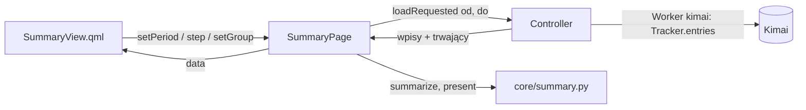

# Plan 6: podsumowania (0.10.3) — plan implementacji

**Cel:** wydać DK Tracker 0.10.3 z widokiem **Podsumowania** w oknie głównym: okresy (tydzień, miesiąc, rok,
zakres), liczby (czas, płatne, średnie, dni z wpisami, norma), wykres słupkowy w kolorach projektów z normą i dymkiem,
podział (wykres pierścieniowy i tabela wg projektu, klienta albo rodzaju pracy).

**Specyfikacja:** [0.10, sekcja 6](../specyfikacja/2026-09-26-okno-glowne-0.10.md#6-podsumowania-0103) (i 3, 9, 10,
12). Zadanie: [0070](../../TODO/ZROBIONE/0070-plan6-podsumowania/todo.md).

**Architektura:** liczenie w czystym `core/summary.py` (bez Qt): okres, kubełki wykresu, podziały, średnie, skala osi
i gotowe teksty. W oknie głównym obiekt `SummaryPage` (`app.summary` w QML) trzyma wybrany okres i podział, prosi
kontroler o wpisy okresu (`loadRequested`), a po ich nadejściu liczy i wystawia jedną mapę `data` do rysowania.
Kontroler pobiera wpisy przez istniejące `Tracker.entries` w wątku „kimai” i dokłada trwający wpis ze stanu.



## Ograniczenia

- Bez nowych zależności: `QtQuick.Shapes` jest w PySide6 z `.venv` i w runtime KDE (moduł Qt Declarative).
- Teksty w `pl.json` i `en.json` (te same klucze). Wygląd tylko z tokenów i kontrolek z
  [projektu wyglądu](../architektura/wyglad-okna-glownego.md); galeria zrzutów obu motywów przed pokazaniem.
- Okno minimum 800×560 — widok mieści się w 616 px treści (800 − pasek boczny 184).
- Testy zapisu tylko na Kimai w Dockerze.

## Rozstrzygnięcia względem specyfikacji

| Nr | Rozstrzygnięcie | Dlaczego |
| --- | --- | --- |
| R1 | **Trwający wpis liczony na żywo** (od początku do teraz), w dniu, w którym się zaczął | tak liczy nagłówek „Dziś / Tydz.”; bez tego suma dnia w podsumowaniu byłaby mniejsza niż w pasku timera |
| R2 | Klient i kolory z wpisu (`full=true`: projekt z klientem, `color-safe` projektu, klienta i rodzaju pracy) | Kimai daje je w każdym wpisie (sprawdzone na 2.67.0); kolory takie jak w raportach Kimai |
| R3 | Tydzień od dnia z konta Kimai (`first_weekday`); miesiąc i rok kalendarzowe; zakres — obie daty włącznie, najwyżej **366 dni** | pobieranie ma limit 5000 wpisów (10 stron × 500) |
| R4 | ◀ ▶ przesuwają o jeden okres; zakres — o swoją długość; przycisk „Dziś” wraca do okresu z dzisiejszym dniem | jak w kalendarzu i w Togglu |
| R5 | Słupek na dzień: tydzień, miesiąc, zakres do 62 dni; na miesiąc: rok i dłuższy zakres | ponad 62 słupki nie mieszczą się w 616 px |
| R6 | ~~Średnia na tydzień i na miesiąc~~ — **jedna średnia**: czas ÷ dni robocze (pon.–pt., do dziś), „Średnio na dzień roboczy” | test na żywo 2026-09-27: jedna średnia; ÷ dni z wpisami obniżało średnią po pracy w sobotę |
| R7 | Norma na wykresie: przy słupkach dziennych jedna przerywana linia; przy miesięcznych kreska nad każdym słupkiem (norma × dni robocze miesiąca do dziś) | spec, sekcja 6 |
| R8 | Porównanie z normą: „7:24 / 8:00”, różnica ze znakiem („−0:36”) w kolorze `muted` — bez czerwieni | norma to punkt odniesienia, nie błąd |
| R9 | Wykres pierścieniowy: 8 największych pozycji, reszta jako „Pozostałe”; tabela — wszystkie | więcej wycinków jest nieczytelne |
| R10 | Okres i podział pamiętane do końca działania aplikacji, nie w pliku; na start bieżący tydzień | spec: domyślnie bieżący tydzień |
| R11 | Odświeżanie jak lista wpisów: co minutę, po każdej zmianie wpisu i po powrocie do widoku; przy wczytywaniu zostają poprzednie liczby | bez migania pustym widokiem |
| R12 | Norma w ustawieniach: „Norma dzienna (godziny)”, krok 0,5 h, 0 = bez normy (znika linia i porównanie) | spec, sekcja 3 |

## Projekt widoku

Kolory i kontrolki z [projektu wyglądu](../architektura/wyglad-okna-glownego.md); nowe: `Card.qml` (karta —
`surface`, ramka `divider`, promień 8) i `Segmented.qml` (przełącznik — przyciski w jednej ramce, wybrany: tło
`control`, tekst i ramka `accent`).

```text
┌ pasek okresu ─────────────────────────────────────────────────────────────┐
│ [Tydzień|Miesiąc|Rok|Zakres]   ◀  21 – 27 wrz 2026  ▶  [Dziś]  Wczytywanie… │
├ kafelki (karty) ──────────────────────────────────────────────────────────┤
│ Łącznie 38:15                    │ Płatne 30:10 · 79 %      │ Śr. na dzień roboczy 7:39 │
│ dni robocze: 5 · z wpisami: 5    │ niepłatne 8:05 · 21 %    │ norma 8:00 · −0:21        │
├ karta: wykres słupkowy ───────────────────────────────────────────────────┤
│ oś godzin, słupki w kolorach projektów, przerywana linia normy, dymek      │
├ karta: podział ───────────────────── [Projekt|Klient|Rodzaj pracy] ───────┤
│ (pierścień z sumą w środku)  │ ● nazwa (klient)   czas   udział   płatne   │
└───────────────────────────────────────────────────────────────────────────┘
```

- Tryb „Zakres”: w miejscu nazwy okresu dwa pola dnia (`DateField`) „od” i „do”.
- Pusty okres: w karcie wykresu i podziału napis „Brak wpisów w tym okresie”.
- Cała strona przewija się (`Scroller`), gdy okno jest niskie.

## Pliki

```text
src/dk_tracker/core/models.py              Entry: klient, kolory color-safe
src/dk_tracker/core/summary.py             nowy: okres, kubełki, podziały, średnie, skala, teksty
src/dk_tracker/core/settings.py            Settings.daily_norm_hours
src/dk_tracker/core/locales/*.json         teksty widoku i ustawienia normy
src/dk_tracker/ui/main_window/summary_page.py   nowy: SummaryPage (app.summary)
src/dk_tracker/ui/main_window/bridge.py    summary, strona "summary"
src/dk_tracker/ui/main_window/settings_form.py  norma
src/dk_tracker/ui/main_window/qml/         SummaryView, BarChart, DonutChart, Card, Segmented; Sidebar, Main, SettingsView
src/dk_tracker/ui/icons.py                 ikona "chart"
src/dk_tracker/ui/app.py                   wczytywanie okresu, odświeżanie
tests/core/test_summary.py, tests/ui/main_window/test_summary_page.py, test_window.py, tests/kimai/test_kontrakt.py
```

## Zadania

1. **`Entry`: klient i kolory** — `customer_id`, `customer_name`, `customer_color`, `activity_color`; kolor projektu
   z `color`, a bez niego z `color-safe`. Testy w `test_models.py`.
2. **`core/summary.py`** (TDD) — `span_for`, `shifted`, `range_span`, `span_label`, `summarize`, `nice_scale`,
   `present`. Testy: granice tygodnia z `first_weekday`, miesiąca, roku; przesuwanie; zakres odwrócony i przycięty;
   trwający wpis na żywo; wpis przez północ w dniu początku; średnia z dni roboczych; norma przy słupkach
   miesięcznych; płatne %; podział
   wg projektu, klienta i rodzaju pracy; „Pozostałe” w pierścieniu; skala osi; pusty okres.
3. **Norma w ustawieniach** — `Settings.daily_norm_hours = 8.0` (normalizacja ≥ 0), pole w `SettingsForm` i
   `SettingsView.qml`.
4. **`SummaryPage`** — stan okresu i podziału, sloty `setPeriod`, `step`, `today`, `setRange`, `setGroup`,
   `hoverBar`; sygnał `loadRequested(date, date)`; `set_entries(...)`, `set_loading`, `retranslate`. Testy pytest-qt.
5. **Widok QML** — `SummaryView.qml`, `BarChart.qml`, `DonutChart.qml`, `Card.qml`, `Segmented.qml`; pozycja
   „Podsumowania” w pasku bocznym (ikona `chart`); strona `summary` w `Main.qml`. Testy dymne w `test_window.py`.
6. **Kontroler** — `summary.loadRequested` → `Tracker.entries(od, do)` w wątku „kimai” (klucz `main-summary`),
   trwający wpis ze stanu, norma z ustawień; odświeżanie co minutę, po akcjach i po wejściu na stronę; zapamiętany
   widok `main_view` obejmuje `summary`. Testy w `test_app_main_window.py`.
7. **Test kontraktowy** — suma i płatne z `summarize` dla okresu równe sumie `duration` z `GET /api/timesheets` tego
   samego okresu na Kimai w Dockerze.
8. **Galeria zrzutów** — widok w obu motywach: tydzień, miesiąc, rok, zakres, dymek, podział wg klienta, pusty
   okres, wczytywanie, szerokość 800 px; przejrzeć przed pokazaniem.
9. **Dokumentacja** — [funkcje](../architektura/funkcje.md) (F-36), [wygląd](../architektura/wyglad-okna-glownego.md)
   (karta, przełącznik, wykresy), [architektura](../architektura/architektura-aplikacji.md), specyfikacja, README.
10. **Wersja 0.10.3 i wydanie** — po teście na żywo i za zgodą użytkownika; 0.10.2 zostaje (to nie wydanie z
    poprawkami).

## Na co patrzeć w recenzji

1. Zgodność sum z Kimai (zadanie 7) i trwający wpis liczony raz — nie ma go w `Tracker.entries`.
2. Strefa: dzień wpisu w strefie wyświetlania (jak lista wpisów), okres pobierany w strefie Kimai.
3. Odpowiedź na stary okres po szybkim klikaniu ◀ ▶ nie może nadpisać nowszego (sprawdzanie okresu przy odbiorze).
