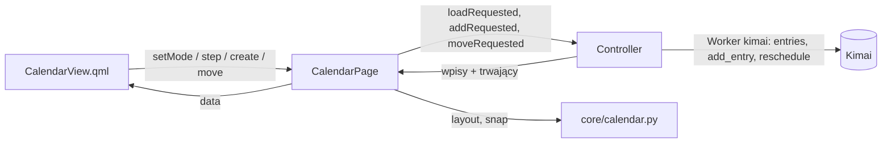

# Plan 7: kalendarz (0.10.5) — plan implementacji

**Cel:** wydać DK Tracker 0.10.5 z widokiem **Kalendarz** w oknie głównym: dzień albo tydzień (5 lub 7 dni), siatka
godzin z wpisami jako blokami w kolorach projektów, tworzenie wpisu przeciągnięciem, zmiana godzin krawędzią,
przesuwanie (także na inny dzień), dymek z edycją, „Usuń” i „Wznów”.

**Specyfikacja:** [0.10, sekcja 8](../specyfikacja/2026-09-26-okno-glowne-0.10.md#8-kalendarz-0105) (i 9, 10, 12).
Zadanie: [0073](../../TODO/ZROBIONE/0073-plan7-kalendarz/todo.md).

**Architektura:** jak w podsumowaniach ([Plan 6](2026-09-27-plan-6-podsumowania.md)). Czysty `core/calendar.py`:
dni widoku, nazwa okresu, bloki (dzień, minuty od–do, kolumna przy nakładaniu), przyciąganie i godziny jako tekst.
`Tracker.reschedule` zapisuje nowe godziny i dzień wpisu. W oknie `CalendarPage` (`app.calendarPage`) trzyma tryb,
okres i wpisy, prosi kontroler o wpisy (`loadRequested`) i wysyła akcje (`addRequested`, `moveRequested`,
`editRequested`); usuwanie i wznawianie idą tymi samymi drogami co w liście wpisów (pasek „Cofnij”).



## Rozstrzygnięcia względem specyfikacji

| Nr | Rozstrzygnięcie | Dlaczego |
| --- | --- | --- |
| R1 | „5 dni” = pon.–pt. tygodnia (niezależnie od pierwszego dnia tygodnia w Kimai), „7 dni” = tydzień od dnia z konta | tydzień roboczy, jak w Togglu |
| R2 | Tryb, liczba dni i ostatni okres pamiętane do końca działania aplikacji; na start bieżący tydzień, 7 dni | jak podsumowania |
| R3 | Siatka 48 px na godzinę, na start przewinięta na 7:00 (dziś: na godzinę przed „teraz”, gdy później) | spec: „przewinięta na godziny pracy” |
| R4 | Wpis przez północ: blok w dniu początku do 24:00 i dalszy ciąg w dniu następnym od 0:00 (gdy widoczny); przeciągać można tylko wpis w jednym dniu | bez tego dwa bloki jednego wpisu ciągnęłyby się nawzajem |
| R5 | Trwający wpis: blok rośnie co minutę; bez przeciągania; klik → dymek z polami trwającego wpisu (zapis od razu, jak na pasku timera) i „Zatrzymaj” | zmiana godzin trwającego to „od” na pasku timera |
| R6 | Nowy blok i zmiana godzin: koniec może być 24:00 (północ dnia następnego); najkrótszy blok 15 min (z Alt — 1 min) | spec: przyciąganie 15 min, Alt wyłącza |
| R7 | Po puszczeniu blok od razu stoi w nowym miejscu; odmowa Kimai → kalendarz wczytuje wpisy od nowa (blok wraca) i pasek błędu | spec, sekcje 8 i 9 |
| R8 | Dymek istniejącego wpisu: opis, projekt, rodzaj pracy, `$`, godziny tylko do odczytu; „Usuń” (pasek „Cofnij”), „Wznów”, „Więcej…” (pełne okno edycji), „Zapisz” | reszta opcji (tagi, pola dodatkowe) jest w oknie edycji |
| R9 | Bez połączenia: bloki widać, przeciąganie i dymek wyłączone | spec, sekcja 9 |

## Pliki

```text
src/dk_tracker/core/calendar.py             nowy: dni widoku, bloki, przyciąganie, godziny
src/dk_tracker/core/tracker.py              reschedule (dzień i godziny), 24:00 w add_entry
src/dk_tracker/ui/main_window/calendar_page.py   nowy: CalendarPage (app.calendarPage)
src/dk_tracker/ui/main_window/bridge.py     calendarPage, strona "calendar", wpisy z kalendarza do usuwania i wznawiania
src/dk_tracker/ui/main_window/qml/          CalendarView, CalendarBlock, CalendarPopup; Sidebar, Main
src/dk_tracker/ui/app.py                    wczytywanie i akcje kalendarza
tests/core/test_calendar.py, test_tracker_entries.py, tests/ui/main_window/test_calendar_page.py, test_window.py,
tests/ui/test_app_main_window.py, tests/kimai/test_kontrakt.py
```

## Zadania

1. **`core/calendar.py`** (TDD): `view_days`, `shifted`, `span_label`, `layout` (kolumny nakładających się bloków,
   wpis przez północ, trwający do teraz), `snap`, `hhmm_of`.
2. **`Tracker.reschedule(entry, day, begin, end)`**: nowy dzień i godziny (minuty), koniec 24:00 = północ; blokada
   wpisów wyeksportowanych i trwających; `add_entry` przyjmuje koniec „24:00”.
3. **`CalendarPage`**: tryb, dni, okres, dane dla QML, sloty akcji; odpowiedź dla starego okresu pomijana;
   przesunięcie widać od razu.
4. **Widok QML**: pasek okresu, nagłówki dni z sumami, siatka z przewijaniem, bloki, linia „teraz”, przeciąganie
   (nowy, krawędzie, przesunięcie; Alt), dymek.
5. **Kontroler**: wczytywanie w tle (klucz z datami), akcje, odświeżanie co minutę i po akcjach, pamięć widoku.
6. **Test kontraktowy**: przesunięcie wpisu na inny dzień i zmiana godzin na Kimai w Dockerze.
7. **Galeria** w obu motywach: tydzień 7 i 5 dni, dzień, nakładanie się, trwający, wyeksportowany, dymek nowego i
   istniejącego wpisu, przeciąganie, 800 px.
8. **Dokumentacja**: F-37, wygląd, architektura, specyfikacja, README.
9. **Wersja 0.10.5 i wydanie** po teście na żywo.

## Na co patrzeć w recenzji

1. Strefy: minuty w siatce to czas w strefie wyświetlania; zapis — czas zegarowy w strefie Kimai (jak ręczny wpis).
2. Przeciąganie nie może wysłać zapisu po samym kliknięciu (bez ruchu) — klik otwiera dymek.
3. Odświeżenie w trakcie przeciągania nie może przebudować bloków pod kursorem (odświeżenie czeka).
