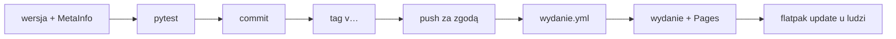

# Wydania i instalacja

Jak wydać nową wersję WS Tracker i jak ją zainstalować. Decyzja o dystrybucji:
[ADR-0007](../decyzje/0007-dystrybucja-repozytorium-flatpak-na-github-pages.md); workflow:
[wydanie.yml](../../.github/workflows/wydanie.yml) ([GitHub Actions](../integracje/github-actions.md)).

## Jednorazowo: klucz i Pages

1. `flatpak/klucz-gpg.sh` ([skrypt](../../flatpak/klucz-gpg.sh)) — klucz publiczny trafia do
   `flatpak/ws-tracker-tray-repo.gpg` (commit), prywatny do `~/ws-tracker-tray-repo-private.asc`.
2. Sekret i sprzątnięcie klucza prywatnego:

   ```bash
   gh secret set FLATPAK_GPG_PRIVATE_KEY < ~/ws-tracker-tray-repo-private.asc
   shred -u ~/ws-tracker-tray-repo-private.asc
   ```

3. GitHub → **Settings → Pages → Source: GitHub Actions** ([GitHub Pages](../integracje/github-pages.md)).
4. Środowisko `github-pages` domyślnie przyjmuje publikację tylko z gałęzi `main`, a wydanie idzie z tagu. Reguła dla
   tagów `v*` (Settings → Environments → github-pages → Deployment branches and tags → Add rule → Tag, `v*`) albo
   ([API](https://docs.github.com/en/rest/deployments/branch-policies)):

   ```bash
   gh api -X PUT repos/DragonKing026/WS-Tracker-Linux/environments/github-pages \
     --input - <<< '{"deployment_branch_policy": {"protected_branches": false, "custom_branch_policies": true}}'
   gh api -X POST repos/DragonKing026/WS-Tracker-Linux/environments/github-pages/deployment-branch-policies \
     -f name='v*' -f type=tag
   ```

> [!warning] Klucz prywatny
> Klucz prywatny istnieje tylko w sekrecie GitHuba — nigdy w repozytorium ani w logach. Jego utrata oznacza nowy klucz
> i ponowną instalację z nowego `.flatpakref` u wszystkich.

## Każde wydanie

1. Wersja w [pyproject.toml](../../pyproject.toml) i [`__init__.py`](../../src/ws_tracker_tray/__init__.py).
2. Nowy `<release version="…" date="…">` na **początku** `<releases>` w
   [MetaInfo](../../data/pl.websystems.WsTrackerTray.metainfo.xml) — lista zmian po angielsku (Discover ją pokazuje);
   po polsku opisuje ją commit.
3. `.venv/bin/pytest` — test spójności wersji ([test_pakiet.py](../../tests/test_pakiet.py)) i reszta.
4. Commit, potem tag i wypchnięcie (**tylko za zgodą właściciela repozytorium**):

   ```bash
   git tag v<wersja>
   git push origin main v<wersja>
   gh run watch                      # testy i wydanie
   ```

5. Kolejność w workflow: testy → budowa i podpis → Pages → dopiero wtedy wydanie na GitHubie. Gdy publikacja na
   Pages się nie uda, wydania nie ma; po naprawie przyczyny wystarczy **Re-run failed jobs** w zakładce Actions.
6. Sprawdzenie: wydanie na GitHubie z plikiem `pl.websystems.WsTrackerTray-v<wersja>.flatpak`, strona
   <https://dragonking026.github.io/WS-Tracker-Linux/>, `flatpak update` u siebie.

Wersje `0.x` wychodzą jako „pre-release”. **1.0.0** — po testach na GNOME
([0020](../../TODO/DO-ZROBIENIA/0020-testy-gnome/todo.md)).



## Instalacja dla ludzi

Zalecana — z repozytorium, aktualizacje przyjdą same (Discover, GNOME Software, `flatpak update`):

```bash
flatpak install --user https://dragonking026.github.io/WS-Tracker-Linux/pl.websystems.WsTrackerTray.flatpakref
```

Plik `.flatpak` z [najnowszego wydania](https://github.com/DragonKing026/WS-Tracker-Linux/releases/latest) — tylko bez
dostępu do strony repozytorium; **nie dostaje aktualizacji**. Przejście z pliku na repozytorium:

```bash
flatpak uninstall --user pl.websystems.WsTrackerTray    # ustawienia w ~/.var/app zostają
flatpak install --user https://dragonking026.github.io/WS-Tracker-Linux/pl.websystems.WsTrackerTray.flatpakref
```

## Zmiana nazwy repozytorium na GitHubie

GitHub przekierowuje stare adresy repozytorium, ale **nie** strony GitHub Pages: po zmianie nazwy (2026-09-26:
`Kimai-App--Linux-` → `WS-Tracker-Linux`) stary adres repozytorium Flatpaka daje 404 i zainstalowane kopie nie widzą
aktualizacji. Nowy adres trafia do plików przy najbliższym wydaniu; zainstalowane kopie przestawia jedna komenda:

```bash
flatpak remote-modify --user ws-tracker-tray --url=https://dragonking026.github.io/WS-Tracker-Linux/repo/
flatpak update --user
```

## Wersja deweloperska a Flatpak

[instaluj-dev.sh](../../scripts/instaluj-dev.sh) kładzie w `~/.local/share` plik `.desktop` i ikonę o tym samym
identyfikatorze co Flatpak, więc przesłania paczkę w menu i w powiadomieniach. Przed instalacją paczki:

```bash
scripts/instaluj-dev.sh --usun
```

## Powiązane

- [Flatpak](../integracje/flatpak.md), [budowa lokalna](../../flatpak/buduj.sh)
- [Plan 4](../plany/2026-09-26-plan-4-flatpak.md)
