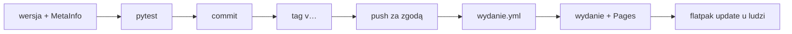

# Wydania i instalacja

Jak wydać nową wersję DK Tracker i jak ją zainstalować. Decyzja o dystrybucji:
[ADR-0007](../decyzje/0007-dystrybucja-repozytorium-flatpak-na-github-pages.md); workflow:
[wydanie.yml](../../.github/workflows/wydanie.yml) ([GitHub Actions](../integracje/github-actions.md)).

## Jednorazowo: klucz i Pages

1. `flatpak/klucz-gpg.sh` ([skrypt](../../flatpak/klucz-gpg.sh)) — klucz publiczny trafia do
   `flatpak/dk-tracker-repo.gpg` (commit), prywatny do `~/dk-tracker-repo-private.asc`.
2. Sekret i sprzątnięcie klucza prywatnego:

   ```bash
   gh secret set FLATPAK_GPG_PRIVATE_KEY < ~/dk-tracker-repo-private.asc
   shred -u ~/dk-tracker-repo-private.asc
   ```

3. GitHub → **Settings → Pages → Source: GitHub Actions** ([GitHub Pages](../integracje/github-pages.md)).
4. Środowisko `github-pages` domyślnie przyjmuje publikację tylko z gałęzi `main`, a wydanie idzie z tagu. Reguła dla
   tagów `v*` (Settings → Environments → github-pages → Deployment branches and tags → Add rule → Tag, `v*`) albo
   ([API](https://docs.github.com/en/rest/deployments/branch-policies)):

   ```bash
   gh api -X PUT repos/DragonKing026/DK-Tracker-Linux/environments/github-pages \
     --input - <<< '{"deployment_branch_policy": {"protected_branches": false, "custom_branch_policies": true}}'
   gh api -X POST repos/DragonKing026/DK-Tracker-Linux/environments/github-pages/deployment-branch-policies \
     -f name='v*' -f type=tag
   ```

> [!warning] Klucz prywatny
> Klucz prywatny istnieje tylko w sekrecie GitHuba — nigdy w repozytorium ani w logach. Jego utrata oznacza nowy klucz
> i ponowną instalację z nowego `.flatpakref` u wszystkich.

## Każde wydanie

1. Wersja w [pyproject.toml](../../pyproject.toml) i [`__init__.py`](../../src/dk_tracker/__init__.py).
2. Nowy `<release version="…" date="…">` na **początku** `<releases>` w
   [MetaInfo](../../data/io.github.dragonking026.DK-Tracker-Linux.metainfo.xml) — lista zmian po angielsku (Discover ją
   pokazuje);
   po polsku opisuje ją commit.
3. `.venv/bin/pytest` — test spójności wersji ([test_pakiet.py](../../tests/test_pakiet.py)) i reszta.
4. Commit, potem tag i wypchnięcie (**tylko za zgodą właściciela repozytorium**):

   ```bash
   git tag v<wersja>
   git push origin main v<wersja>
   gh run watch                      # testy i wydanie
   ```

5. Kolejność w workflow: testy → budowa i podpis → Pages → dopiero wtedy wydanie na GitHubie. Gdy publikacja na
   Pages się nie uda, wydania nie ma; po naprawie przyczyny wystarczy **Re-run failed jobs** w zakładce Actions.
6. Sama strona projektu (bez nowej wersji aplikacji) wychodzi workflow **Strona**
   ([strona.yml](../../.github/workflows/strona.yml), [GitHub Pages](../integracje/github-pages.md)): sama po pushu
   zmiany strony na `main` albo `gh workflow run strona.yml`. Nie w trakcie wydania — oba dzielą kolejkę Pages.
7. Sprawdzenie: wydanie na GitHubie z plikiem `io.github.dragonking026.DK-Tracker-Linux-v<wersja>.flatpak`, strona
   <https://dragonking026.github.io/DK-Tracker-Linux/>, `flatpak update` u siebie.

Wersje `0.x` wychodzą jako „pre-release” (do 1.0). **Działających wydań nie usuwamy**; stronę wydania z błędem usuwa
się ręcznie (`gh release delete v<wersja> --yes`, bez `--cleanup-tag` — tag zostaje w historii), jak 0.9.0–0.9.3,
0.10.0 i 0.10.1 ([0067](../../TODO/ZROBIONE/0067-tylko-najnowsze-wydanie/todo.md)). **Wydanie z poprawkami zastępuje
poprawiane**: po wydaniu 0.10.1 (poprawki błędów 0.10.0) strona 0.10.0 znika od razu (decyzja użytkownika
2026-09-26). Numeracja: kolejne kroki jednej wersji to
`0.10.0`, `0.10.1`, `0.10.2`… aż do pełnej wersji. Sekcja „Deployments” na stronie repozytorium to
publikacje GitHub Pages (repozytorium Flatpaka) — ukrywa się ją na stronie repozytorium: koło zębate przy „About” →
odznaczyć „Deployments”. **1.0.0** — po testach na GNOME
([0020](../../TODO/DO-ZROBIENIA/0020-testy-gnome/todo.md)).



## Instalacja dla ludzi

Zalecana — z repozytorium, aktualizacje przyjdą same (Discover, GNOME Software, `flatpak update`):

```bash
flatpak install --user https://dragonking026.github.io/DK-Tracker-Linux/io.github.dragonking026.DK-Tracker-Linux.flatpakref
```

Plik `.flatpak` z [najnowszego wydania](https://github.com/DragonKing026/DK-Tracker-Linux/releases/latest) — tylko bez
dostępu do strony repozytorium; **nie dostaje aktualizacji**. Przejście z pliku na repozytorium:

```bash
flatpak uninstall --user io.github.dragonking026.DK-Tracker-Linux    # ustawienia w ~/.var/app zostają
flatpak install --user https://dragonking026.github.io/DK-Tracker-Linux/io.github.dragonking026.DK-Tracker-Linux.flatpakref
```

## Zmiana nazwy repozytorium i identyfikatora (0.9.2)

- 2026-09-26 repozytorium zmieniło nazwę (`Kimai-App--Linux-` → `DK-Tracker-Linux`). GitHub przekierowuje stare adresy
  repozytorium, ale **nie** strony GitHub Pages — stary adres repozytorium Flatpaka daje 404.
- Od 0.9.2 identyfikator to `io.github.dragonking026.DK-Tracker-Linux` (projekt prywatny,
  [0056](../../TODO/ZROBIONE/0056-identyfikator-i-wydawca/todo.md)); dla systemu to nowa aplikacja. Kto ma 0.9.0 lub
  0.9.1 (`pl.websystems.WsTrackerTray`), instaluje od nowa i raz wpisuje adres Kimai i token:

```bash
flatpak uninstall --user pl.websystems.WsTrackerTray
flatpak remote-delete --user dk-tracker-tray
flatpak install --user https://dragonking026.github.io/DK-Tracker-Linux/io.github.dragonking026.DK-Tracker-Linux.flatpakref
```

## Wersja deweloperska a Flatpak

[instaluj-dev.sh](../../scripts/instaluj-dev.sh) kładzie w `~/.local/share` plik `.desktop` i ikonę o tym samym
identyfikatorze co Flatpak, więc przesłania paczkę w menu i w powiadomieniach. Przed instalacją paczki:

```bash
scripts/instaluj-dev.sh --usun
```

## Powiązane

- [Flatpak](../integracje/flatpak.md), [budowa lokalna](../../flatpak/buduj.sh)
- [Plan 4](../plany/2026-09-26-plan-4-flatpak.md)
