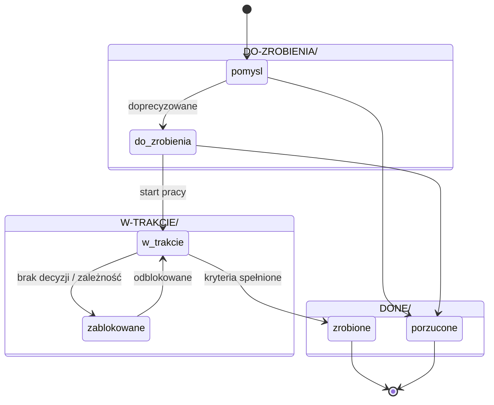

# Zadania w folderze `TODO/`

Każde zadanie to **osobny podfolder** z plikiem `todo.md`. Folder zadania jest też
miejscem na wszystko, co z nim związane: zrzuty ekranu, szkice, logi, notatki badawcze.

Folder zadania leży w podfolderze **według statusu**:

| Podfolder | Statusy | Co tam jest |
|---|---|---|
| [TODO/DO-ZROBIENIA/](../../TODO/DO-ZROBIENIA) | `pomysl`, `do-zrobienia` | zadania czekające na start |
| [TODO/W-TRAKCIE/](../../TODO/W-TRAKCIE) | `w-trakcie`, `zablokowane` | zadania rozpoczęte |
| [TODO/DONE/](../../TODO/ZROBIONE) | `zrobione`, `porzucone` | zadania zakończone |

- Nowe zadanie powstaje w `DO-ZROBIENIA/`.
- **Zmiana statusu, która zmienia grupę, przenosi folder**. Przenosimy wyłącznie
  skryptem `linki.py przenies` (skill `sprawdz-linki`). Robi `git mv`, więc historia
  pliku zostaje, a linki poprawiają się same.
- [TODO/README.md](../../TODO/README.md) zawiera **linki do wszystkich aktywnych zadań** i do zakończonych.

## Materiały zadania — wszystko w folderze zadania

**Każde zadanie trzyma wszystkie swoje materiały we własnym folderze**, w podfolderach
według rodzaju. Nic, co powstało na potrzeby zadania, nie leży luzem gdzie indziej.

| Podfolder | Co trafia | Przykład |
|---|---|---|
| `zrzuty/` | zrzuty ekranu (PNG) | `zrzuty/kde-tacka-trwa.png` |
| `diagramy/` | diagramy eksportowane i ich źródła | `diagramy/przeplyw-startu.svg` |
| `testy/` | scenariusze testów ręcznych, raporty, logi, wyniki | `testy/raport-2026-09-26.md`, `testy/pytest.log` |
| `prototyp/` | kod roboczy, spike, skrypty jednorazowe | `prototyp/tray_demo.py` |
| `notatki/` | notatki badawcze, porównania, wycinki z dokumentacji | `notatki/porownanie-http.md` |
| `dane/` | przykładowe dane: odpowiedzi API, pliki wejściowe | `dane/timesheets-active.json` |

Zasady:
- Podfoldery tworzymy **dopiero, gdy jest w nich co położyć** (git nie przechowuje pustych
  folderów). Szablon wymienia je w sekcji „Materiały”.
- W `todo.md` każdy materiał jest **podlinkowany lub osadzony** w sekcji „Materiały”
  albo w miejscu, którego dotyczy (``, ścieżka względna od `todo.md`).
- Nazwy plików: małe litery, myślniki, bez polskich znaków; data ISO, gdy jest ich seria.
- **Testy aplikacji** (unit, integracyjne) żyją w kodzie (`tests/`), bo są częścią
  produktu. W `testy/` zadania są **wyniki i dowody** ich uruchomienia oraz testy ręczne.
- Kod z `prototyp/` nigdy nie jest importowany przez aplikację.
- Materiały **wspólne dla wielu dokumentów** (np. wzorzec UI) trafiają do `docs/assets/`.

```
TODO/
  README.md                     ← tablica: linki do wszystkich zadań, pogrupowane jak foldery
  _szablon/todo.md              ← szablon (kopiowany przez skill nowe-zadanie)
  DO-ZROBIENIA/
    0004-prototyp-tacki-i-okna/
  W-TRAKCIE/
    0002-specyfikacja-projektu/ ← przykład zadania
    todo.md                     ← opis zadania (zawsze)
    zrzuty/                     ← zrzuty ekranu
    diagramy/                   ← diagramy wyeksportowane (PNG/SVG), źródła (.drawio, .excalidraw)
    testy/                      ← scenariusze testów ręcznych, raporty, logi, wyniki testów
    prototyp/                   ← kod roboczy / spike (do wyrzucenia, nie trafia do src/)
    notatki/                    ← notatki badawcze, wycinki z dokumentacji, porównania
    dane/                       ← przykładowe odpowiedzi API, pliki wejściowe
  DONE/
    0001-struktura-agenta-i-dokumentacja/
```

## Nazewnictwo

`NNNN-krotki-slug` — czterocyfrowy kolejny numer + slug bez polskich znaków,
np. `0005-klient-api-kimai`. Numer nigdy nie jest używany ponownie — przy ustalaniu
następnego numeru bierzemy pod uwagę wszystkie trzy podfoldery.

## Cykl życia zadania



Wartości pola `status` we frontmatterze: `pomysl`, `do-zrobienia`, `w-trakcie`,
`zablokowane`, `zrobione`, `porzucone`.

Priorytety: `p0` (krytyczne, blokuje inne), `p1` (ważne), `p2` (normalne), `p3` (kiedyś).

## Zawartość `todo.md`

1. **Frontmatter** — `noteId`, status, priorytet, daty, `tags`, zależności (`zalezy_od`).
2. **Cel** — jedno-dwa zdania: po co to zadanie.
3. **Kontekst** — skąd się wzięło, linki do docs/ADR/integracji.
4. **Kryteria akceptacji** — sprawdzalna lista `- [ ]`.
5. **Kroki** — lista `- [ ]` odhaczana w trakcie.
6. **Materiały** — linki i osadzenia z podfolderów zadania (`zrzuty/`, `testy/`…).
7. **Dziennik** — datowane wpisy: co zrobiono, co odkryto, jakie commity.
8. **Wynik** — wypełniane przy zamknięciu: co powstało, gdzie, co zostało na później.

## Reguły

- Zadanie zakładamy **przed** rozpoczęciem pracy (skill `nowe-zadanie`).
- Każda zmiana statusu = aktualizacja [TODO/README.md](../../TODO/README.md) + commit `todo: ...`.
- Zadanie zamykamy skillem `zamknij-zadanie` — wypełnia „Wynik”, przenosi folder
  do `TODO/DONE/`, przenosi wiersz w tablicy do sekcji zakończonych i poprawia linki
  prowadzące do zadania.
- Linki w tablicy to zwykłe linki markdown ze ścieżką względną
  (`[Tytuł](0002-slug/todo.md)`) — działają w Obsidianie i na GitHubie.
- Duże zadanie dzielimy na mniejsze (osobne foldery) i linkujemy przez `zalezy_od`.

## Powiązane

- [Tablica zadań](../../TODO/README.md)
- [Szablon zadania](../../TODO/_szablon/todo.md)
- [Konwencja commitów](commity.md)
