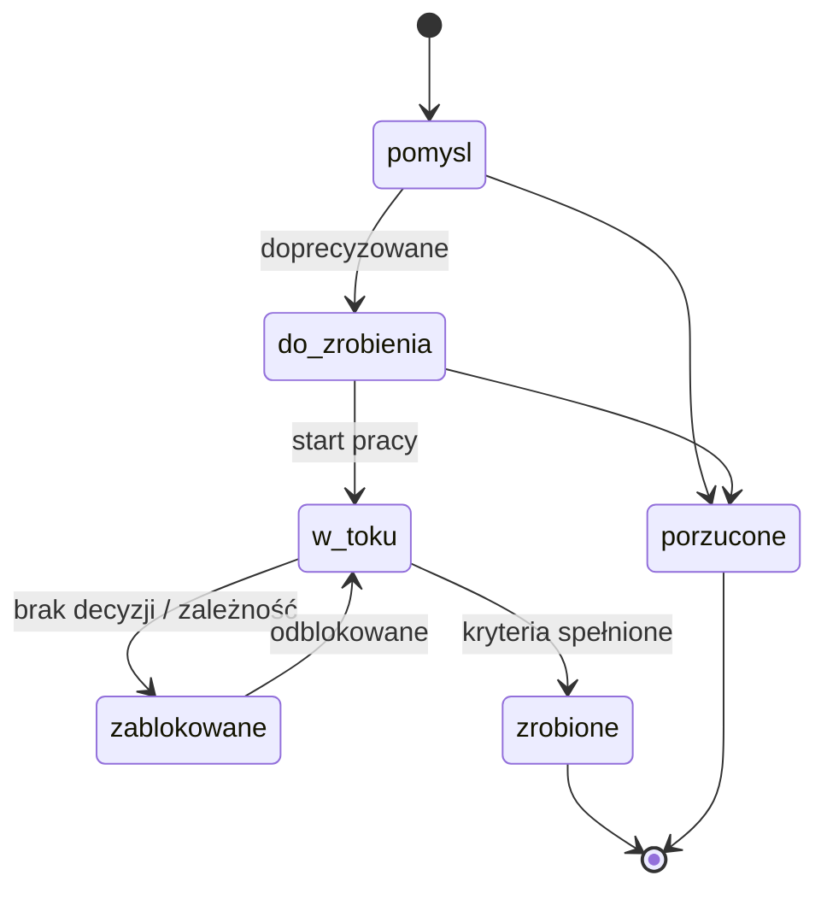

# Zadania w folderze `TODO/`

Każde zadanie to **osobny podfolder** z plikiem `todo.md`. Folder zadania jest też
miejscem na wszystko, co z nim związane: zrzuty ekranu, szkice, logi, notatki badawcze.

- **Aktywne** zadania leżą bezpośrednio w `TODO/`.
- **Zakończone** (`zrobione` albo `porzucone`) przenosimy w całości do `TODO/DONE/`
  (`git mv`, żeby historia pliku została zachowana).
- `TODO/README.md` zawiera **linki do wszystkich aktywnych zadań** i do zakończonych.

```
TODO/
  README.md                     ← tablica: linki do zadań aktywnych i zakończonych
  _szablon/todo.md              ← szablon (kopiowany przez skill nowe-zadanie)
  0002-specyfikacja-projektu/   ← zadanie aktywne
    todo.md
    assets/                     ← zrzuty, diagramy PNG/SVG (opcjonalnie)
  DONE/                         ← zadania zakończone
    0001-struktura-agenta-i-dokumentacja/
      todo.md
```

## Nazewnictwo

`NNNN-krotki-slug` — czterocyfrowy kolejny numer + slug bez polskich znaków,
np. `0005-klient-api-kimai`. Numer nigdy nie jest używany ponownie — przy ustalaniu
następnego numeru bierzemy pod uwagę także `TODO/DONE/`.

## Cykl życia zadania



Wartości pola `status` we frontmatterze: `pomysl`, `do-zrobienia`, `w-toku`,
`zablokowane`, `zrobione`, `porzucone`.

Priorytety: `p0` (krytyczne, blokuje inne), `p1` (ważne), `p2` (normalne), `p3` (kiedyś).

## Zawartość `todo.md`

1. **Frontmatter** — status, priorytet, daty, tagi, zależności (`zalezy_od`).
2. **Cel** — jedno-dwa zdania: po co to zadanie.
3. **Kontekst** — skąd się wzięło, linki do docs/ADR/integracji.
4. **Kryteria akceptacji** — sprawdzalna lista `- [ ]`.
5. **Kroki** — lista `- [ ]` odhaczana w trakcie.
6. **Diagramy / zrzuty** — jeśli pomagają zrozumieć.
7. **Dziennik** — datowane wpisy: co zrobiono, co odkryto, jakie commity.
8. **Wynik** — wypełniane przy zamknięciu: co powstało, gdzie, co zostało na później.

## Reguły

- Zadanie zakładamy **przed** rozpoczęciem pracy (skill `nowe-zadanie`).
- Każda zmiana statusu = aktualizacja `TODO/README.md` + commit `todo: ...`.
- Zadanie zamykamy skillem `zamknij-zadanie` — wypełnia „Wynik”, przenosi folder
  do `TODO/DONE/`, przenosi wiersz w tablicy do sekcji zakończonych i poprawia linki
  prowadzące do zadania.
- Linki w tablicy to zwykłe linki markdown ze ścieżką względną
  (`[Tytuł](0002-slug/todo.md)`) — działają w Obsidianie i na GitHubie.
- Duże zadanie dzielimy na mniejsze (osobne foldery) i linkujemy przez `zalezy_od`.

## Powiązane

- [[TODO/README|Tablica zadań]]
- [[TODO/_szablon/todo|Szablon zadania]]
- [[docs/procesy/commity|Konwencja commitów]]
