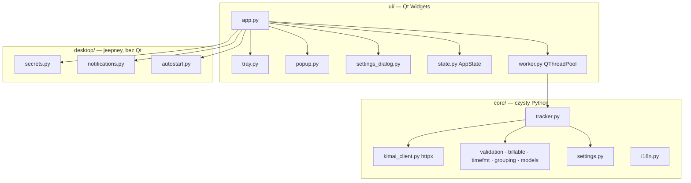
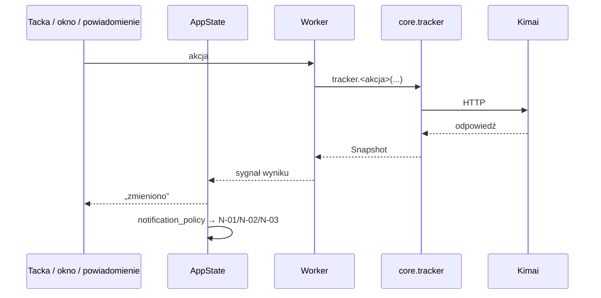

# Specyfikacja Kimai Tray 1.0

> [!success] Status: zaakceptowana przez użytkownika 2026-09-25
> Dokument zbiera ustalenia z [zadania 0002](../../TODO/ZROBIONE/0002-specyfikacja-projektu/todo.md)
> (brainstorming 2026-09-25). Każda sekcja projektu została zaakceptowana osobno, potem całość.
> Kolejny krok: plan implementacji.

## 1. Cel

Natywna aplikacja linuksowa w **tacce systemowej**, dystrybuowana jako **Flatpak**, do
mierzenia czasu w firmowym **Kimai**. Robi wszystko, co wtyczka
[WS Tracker](../integracje/kimai-ws-tracker.md), bez przeglądarki. Priorytetem jest
Fedora KDE Plasma (Wayland); GNOME ma działać z rozszerzeniem AppIndicator i bez niego.

Kontekst, użytkownicy, ryzyka: [przegląd projektu](../architektura/przeglad.md).

## 2. Zakres 1.0

| Obszar | Funkcje | Źródło szczegółów |
|---|---|---|
| Parytet z wtyczką | F-01 … F-14 | [katalog funkcji](../architektura/funkcje.md) |
| Menu kontekstowe ikony | F-20 | [ADR-0005](../decyzje/0005-okno-przy-tacce-na-kde.md) |
| Powiadomienia N-01 długi timer, N-02/N-02b połączenie, N-03 potwierdzenie z menu | F-21 | [katalog funkcji → F-21](../architektura/funkcje.md) |
| Autostart z sesją | F-22 | [portale XDG](../integracje/xdg-portale.md) |
| Pełna wersja PL i EN | F-13 | [katalog funkcji → F-13](../architektura/funkcje.md) |
| Paczka Flatpak | — | [Flatpak](../integracje/flatpak.md) |

**Poza 1.0:** wykrywanie bezczynności (F-23), globalny skrót (F-24), powiadomienie „brak
timera w godzinach pracy”, portal Secret zamiast Secret Service, popup `layer-shell-qt`
(zależnie od wyniku [prototypu 0004](../../TODO/W-TRAKCIE/0004-prototyp-tacki-i-okna/todo.md)).
**Nigdy:** zarządzanie projektami/fakturami, uwierzytelnianie `X-AUTH-*`, telemetria.

## 3. Decyzje

| ADR | Decyzja |
|---|---|
| [0001](../decyzje/0001-dokumentacja-w-repo-jako-vault-obsidian.md) | Dokumentacja i zadania w repo (Markdown, linki względne) |
| [0002](../decyzje/0002-stos-python-pyside6.md) | Python + PySide6 (Qt 6), Flatpak na `org.kde.Platform` 6.11 + `io.qt.PySide.BaseApp` |
| [0003](../decyzje/0003-okno-szybkiej-obslugi-na-wayland.md) | ~~Okno bezramkowe~~ — zastąpiona przez 0005 |
| [0005](../decyzje/0005-okno-przy-tacce-na-kde.md) | **Okno przy tacce na KDE (layer-shell), na środku gdzie indziej**; przycisk zamknięcia + `Esc`; menu kontekstowe; tryb okna bez tacki |
| [0006](../decyzje/0006-budowanie-flatpaka-w-kontenerze.md) | Budowa Flatpaka w kontenerze (regresja Flatpaka 1.18.2 na Fedorze 44) |
| [0004](../decyzje/0004-architektura-rdzen-python-ui-qt.md) | Rdzeń w czystym Pythonie (`httpx`, `jeepney`), UI w Qt Widgets |

## 4. Architektura i moduły

Trzy warstwy, zależności tylko w dół: `ui` → `desktop` → `core`.



```
src/kimai_tray/
  __main__.py            start: --hidden (autostart do tacki), jedna instancja
  core/                  ZERO importów Qt i D-Bus
    models.py            Entry, Project, Activity, Customer, User (dataclasses)
    validation.py        F-11 walidacja opisu + lista ogólników z wtyczki
    billable.py          F-09 domyślne billable, rozpoznanie 400 „extra fields”
    timefmt.py           czas w strefie konta Kimai, „47m” / „1:22”, h:mm, nazwy dni
    grouping.py          wpisy po dniach, projekty po klientach
    kimai_client.py      httpx: endpointy, ApiError, błędy formularza, stronicowanie
    tracker.py           logika aplikacji → Snapshot; blokada billable; sumy
    notification_policy.py  (poprzedni, nowy Snapshot, ustawienia) → powiadomienia
    settings.py          ustawienia i ostatni wybór (JSON w katalogu konfiguracji XDG)
    i18n.py              teksty PL/EN
  desktop/
    secrets.py           SecretStore → Secret Service (sesja plain, kolekcja default)
    notifications.py     portal Notification (akcje przycisków)
    autostart.py         portal Background (RequestBackground, SetStatus)
  ui/
    app.py, worker.py, state.py, tray.py, popup.py, settings_dialog.py, style.qss, icons/
tests/
  core/, desktop/, ui/, kimai/ (Docker), test_architektura.py
flatpak/                 manifest, zależności pip, .desktop, metainfo.xml, ikona
pyproject.toml
```

Odpowiedzialności komponentów i przepływy logiczne:
[architektura aplikacji](../architektura/architektura-aplikacji.md).

## 5. Przepływ danych

- **Snapshot** — niemutowalny obraz stanu zwracany przez rdzeń: trwający wpis (lub
  wpisy przy limicie > 1), projekty/czynności, ostatnie wpisy, sumy, stan połączenia,
  blokada billable, licznik kolejnych błędów, strefa konta Kimai.
- **AppState** (Qt) trzyma ostatni Snapshot i emituje jeden sygnał „zmieniono”.
  Tacka, okno i menu tylko go czytają.
- **Odświeżanie:** co 60 s `GET /api/timesheets/active`. Pełne odświeżenie (trwający,
  ostatnie wpisy, sumy) przy otwarciu okna i po każdej akcji. Projekty i czynności raz
  na otwarcie okna. Zegar 1 s tylko przy widocznym oknie. Tooltip liczony lokalnie
  raz na minutę.
- **Kolejka akcji:** akcje wysyłane do Kimai po jednej. Wynik odświeżenia starszy niż
  ostatnia akcja jest odrzucany (licznik generacji).
- **Powiadomienia:** decyzję podejmuje czysta funkcja w rdzeniu. `desktop/` tylko wysyła.
  Akcja „Zatrzymaj” z powiadomienia wraca jako zwykła akcja stop.
- **Zapis ustawień:** nowy klient API, zdjęcie blokady billable, przeładowanie języka,
  pełne odświeżenie.
- **Jedna instancja:** ponowne uruchomienie (`QLocalServer`) pokazuje okno działającej
  instancji.



## 6. Czas i strefa czasowa

**Wszystkie godziny wysyłane do Kimai liczone są w strefie konta Kimai**
(`GET /api/users/me → timezone`). Kimai dokleja tę strefę do podanej godziny bez
przeliczania. Sprawdzono na Kimai 2.67.0: przy koncie w UTC i systemie w Europe/Warsaw
czas systemu daje wpis 2 h w przyszłości, a potem stop i kolejny start są odrzucane
([raport](../../TODO/ZROBIONE/0002-specyfikacja-projektu/testy/raport-kimai-docker-2026-09-25.md)).

- Strefa konta ≠ strefa systemu → ostrzeżenie w oknie i ustawieniach.
- Start wysyła „teraz − 1 s” (jak wtyczka).
- Kimai zaokrągla czasy do minut, więc porównania nie opierają się na sekundach.
- Nazwy dni i granice dnia/tygodnia (sumy) liczone są w strefie konta Kimai.
- Przeliczenie sum o północy; skok zegara > 2 min (uśpienie) → pełne odświeżenie.

## 7. Obsługa błędów

| Sytuacja | Zachowanie |
|---|---|
| Brak sieci / timeout przy odświeżaniu | ikona błędu, pasek w oknie; po 3 kolejnych błędach N-02, po powrocie N-02b |
| Timeout przy starcie | **bez ponawiania POST**. Odczyt `/active`: wpis istnieje → sukces, brak → błąd |
| 401/403 | od razu N-02 „token nieważny lub wygasł” z akcją „Ustawienia”; odświeżanie trwa co 60 s |
| 400 „extra fields” po wysłaniu `billable` | ponowienie bez `billable`, blokada przełącznika zapisana w stanie; zdejmowana zapisem ustawień |
| Inne 400 | treść błędu z Kimai (zebrane `errors` z formularza) — w tym limit czasu wpisu, nakładanie wpisów, „active time record which cannot be stopped automatically” |
| 5xx | „błąd serwera Kimai (kod)” |
| Błąd certyfikatu TLS | osobny komunikat o niezaufanym certyfikacie |
| Wpis zmieniony poza aplikacją | przejmowany przy odświeżeniu. Stop już zatrzymanego wpisu Kimai zwraca 200, więc nie jest to błąd |
| `/active` zwraca kilka wpisów (limit > 1) | pokazany najnowszy, reszta w tooltipie |
| Portfel zablokowany | systemowy prompt; po odmowie komunikat „odblokuj portfel”, odświeżanie wstrzymane |
| Brak Secret Service | komunikat w ustawieniach; **token nigdy nie trafia do pliku** |
| Brak hosta tacki | tryb zwykłego okna + jednorazowa podpowiedź o rozszerzeniu AppIndicator |
| Adres `http://` | ostrzeżenie w ustawieniach |

Logi: plik w katalogu stanu aplikacji, z rotacją. Nigdy nie zawierają tokenu ani nagłówków.
Szczegóły API i kodów: [Kimai REST API](../integracje/kimai-api.md).

## 8. Bezpieczeństwo i prywatność

- Token wyłącznie w Secret Service (KWallet / GNOME Keyring), atrybuty
  `application=pl.websystems.KimaiTray`, `url=<adres>` ([jeepney](../integracje/jeepney.md)).
- Połączenia tylko z adresem Kimai podanym przez użytkownika. Brak telemetrii.
- Uprawnienia Flatpaka: `--share=network`, `--share=ipc`, `--socket=wayland`,
  `--socket=fallback-x11`, `--device=dri`, `--talk-name=org.kde.StatusNotifierWatcher`,
  `--talk-name=org.freedesktop.secrets`. Autostart i powiadomienia przez portale.

## 9. Język (PL/EN)

- Każdy tekst dla użytkownika przez `t(klucz)`; zestawy PL i EN identyczne (test).
- Teksty startowe: klucze z `_locales` wtyczki + nowe (menu, powiadomienia, autostart,
  strefa czasowa).
- Standardowe elementy Qt: `QTranslator` z `qtbase_<lang>.qm` z runtime'u.
- `.desktop` z `Name[pl]`/`Comment[pl]`, MetaInfo z `xml:lang="pl"`.
- Wybór auto/pl/en w ustawieniach, zmiana bez restartu.

## 10. Testy

Kod piszemy metodą TDD.

| Poziom | Narzędzie | Zakres |
|---|---|---|
| Rdzeń | pytest, `httpx.MockTransport` | walidacja, billable, czas/strefy, grupowanie, klient API (wszystkie endpointy i błędy), tracker (blokada billable, timeout startu, wznowienie, nieaktualny stop), polityka powiadomień, kompletność i18n. **Pokrycie ≥ 90%** |
| Desktop | pytest + test ręczny `desktop` | budowa komunikatów D-Bus; zapis/odczyt/usunięcie „Kimai Tray TEST” w KWallet na stacji dewelopera |
| UI | pytest-qt, `QT_QPA_PLATFORM=offscreen` | okno ze Snapshotów (brak konfiguracji / bezczynny / trwa / błąd), Enter/Shift+Enter, billable, przełączenie języka, menu tacki |
| Architektura | pytest | `core/` bez PySide6 i jeepney, `desktop/` bez PySide6 |
| Kontraktowe | pytest `@pytest.mark.kimai` + [tests/kimai](../../tests/kimai/README.md) | pełny zapis i odczyt na lokalnym Kimai 2.67.0 w Dockerze, konta ROLE_USER i ROLE_TEAMLEAD |
| Ręczne | lista kontrolna w zadaniu | KDE Wayland, GNOME + AppIndicator, GNOME bez tacki; zrzuty w `zrzuty/`, raport w `testy/` |
| Paczka | flatpak-builder | budowa, uruchomienie, ikona w tacce |

Lint i format: `ruff`.

## 11. Kwestie rozstrzygnięte w prototypie

[Prototyp 0004](../../TODO/W-TRAKCIE/0004-prototyp-tacki-i-okna/notatki/ustalenia.md) (2026-09-25 20:38), Plasma 6.7.5 Wayland:

- ikona `QSystemTrayIcon` działa **we Flatpaku** z samym `--talk-name=org.kde.StatusNotifierWatcher` (bez `--own-name`);
- lewy klik → okno, prawy → menu (dbusmenu, rysuje Plasma), tooltip odświeżany co sekundę;
- **klik ikony przy otwartym oknie nie dociera do aplikacji** → przycisk zamknięcia i `Esc`;
- okno przy tacce przez `layer-shell-qt` działa lokalnie i we Flatpaku → [ADR-0005](../decyzje/0005-okno-przy-tacce-na-kde.md);
- Flatpak z bazą PySide trzeba budować w kontenerze → [ADR-0006](../decyzje/0006-budowanie-flatpaka-w-kontenerze.md).

**Otwarte:** GNOME (z rozszerzeniem AppIndicator i bez) — testy ręczne innych osób (zadanie w `TODO/`).

## 12. Kryteria akceptacji 1.0

1. Na Fedorze KDE: instalacja z `.flatpak`, konfiguracja w < 2 min, start/stop w ≤ 2
   kliknięciach od ikony.
2. Na GNOME z rozszerzeniem AppIndicator — to samo. Bez rozszerzenia aplikacja działa
   jako okno.
3. Wszystkie funkcje z sekcji 2 działają. F-01…F-14 zachowują się jak we wtyczce, poza
   świadomymi różnicami: strefa czasowa (sekcja 6), timeout startu (sekcja 7).
4. Token wyłącznie w magazynie sekretów.
5. Pełne PL i EN, przełączane bez restartu.
6. Testy zielone: rdzeń (pokrycie ≥ 90%), UI, architektura, kontraktowe na Kimai w Dockerze.
7. Dokumentacja aktualna: integracje, ADR, katalog funkcji, komendy w `AGENTS.md`.
