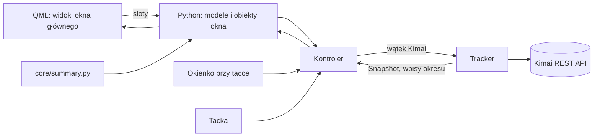

# Specyfikacja DK Tracker 0.10 — okno główne

> [!success] Status: zaakceptowana przez użytkownika 2026-09-26 16:05
> Uzgodniona w rozmowie 2026-09-26 (brainstorming, makiety w przeglądarce). Uzupełnia
> [specyfikację 1.0](2026-09-25-kimai-tray-1.0.md); zadanie
> [0062](../../TODO/DO-ZROBIENIA/0062-aplikacja-ws-tracker/todo.md).

## 1. Cel

DK Tracker staje się **pełnym klientem Kimai** na pulpit Linuksa, na wzór **Toggl Track**: okno główne w menu
programów i na pasku zadań, a tacka i okienko przy tacce zostają do szybkiego startu i stopu. Okno główne daje to,
czego brakuje w okienku i w firmowym Kimai: przegląd dni i tygodni, edycję i ręczne dodawanie wpisów, podsumowania ze
**średnimi** oraz interaktywny kalendarz.

## 2. Zakres i kolejność wydań

| Wydanie | Zawartość |
| --- | --- |
| **0.10.0** | Okno główne (pasek boczny, pasek timera), widok **Wpisy** (edycja w wierszu, ręczne wpisy, usuwanie z „Cofnij”, przewijanie bez końca), zmiany w uruchamianiu i tacce (sekcja 7) |
| **0.10.1** | Poprawki po teście na żywo 0.10.0: tagi z listy, bez stawek, token jako maska, paski przewijania |
| **0.10.2** | Poprawka: po starcie okno główne na wpisach (zostawało na ustawieniach, zanim token dotarł) |
| **0.10.3** | Widok **Podsumowania** (okresy, podział, wykres dzienny, średnie, norma) |
| **0.10.4** | Widok **Kalendarz** (interaktywny: tworzenie, zmiana godzin, przesuwanie) |

Dalsze kroki: 0.10.5… aż do pełnej wersji. Minutnik (GNOME: napis przy ikonie; KDE: widżet panelu) — osobno, w
[0062](../../TODO/DO-ZROBIENIA/0062-aplikacja-ws-tracker/todo.md). Jedna specyfikacja, osobny plan na każde wydanie.

## 3. Decyzje (użytkownik, 2026-09-26)

| Temat | Decyzja |
| --- | --- |
| Rola okna głównego | Pełny klient Kimai (wariant B), wzór Toggl Track |
| Układ | Pasek boczny z widokami, pasek timera zawsze u góry (wariant A) |
| Edycja wpisu | W wierszu, jak w Togglu (wariant A); ręczny wpis: przełącznik ⏱/✎ na pasku timera |
| Usuwanie | Od razu z paskiem „Usunięto wpis · Cofnij” (~6 s), bez okna potwierdzenia |
| Lista | Przewijanie bez końca (doładowanie kolejnych tygodni) |
| Kalendarz | Interaktywny jak Toggl; przyciąganie co **15 min**, Alt wyłącza |
| Podsumowania | Okresy, podział, wykres dzienny, średnie; słupki w kolorach projektów |
| Średnia na dzień | Czas ÷ **dni z wpisami**; na tydzień/miesiąc — ÷ tygodnie/miesiące z wpisami |
| Norma | 8:00 na dzień, do zmiany w ustawieniach (0 = bez normy); porównanie: średnia na dzień wobec normy |
| Technologia okna | **Qt Quick (QML)** z logiką w Pythonie (wariant B) |
| Tacka | Tylko gdy system ją ma, **z opcją wyłączenia**; uruchomienie z menu otwiera okno główne |

## 4. Architektura

- **Rdzeń (`core/`, bez Qt)** — nowe elementy:
  - klient API: `create_entry` (wpis z `begin` i `end`), `delete_entry`; istniejące `range` i `update` wystarczą do
    pobierania okresu i edycji;
  - `Tracker`: `entries(od, do)` (wpisy okresu, bez trwającego), `add_entry(...)`, `edit_entry(id, zmiany)` (opis,
    projekt, rodzaj pracy, od–do, `$`; walidacja opisu F-11, blokada wpisów wyeksportowanych), `delete_entry(id)`;
  - `summary.py`: czyste funkcje — sumy dzienne, podział wg projektu/klienta/rodzaju pracy, płatne/niepłatne, średnie
    (sekcja 6), punkty wykresu.
- **Okno główne (`ui/main_window/`)**: QML tylko rysuje; Python ma logikę w obiektach `QObject` (właściwości, sygnały,
  sloty) i modelach `QAbstractListModel` (tygodnie i dni, wpisy, bloki kalendarza, pozycje podziału). Do QML trafiają
  też tłumaczenia (`t(klucz, …)`) i paleta motywu — język i jasny/ciemny motyw jak w reszcie aplikacji.
- **Bez zmian**: tacka, okienko przy tacce (Qt Widgets), powiadomienia (ustawienia — patrz sekcja 5); kontroler łączy
  wszystko — zmiana
  w jednym miejscu odświeża pozostałe.
- **Wątki**: jak dotąd — zapytania do Kimai w wątku roboczym, wyniki w wątku GUI; QML nie czeka na sieć.
- **Zależności**: brak nowych. `QtQuick`, `QtQml`, `QtQuickControls2` są w bazie PySide Flatpaka (sprawdzone
  2026-09-26), moduły QML w runtime KDE; w `.venv` PySide6 6.11.2.

## 5. Okno główne i widok „Wpisy” (0.10.0)

**Okno**: zwykłe okno aplikacji; rozmiar, pozycja i ostatni widok zapamiętywane; minimum ok. 800×560. Pasek boczny:
Wpisy, Podsumowania, Kalendarz (widoki z kolejnych wydań pojawiają się, gdy są gotowe), na dole Ustawienia —
**strona okna głównego**, nie osobne okno (zmiana po teście na żywo, poniżej).

**Pasek timera** (zawsze u góry): te same funkcje co okienko — opis (F-11), projekt z wyszukiwaniem, rodzaj pracy,
`$`, start/stop; przy trwającym wpisie zegar, „od” i zmiana opisu/projektu/rodzaju pracy (F-07, F-34). Przełącznik
**⏱/✎**: w trybie ✎ pola daty i godzin od–do oraz „Dodaj” (ręczny wpis).

**Lista**:

- tydzień z sumą, dni z sumami, najnowsze u góry; na start bieżący tydzień, **przewijanie bez końca** doładowuje
  poprzednie tygodnie (w tle, z informacją „Wczytywanie…”);
- pole wyszukiwania (F-33);
- wiersz: kropka koloru projektu, **opis**, **projekt · rodzaj pracy**, **`$`**, **od–do**, czas, **▶ wznów**,
  **usuń** (kosz); pogrubione = edycja w miejscu (Enter/wyjście zapisuje, Esc anuluje, walidacja opisu
  przy polu); wpis wyeksportowany: kłódka, bez edycji;
- **usuwanie**: wiersz znika, pasek „Usunięto wpis · Cofnij” przez ok. 6 s; do Kimai trafia dopiero po tym czasie
  (zamknięcie aplikacji w tym czasie wysyła usunięcie od razu);
- odświeżanie jak dotąd (co minutę) — widać zmiany z okienka, tacki i przeglądarki; edycji w toku nie nadpisuje.

> [!note] Zmiany po teście na żywo 0.10.0 (użytkownik, 2026-09-26)
>
> - **Ustawienia** są stroną okna głównego (pasek boczny); tacka, zębatka w okienku i pierwsze uruchomienie
>   otwierają tę stronę. Osobnego okna ustawień nie ma.
> - **Bez „Duplikuj”**: wznowienie ▶ tworzy ten sam wpis od teraz; w wierszu zamiast menu ⋮ jest kosz.
> - **Okno edycji zamiast edycji w wierszu** (drugi test): kliknięcie wiersza otwiera okno ze wszystkimi opcjami
>   wpisu, jakie ma serwer (tagi, pola dodatkowe) — także tymi, których aplikacja nie przewidziała; bez stawek, których
>   formularz Kimai nie pokazuje kontu bez uprawnienia `edit_rate`.
> - Opis w wielu liniach (Shift+Enter), zaokrąglone kontrolki, kursor rączki na przyciskach; projekt w kolorze
>   projektu; `$` zielony (płatne) albo szary.

## 6. Podsumowania (0.10.3)

- **Okres**: Tydzień / Miesiąc / Rok / Zakres (dwie daty), strzałki ◀ ▶, domyślnie bieżący tydzień.
- **Liczby**: czas łączny; płatne/niepłatne (h i %); **średnia na dzień** = czas ÷ liczba dni z wpisami; **średnia na
  tydzień** i **na miesiąc** = czas ÷ liczba tygodni / miesięcy z wpisami (gdy okres je obejmuje); liczba dni z
  wpisami; porównanie średniej na dzień z **normą** (np. „7:24 / 8:00”).
- **Wykres słupkowy**: tydzień/miesiąc — słupek na dzień, rok — na miesiąc; słupki podzielone kolorami projektów;
  linia normy (dzień: norma; miesiąc w widoku roku: norma × dni z wpisami w miesiącu); dymek z rozbiciem.
- **Podział**: wykres kołowy + tabela wg **projektu** (przełącznik: **klient**, **rodzaj pracy**); kolumny: czas,
  udział %, w tym płatne.
- **Dane**: wpisy okresu pobierane w tle ze stronicowaniem (rok — kilka tysięcy wpisów); liczenie w `summary.py`.
- Wykresy rysowane w QML (bez QtCharts).

## 7. Uruchamianie, tacka, zamykanie (0.10.0)

- **Z menu programów**: okno główne; gdy aplikacja już działa — jej okno główne na wierzch (jedna instancja).
- **Autostart** (`--hidden`): z tacką — ukryta w tacce; bez tacki — okno główne.
- **Zamknięcie okna głównego**: z tacką — chowa okno (timer, przypomnienia, powiadomienia działają); bez tacki —
  kończy aplikację.
- **Tacka**: ustawienie „Pokazuj ikonę w tacce” (domyślnie tak, gdy system ma tackę); wyłączona — brak ikony i
  okienka.
- **Menu tacki**: nowa pozycja „Otwórz DK Tracker”. Link „Wszystkie moje wpisy” w okienku otwiera **okno główne**
  zamiast przeglądarki. Kliknięcie powiadomienia otwiera okno główne.
- **Nowe ustawienia**: ikona w tacce; norma dzienna (0.10.3); zapamiętany rozmiar/pozycja/widok okna głównego.

## 8. Kalendarz (0.10.4)

- Dzień / tydzień (przełącznik 5/7 dni), ◀ ▶ i „Dziś”; siatka 0–24 przewinięta na godziny pracy; linia „teraz”.
- Bloki = wpisy w kolorze projektu (opis, czas); trwający rośnie na żywo; nakładające się obok siebie; wyeksportowane z
  kłódką, bez przeciągania.
- **Przeciągnięcie w pustym miejscu** → nowy blok → dymek (opis, projekt, rodzaj pracy, `$`, „Dodaj”; Esc anuluje).
- **Krawędź bloku** → zmiana godzin; **blok** → przesunięcie (także na inny dzień tygodnia); zapis po puszczeniu;
  odmowa Kimai → blok wraca, komunikat.
- **Klik w blok** → ten sam dymek z „Usuń” i „Wznów”.
- Przyciąganie co 15 min; **Alt** wyłącza (dokładna minuta).

## 9. Błędy

- **Brak połączenia**: okno pokazuje ostatnio wczytane dane, pasek błędu u góry, **blokada edycji** do powrotu
  połączenia; zapisy nie są kolejkowane „na później”.
- **Odmowa Kimai** (uprawnienia, wpis wyeksportowany, zbyt długi lub nakładający się wpis — zależnie od konfiguracji
  serwera): komunikat przy polu/bloku, wartość wraca do stanu z Kimai. Zachowanie przy nakładaniu się sprawdza test
  kontraktowy.
- Uprawnienia jak w koncie Kimai (np. usuwanie własnych wpisów); brak uprawnienia → komunikat, bez ukrywania funkcji.

## 10. Testy

- Rdzeń i `summary.py`: pytest, pokrycie rdzenia ≥ 90 % (jak w CI).
- Modele i obiekty okna głównego: pytest-qt, bez QML.
- Każdy widok QML: test „dymny” — plik ładuje się w trybie bez ekranu i ma kluczowe elementy (identyfikatory
  `objectName`).
- Nowe operacje API (dodanie wpisu z od–do, usunięcie, edycja godzin i projektu zakończonego wpisu, nakładanie się):
  testy kontraktowe na Kimai w Dockerze, nigdy na Kimai firmy.
- Test na żywo na KDE przed każdym wydaniem; GNOME — [0020](../../TODO/DO-ZROBIENIA/0020-testy-gnome/todo.md).

## 11. Poza zakresem 0.10

Minutnik (0062), eksport raportów, wiele kont Kimai, integracje z trackerami zadań, własne motywy, kalendarz świąt,
kolejkowanie zapisów offline.

## 12. Kryteria akceptacji

- **0.10.0**: uruchomienie z menu otwiera okno główne; lista tygodni z edycją w wierszu, ręcznymi wpisami, usuwaniem z
  „Cofnij”, przewijaniem bez końca; tacka do wyłączenia; zamykanie zgodnie z sekcją 7; PL/EN, oba motywy; testy i
  test na żywo.
- **0.10.3**: podsumowania z okresami, podziałem, wykresem, średnimi i normą; wyniki zgodne z sumami z Kimai dla tego
  samego okresu.
- **0.10.4**: kalendarz z tworzeniem, zmianą godzin i przesuwaniem wpisów; przyciąganie 15 min, Alt wyłącza.
